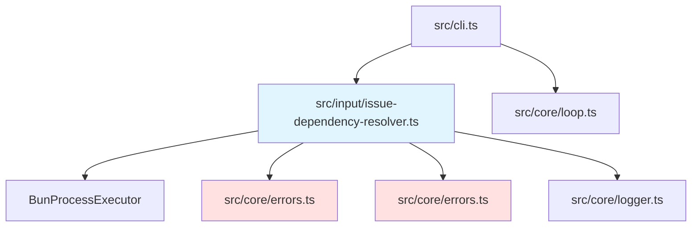

# Issue依存関係管理機能 バックエンド設計書

## メタ情報

| 項目 | 内容 |
|------|------|
| ドキュメントID | DETAILED-ORCH-002-F011-BE |
| バージョン | 1.0.0 |
| ステータス | ドラフト |
| 作成日 | 2026-01-25 |
| 最終更新日 | 2026-01-25 |
| 作成者 | AI Assistant |
| 承認者 | - |
| 関連詳細設計書 | DETAILED-ORCH-002-F011 |
| 対象機能 | F-011 |

---

## 1. 概要

Issue依存関係管理機能のバックエンド実装仕様を定義します。

---

## 2. ファイル構成

| ファイル | 説明 | 新規/変更 |
|---------|------|----------|
| `src/input/issue-dependency-resolver.ts` | IssueDependencyResolverクラス | 新規 |
| `src/input/issue-dependency-resolver.test.ts` | 単体テスト | 新規 |
| `src/core/errors.ts` | CircularDependencyError, IssueDependencyError追加 | 変更 |
| `src/cli.ts` | `--resolve-deps`, `--ignore-deps`, `--check-deps`オプション追加 | 変更 |

---

## 3. クラス詳細設計

### 3.1 IssueDependencyResolver

#### ファイル: `src/input/issue-dependency-resolver.ts`

```typescript
import { ProcessExecutor, BunProcessExecutor } from "../core/bun-process-executor.js";
import { CircularDependencyError, IssueDependencyError } from "../core/errors.js";
import { logger } from "../core/logger.js";

/**
 * Issue依存関係ノード
 */
export interface DependencyNode {
  /**
   * Issue番号
   */
  issueNumber: number;

  /**
   * このIssueがブロックされているIssue番号のリスト
   * （このIssueを実行する前に完了する必要があるIssue）
   */
  blockedBy: number[];

  /**
   * このIssueがブロックしているIssue番号のリスト
   * （このIssueが完了しないと実行できないIssue）
   */
  blocking: number[];

  /**
   * Issueの状態
   */
  state: "open" | "closed";
}

/**
 * Issue依存関係を解決するクラス
 * 
 * GitHub Issue Dependencies APIを使用して依存関係を取得し、
 * トポロジカルソートで実行順序を決定します。
 * 
 * @example
 * ```typescript
 * const resolver = new IssueDependencyResolver();
 * 
 * // 依存関係を考慮した実行順序を取得
 * const order = await resolver.resolveOrder([42, 43, 44]);
 * // => [43, 42, 44] （43が先に実行される必要がある場合）
 * 
 * // 特定Issueの依存関係を取得
 * const deps = await resolver.getDependencies(42);
 * // => { issueNumber: 42, blockedBy: [43], blocking: [44], state: "open" }
 * ```
 */
export class IssueDependencyResolver {
  private readonly executor: ProcessExecutor;

  constructor(executor: ProcessExecutor = new BunProcessExecutor()) {
    this.executor = executor;
  }

  /**
   * Issue番号のリストを依存関係を考慮してソート
   * 
   * @param issueNumbers - Issue番号のリスト
   * @returns トポロジカルソート済みのIssue番号リスト
   * @throws CircularDependencyError - 循環依存を検出した場合
   */
  async resolveOrder(issueNumbers: number[]): Promise<number[]> {
    if (issueNumbers.length === 0) {
      return [];
    }

    if (issueNumbers.length === 1) {
      return issueNumbers;
    }

    logger.info(`${issueNumbers.length}件のIssueの依存関係を解析中...`);

    // 依存関係グラフを構築
    const graph = await this.buildDependencyGraph(issueNumbers);

    // 循環依存をチェック
    this.detectCircularDependency(graph);

    // トポロジカルソート
    const sorted = this.topologicalSort(graph);

    logger.info(`実行順序: ${sorted.map(n => `#${n}`).join(" -> ")}`);

    return sorted;
  }

  /**
   * 指定されたIssueの依存関係を取得
   * 
   * @param issueNumber - Issue番号
   * @returns 依存関係ノード
   * @throws IssueDependencyError - API呼び出し失敗時
   */
  async getDependencies(issueNumber: number): Promise<DependencyNode> {
    // GitHub Issue Dependencies API を使用
    const blockedByResult = await this.executor.spawn("gh", [
      "api",
      `repos/{owner}/{repo}/issues/${issueNumber}/dependencies/blocked_by`,
      "--jq",
      ".[].number",
    ]);

    const blockingResult = await this.executor.spawn("gh", [
      "api",
      `repos/{owner}/{repo}/issues/${issueNumber}/dependencies/blocking`,
      "--jq",
      ".[].number",
    ]);

    // blockedBy解析
    const blockedBy = blockedByResult.exitCode === 0 && blockedByResult.stdout.trim()
      ? blockedByResult.stdout.trim().split("\n").map(Number).filter(n => !isNaN(n))
      : [];

    // blocking解析
    const blocking = blockingResult.exitCode === 0 && blockingResult.stdout.trim()
      ? blockingResult.stdout.trim().split("\n").map(Number).filter(n => !isNaN(n))
      : [];

    // Issue状態を取得
    const issueResult = await this.executor.spawn("gh", [
      "issue",
      "view",
      String(issueNumber),
      "--json",
      "state",
    ]);

    let state: "open" | "closed" = "open";
    if (issueResult.exitCode === 0) {
      try {
        const issueData = JSON.parse(issueResult.stdout);
        state = issueData.state?.toLowerCase() === "closed" ? "closed" : "open";
      } catch {
        // JSON解析失敗時はデフォルト値を使用
      }
    }

    return {
      issueNumber,
      blockedBy,
      blocking,
      state,
    };
  }

  /**
   * 依存Issueが完了しているかチェック
   * 
   * @param issueNumber - Issue番号
   * @returns すべての依存Issueが完了している場合はtrue
   */
  async checkDependenciesCompleted(issueNumber: number): Promise<boolean> {
    const node = await this.getDependencies(issueNumber);

    if (node.blockedBy.length === 0) {
      return true;
    }

    const incompleteIssues: number[] = [];

    for (const dep of node.blockedBy) {
      const depNode = await this.getDependencies(dep);
      if (depNode.state !== "closed") {
        incompleteIssues.push(dep);
        logger.warn(
          `Issue #${issueNumber} は Issue #${dep} に依存していますが、未完了です。`
        );
      }
    }

    if (incompleteIssues.length > 0) {
      logger.error(
        `未完了の依存Issue: ${incompleteIssues.map(n => `#${n}`).join(", ")}`
      );
      return false;
    }

    return true;
  }

  /**
   * 依存関係グラフを構築
   * 
   * @param issueNumbers - Issue番号のリスト
   * @returns 依存関係グラフ（Issue番号 -> DependencyNode）
   */
  private async buildDependencyGraph(
    issueNumbers: number[]
  ): Promise<Map<number, DependencyNode>> {
    const graph = new Map<number, DependencyNode>();

    for (const issueNumber of issueNumbers) {
      const node = await this.getDependencies(issueNumber);
      graph.set(issueNumber, node);
    }

    return graph;
  }

  /**
   * 循環依存を検出
   * 
   * 深さ優先探索（DFS）を使用して循環依存を検出します。
   * 
   * @param graph - 依存関係グラフ
   * @throws CircularDependencyError - 循環依存を検出した場合
   */
  private detectCircularDependency(
    graph: Map<number, DependencyNode>
  ): void {
    const visited = new Set<number>();
    const recursionStack = new Set<number>();
    const path: number[] = [];

    const dfs = (issueNumber: number): void => {
      visited.add(issueNumber);
      recursionStack.add(issueNumber);
      path.push(issueNumber);

      const node = graph.get(issueNumber);
      if (!node) {
        recursionStack.delete(issueNumber);
        path.pop();
        return;
      }

      for (const dep of node.blockedBy) {
        // グラフ内のノードのみをチェック
        if (!graph.has(dep)) {
          continue;
        }

        if (!visited.has(dep)) {
          dfs(dep);
        } else if (recursionStack.has(dep)) {
          // 循環依存を検出
          const cycleStartIndex = path.indexOf(dep);
          const cycle = [...path.slice(cycleStartIndex), dep];
          
          throw new CircularDependencyError(
            `循環依存を検出: ${cycle.map(n => `#${n}`).join(" -> ")}`,
            { cycle }
          );
        }
      }

      recursionStack.delete(issueNumber);
      path.pop();
    };

    for (const issueNumber of graph.keys()) {
      if (!visited.has(issueNumber)) {
        dfs(issueNumber);
      }
    }
  }

  /**
   * トポロジカルソート（Kahnのアルゴリズム）
   * 
   * 入次数（依存されている数）が0のノードから順に処理し、
   * 依存関係を考慮した実行順序を決定します。
   * 
   * @param graph - 依存関係グラフ
   * @returns ソート済みのIssue番号リスト
   */
  private topologicalSort(
    graph: Map<number, DependencyNode>
  ): number[] {
    // 入次数を計算（グラフ内のノードのみカウント）
    const inDegree = new Map<number, number>();
    
    for (const issueNumber of graph.keys()) {
      inDegree.set(issueNumber, 0);
    }

    for (const node of graph.values()) {
      for (const dep of node.blockedBy) {
        if (graph.has(dep)) {
          // depがブロックしているノード（現在のnode）の入次数を増やす
          const current = inDegree.get(node.issueNumber) ?? 0;
          inDegree.set(node.issueNumber, current + 1);
        }
      }
    }

    // 入次数が0のノードをキューに追加
    const queue: number[] = [];
    for (const [issueNumber, degree] of inDegree.entries()) {
      if (degree === 0) {
        queue.push(issueNumber);
      }
    }

    const result: number[] = [];

    // トポロジカルソート実行
    while (queue.length > 0) {
      // 番号順でソートして安定した順序を保証
      queue.sort((a, b) => a - b);
      const issueNumber = queue.shift()!;
      result.push(issueNumber);

      const node = graph.get(issueNumber);
      if (!node) {
        continue;
      }

      // このノードがブロックしているノードの入次数を減らす
      for (const blocked of node.blocking) {
        if (!graph.has(blocked)) {
          continue;
        }

        const degree = inDegree.get(blocked)! - 1;
        inDegree.set(blocked, degree);

        if (degree === 0) {
          queue.push(blocked);
        }
      }
    }

    return result;
  }

  /**
   * 依存関係レポートを生成
   * 
   * @param issueNumber - Issue番号
   * @returns レポート文字列
   */
  async generateDependencyReport(issueNumber: number): Promise<string> {
    const node = await this.getDependencies(issueNumber);
    const lines: string[] = [];

    lines.push(`Issue #${issueNumber} の依存関係:`);
    lines.push("");

    // blockedBy
    lines.push("  依存元（blockedBy）:");
    if (node.blockedBy.length === 0) {
      lines.push("    なし");
    } else {
      for (const dep of node.blockedBy) {
        const depNode = await this.getDependencies(dep);
        const status = depNode.state === "closed" ? "[closed]" : "[open] <- 未完了";
        lines.push(`    - #${dep}: ${status}`);
      }
    }
    lines.push("");

    // blocking
    lines.push("  ブロック先（blocking）:");
    if (node.blocking.length === 0) {
      lines.push("    なし");
    } else {
      for (const dep of node.blocking) {
        lines.push(`    - #${dep}`);
      }
    }
    lines.push("");

    // ステータス
    const completed = await this.checkDependenciesCompleted(issueNumber);
    const status = completed ? "すべての依存Issueが完了" : "依存Issue未完了";
    lines.push(`ステータス: ${status}`);

    return lines.join("\n");
  }
}
```

---

## 4. エラークラス追加

### ファイル: `src/core/errors.ts`（追加分）

```typescript
/**
 * 循環依存エラー
 * 
 * Issue間で循環依存が検出された場合にスローされます。
 * 
 * @example
 * ```typescript
 * throw new CircularDependencyError(
 *   "循環依存を検出: #42 -> #43 -> #42",
 *   { cycle: [42, 43, 42] }
 * );
 * ```
 */
export class CircularDependencyError extends SandboxError {
  constructor(message: string, details?: Record<string, unknown>) {
    super(message, {
      code: "CIRCULAR_DEPENDENCY_ERROR",
      details,
    });
    this.name = "CircularDependencyError";
  }
}

/**
 * Issue依存関係エラー
 * 
 * 依存関係の取得や解決に失敗した場合にスローされます。
 * 
 * @example
 * ```typescript
 * throw new IssueDependencyError(
 *   "Issue #42 の依存関係取得に失敗しました",
 *   { issueNumber: 42, cause: "API error" }
 * );
 * ```
 */
export class IssueDependencyError extends SandboxError {
  constructor(message: string, details?: Record<string, unknown>) {
    super(message, {
      code: "ISSUE_DEPENDENCY_ERROR",
      details,
    });
    this.name = "IssueDependencyError";
  }
}
```

---

## 5. CLI統合

### ファイル: `src/cli.ts`（変更分）

```typescript
import { IssueDependencyResolver } from "./input/issue-dependency-resolver.js";

program
  .command("run")
  // ... 既存オプション
  .option("--resolve-deps", "依存Issueを先に実行")
  .option("--ignore-deps", "依存関係を無視")
  .option("--check-deps", "依存関係のみチェック（実行しない）")
  .action(async (options) => {
    // オプションの排他チェック
    if (options.resolveDeps && options.ignoreDeps) {
      logger.error("--resolve-deps と --ignore-deps は同時に指定できません");
      process.exit(1);
    }

    const resolver = new IssueDependencyResolver();

    // --check-deps: 依存関係のみチェック
    if (options.checkDeps) {
      const report = await resolver.generateDependencyReport(issueNumber);
      console.log(report);
      
      const completed = await resolver.checkDependenciesCompleted(issueNumber);
      process.exit(completed ? 0 : 1);
    }

    // --ignore-deps: 依存関係を無視して実行
    if (options.ignoreDeps) {
      logger.warn("依存関係を無視して実行します");
      // 通常実行へ進む
    } else {
      // デフォルト: 依存関係をチェック
      const completed = await resolver.checkDependenciesCompleted(issueNumber);

      if (!completed) {
        if (options.resolveDeps) {
          // --resolve-deps: 依存Issueを先に実行
          const node = await resolver.getDependencies(issueNumber);
          
          for (const dep of node.blockedBy) {
            const depNode = await resolver.getDependencies(dep);
            if (depNode.state !== "closed") {
              logger.info(`依存Issue #${dep} を先に実行します`);
              await runIssue(dep, options);
            }
          }
        } else {
          // 依存未完了でオプションなし: エラー
          logger.error(
            `Issue #${issueNumber} の依存関係が未完了です。\n` +
            `--resolve-deps で依存Issueを先に実行するか、\n` +
            `--ignore-deps で依存関係を無視してください。`
          );
          process.exit(1);
        }
      }
    }

    // ... 既存の実行処理
  });
```

---

## 6. テスト設計

### ファイル: `src/input/issue-dependency-resolver.test.ts`

```typescript
import { describe, it, expect, mock, beforeEach } from "bun:test";
import { IssueDependencyResolver, DependencyNode } from "./issue-dependency-resolver.js";
import { CircularDependencyError } from "../core/errors.js";
import type { ProcessExecutor } from "../core/bun-process-executor.js";

describe("IssueDependencyResolver", () => {
  let mockExecutor: ProcessExecutor;

  beforeEach(() => {
    mockExecutor = {
      spawn: mock(() => Promise.resolve({ stdout: "", stderr: "", exitCode: 0 })),
    };
  });

  describe("getDependencies", () => {
    it("依存関係を正しく取得する", async () => {
      let callCount = 0;
      mockExecutor.spawn = mock(() => {
        callCount++;
        switch (callCount) {
          case 1: // blocked_by
            return Promise.resolve({ stdout: "41\n43", stderr: "", exitCode: 0 });
          case 2: // blocking
            return Promise.resolve({ stdout: "45", stderr: "", exitCode: 0 });
          case 3: // issue view
            return Promise.resolve({
              stdout: JSON.stringify({ state: "OPEN" }),
              stderr: "",
              exitCode: 0,
            });
          default:
            return Promise.resolve({ stdout: "", stderr: "", exitCode: 0 });
        }
      });

      const resolver = new IssueDependencyResolver(mockExecutor);
      const result = await resolver.getDependencies(42);

      expect(result).toEqual({
        issueNumber: 42,
        blockedBy: [41, 43],
        blocking: [45],
        state: "open",
      });
    });

    it("依存関係がない場合は空配列を返す", async () => {
      let callCount = 0;
      mockExecutor.spawn = mock(() => {
        callCount++;
        if (callCount <= 2) {
          return Promise.resolve({ stdout: "", stderr: "", exitCode: 0 });
        }
        return Promise.resolve({
          stdout: JSON.stringify({ state: "OPEN" }),
          stderr: "",
          exitCode: 0,
        });
      });

      const resolver = new IssueDependencyResolver(mockExecutor);
      const result = await resolver.getDependencies(42);

      expect(result.blockedBy).toEqual([]);
      expect(result.blocking).toEqual([]);
    });
  });

  describe("resolveOrder", () => {
    it("単一Issueはそのまま返す", async () => {
      const resolver = new IssueDependencyResolver(mockExecutor);
      const result = await resolver.resolveOrder([42]);

      expect(result).toEqual([42]);
    });

    it("空配列は空配列を返す", async () => {
      const resolver = new IssueDependencyResolver(mockExecutor);
      const result = await resolver.resolveOrder([]);

      expect(result).toEqual([]);
    });

    it("依存関係に基づいてソートする", async () => {
      // Issue 43 -> 42 -> 44 の依存関係
      const mockDeps: Record<number, { blockedBy: number[]; blocking: number[] }> = {
        42: { blockedBy: [43], blocking: [44] },
        43: { blockedBy: [], blocking: [42] },
        44: { blockedBy: [42], blocking: [] },
      };

      mockExecutor.spawn = mock((cmd: string, args: string[]) => {
        const issueMatch = args[1]?.match(/issues\/(\d+)/);
        const issueNum = issueMatch ? Number(issueMatch[1]) : Number(args[2]);
        const deps = mockDeps[issueNum] ?? { blockedBy: [], blocking: [] };

        if (args[1]?.includes("blocked_by")) {
          return Promise.resolve({
            stdout: deps.blockedBy.join("\n"),
            stderr: "",
            exitCode: 0,
          });
        }
        if (args[1]?.includes("blocking")) {
          return Promise.resolve({
            stdout: deps.blocking.join("\n"),
            stderr: "",
            exitCode: 0,
          });
        }
        return Promise.resolve({
          stdout: JSON.stringify({ state: "OPEN" }),
          stderr: "",
          exitCode: 0,
        });
      });

      const resolver = new IssueDependencyResolver(mockExecutor);
      const result = await resolver.resolveOrder([42, 43, 44]);

      // 43 -> 42 -> 44 の順序
      expect(result.indexOf(43)).toBeLessThan(result.indexOf(42));
      expect(result.indexOf(42)).toBeLessThan(result.indexOf(44));
    });
  });

  describe("detectCircularDependency", () => {
    it("循環依存を検出してエラーをスローする", async () => {
      // 42 -> 43 -> 44 -> 42 の循環
      const mockDeps: Record<number, { blockedBy: number[]; blocking: number[] }> = {
        42: { blockedBy: [44], blocking: [43] },
        43: { blockedBy: [42], blocking: [44] },
        44: { blockedBy: [43], blocking: [42] },
      };

      mockExecutor.spawn = mock((cmd: string, args: string[]) => {
        const issueMatch = args[1]?.match(/issues\/(\d+)/);
        const issueNum = issueMatch ? Number(issueMatch[1]) : Number(args[2]);
        const deps = mockDeps[issueNum] ?? { blockedBy: [], blocking: [] };

        if (args[1]?.includes("blocked_by")) {
          return Promise.resolve({
            stdout: deps.blockedBy.join("\n"),
            stderr: "",
            exitCode: 0,
          });
        }
        if (args[1]?.includes("blocking")) {
          return Promise.resolve({
            stdout: deps.blocking.join("\n"),
            stderr: "",
            exitCode: 0,
          });
        }
        return Promise.resolve({
          stdout: JSON.stringify({ state: "OPEN" }),
          stderr: "",
          exitCode: 0,
        });
      });

      const resolver = new IssueDependencyResolver(mockExecutor);

      await expect(resolver.resolveOrder([42, 43, 44])).rejects.toThrow(
        CircularDependencyError
      );
    });
  });

  describe("checkDependenciesCompleted", () => {
    it("依存がすべて完了している場合はtrueを返す", async () => {
      let callCount = 0;
      mockExecutor.spawn = mock(() => {
        callCount++;
        if (callCount === 1) {
          // blocked_by for issue 42
          return Promise.resolve({ stdout: "41", stderr: "", exitCode: 0 });
        }
        if (callCount === 2) {
          // blocking for issue 42
          return Promise.resolve({ stdout: "", stderr: "", exitCode: 0 });
        }
        if (callCount === 3) {
          // state for issue 42
          return Promise.resolve({
            stdout: JSON.stringify({ state: "OPEN" }),
            stderr: "",
            exitCode: 0,
          });
        }
        // 依存Issue 41の状態
        return Promise.resolve({
          stdout: JSON.stringify({ state: "CLOSED" }),
          stderr: "",
          exitCode: 0,
        });
      });

      const resolver = new IssueDependencyResolver(mockExecutor);
      const result = await resolver.checkDependenciesCompleted(42);

      expect(result).toBe(true);
    });

    it("依存が未完了の場合はfalseを返す", async () => {
      let callCount = 0;
      mockExecutor.spawn = mock(() => {
        callCount++;
        if (callCount === 1) {
          return Promise.resolve({ stdout: "41", stderr: "", exitCode: 0 });
        }
        if (callCount === 2) {
          return Promise.resolve({ stdout: "", stderr: "", exitCode: 0 });
        }
        // すべてOPEN状態
        return Promise.resolve({
          stdout: JSON.stringify({ state: "OPEN" }),
          stderr: "",
          exitCode: 0,
        });
      });

      const resolver = new IssueDependencyResolver(mockExecutor);
      const result = await resolver.checkDependenciesCompleted(42);

      expect(result).toBe(false);
    });

    it("依存がない場合はtrueを返す", async () => {
      mockExecutor.spawn = mock(() => {
        return Promise.resolve({
          stdout: "",
          stderr: "",
          exitCode: 0,
        });
      });

      const resolver = new IssueDependencyResolver(mockExecutor);
      const result = await resolver.checkDependenciesCompleted(42);

      expect(result).toBe(true);
    });
  });
});
```

---

## 7. 依存関係



---

## 8. GitHub Issue Dependencies API詳細

### 8.1 APIエンドポイント

```
GET /repos/{owner}/{repo}/issues/{issue_number}/dependencies/blocked_by
GET /repos/{owner}/{repo}/issues/{issue_number}/dependencies/blocking
```

### 8.2 レスポンスフォーマット

```json
[
  {
    "id": 123456789,
    "number": 41,
    "title": "認証機能の実装",
    "state": "closed",
    "html_url": "https://github.com/owner/repo/issues/41",
    "created_at": "2026-01-20T10:00:00Z",
    "updated_at": "2026-01-24T15:30:00Z"
  }
]
```

### 8.3 jqによるフィルタリング

```bash
# Issue番号のみ取得
gh api repos/{owner}/{repo}/issues/42/dependencies/blocked_by --jq ".[].number"

# 出力例:
# 41
# 43
```

---

## 9. 実装手順

1. `src/core/errors.ts` に `CircularDependencyError`, `IssueDependencyError` を追加
2. `src/input/issue-dependency-resolver.ts` を新規作成
3. `src/input/issue-dependency-resolver.test.ts` を新規作成
4. テスト実行・パス確認
5. `src/cli.ts` に `--resolve-deps`, `--ignore-deps`, `--check-deps` オプション追加
6. 統合テスト実行

---

## 10. パフォーマンス考慮事項

### 10.1 API呼び出し回数

- 各Issueに対して3回のAPI呼び出し（blocked_by, blocking, state）
- N個のIssueで最大3N回の呼び出し

### 10.2 最適化案

1. **バッチ取得**: 将来的にGraphQL APIで一括取得
2. **キャッシュ**: 同一セッション内での結果キャッシュ
3. **並列取得**: Promise.allで並列化（rate limit注意）

### 10.3 現在の制約

- GitHub API rate limit: 5000リクエスト/時間（認証済み）
- 依存関係が深い場合は再帰的にAPI呼び出しが発生

---

## 11. 変更履歴

| バージョン | 日付 | 変更内容 | 変更者 |
|-----------|------|---------|--------|
| 1.0.0 | 2026-01-25 | 初版作成 | AI Assistant |
