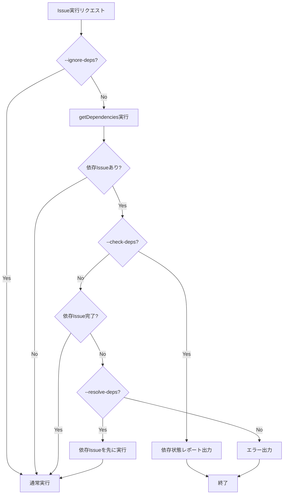
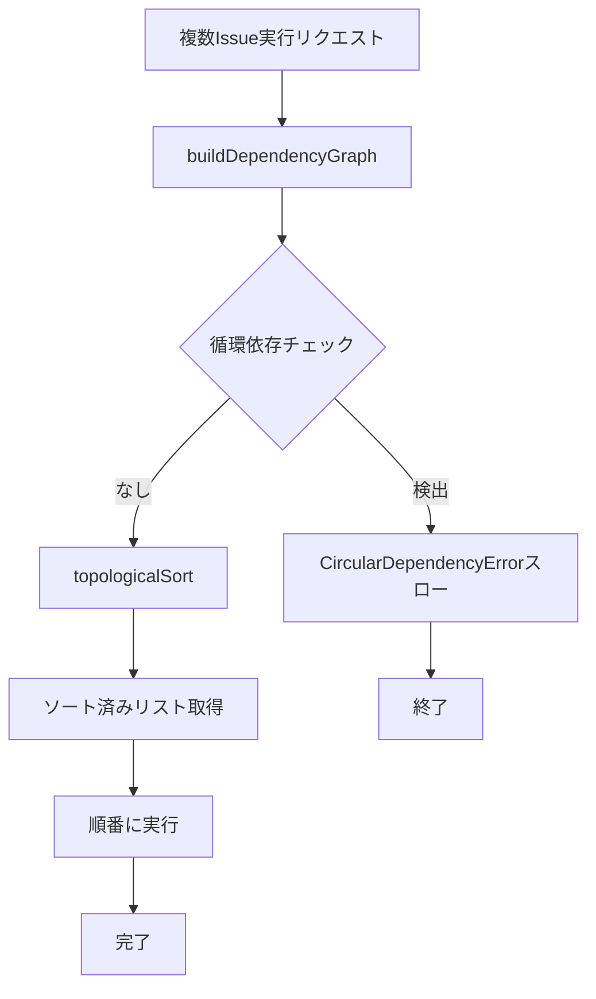

# Issue依存関係管理機能 詳細設計書

## メタ情報

| 項目 | 内容 |
|------|------|
| ドキュメントID | DETAILED-ORCH-002-F011 |
| バージョン | 1.0.0 |
| ステータス | ドラフト |
| 作成日 | 2026-01-25 |
| 最終更新日 | 2026-01-25 |
| 作成者 | AI Assistant |
| 承認者 | - |
| 関連基本設計書 | BASIC-ORCH-002 v1.0.0 |
| 対象機能 | F-011 |

---

## 1. 概要

### 1.1 目的

Issue間の依存関係を管理し、依存順に実行する機能を提供します。依存Issueが未完了の場合は警告またはエラーを出力し、依存関係を考慮した正しい実行順序を保証します。

### 1.2 スコープ

#### スコープ内

- GitHub Issue Dependencies APIを使用した依存関係取得
- 依存関係グラフの構築
- 循環依存の検出
- トポロジカルソートによる実行順序決定
- 依存Issueの完了状態チェック
- CLIオプション（`--resolve-deps`, `--ignore-deps`, `--check-deps`）

#### スコープ外

- 依存関係グラフの可視化UI
- 依存関係の自動設定
- 依存関係の推論

### 1.3 参照ドキュメント

| ドキュメント | パス | 参照箇所 |
|-------------|------|---------|
| 基本設計書 | docs/designs/basic/BASIC-ORCH-002_v1.3.0機能.md | セクション3.3 |
| GitHub Issue取得 | src/input/github.ts | 参考実装 |

---

## 2. 処理フロー

### 2.1 依存関係チェックフロー



### 2.2 複数Issue実行フロー



### 2.3 シーケンス図

```mermaid
sequenceDiagram
    participant CLI as CLI
    participant Resolver as IssueDependencyResolver
    participant GH as gh CLI
    participant Loop as LoopEngine

    CLI->>Resolver: resolveOrder([42, 43, 44])
    
    loop 各Issue
        Resolver->>GH: gh api blocked_by
        GH-->>Resolver: 依存Issue一覧
        Resolver->>GH: gh api blocking
        GH-->>Resolver: ブロック中Issue一覧
        Resolver->>GH: gh issue view --json state
        GH-->>Resolver: Issue状態
    end
    
    Resolver->>Resolver: detectCircularDependency
    
    alt 循環依存あり
        Resolver-->>CLI: throw CircularDependencyError
    else 循環依存なし
        Resolver->>Resolver: topologicalSort
        Resolver-->>CLI: ソート済みIssue番号リスト
    end
    
    loop 各Issue（ソート順）
        CLI->>Loop: runLoop(issue)
        Loop-->>CLI: result
    end
```

---

## 3. インターフェース定義

### 3.1 DependencyNode

```typescript
/**
 * Issue依存関係ノード
 */
export interface DependencyNode {
  /**
   * Issue番号
   */
  issueNumber: number;

  /**
   * このIssueがブロックされているIssue番号のリスト
   * （このIssueを実行する前に完了する必要があるIssue）
   */
  blockedBy: number[];

  /**
   * このIssueがブロックしているIssue番号のリスト
   * （このIssueが完了しないと実行できないIssue）
   */
  blocking: number[];

  /**
   * Issueの状態
   */
  state: "open" | "closed";
}
```

### 3.2 IssueDependencyResolverクラス

```typescript
/**
 * Issue依存関係を解決するクラス
 */
export class IssueDependencyResolver {
  /**
   * コンストラクタ
   * @param executor - プロセス実行器（DI用）
   */
  constructor(executor?: ProcessExecutor);

  /**
   * Issue番号のリストを依存関係を考慮してソート
   * 
   * @param issueNumbers - Issue番号のリスト
   * @returns トポロジカルソート済みのIssue番号リスト
   * @throws CircularDependencyError - 循環依存を検出した場合
   */
  resolveOrder(issueNumbers: number[]): Promise<number[]>;

  /**
   * 指定されたIssueの依存関係を取得
   * 
   * @param issueNumber - Issue番号
   * @returns 依存関係ノード
   */
  getDependencies(issueNumber: number): Promise<DependencyNode>;

  /**
   * 依存Issueが完了しているかチェック
   * 
   * @param issueNumber - Issue番号
   * @returns すべての依存Issueが完了している場合はtrue
   */
  checkDependenciesCompleted(issueNumber: number): Promise<boolean>;
}
```

---

## 4. GitHub Issue Dependencies API

### 4.1 API概要

GitHub Issue Dependencies APIは2025年8月にGAとなった公式機能です。

### 4.2 使用するエンドポイント

| エンドポイント | 説明 |
|---------------|------|
| `repos/{owner}/{repo}/issues/{issue_number}/dependencies/blocked_by` | このIssueをブロックしているIssue一覧 |
| `repos/{owner}/{repo}/issues/{issue_number}/dependencies/blocking` | このIssueがブロックしているIssue一覧 |

### 4.3 APIレスポンス例

```json
// blocked_by レスポンス
[
  {
    "number": 41,
    "title": "依存Issue",
    "state": "closed",
    "html_url": "https://github.com/owner/repo/issues/41"
  }
]
```

### 4.4 gh CLI呼び出し

```bash
# 依存元Issue取得
gh api repos/{owner}/{repo}/issues/42/dependencies/blocked_by

# ブロック先Issue取得
gh api repos/{owner}/{repo}/issues/42/dependencies/blocking
```

---

## 5. アルゴリズム

### 5.1 トポロジカルソート

Kahnのアルゴリズムを使用して、依存関係を考慮した実行順序を決定します。

```
1. 各ノードの入次数（blockedBy.length）を計算
2. 入次数が0のノードをキューに追加
3. キューからノードを取り出し、結果リストに追加
4. 取り出したノードがブロックしているノードの入次数を減らす
5. 入次数が0になったノードをキューに追加
6. キューが空になるまで繰り返す
```

### 5.2 循環依存検出

深さ優先探索（DFS）を使用して循環依存を検出します。

```
1. 各ノードに対してDFSを実行
2. 訪問済みセットと再帰スタックセットを管理
3. 再帰スタック内のノードに再度到達した場合、循環依存
4. 循環依存を検出したらCircularDependencyErrorをスロー
```

---

## 6. エラーハンドリング

### 6.1 CircularDependencyError

```typescript
/**
 * 循環依存エラー
 */
export class CircularDependencyError extends SandboxError {
  constructor(message: string, details?: Record<string, unknown>) {
    super(message, {
      code: "CIRCULAR_DEPENDENCY_ERROR",
      details,
    });
    this.name = "CircularDependencyError";
  }
}
```

### 6.2 IssueDependencyError

```typescript
/**
 * Issue依存関係エラー
 */
export class IssueDependencyError extends SandboxError {
  constructor(message: string, details?: Record<string, unknown>) {
    super(message, {
      code: "ISSUE_DEPENDENCY_ERROR",
      details,
    });
    this.name = "IssueDependencyError";
  }
}
```

### 6.3 エラーケース

| エラーケース | エラーメッセージ | 対処 |
|-------------|----------------|------|
| 循環依存検出 | `循環依存を検出: Issue #A -> #B -> #A` | 依存関係を手動で修正 |
| 依存Issue未完了 | `Issue #42 は Issue #41 に依存していますが、未完了です。` | `--resolve-deps`で依存を先に実行 |
| 依存関係API失敗 | `Issue #42 の依存関係取得に失敗しました` | ネットワーク・権限を確認 |

---

## 7. CLI統合

### 7.1 新規オプション

```bash
# 依存関係をチェック（デフォルト動作）
orch run --issue 45

# 依存Issueを先に実行
orch run --issue 45 --resolve-deps

# 依存関係を無視して実行
orch run --issue 45 --ignore-deps

# 依存関係のみチェック（実行しない）
orch run --issue 45 --check-deps
```

| オプション | 説明 |
|-----------|------|
| `--resolve-deps` | 依存Issueを先に実行してから対象Issueを実行 |
| `--ignore-deps` | 依存関係を無視して実行 |
| `--check-deps` | 依存関係のみチェックして終了（実行しない） |

### 7.2 オプションの排他関係

- `--resolve-deps` と `--ignore-deps` は排他（同時指定不可）
- `--check-deps` は単独で使用（他オプションと併用不可）

---

## 8. 出力仕様

### 8.1 依存関係チェック結果

```
Issue #45 の依存関係:

  依存元（blockedBy）:
    - #41: 認証機能の実装 [closed]
    - #42: データベーススキーマ設計 [open] <- 未完了

  ブロック先（blocking）:
    - #46: API統合テスト

ステータス: 依存Issue未完了（#42）
```

### 8.2 循環依存検出時

```
エラー: 循環依存を検出しました

  #42 -> #43 -> #44 -> #42

依存関係を修正してから再実行してください。
```

### 8.3 実行順序決定時

```
依存関係を解析しました:

  実行順序:
    1. #41: 認証機能の実装
    2. #42: データベーススキーマ設計
    3. #45: ユーザー管理機能

3件のIssueを順番に実行します...
```

---

## 9. テスト方針

### 9.1 単体テスト

| テストケース | 期待結果 |
|-------------|---------|
| 依存関係なしのIssue | そのまま実行可能 |
| 依存Issue完了済み | そのまま実行可能 |
| 依存Issue未完了 | エラー（`--ignore-deps`なし時） |
| 循環依存 | CircularDependencyErrorスロー |
| トポロジカルソート | 正しい順序で返却 |
| 複数Issue依存 | 全依存が考慮される |

### 9.2 統合テスト

| テストケース | 期待結果 |
|-------------|---------|
| `--resolve-deps`フラグ | 依存Issueが先に実行される |
| `--ignore-deps`フラグ | 依存関係を無視して実行 |
| `--check-deps`フラグ | 依存関係レポートのみ出力 |

---

## 10. 実装チェックリスト

- [ ] `src/input/issue-dependency-resolver.ts` 作成
  - [ ] DependencyNodeインターフェース定義
  - [ ] IssueDependencyResolverクラス実装
  - [ ] getDependencies()メソッド実装
  - [ ] resolveOrder()メソッド実装
  - [ ] buildDependencyGraph()メソッド実装
  - [ ] detectCircularDependency()メソッド実装
  - [ ] topologicalSort()メソッド実装
  - [ ] checkDependenciesCompleted()メソッド実装
- [ ] `src/core/errors.ts` 拡張
  - [ ] CircularDependencyError追加
  - [ ] IssueDependencyError追加
- [ ] `src/cli.ts` 拡張
  - [ ] `--resolve-deps`オプション追加
  - [ ] `--ignore-deps`オプション追加
  - [ ] `--check-deps`オプション追加
- [ ] テスト作成
  - [ ] `src/input/issue-dependency-resolver.test.ts`

---

## 11. 変更履歴

| バージョン | 日付 | 変更内容 | 変更者 |
|-----------|------|---------|--------|
| 1.0.0 | 2026-01-25 | 初版作成 | AI Assistant |

---

## 12. 承認

| 役割 | 氏名 | 承認日 | 署名 |
|------|------|--------|------|
| 作成者 | AI Assistant | 2026-01-25 | - |
| レビュアー | - | - | - |
| 承認者 | - | - | - |
