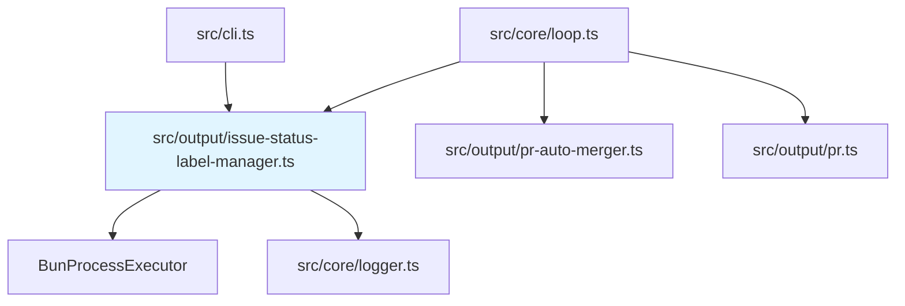

# Issueステータスラベル機能 バックエンド設計書

## メタ情報

| 項目 | 内容 |
|------|------|
| ドキュメントID | DETAILED-ORCH-002-F012-BE |
| バージョン | 1.0.0 |
| ステータス | ドラフト |
| 作成日 | 2026-01-25 |
| 最終更新日 | 2026-01-25 |
| 作成者 | AI Assistant |
| 承認者 | - |
| 関連詳細設計書 | DETAILED-ORCH-002-F012 |
| 対象機能 | F-012 |

---

## 1. 概要

Issueステータスラベル機能のバックエンド実装仕様を定義します。

---

## 2. ファイル構成

| ファイル | 説明 | 新規/変更 |
|---------|------|----------|
| `src/output/issue-status-label-manager.ts` | IssueStatusLabelManagerクラス | 新規 |
| `src/output/issue-status-label-manager.test.ts` | 単体テスト | 新規 |
| `src/core/types.ts` | StateConfigSchema拡張 | 変更 |
| `src/core/loop.ts` | ラベル更新統合 | 変更 |
| `src/cli.ts` | `init --labels`オプション追加 | 変更 |

---

## 3. クラス詳細設計

### 3.1 IssueStatusLabelManager

#### ファイル: `src/output/issue-status-label-manager.ts`

```typescript
import { ProcessExecutor, BunProcessExecutor } from "../core/bun-process-executor.js";
import { logger } from "../core/logger.js";

/**
 * Issueステータス
 */
export type IssueStatus =
  | "queued"
  | "running"
  | "completed"
  | "failed"
  | "blocked"
  | "pr-created"
  | "merged";

/**
 * ラベル定義
 */
export interface LabelDefinition {
  name: string;
  color: string;
  description: string;
}

/**
 * デフォルトのステータスラベル定義
 */
export const STATUS_LABELS: Record<IssueStatus, LabelDefinition> = {
  queued: {
    name: "queued",
    color: "c2e0c6",
    description: "実行待ち",
  },
  running: {
    name: "running",
    color: "0e8a16",
    description: "実行中",
  },
  completed: {
    name: "completed",
    color: "1d76db",
    description: "正常完了",
  },
  failed: {
    name: "failed",
    color: "d93f0b",
    description: "失敗",
  },
  blocked: {
    name: "blocked",
    color: "fbca04",
    description: "ブロック中",
  },
  "pr-created": {
    name: "pr-created",
    color: "6f42c1",
    description: "PR作成済み",
  },
  merged: {
    name: "merged",
    color: "0052cc",
    description: "マージ完了",
  },
};

/**
 * ステータスラベルマネージャー設定
 */
export interface IssueStatusLabelManagerConfig {
  enabled: boolean;
  labelPrefix: string;
}

/**
 * Issueステータスラベルを管理するクラス
 * 
 * タスクの実行状況をGitHub Issueラベルで視覚化します。
 * 
 * @example
 * ```typescript
 * const manager = new IssueStatusLabelManager({
 *   enabled: true,
 *   labelPrefix: "orch",
 * });
 * 
 * // ステータスラベルを初期化
 * await manager.initializeLabels();
 * 
 * // ステータスを更新
 * await manager.updateStatus(42, "running");
 * await manager.updateStatus(42, "completed");
 * ```
 */
export class IssueStatusLabelManager {
  private readonly config: IssueStatusLabelManagerConfig;
  private readonly executor: ProcessExecutor;
  private readonly labels: Map<IssueStatus, LabelDefinition>;

  constructor(
    config: IssueStatusLabelManagerConfig,
    executor: ProcessExecutor = new BunProcessExecutor()
  ) {
    this.config = config;
    this.executor = executor;

    // ラベル定義をプレフィックスで更新
    this.labels = new Map();
    for (const [status, label] of Object.entries(STATUS_LABELS)) {
      this.labels.set(status as IssueStatus, {
        ...label,
        name: `${config.labelPrefix}:${label.name}`,
      });
    }
  }

  /**
   * リポジトリにステータスラベルを初期化
   * 
   * ラベルが存在しない場合は作成します。
   */
  async initializeLabels(): Promise<void> {
    if (!this.config.enabled) {
      logger.debug("ラベル機能は無効です");
      return;
    }

    logger.info("ステータスラベルを初期化中...");

    for (const label of this.labels.values()) {
      await this.ensureLabel(label);
    }

    logger.success("ステータスラベルを初期化しました");
  }

  /**
   * Issueのステータスラベルを更新
   * 
   * 既存のステータスラベルを削除し、新しいステータスラベルを追加します。
   * 
   * @param issueNumber - Issue番号
   * @param status - 新しいステータス
   */
  async updateStatus(issueNumber: number, status: IssueStatus): Promise<void> {
    if (!this.config.enabled) {
      return;
    }

    try {
      // 既存のステータスラベルを削除
      await this.removeAllStatusLabels(issueNumber);

      // 新しいステータスラベルを追加
      const label = this.labels.get(status);
      if (!label) {
        logger.warn(`未知のステータス: ${status}`);
        return;
      }

      await this.addLabel(issueNumber, label.name);

      logger.info(`Issue #${issueNumber} のステータスを ${status} に更新しました`);
    } catch (error) {
      // ベストエフォート: 失敗しても処理は継続
      logger.warn(`ラベル更新失敗（処理は継続）: ${(error as Error).message}`);
    }
  }

  /**
   * 現在のステータスを取得
   * 
   * @param issueNumber - Issue番号
   * @returns 現在のステータス（なければnull）
   */
  async getCurrentStatus(issueNumber: number): Promise<IssueStatus | null> {
    if (!this.config.enabled) {
      return null;
    }

    try {
      const result = await this.executor.spawn("gh", [
        "issue",
        "view",
        String(issueNumber),
        "--json",
        "labels",
      ]);

      if (result.exitCode !== 0) {
        return null;
      }

      const issue = JSON.parse(result.stdout);
      const currentLabels: string[] = issue.labels?.map((l: { name: string }) => l.name) ?? [];

      // ステータスラベルを探す
      for (const [status, label] of this.labels.entries()) {
        if (currentLabels.includes(label.name)) {
          return status;
        }
      }

      return null;
    } catch {
      return null;
    }
  }

  /**
   * ラベルが存在することを確認（なければ作成）
   * 
   * @param label - ラベル定義
   */
  private async ensureLabel(label: LabelDefinition): Promise<void> {
    // ラベルの存在確認
    const result = await this.executor.spawn("gh", [
      "label",
      "list",
      "--search",
      label.name,
      "--json",
      "name",
    ]);

    if (result.exitCode === 0) {
      try {
        const labels = JSON.parse(result.stdout);
        if (labels.some((l: { name: string }) => l.name === label.name)) {
          logger.debug(`ラベル ${label.name} は既に存在します`);
          return;
        }
      } catch {
        // JSON解析失敗時は作成を試みる
      }
    }

    // ラベルを作成
    const createResult = await this.executor.spawn("gh", [
      "label",
      "create",
      label.name,
      "--color",
      label.color,
      "--description",
      label.description,
      "--force", // 既存の場合は更新
    ]);

    if (createResult.exitCode === 0) {
      logger.debug(`ラベル ${label.name} を作成しました`);
    } else {
      logger.warn(`ラベル ${label.name} の作成に失敗: ${createResult.stderr}`);
    }
  }

  /**
   * Issueにラベルを追加
   * 
   * @param issueNumber - Issue番号
   * @param labelName - ラベル名
   */
  private async addLabel(issueNumber: number, labelName: string): Promise<void> {
    const result = await this.executor.spawn("gh", [
      "issue",
      "edit",
      String(issueNumber),
      "--add-label",
      labelName,
    ]);

    if (result.exitCode !== 0) {
      throw new Error(`ラベル追加失敗: ${result.stderr}`);
    }
  }

  /**
   * Issueからすべてのステータスラベルを削除
   * 
   * @param issueNumber - Issue番号
   */
  private async removeAllStatusLabels(issueNumber: number): Promise<void> {
    // 現在のラベルを取得
    const result = await this.executor.spawn("gh", [
      "issue",
      "view",
      String(issueNumber),
      "--json",
      "labels",
    ]);

    if (result.exitCode !== 0) {
      return;
    }

    let currentLabels: string[];
    try {
      const issue = JSON.parse(result.stdout);
      currentLabels = issue.labels?.map((l: { name: string }) => l.name) ?? [];
    } catch {
      return;
    }

    // ステータスラベルのみを削除
    const prefix = `${this.config.labelPrefix}:`;
    for (const labelName of currentLabels) {
      if (labelName.startsWith(prefix)) {
        await this.executor.spawn("gh", [
          "issue",
          "edit",
          String(issueNumber),
          "--remove-label",
          labelName,
        ]);
      }
    }
  }

  /**
   * すべてのステータスラベル名を取得
   * 
   * @returns ラベル名の配列
   */
  getAllLabelNames(): string[] {
    return Array.from(this.labels.values()).map(l => l.name);
  }
}
```

---

## 4. 型定義拡張

### ファイル: `src/core/types.ts`（変更分）

```typescript
/**
 * 状態管理設定のzodスキーマ（拡張）
 */
export const StateConfigSchema = z.object({
  use_github_labels: z.boolean().default(true),
  use_scratchpad: z.boolean().default(true),
  scratchpad_path: z.string().default(".agent/scratchpad.md"),

  /**
   * ラベルのプレフィックス
   * @default "orch"
   */
  label_prefix: z.string().default("orch"),
});

export type StateConfig = z.infer<typeof StateConfigSchema>;
```

---

## 5. Loop Engine統合

### ファイル: `src/core/loop.ts`（変更分）

```typescript
import { IssueStatusLabelManager, IssueStatus } from "../output/issue-status-label-manager.js";
import { PRAutoMerger } from "../output/pr-auto-merger.js";

export async function runLoop(context: LoopContext): Promise<LoopResult> {
  const labelManager = new IssueStatusLabelManager({
    enabled: config.state?.use_github_labels ?? true,
    labelPrefix: config.state?.label_prefix ?? "orch",
  });

  // タスク開始時: running
  await labelManager.updateStatus(context.issue.number, "running");

  try {
    // 既存のループ処理
    const result = await executeLoop(context);

    // タスク完了時: completed
    await labelManager.updateStatus(context.issue.number, "completed");

    // PR作成時: pr-created
    if (context.createPR) {
      const prNumber = await createPR(context);
      await labelManager.updateStatus(context.issue.number, "pr-created");

      // PR自動マージ
      if (context.prConfig?.autoMerge) {
        const merger = new PRAutoMerger({
          enabled: true,
          mergeMethod: context.prConfig.mergeMethod,
          deleteBranch: context.prConfig.deleteBranch,
          ciTimeoutSecs: context.prConfig.ciTimeoutSecs,
        });

        try {
          await merger.autoMerge(prNumber);
          // マージ成功時: merged
          await labelManager.updateStatus(context.issue.number, "merged");
        } catch (error) {
          // CI失敗時はpr-createdのまま
          logger.error(`PR自動マージ失敗: ${(error as Error).message}`);
        }
      }
    }

    return result;
  } catch (error) {
    // タスク失敗時: failed
    await labelManager.updateStatus(context.issue.number, "failed");
    throw error;
  }
}

/**
 * 依存関係チェック時のブロック状態設定
 */
export async function setBlockedStatus(
  issueNumber: number,
  config: Config
): Promise<void> {
  const labelManager = new IssueStatusLabelManager({
    enabled: config.state?.use_github_labels ?? true,
    labelPrefix: config.state?.label_prefix ?? "orch",
  });

  await labelManager.updateStatus(issueNumber, "blocked");
}
```

---

## 6. CLI統合

### ファイル: `src/cli.ts`（変更分）

```typescript
import { IssueStatusLabelManager } from "./output/issue-status-label-manager.js";

program
  .command("init")
  // ... 既存オプション
  .option("--labels", "ステータスラベルをリポジトリに作成")
  .action(async (options) => {
    // ... 既存処理

    if (options.labels) {
      const labelManager = new IssueStatusLabelManager({
        enabled: true,
        labelPrefix: config.state?.label_prefix ?? "orch",
      });

      await labelManager.initializeLabels();
      logger.success("ステータスラベルを初期化しました");
    }

    // ... 既存処理
  });
```

---

## 7. テスト設計

### ファイル: `src/output/issue-status-label-manager.test.ts`

```typescript
import { describe, it, expect, mock, beforeEach } from "bun:test";
import {
  IssueStatusLabelManager,
  IssueStatusLabelManagerConfig,
  STATUS_LABELS,
} from "./issue-status-label-manager.js";
import type { ProcessExecutor } from "../core/bun-process-executor.js";

describe("IssueStatusLabelManager", () => {
  let mockExecutor: ProcessExecutor;
  let defaultConfig: IssueStatusLabelManagerConfig;

  beforeEach(() => {
    mockExecutor = {
      spawn: mock(() => Promise.resolve({ stdout: "", stderr: "", exitCode: 0 })),
    };

    defaultConfig = {
      enabled: true,
      labelPrefix: "orch",
    };
  });

  describe("constructor", () => {
    it("プレフィックスを適用したラベル名を生成する", () => {
      const manager = new IssueStatusLabelManager(defaultConfig, mockExecutor);
      const labels = manager.getAllLabelNames();

      expect(labels).toContain("orch:running");
      expect(labels).toContain("orch:completed");
      expect(labels).toContain("orch:failed");
    });

    it("カスタムプレフィックスを適用する", () => {
      const customConfig = { ...defaultConfig, labelPrefix: "custom" };
      const manager = new IssueStatusLabelManager(customConfig, mockExecutor);
      const labels = manager.getAllLabelNames();

      expect(labels).toContain("custom:running");
      expect(labels).toContain("custom:completed");
    });
  });

  describe("initializeLabels", () => {
    it("各ラベルを作成する", async () => {
      mockExecutor.spawn = mock(() =>
        Promise.resolve({ stdout: "[]", stderr: "", exitCode: 0 })
      );

      const manager = new IssueStatusLabelManager(defaultConfig, mockExecutor);
      await manager.initializeLabels();

      // ラベル数 * 2（確認 + 作成）
      expect(mockExecutor.spawn).toHaveBeenCalled();
    });

    it("enabled=falseの場合は何もしない", async () => {
      const disabledConfig = { ...defaultConfig, enabled: false };
      const manager = new IssueStatusLabelManager(disabledConfig, mockExecutor);
      
      await manager.initializeLabels();

      expect(mockExecutor.spawn).not.toHaveBeenCalled();
    });
  });

  describe("updateStatus", () => {
    it("既存ラベルを削除して新しいラベルを追加する", async () => {
      const spawnCalls: { cmd: string; args: string[] }[] = [];
      mockExecutor.spawn = mock((cmd: string, args: string[]) => {
        spawnCalls.push({ cmd, args });
        
        if (args.includes("--json")) {
          return Promise.resolve({
            stdout: JSON.stringify({ labels: [{ name: "orch:running" }] }),
            stderr: "",
            exitCode: 0,
          });
        }
        return Promise.resolve({ stdout: "", stderr: "", exitCode: 0 });
      });

      const manager = new IssueStatusLabelManager(defaultConfig, mockExecutor);
      await manager.updateStatus(42, "completed");

      // ラベル取得 + 削除 + 追加
      expect(spawnCalls.some(c => c.args.includes("--remove-label"))).toBe(true);
      expect(spawnCalls.some(c => c.args.includes("--add-label"))).toBe(true);
      expect(spawnCalls.some(c => c.args.includes("orch:completed"))).toBe(true);
    });

    it("enabled=falseの場合は何もしない", async () => {
      const disabledConfig = { ...defaultConfig, enabled: false };
      const manager = new IssueStatusLabelManager(disabledConfig, mockExecutor);

      await manager.updateStatus(42, "running");

      expect(mockExecutor.spawn).not.toHaveBeenCalled();
    });

    it("エラー時も例外をスローしない（ベストエフォート）", async () => {
      mockExecutor.spawn = mock(() =>
        Promise.resolve({ stdout: "", stderr: "API error", exitCode: 1 })
      );

      const manager = new IssueStatusLabelManager(defaultConfig, mockExecutor);

      // 例外がスローされないことを確認
      await expect(manager.updateStatus(42, "running")).resolves.toBeUndefined();
    });
  });

  describe("getCurrentStatus", () => {
    it("現在のステータスを返す", async () => {
      mockExecutor.spawn = mock(() =>
        Promise.resolve({
          stdout: JSON.stringify({ labels: [{ name: "orch:running" }] }),
          stderr: "",
          exitCode: 0,
        })
      );

      const manager = new IssueStatusLabelManager(defaultConfig, mockExecutor);
      const status = await manager.getCurrentStatus(42);

      expect(status).toBe("running");
    });

    it("ステータスラベルがない場合はnullを返す", async () => {
      mockExecutor.spawn = mock(() =>
        Promise.resolve({
          stdout: JSON.stringify({ labels: [{ name: "bug" }] }),
          stderr: "",
          exitCode: 0,
        })
      );

      const manager = new IssueStatusLabelManager(defaultConfig, mockExecutor);
      const status = await manager.getCurrentStatus(42);

      expect(status).toBeNull();
    });

    it("enabled=falseの場合はnullを返す", async () => {
      const disabledConfig = { ...defaultConfig, enabled: false };
      const manager = new IssueStatusLabelManager(disabledConfig, mockExecutor);

      const status = await manager.getCurrentStatus(42);

      expect(status).toBeNull();
      expect(mockExecutor.spawn).not.toHaveBeenCalled();
    });
  });
});
```

---

## 8. 依存関係



---

## 9. gh CLIコマンド一覧

### 9.1 ラベル操作

```bash
# ラベル一覧取得
gh label list --search "orch:" --json name

# ラベル作成
gh label create "orch:running" --color "0e8a16" --description "実行中" --force

# Issue ラベル確認
gh issue view 42 --json labels

# ラベル追加
gh issue edit 42 --add-label "orch:running"

# ラベル削除
gh issue edit 42 --remove-label "orch:queued"
```

### 9.2 エラーコード

| 終了コード | 意味 |
|-----------|------|
| 0 | 成功 |
| 1 | 一般エラー（権限不足、Issue不存在など） |

---

## 10. 実装手順

1. `src/core/types.ts` の `StateConfigSchema` に `label_prefix` を追加
2. `src/output/issue-status-label-manager.ts` を新規作成
3. `src/output/issue-status-label-manager.test.ts` を新規作成
4. テスト実行・パス確認
5. `src/core/loop.ts` に ラベル更新統合
6. `src/cli.ts` に `init --labels` オプション追加
7. 統合テスト実行

---

## 11. パフォーマンス考慮事項

### 11.1 API呼び出し回数

- ステータス更新: 最大3回（取得 + 削除 + 追加）
- ラベル初期化: 7 * 2 = 14回（確認 + 作成）

### 11.2 最適化案

1. **ラベル削除の効率化**: `--remove-label` を1回で複数指定
2. **存在確認のスキップ**: `--force` フラグで既存確認を省略
3. **バッチ処理**: GraphQL APIで一括操作（将来対応）

---

## 12. 変更履歴

| バージョン | 日付 | 変更内容 | 変更者 |
|-----------|------|---------|--------|
| 1.0.0 | 2026-01-25 | 初版作成 | AI Assistant |
