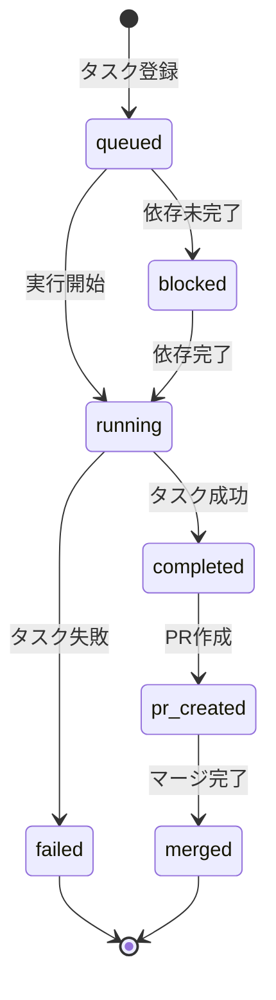
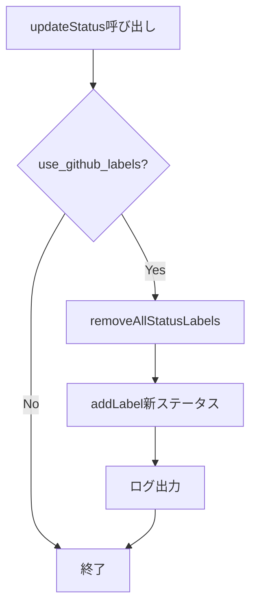
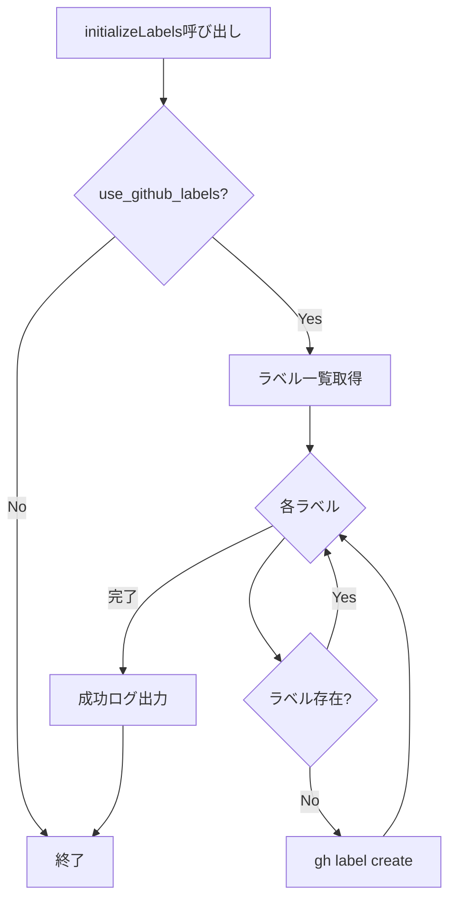

# Issueステータスラベル機能 詳細設計書

## メタ情報

| 項目 | 内容 |
|------|------|
| ドキュメントID | DETAILED-ORCH-002-F012 |
| バージョン | 1.0.0 |
| ステータス | ドラフト |
| 作成日 | 2026-01-25 |
| 最終更新日 | 2026-01-25 |
| 作成者 | AI Assistant |
| 承認者 | - |
| 関連基本設計書 | BASIC-ORCH-002 v1.0.0 |
| 対象機能 | F-012 |

---

## 1. 概要

### 1.1 目的

GitHub Issueラベルでタスク状態を管理する機能を提供します。タスクの実行状況（実行中、完了、失敗など）をGitHub上で視覚的に確認できるようにします。

### 1.2 スコープ

#### スコープ内

- ステータスラベルの定義と初期化
- タスク状態に応じたラベル更新
- 排他的なラベル管理（1つのステータスラベルのみ付与）
- ラベルプレフィックスのカスタマイズ
- Loop Engineとの統合

#### スコープ外

- ラベル体系の完全カスタマイズ（プレフィックスのみ対応）
- ラベルの色・説明文のカスタマイズ
- 複数ステータスの同時付与

### 1.3 参照ドキュメント

| ドキュメント | パス | 参照箇所 |
|-------------|------|---------|
| 基本設計書 | docs/designs/basic/BASIC-ORCH-002_v1.3.0機能.md | セクション3.4 |
| 既存ラベル機能 | src/core/config.ts | state.use_github_labels |

---

## 2. ステータスラベル体系

### 2.1 ラベル定義

| ステータス | ラベル名 | 色コード | 説明 |
|-----------|---------|---------|------|
| `queued` | `orch:queued` | #c2e0c6 (薄緑) | 実行待ち |
| `running` | `orch:running` | #0e8a16 (緑) | 実行中 |
| `completed` | `orch:completed` | #1d76db (青) | 正常完了 |
| `failed` | `orch:failed` | #d93f0b (赤) | 失敗 |
| `blocked` | `orch:blocked` | #fbca04 (黄) | ブロック中（依存待ち） |
| `pr-created` | `orch:pr-created` | #6f42c1 (紫) | PR作成済み |
| `merged` | `orch:merged` | #0052cc (濃青) | マージ完了 |

### 2.2 状態遷移図



---

## 3. 処理フロー

### 3.1 ラベル更新フロー



### 3.2 ラベル初期化フロー



### 3.3 シーケンス図

```mermaid
sequenceDiagram
    participant Loop as LoopEngine
    participant Label as IssueStatusLabelManager
    participant GH as gh CLI

    Loop->>Label: updateStatus(42, "running")
    
    alt use_github_labels有効
        Label->>GH: gh issue view 42 --json labels
        GH-->>Label: 現在のラベル一覧
        
        loop 各ステータスラベル
            Label->>GH: gh issue edit 42 --remove-label
        end
        
        Label->>GH: gh issue edit 42 --add-label orch:running
        GH-->>Label: 成功
        Label-->>Loop: void
    else use_github_labels無効
        Label-->>Loop: void（何もしない）
    end
```

---

## 4. インターフェース定義

### 4.1 IssueStatus型

```typescript
/**
 * Issueステータス
 */
export type IssueStatus =
  | "queued"
  | "running"
  | "completed"
  | "failed"
  | "blocked"
  | "pr-created"
  | "merged";
```

### 4.2 LabelDefinition

```typescript
/**
 * ラベル定義
 */
export interface LabelDefinition {
  /**
   * ラベル名
   */
  name: string;

  /**
   * 色コード（#なし、6桁16進数）
   */
  color: string;

  /**
   * 説明文
   */
  description: string;
}
```

### 4.3 IssueStatusLabelManagerConfig

```typescript
/**
 * ステータスラベルマネージャー設定
 */
export interface IssueStatusLabelManagerConfig {
  /**
   * GitHub Issueラベルを使用するか
   * @default true
   */
  enabled: boolean;

  /**
   * ラベルのプレフィックス
   * @default "orch"
   */
  labelPrefix: string;
}
```

### 4.4 IssueStatusLabelManagerクラス

```typescript
/**
 * Issueステータスラベルを管理するクラス
 */
export class IssueStatusLabelManager {
  /**
   * コンストラクタ
   * @param config - 設定
   * @param executor - プロセス実行器（DI用）
   */
  constructor(
    config: IssueStatusLabelManagerConfig,
    executor?: ProcessExecutor
  );

  /**
   * リポジトリにステータスラベルを初期化
   * ラベルが存在しない場合は作成する
   */
  initializeLabels(): Promise<void>;

  /**
   * Issueのステータスラベルを更新
   * 
   * @param issueNumber - Issue番号
   * @param status - 新しいステータス
   */
  updateStatus(issueNumber: number, status: IssueStatus): Promise<void>;

  /**
   * 現在のステータスを取得
   * 
   * @param issueNumber - Issue番号
   * @returns 現在のステータス（なければnull）
   */
  getCurrentStatus(issueNumber: number): Promise<IssueStatus | null>;
}
```

---

## 5. 設定ファイル拡張

### 5.1 orch.yml

```yaml
# 状態管理（拡張 v1.3.0）
state:
  use_github_labels: true
  use_scratchpad: true
  scratchpad_path: ".agent/scratchpad.md"
  label_prefix: "orch"  # 新規
```

### 5.2 StateConfigSchema（zod）拡張

```typescript
export const StateConfigSchema = z.object({
  use_github_labels: z.boolean().default(true),
  use_scratchpad: z.boolean().default(true),
  scratchpad_path: z.string().default(".agent/scratchpad.md"),

  // 新規: ラベルプレフィックス
  label_prefix: z.string().default("orch"),
});

export type StateConfig = z.infer<typeof StateConfigSchema>;
```

---

## 6. Loop Engine統合

### 6.1 統合ポイント

| タイミング | ステータス | 説明 |
|-----------|-----------|------|
| タスク開始時 | `running` | ループ開始直後 |
| タスク完了時 | `completed` | ループ正常終了時 |
| タスク失敗時 | `failed` | エラー発生時 |
| 依存未完了時 | `blocked` | 依存Issueが未完了 |
| PR作成時 | `pr-created` | PR作成成功時 |
| マージ完了時 | `merged` | 自動マージ成功時 |

### 6.2 統合コード

```typescript
// src/core/loop.ts

export async function runLoop(context: LoopContext): Promise<LoopResult> {
  const labelManager = new IssueStatusLabelManager({
    enabled: config.state?.use_github_labels ?? true,
    labelPrefix: config.state?.label_prefix ?? "orch",
  });

  // 1. タスク開始時: running
  await labelManager.updateStatus(context.issue.number, "running");

  try {
    // 2. 既存のループ処理
    // ...

    // 3. タスク完了時: completed
    await labelManager.updateStatus(context.issue.number, "completed");

    // 4. PR作成時: pr-created
    if (context.createPR) {
      const prNumber = await createPR(context);
      await labelManager.updateStatus(context.issue.number, "pr-created");

      // 5. PR自動マージ成功時: merged
      if (config.pr?.autoMerge) {
        const merger = new PRAutoMerger(config.pr);
        await merger.autoMerge(prNumber);
        await labelManager.updateStatus(context.issue.number, "merged");
      }
    }

    return result;
  } catch (error) {
    // 6. タスク失敗時: failed
    await labelManager.updateStatus(context.issue.number, "failed");
    throw error;
  }
}
```

---

## 7. CLI統合

### 7.1 ラベル初期化コマンド

```bash
# ステータスラベルを初期化
orch init --labels
```

### 7.2 オプション

| オプション | 説明 |
|-----------|------|
| `--labels` | ステータスラベルをリポジトリに作成 |

---

## 8. エラーハンドリング

### 8.1 エラーケース

| エラーケース | 対処 | リトライ |
|-------------|------|---------|
| ラベル作成失敗 | 警告ログ出力、処理続行 | なし |
| ラベル更新失敗 | 警告ログ出力、処理続行 | 1回 |
| Issue取得失敗 | 警告ログ出力、処理続行 | なし |
| 権限不足 | エラーログ出力、処理続行 | なし |

### 8.2 ベストエフォート方針

ラベル更新は「ベストエフォート」で行い、失敗してもタスク実行自体は継続します。

```typescript
try {
  await labelManager.updateStatus(issueNumber, "running");
} catch (error) {
  logger.warn(`ラベル更新失敗（処理は継続）: ${error.message}`);
}
```

---

## 9. テスト方針

### 9.1 単体テスト

| テストケース | 期待結果 |
|-------------|---------|
| ラベル初期化（新規作成） | gh label create が呼ばれる |
| ラベル初期化（既存） | 作成スキップ |
| ステータス更新 | 旧ラベル削除 + 新ラベル追加 |
| use_github_labels=false | 何も実行しない |
| カスタムプレフィックス | プレフィックスが反映される |

### 9.2 統合テスト

| テストケース | 期待結果 |
|-------------|---------|
| タスク実行フロー | running -> completed |
| タスク失敗フロー | running -> failed |
| PR作成フロー | completed -> pr-created |
| マージフロー | pr-created -> merged |

---

## 10. 実装チェックリスト

- [ ] `src/output/issue-status-label-manager.ts` 作成
  - [ ] IssueStatus型定義
  - [ ] LabelDefinitionインターフェース定義
  - [ ] STATUS_LABELS定数定義
  - [ ] IssueStatusLabelManagerConfigインターフェース定義
  - [ ] IssueStatusLabelManagerクラス実装
  - [ ] initializeLabels()メソッド実装
  - [ ] updateStatus()メソッド実装
  - [ ] getCurrentStatus()メソッド実装
  - [ ] ensureLabel()プライベートメソッド実装
  - [ ] addLabel()プライベートメソッド実装
  - [ ] removeAllStatusLabels()プライベートメソッド実装
- [ ] `src/core/types.ts` 拡張
  - [ ] StateConfigSchemaにlabel_prefix追加
- [ ] `src/core/loop.ts` 統合
  - [ ] IssueStatusLabelManager呼び出し追加
- [ ] `src/cli.ts` 拡張
  - [ ] `init --labels`オプション追加
- [ ] テスト作成
  - [ ] `src/output/issue-status-label-manager.test.ts`

---

## 11. 変更履歴

| バージョン | 日付 | 変更内容 | 変更者 |
|-----------|------|---------|--------|
| 1.0.0 | 2026-01-25 | 初版作成 | AI Assistant |

---

## 12. 承認

| 役割 | 氏名 | 承認日 | 署名 |
|------|------|--------|------|
| 作成者 | AI Assistant | 2026-01-25 | - |
| レビュアー | - | - | - |
| 承認者 | - | - | - |
