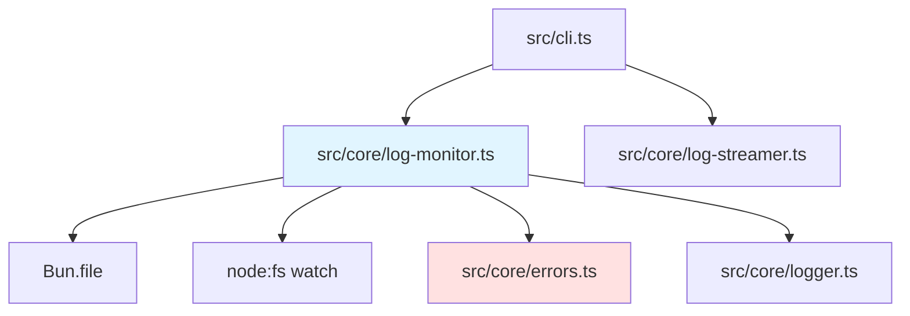

# リアルタイムログ監視機能 バックエンド設計書

## メタ情報

| 項目 | 内容 |
|------|------|
| ドキュメントID | DETAILED-ORCH-002-F010-BE |
| バージョン | 1.0.0 |
| ステータス | ドラフト |
| 作成日 | 2026-01-25 |
| 最終更新日 | 2026-01-25 |
| 作成者 | AI Assistant |
| 承認者 | - |
| 関連詳細設計書 | DETAILED-ORCH-002-F010 |
| 対象機能 | F-010 |

---

## 1. 概要

リアルタイムログ監視機能のバックエンド実装仕様を定義します。

---

## 2. ファイル構成

| ファイル | 説明 | 新規/変更 |
|---------|------|----------|
| `src/core/log-monitor.ts` | LogMonitorクラス | 新規 |
| `src/core/log-monitor.test.ts` | 単体テスト | 新規 |
| `src/core/errors.ts` | LogMonitorError追加 | 変更 |
| `src/cli.ts` | `--follow`オプション追加 | 変更 |

---

## 3. クラス詳細設計

### 3.1 LogMonitor

#### ファイル: `src/core/log-monitor.ts`

```typescript
import { join } from "node:path";
import { watch } from "node:fs";
import { LogMonitorError } from "./errors.js";
import { logger } from "./logger.js";

/**
 * ログ監視設定
 */
export interface LogMonitorConfig {
  taskId: string;
  baseDir?: string;
  pollInterval?: number;
}

/**
 * 別プロセスからログファイルをリアルタイム監視するクラス
 * 
 * @example
 * ```typescript
 * const monitor = new LogMonitor({ taskId: "task-123" });
 * 
 * // 別ターミナルから監視開始
 * await monitor.monitor((line) => {
 *   console.log(line);
 * });
 * 
 * // Ctrl+Cで停止
 * process.on("SIGINT", () => {
 *   monitor.stop();
 * });
 * ```
 */
export class LogMonitor {
  private readonly taskId: string;
  private readonly logPath: string;
  private readonly pollInterval: number;
  private abortController: AbortController | null = null;
  private lastSize = 0;

  constructor(config: LogMonitorConfig) {
    this.taskId = config.taskId;
    this.logPath = join(
      config.baseDir ?? ".agent",
      config.taskId,
      "output.log"
    );
    this.pollInterval = config.pollInterval ?? 500;
  }

  /**
   * 監視対象のログファイルパスを取得
   */
  getLogPath(): string {
    return this.logPath;
  }

  /**
   * ログファイルをリアルタイムで監視
   * 
   * @param callback - 新しい行が追加されたときに呼ばれる関数
   * @throws LogMonitorError - ログファイルが存在しない場合
   */
  async monitor(callback: (line: string) => void): Promise<void> {
    // ファイルの存在確認
    const file = Bun.file(this.logPath);
    if (!(await file.exists())) {
      throw new LogMonitorError(
        `ログファイルが見つかりません: ${this.logPath}`,
        { taskId: this.taskId, logPath: this.logPath }
      );
    }

    // 初期サイズを取得
    this.lastSize = file.size;

    this.abortController = new AbortController();
    const signal = this.abortController.signal;

    // fs.watch() を試行
    try {
      await this.monitorWithWatch(callback, signal);
    } catch (error) {
      // fs.watch() が使えない場合はpollingにフォールバック
      if (!signal.aborted) {
        logger.warn("fs.watch() が使えません。pollingモードで監視します。");
        await this.monitorWithPolling(callback, signal);
      }
    }
  }

  /**
   * 監視を停止
   */
  stop(): void {
    if (this.abortController) {
      this.abortController.abort();
      this.abortController = null;
    }
  }

  /**
   * fs.watch() を使用した監視
   */
  private async monitorWithWatch(
    callback: (line: string) => void,
    signal: AbortSignal
  ): Promise<void> {
    return new Promise((resolve, reject) => {
      const watcher = watch(this.logPath, { persistent: true }, async (eventType) => {
        if (signal.aborted) {
          watcher.close();
          resolve();
          return;
        }

        if (eventType === "change") {
          try {
            await this.readNewLines(callback);
          } catch (error) {
            logger.debug("Failed to read new lines", { error });
          }
        }
      });

      watcher.on("error", (error) => {
        watcher.close();
        if (!signal.aborted) {
          reject(error);
        }
      });

      // シグナルでアボートされたら終了
      signal.addEventListener("abort", () => {
        watcher.close();
        resolve();
      });
    });
  }

  /**
   * polling を使用した監視
   */
  private async monitorWithPolling(
    callback: (line: string) => void,
    signal: AbortSignal
  ): Promise<void> {
    while (!signal.aborted) {
      try {
        await this.readNewLines(callback);
      } catch (error) {
        logger.debug("Failed to read new lines", { error });
      }
      await new Promise((resolve) => setTimeout(resolve, this.pollInterval));
    }
  }

  /**
   * 新しい行を読み取り
   */
  private async readNewLines(callback: (line: string) => void): Promise<void> {
    const file = Bun.file(this.logPath);
    const currentSize = file.size;

    if (currentSize > this.lastSize) {
      // 新しいデータを読み取る
      const content = await file.text();
      const newContent = content.slice(this.lastSize);
      const lines = newContent.split("\n");

      for (const line of lines) {
        if (line.trim()) {
          callback(line);
        }
      }

      this.lastSize = currentSize;
    }
  }
}
```

---

## 4. エラークラス追加

### ファイル: `src/core/errors.ts`（追加分）

```typescript
/**
 * ログ監視エラー
 * 
 * @example
 * ```typescript
 * throw new LogMonitorError("Log file not found", { taskId: "task-123" });
 * ```
 */
export class LogMonitorError extends SandboxError {
  constructor(message: string, details?: Record<string, unknown>) {
    super(message, {
      code: "LOG_MONITOR_ERROR",
      details,
    });
    this.name = "LogMonitorError";
  }
}
```

---

## 5. CLI統合

### ファイル: `src/cli.ts`（変更分）

```typescript
import { LogMonitor } from "./core/log-monitor.js";
import { LogStreamer } from "./core/log-streamer.js";

program
  .command("logs")
  .description("タスクの実行ログを表示")
  .option("-t, --task <id>", "タスクID")
  .option("-f, --follow", "リアルタイムで監視")
  .option("-n, --lines <number>", "表示する行数", "100")
  .option("--table", "タスク状態テーブルを表示（レガシーモード）")
  .option("--interval <ms>", "テーブルモードの更新間隔", "1000")
  .action(async (options) => {
    // --table モード（既存機能）
    if (options.table) {
      // 既存のテーブル表示ロジック
      await showTaskTable(Number(options.interval));
      return;
    }

    // タスクID取得
    const taskId = options.task ?? (await selectLatestTask());
    
    if (!taskId) {
      logger.error("タスクIDを指定してください");
      process.exit(1);
    }

    if (options.follow) {
      // リアルタイム監視（v1.3.0新機能）
      const monitor = new LogMonitor({ taskId });

      logger.info(`タスク ${taskId} のログを監視中... (Ctrl+Cで終了)`);

      // Ctrl+Cで終了
      process.on("SIGINT", () => {
        monitor.stop();
        logger.info("監視を終了しました");
        process.exit(0);
      });

      try {
        await monitor.monitor((line) => {
          console.log(line);
        });
      } catch (error) {
        if (error instanceof LogMonitorError) {
          logger.error(error.message);
        } else {
          logger.error(`ログ監視エラー: ${error}`);
        }
        process.exit(1);
      }
    } else {
      // 過去のログを表示（既存機能）
      const streamer = new LogStreamer({
        taskId,
        lines: Number(options.lines),
      });

      try {
        await streamer.stream((line) => {
          console.log(line);
        });
      } catch (error) {
        logger.error(`ログ読み取りエラー: ${error}`);
        process.exit(1);
      }
    }
  });

/**
 * 最新のタスクIDを取得
 */
async function selectLatestTask(): Promise<string | undefined> {
  // .agent/ ディレクトリから最新のタスクを検索
  const taskManager = new TaskManager();
  const tasks = await taskManager.listTasks();
  
  if (tasks.length === 0) {
    return undefined;
  }

  // 最新のタスクを返す
  return tasks[0].id;
}
```

---

## 6. テスト設計

### ファイル: `src/core/log-monitor.test.ts`

```typescript
import { describe, it, expect, beforeEach, afterEach, mock } from "bun:test";
import { LogMonitor, LogMonitorConfig } from "./log-monitor.js";
import { LogMonitorError } from "./errors.js";
import { mkdir, writeFile, appendFile, rm } from "node:fs/promises";
import { join } from "node:path";

describe("LogMonitor", () => {
  const testDir = ".test-agent";
  const taskId = "test-task-123";
  const logDir = join(testDir, taskId);
  const logPath = join(logDir, "output.log");

  beforeEach(async () => {
    // テスト用ディレクトリとファイルを作成
    await mkdir(logDir, { recursive: true });
    await writeFile(logPath, "initial line\n");
  });

  afterEach(async () => {
    // クリーンアップ
    await rm(testDir, { recursive: true, force: true });
  });

  describe("constructor", () => {
    it("デフォルト設定で初期化できる", () => {
      const monitor = new LogMonitor({ taskId });
      expect(monitor.getLogPath()).toBe(join(".agent", taskId, "output.log"));
    });

    it("カスタムbaseDirで初期化できる", () => {
      const monitor = new LogMonitor({ taskId, baseDir: testDir });
      expect(monitor.getLogPath()).toBe(logPath);
    });
  });

  describe("monitor", () => {
    it("ファイルが存在しない場合はエラーをスローする", async () => {
      const monitor = new LogMonitor({ taskId: "nonexistent", baseDir: testDir });

      await expect(monitor.monitor(() => {})).rejects.toThrow(LogMonitorError);
    });

    it("ファイル存在時に監視を開始できる", async () => {
      const monitor = new LogMonitor({ taskId, baseDir: testDir });
      const lines: string[] = [];

      // 非同期で監視開始
      const monitorPromise = monitor.monitor((line) => {
        lines.push(line);
      });

      // 少し待ってから新しい行を追加
      await new Promise((resolve) => setTimeout(resolve, 100));
      await appendFile(logPath, "new line 1\n");
      await new Promise((resolve) => setTimeout(resolve, 600)); // polling間隔待ち

      // 監視停止
      monitor.stop();
      await monitorPromise;

      expect(lines).toContain("new line 1");
    });

    it("stop()で監視を停止できる", async () => {
      const monitor = new LogMonitor({ taskId, baseDir: testDir });

      const monitorPromise = monitor.monitor(() => {});

      // すぐに停止
      monitor.stop();

      // エラーなく終了することを確認
      await expect(monitorPromise).resolves.toBeUndefined();
    });
  });

  describe("getLogPath", () => {
    it("正しいログパスを返す", () => {
      const monitor = new LogMonitor({ taskId, baseDir: testDir });
      expect(monitor.getLogPath()).toBe(logPath);
    });
  });
});
```

---

## 7. 依存関係



---

## 8. 実装手順

1. `src/core/errors.ts` に `LogMonitorError` を追加
2. `src/core/log-monitor.ts` を新規作成
3. `src/core/log-monitor.test.ts` を新規作成
4. テスト実行・パス確認
5. `src/cli.ts` の logs コマンドに `--follow` オプション追加

---

## 9. 注意事項

### 9.1 fs.watch()の制限

- ネットワークファイルシステム（NFS等）では動作しない可能性
- macOSとLinuxで挙動が異なる場合がある
- 自動的にpollingモードにフォールバック

### 9.2 パフォーマンス

- pollInterval のデフォルトは500ms
- 高頻度の監視が必要な場合は pollInterval を短くする
- ただし、CPU使用率に注意

### 9.3 並行アクセス

- 複数のLogMonitorインスタンスが同じファイルを監視可能
- ファイルロックは使用しない（読み取り専用のため）

---

## 10. 変更履歴

| バージョン | 日付 | 変更内容 | 変更者 |
|-----------|------|---------|--------|
| 1.0.0 | 2026-01-25 | 初版作成 | AI Assistant |
