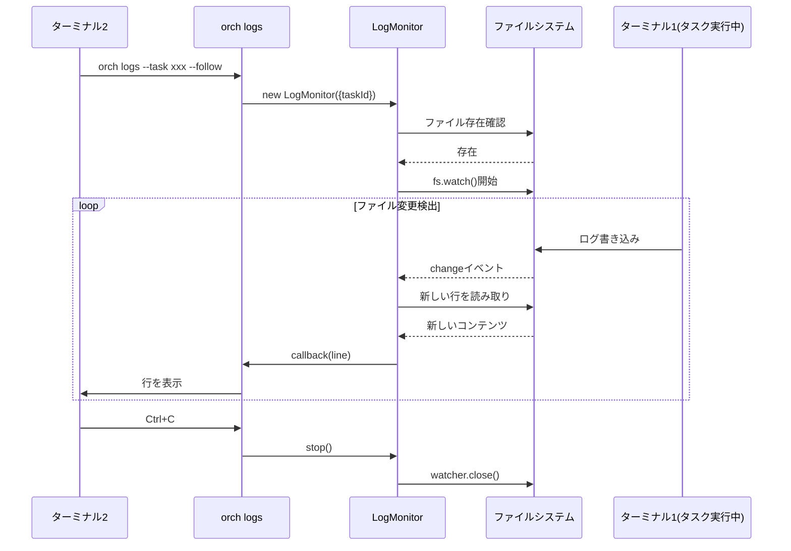

# リアルタイムログ監視機能 詳細設計書

## メタ情報

| 項目 | 内容 |
|------|------|
| ドキュメントID | DETAILED-ORCH-002-F010 |
| バージョン | 1.0.0 |
| ステータス | ドラフト |
| 作成日 | 2026-01-25 |
| 最終更新日 | 2026-01-25 |
| 作成者 | AI Assistant |
| 承認者 | - |
| 関連基本設計書 | BASIC-ORCH-002 v1.0.0 |
| 対象機能 | F-010 |

---

## 1. 概要

### 1.1 目的

別ターミナルから実行中タスクのログをリアルタイムで監視する機能を提供します。v1.2.0で実装済みのLogStreamerを拡張し、別プロセスからの監視を可能にします。

### 1.2 スコープ

#### スコープ内

- 別ターミナルからのログファイル監視
- fs.watch()によるリアルタイム検出
- pollingモードへのフォールバック
- `orch logs --task <id> --follow` コマンド

#### スコープ外

- ログファイルの圧縮・ローテーション
- リモートサーバーからの監視
- WebSocketによるストリーミング

### 1.3 参照ドキュメント

| ドキュメント | パス | 参照箇所 |
|-------------|------|---------|
| 基本設計書 | docs/designs/basic/BASIC-ORCH-002_v1.3.0機能.md | セクション3.2 |
| 既存LogStreamer | src/core/log-streamer.ts | 拡張元 |
| v1.2.0詳細設計書 | docs/designs/detailed/追加仕様/logging/詳細設計書.md | 参考 |

### 1.4 既存機能との関係

| 機能 | 説明 | 本機能との関係 |
|------|------|---------------|
| LogWriter (v1.2.0) | ログファイルへの書き込み | 書き込み先を監視 |
| LogStreamer (v1.2.0) | 同一プロセス内でのログ読み取り | 拡張して別プロセス対応 |
| LogMonitor (v1.3.0) | 別プロセスからの監視 | **本機能** |

---

## 2. 処理フロー

### 2.1 全体フロー

```mermaid
flowchart TD
    A[orch logs --task xxx --follow] --> B{ログファイル存在?}
    B -->|No| C[LogMonitorErrorスロー]
    B -->|Yes| D[監視モード選択]
    D --> E{fs.watch()利用可能?}
    E -->|Yes| F[fs.watch()で監視]
    E -->|No| G[pollingで監視]
    F --> H[ファイル変更検出]
    G --> I[定期的にファイルサイズ確認]
    H --> J[新しい行を読み取り]
    I --> J
    J --> K[コールバック呼び出し]
    K --> L{Ctrl+C押下?}
    L -->|No| H
    L -->|No| I
    L -->|Yes| M[監視停止]
    M --> N[終了]
    C --> N
```

### 2.2 シーケンス図



---

## 3. インターフェース定義

### 3.1 LogMonitorConfig

```typescript
/**
 * ログ監視設定
 */
export interface LogMonitorConfig {
  /**
   * タスクID
   */
  taskId: string;

  /**
   * ログディレクトリのベースパス
   * @default ".agent"
   */
  baseDir?: string;

  /**
   * ポーリング間隔（ミリ秒）
   * fs.watch()が使えない場合のフォールバック
   * @default 500
   */
  pollInterval?: number;
}
```

### 3.2 LogMonitorクラス

```typescript
/**
 * 別プロセスからログファイルをリアルタイム監視するクラス
 */
export class LogMonitor {
  /**
   * コンストラクタ
   * @param config - 設定
   */
  constructor(config: LogMonitorConfig);

  /**
   * ログファイルをリアルタイムで監視
   * 
   * @param callback - 新しい行が追加されたときに呼ばれる関数
   * @throws LogMonitorError - ログファイルが存在しない場合
   */
  monitor(callback: (line: string) => void): Promise<void>;

  /**
   * 監視を停止
   */
  stop(): void;

  /**
   * 監視対象のログファイルパスを取得
   */
  getLogPath(): string;
}
```

---

## 4. 既存LogStreamerとの差分

### 4.1 機能比較

| 機能 | LogStreamer (v1.2.0) | LogMonitor (v1.3.0) |
|------|---------------------|---------------------|
| 同一プロセス監視 | ○ | ○ |
| 別プロセス監視 | △（制限あり） | ○ |
| fs.watch()対応 | × | ○ |
| pollingフォールバック | ○ | ○ |
| AbortController | × | ○ |

### 4.2 設計方針

LogStreamerを直接拡張せず、**LogMonitorとして別クラス**を作成します。理由：

1. **責務の分離**: LogStreamerは同一プロセス向け、LogMonitorは別プロセス向け
2. **後方互換性**: 既存のLogStreamer利用コードに影響を与えない
3. **実装の明確化**: fs.watch()のハンドリングはLogMonitorに集約

---

## 5. CLI統合

### 5.1 logsコマンド拡張

```bash
# 既存（v1.2.0）
orch logs --table                    # タスク状態テーブル表示
orch logs --task <id>                # 過去のログを表示
orch logs --task <id> --lines 50     # 最後の50行を表示

# 新規（v1.3.0）
orch logs --task <id> --follow       # リアルタイム監視
```

### 5.2 オプション

| オプション | 短縮形 | 説明 | デフォルト |
|-----------|--------|------|-----------|
| `--task <id>` | `-t` | タスクID | 最新タスク |
| `--follow` | `-f` | リアルタイム監視 | false |
| `--lines <num>` | `-n` | 表示する行数 | 100 |
| `--table` | - | タスク状態テーブル | false |
| `--interval <ms>` | - | テーブル更新間隔 | 1000 |

---

## 6. エラーハンドリング

### 6.1 LogMonitorError

```typescript
/**
 * ログ監視エラー
 */
export class LogMonitorError extends SandboxError {
  constructor(message: string, details?: Record<string, unknown>) {
    super(message, {
      code: "LOG_MONITOR_ERROR",
      details,
    });
    this.name = "LogMonitorError";
  }
}
```

### 6.2 エラーケース

| エラーケース | エラーメッセージ | 対処 |
|-------------|----------------|------|
| ログファイル不在 | `ログファイルが見つかりません: ${path}` | タスクIDを確認 |
| fs.watch()失敗 | 警告ログ出力後、pollingにフォールバック | 自動リカバリ |

---

## 7. テスト方針

### 7.1 単体テスト

| テストケース | 期待結果 |
|-------------|---------|
| ファイル存在時に監視開始 | 正常開始 |
| ファイル不在時 | LogMonitorErrorスロー |
| 新しい行追加時 | コールバック呼び出し |
| stop()呼び出し時 | 監視停止 |
| pollingモード | 定期的にファイルチェック |

### 7.2 統合テスト

| テストケース | 期待結果 |
|-------------|---------|
| `--follow`オプション | リアルタイム監視開始 |
| Ctrl+C | 監視停止・正常終了 |

---

## 8. 実装チェックリスト

- [ ] `src/core/log-monitor.ts` 作成
  - [ ] LogMonitorConfigインターフェース定義
  - [ ] LogMonitorクラス実装
  - [ ] monitor()メソッド実装
  - [ ] monitorWithWatch()メソッド実装
  - [ ] monitorWithPolling()メソッド実装
  - [ ] readNewLines()メソッド実装
  - [ ] stop()メソッド実装
- [ ] `src/core/errors.ts` 拡張
  - [ ] LogMonitorError追加
- [ ] `src/cli.ts` 拡張
  - [ ] `--follow`オプションでLogMonitor使用
- [ ] テスト作成
  - [ ] `src/core/log-monitor.test.ts`

---

## 9. 変更履歴

| バージョン | 日付 | 変更内容 | 変更者 |
|-----------|------|---------|--------|
| 1.0.0 | 2026-01-25 | 初版作成 | AI Assistant |

---

## 10. 承認

| 役割 | 氏名 | 承認日 | 署名 |
|------|------|--------|------|
| 作成者 | AI Assistant | 2026-01-25 | - |
| レビュアー | - | - | - |
| 承認者 | - | - | - |
