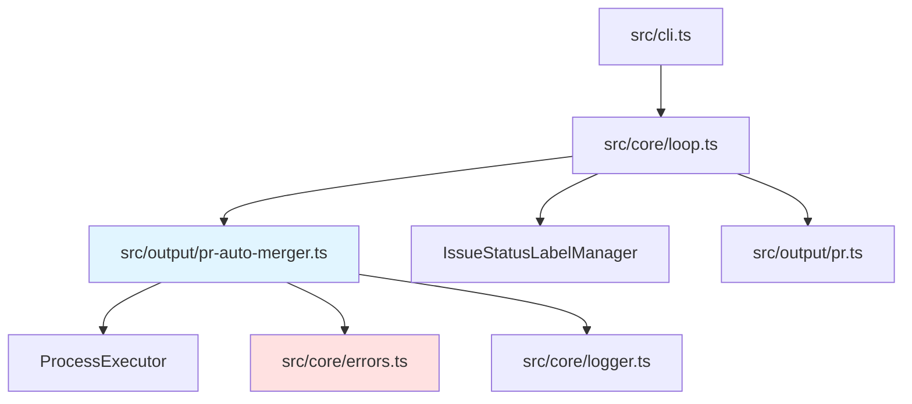

# PR自動マージ機能 バックエンド設計書

## メタ情報

| 項目 | 内容 |
|------|------|
| ドキュメントID | DETAILED-ORCH-002-F009-BE |
| バージョン | 1.0.0 |
| ステータス | ドラフト |
| 作成日 | 2026-01-25 |
| 最終更新日 | 2026-01-25 |
| 作成者 | AI Assistant |
| 承認者 | - |
| 関連詳細設計書 | DETAILED-ORCH-002-F009 |
| 対象機能 | F-009 |

---

## 1. 概要

PR自動マージ機能のバックエンド実装仕様を定義します。

---

## 2. ファイル構成

| ファイル | 説明 | 新規/変更 |
|---------|------|----------|
| `src/output/pr-auto-merger.ts` | PRAutoMergerクラス | 新規 |
| `src/output/pr-auto-merger.test.ts` | 単体テスト | 新規 |
| `src/core/errors.ts` | PRAutoMergeError追加 | 変更 |
| `src/core/types.ts` | PRConfigSchema追加 | 変更 |
| `src/cli.ts` | `--auto-merge`オプション追加 | 変更 |
| `src/core/loop.ts` | PRAutoMerger統合 | 変更 |

---

## 3. クラス詳細設計

### 3.1 PRAutoMerger

#### ファイル: `src/output/pr-auto-merger.ts`

```typescript
import { ProcessExecutor, BunProcessExecutor } from "../core/process-executor.js";
import { PRAutoMergeError } from "../core/errors.js";
import { logger } from "../core/logger.js";

/**
 * PR自動マージ設定
 */
export interface PRAutoMergerConfig {
  enabled: boolean;
  mergeMethod: "squash" | "merge" | "rebase";
  deleteBranch: boolean;
  ciTimeoutSecs: number;
}

/**
 * PR自動マージを実行するクラス
 * 
 * @example
 * ```typescript
 * const merger = new PRAutoMerger({
 *   enabled: true,
 *   mergeMethod: "squash",
 *   deleteBranch: true,
 *   ciTimeoutSecs: 600,
 * });
 * 
 * try {
 *   await merger.autoMerge(123);
 *   console.log("PR merged successfully");
 * } catch (error) {
 *   if (error instanceof PRAutoMergeError) {
 *     console.error("CI failed or timed out");
 *   }
 * }
 * ```
 */
export class PRAutoMerger {
  private readonly config: PRAutoMergerConfig;
  private readonly executor: ProcessExecutor;

  constructor(
    config: PRAutoMergerConfig,
    executor: ProcessExecutor = new BunProcessExecutor()
  ) {
    this.config = config;
    this.executor = executor;
  }

  /**
   * PR作成後、CI成功時に自動マージ
   * 
   * @param prNumber - PR番号
   * @returns マージ成功時はtrue、無効時はfalse
   * @throws PRAutoMergeError - CI失敗、タイムアウト時
   */
  async autoMerge(prNumber: number): Promise<boolean> {
    if (!this.config.enabled) {
      logger.info("PR自動マージは無効です");
      return false;
    }

    logger.info(`PR #${prNumber} のCI完了を待機中...`);

    // CI完了を待機
    const ciSuccess = await this.waitForCI(prNumber);

    if (!ciSuccess) {
      throw new PRAutoMergeError(
        `PR #${prNumber} のCI失敗。マージを中断します。`,
        { prNumber }
      );
    }

    // マージ実行
    await this.merge(prNumber);

    logger.success(`PR #${prNumber} を自動マージしました`);
    return true;
  }

  /**
   * CIの完了を待機
   * 
   * @param prNumber - PR番号
   * @returns CI成功時はtrue、失敗時はfalse
   * @throws PRAutoMergeError - タイムアウト時
   */
  private async waitForCI(prNumber: number): Promise<boolean> {
    const result = await this.executor.spawn(
      "gh",
      ["pr", "checks", String(prNumber), "--watch"],
      {
        timeout: this.config.ciTimeoutSecs * 1000,
      }
    );

    if (result.exitCode === 0) {
      return true; // CI成功
    }

    // タイムアウトチェック
    // Note: gh pr checks --watchはタイムアウトするとプロセスがkillされる
    // この場合、stderrに"timeout"は含まれないが、exitCodeは非0になる
    // タイムアウトかCI失敗かを区別するため、stderrを確認
    const isTimeout = result.stderr.toLowerCase().includes("timeout") ||
                      result.stderr.toLowerCase().includes("timed out");
    
    if (isTimeout) {
      throw new PRAutoMergeError(
        `PR #${prNumber} のCIがタイムアウトしました（${this.config.ciTimeoutSecs}秒）`,
        { prNumber, timeout: this.config.ciTimeoutSecs }
      );
    }

    return false; // CI失敗
  }

  /**
   * PRをマージ
   * 
   * @param prNumber - PR番号
   * @throws PRAutoMergeError - マージ失敗時
   */
  private async merge(prNumber: number): Promise<void> {
    const args = [
      "pr",
      "merge",
      String(prNumber),
      `--${this.config.mergeMethod}`,
    ];

    if (this.config.deleteBranch) {
      args.push("--delete-branch");
    }

    const result = await this.executor.spawn("gh", args);

    if (result.exitCode !== 0) {
      throw new PRAutoMergeError(
        `PR #${prNumber} のマージに失敗: ${result.stderr}`,
        { prNumber, stderr: result.stderr }
      );
    }
  }
}
```

---

## 4. エラークラス追加

### ファイル: `src/core/errors.ts`（追加分）

```typescript
/**
 * PR自動マージエラー
 * 
 * @example
 * ```typescript
 * throw new PRAutoMergeError("CI failed", { prNumber: 123 });
 * ```
 */
export class PRAutoMergeError extends SandboxError {
  constructor(message: string, details?: Record<string, unknown>) {
    super(message, {
      code: "PR_AUTO_MERGE_ERROR",
      details,
    });
    this.name = "PRAutoMergeError";
  }
}
```

---

## 5. 型定義追加

### ファイル: `src/core/types.ts`（追加分）

```typescript
/**
 * PR設定のzodスキーマ
 */
export const PRConfigSchema = z.object({
  /**
   * PR自動マージを有効にするか
   */
  autoMerge: z.boolean().default(false),

  /**
   * マージ方式
   */
  mergeMethod: z.enum(["squash", "merge", "rebase"]).default("squash"),

  /**
   * マージ後にブランチを削除するか
   */
  deleteBranch: z.boolean().default(true),

  /**
   * CIタイムアウト（秒）
   */
  ciTimeoutSecs: z.number().default(600),
});

export type PRConfig = z.infer<typeof PRConfigSchema>;

// ConfigSchema に追加
export const ConfigSchema = z.object({
  // ... 既存フィールド

  // 新規: PR設定
  pr: PRConfigSchema.optional(),
});
```

---

## 6. CLI統合

### ファイル: `src/cli.ts`（変更分）

```typescript
program
  .command("run")
  // ... 既存オプション
  .option("--auto-merge", "PR作成後、CI成功時に自動マージ")
  .action(async (options) => {
    // ... 既存処理

    // PR自動マージ設定を構築
    const prConfig: PRConfig = {
      autoMerge: options.autoMerge ?? config.pr?.autoMerge ?? false,
      mergeMethod: config.pr?.mergeMethod ?? "squash",
      deleteBranch: config.pr?.deleteBranch ?? true,
      ciTimeoutSecs: config.pr?.ciTimeoutSecs ?? 600,
    };

    // LoopContextに渡す
    const context: LoopContext = {
      // ... 既存フィールド
      prConfig, // 追加
    };

    // ... 既存処理
  });
```

---

## 7. Loop Engine統合

### ファイル: `src/core/loop.ts`（変更分）

```typescript
import { PRAutoMerger } from "../output/pr-auto-merger.js";
import { IssueStatusLabelManager } from "../output/issue-status-label-manager.js";

export async function runLoop(context: LoopContext): Promise<LoopResult> {
  const labelManager = new IssueStatusLabelManager({
    enabled: config.state?.use_github_labels ?? true,
    labelPrefix: config.state?.label_prefix ?? "orch",
  });

  // タスク開始時: running
  await labelManager.updateStatus(context.issue.number, "running");

  try {
    // ... 既存のループ処理

    // タスク完了時: completed
    await labelManager.updateStatus(context.issue.number, "completed");

    // PR作成時: pr-created
    if (context.createPR) {
      const prNumber = await createPR(context);
      await labelManager.updateStatus(context.issue.number, "pr-created");

      // PR自動マージ
      if (context.prConfig?.autoMerge) {
        const merger = new PRAutoMerger({
          enabled: true,
          mergeMethod: context.prConfig.mergeMethod,
          deleteBranch: context.prConfig.deleteBranch,
          ciTimeoutSecs: context.prConfig.ciTimeoutSecs,
        });

        try {
          await merger.autoMerge(prNumber);
          await labelManager.updateStatus(context.issue.number, "merged");
        } catch (error) {
          // CI失敗時はpr-createdのまま
          logger.error(`PR自動マージ失敗: ${error.message}`);
          // エラーはスローしない（タスク自体は成功）
        }
      }
    }

    return result;
  } catch (error) {
    // タスク失敗時: failed
    await labelManager.updateStatus(context.issue.number, "failed");
    throw error;
  }
}
```

---

## 8. テスト設計

### ファイル: `src/output/pr-auto-merger.test.ts`

```typescript
import { describe, it, expect, mock, beforeEach } from "bun:test";
import { PRAutoMerger, PRAutoMergerConfig } from "./pr-auto-merger.js";
import { PRAutoMergeError } from "../core/errors.js";
import type { ProcessExecutor, ProcessResult } from "../core/process-executor.js";

describe("PRAutoMerger", () => {
  let mockExecutor: ProcessExecutor;
  let defaultConfig: PRAutoMergerConfig;

  beforeEach(() => {
    mockExecutor = {
      spawn: mock(() => Promise.resolve({ stdout: "", stderr: "", exitCode: 0 })),
    };

    defaultConfig = {
      enabled: true,
      mergeMethod: "squash",
      deleteBranch: true,
      ciTimeoutSecs: 600,
    };
  });

  describe("autoMerge", () => {
    it("CI成功時にマージする", async () => {
      const merger = new PRAutoMerger(defaultConfig, mockExecutor);
      
      const result = await merger.autoMerge(123);

      expect(result).toBe(true);
      expect(mockExecutor.spawn).toHaveBeenCalledTimes(2);
      // 1回目: gh pr checks
      expect(mockExecutor.spawn).toHaveBeenNthCalledWith(
        1,
        "gh",
        ["pr", "checks", "123", "--watch"],
        expect.any(Object)
      );
      // 2回目: gh pr merge
      expect(mockExecutor.spawn).toHaveBeenNthCalledWith(
        2,
        "gh",
        ["pr", "merge", "123", "--squash", "--delete-branch"]
      );
    });

    it("CI失敗時にエラーをスローする", async () => {
      mockExecutor.spawn = mock(() =>
        Promise.resolve({ stdout: "", stderr: "CI failed", exitCode: 1 })
      );

      const merger = new PRAutoMerger(defaultConfig, mockExecutor);

      await expect(merger.autoMerge(123)).rejects.toThrow(PRAutoMergeError);
    });

    it("auto_merge無効時はfalseを返す", async () => {
      const disabledConfig = { ...defaultConfig, enabled: false };
      const merger = new PRAutoMerger(disabledConfig, mockExecutor);

      const result = await merger.autoMerge(123);

      expect(result).toBe(false);
      expect(mockExecutor.spawn).not.toHaveBeenCalled();
    });

    it("deleteBranch=falseの場合、--delete-branchなしでマージ", async () => {
      const noBranchDeleteConfig = { ...defaultConfig, deleteBranch: false };
      const merger = new PRAutoMerger(noBranchDeleteConfig, mockExecutor);

      await merger.autoMerge(123);

      expect(mockExecutor.spawn).toHaveBeenNthCalledWith(
        2,
        "gh",
        ["pr", "merge", "123", "--squash"]
      );
    });

    it("mergeMethodがrebaseの場合、--rebaseでマージ", async () => {
      const rebaseConfig = { ...defaultConfig, mergeMethod: "rebase" as const };
      const merger = new PRAutoMerger(rebaseConfig, mockExecutor);

      await merger.autoMerge(123);

      expect(mockExecutor.spawn).toHaveBeenNthCalledWith(
        2,
        "gh",
        ["pr", "merge", "123", "--rebase", "--delete-branch"]
      );
    });

    it("マージ失敗時にエラーをスローする", async () => {
      let callCount = 0;
      mockExecutor.spawn = mock(() => {
        callCount++;
        if (callCount === 1) {
          return Promise.resolve({ stdout: "", stderr: "", exitCode: 0 });
        }
        return Promise.resolve({
          stdout: "",
          stderr: "merge conflict",
          exitCode: 1,
        });
      });

      const merger = new PRAutoMerger(defaultConfig, mockExecutor);

      await expect(merger.autoMerge(123)).rejects.toThrow(PRAutoMergeError);
    });
  });
});
```

---

## 9. 依存関係



---

## 10. 実装手順

1. `src/core/errors.ts` に `PRAutoMergeError` を追加
2. `src/core/types.ts` に `PRConfigSchema` を追加
3. `src/output/pr-auto-merger.ts` を新規作成
4. `src/output/pr-auto-merger.test.ts` を新規作成
5. テスト実行・パス確認
6. `src/cli.ts` に `--auto-merge` オプション追加
7. `src/core/loop.ts` に PRAutoMerger 統合

---

## 11. 変更履歴

| バージョン | 日付 | 変更内容 | 変更者 |
|-----------|------|---------|--------|
| 1.0.0 | 2026-01-25 | 初版作成 | AI Assistant |
