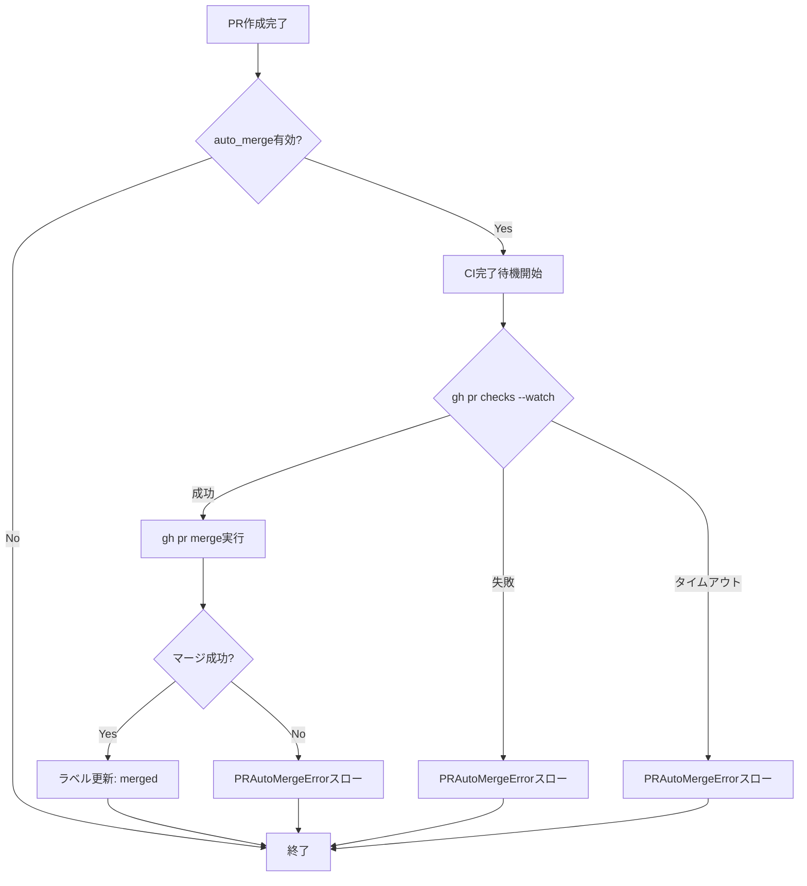

# PR自動マージ機能 詳細設計書

## メタ情報

| 項目 | 内容 |
|------|------|
| ドキュメントID | DETAILED-ORCH-002-F009 |
| バージョン | 1.0.0 |
| ステータス | ドラフト |
| 作成日 | 2026-01-25 |
| 最終更新日 | 2026-01-25 |
| 作成者 | AI Assistant |
| 承認者 | - |
| 関連基本設計書 | BASIC-ORCH-002 v1.0.0 |
| 対象機能 | F-009 |

---

## 1. 概要

### 1.1 目的

PR作成後、CIが成功したら自動的にマージする機能を提供します。これにより、人間の介入なしに完全自動化されたワークフローを実現します。

### 1.2 スコープ

#### スコープ内

- CI完了待機（`gh pr checks --watch`）
- CI成功時の自動マージ（`gh pr merge`）
- マージ方式の選択（squash/merge/rebase）
- マージ後のブランチ削除オプション
- CIタイムアウト処理

#### スコープ外

- CI設定の自動生成
- PR自動作成機能（既存機能）
- マージコンフリクトの自動解決

### 1.3 参照ドキュメント

| ドキュメント | パス | 参照箇所 |
|-------------|------|---------|
| 基本設計書 | docs/designs/basic/BASIC-ORCH-002_v1.3.0機能.md | セクション3.1 |
| 既存PR作成機能 | src/output/pr.ts | 参考実装 |

---

## 2. 処理フロー

### 2.1 全体フロー



### 2.2 シーケンス図

```mermaid
sequenceDiagram
    participant Loop as LoopEngine
    participant Merger as PRAutoMerger
    participant GH as gh CLI
    participant Label as LabelManager

    Loop->>Merger: autoMerge(prNumber)
    
    alt auto_merge無効
        Merger-->>Loop: false
    else auto_merge有効
        Merger->>GH: gh pr checks <pr> --watch
        
        alt CI成功
            GH-->>Merger: exitCode=0
            Merger->>GH: gh pr merge <pr> --squash
            GH-->>Merger: exitCode=0
            Merger->>Label: updateStatus(merged)
            Merger-->>Loop: true
        else CI失敗
            GH-->>Merger: exitCode≠0
            Merger-->>Loop: throw PRAutoMergeError
        else タイムアウト
            GH-->>Merger: timeout
            Merger-->>Loop: throw PRAutoMergeError
        end
    end
```

---

## 3. インターフェース定義

### 3.1 PRAutoMergerConfig

```typescript
/**
 * PR自動マージ設定
 */
export interface PRAutoMergerConfig {
  /**
   * 自動マージを有効にするか
   * @default false
   */
  enabled: boolean;

  /**
   * マージ方式
   * - squash: コミットをまとめてマージ（推奨）
   * - merge: マージコミットを作成
   * - rebase: リベースしてマージ
   * @default "squash"
   */
  mergeMethod: "squash" | "merge" | "rebase";

  /**
   * マージ後にブランチを削除するか
   * @default true
   */
  deleteBranch: boolean;

  /**
   * CIタイムアウト（秒）
   * @default 600 (10分)
   */
  ciTimeoutSecs: number;
}
```

### 3.2 PRAutoMergerクラス

```typescript
/**
 * PR自動マージを実行するクラス
 */
export class PRAutoMerger {
  /**
   * コンストラクタ
   * @param config - 設定
   * @param executor - プロセス実行器（DI用）
   */
  constructor(
    config: PRAutoMergerConfig,
    executor?: ProcessExecutor
  );

  /**
   * PR作成後、CI成功時に自動マージ
   * 
   * @param prNumber - PR番号
   * @returns マージ成功時はtrue、無効時はfalse
   * @throws PRAutoMergeError - CI失敗、タイムアウト時
   */
  autoMerge(prNumber: number): Promise<boolean>;
}
```

---

## 4. 設定ファイル拡張

### 4.1 orch.yml

```yaml
# PR設定（新規 v1.3.0）
pr:
  auto_merge: true
  merge_method: squash  # squash | merge | rebase
  delete_branch: true
  ci_timeout_secs: 600  # 10分
```

### 4.2 PRConfigSchema（zod）

```typescript
export const PRConfigSchema = z.object({
  autoMerge: z.boolean().default(false),
  mergeMethod: z.enum(["squash", "merge", "rebase"]).default("squash"),
  deleteBranch: z.boolean().default(true),
  ciTimeoutSecs: z.number().default(600),
});

export type PRConfig = z.infer<typeof PRConfigSchema>;
```

---

## 5. エラーハンドリング

### 5.1 PRAutoMergeError

```typescript
/**
 * PR自動マージエラー
 */
export class PRAutoMergeError extends SandboxError {
  constructor(message: string, details?: Record<string, unknown>) {
    super(message, {
      code: "PR_AUTO_MERGE_ERROR",
      details,
    });
    this.name = "PRAutoMergeError";
  }
}
```

### 5.2 エラーケース

| エラーケース | エラーメッセージ | 対処 |
|-------------|----------------|------|
| CI失敗 | `PR #${prNumber} のCI失敗。マージを中断します。` | PRは残り、手動対応が必要 |
| タイムアウト | `PR #${prNumber} のCIがタイムアウトしました（${timeout}秒）` | PRは残り、手動対応が必要 |
| マージ失敗 | `PR #${prNumber} のマージに失敗: ${stderr}` | 競合の可能性、手動対応が必要 |

---

## 6. CLI統合

### 6.1 新規オプション

```bash
# run コマンドに追加
orch run --issue 42 --auto --create-pr --auto-merge
```

| オプション | 説明 |
|-----------|------|
| `--auto-merge` | PR作成後、CI成功時に自動マージ |

### 6.2 設定ファイルとの優先順位

1. CLIオプション（`--auto-merge`）
2. 設定ファイル（`pr.auto_merge`）
3. デフォルト値（`false`）

---

## 7. Loop Engine統合

### 7.1 統合ポイント

```typescript
// src/core/loop.ts

export async function runLoop(context: LoopContext): Promise<LoopResult> {
  // ... 既存処理 ...

  // PR作成時
  if (context.createPR) {
    const prNumber = await createPR(context);
    await labelManager.updateStatus(context.issue.number, "pr-created");

    // PR自動マージ
    if (config.pr?.autoMerge) {
      const merger = new PRAutoMerger(config.pr);
      await merger.autoMerge(prNumber);
      await labelManager.updateStatus(context.issue.number, "merged");
    }
  }

  return result;
}
```

---

## 8. テスト方針

### 8.1 単体テスト

| テストケース | 期待結果 |
|-------------|---------|
| CI成功時にマージ | exitCode=0, ラベル=merged |
| CI失敗時 | PRAutoMergeErrorスロー |
| タイムアウト時 | PRAutoMergeErrorスロー |
| auto_merge無効時 | false返却、何も実行しない |
| deleteBranch=false | `--delete-branch`なしでマージ |

### 8.2 統合テスト

| テストケース | 期待結果 |
|-------------|---------|
| `--auto-merge`フラグ | 設定ファイルより優先 |
| 設定ファイルのみ | 設定値が適用される |

---

## 9. 実装チェックリスト

- [ ] `src/output/pr-auto-merger.ts` 作成
  - [ ] PRAutoMergerConfigインターフェース定義
  - [ ] PRAutoMergerクラス実装
  - [ ] autoMerge()メソッド実装
  - [ ] waitForCI()メソッド実装
  - [ ] merge()メソッド実装
- [ ] `src/core/errors.ts` 拡張
  - [ ] PRAutoMergeError追加
- [ ] `src/core/types.ts` 拡張
  - [ ] PRConfigSchema追加
  - [ ] ConfigSchemaにpr追加
- [ ] `src/cli.ts` 拡張
  - [ ] `--auto-merge`オプション追加
- [ ] `src/core/loop.ts` 統合
  - [ ] PRAutoMerger呼び出し追加
- [ ] テスト作成
  - [ ] `src/output/pr-auto-merger.test.ts`

---

## 10. 変更履歴

| バージョン | 日付 | 変更内容 | 変更者 |
|-----------|------|---------|--------|
| 1.0.0 | 2026-01-25 | 初版作成 | AI Assistant |

---

## 11. 承認

| 役割 | 氏名 | 承認日 | 署名 |
|------|------|--------|------|
| 作成者 | AI Assistant | 2026-01-25 | - |
| レビュアー | - | - | - |
| 承認者 | - | - | - |
