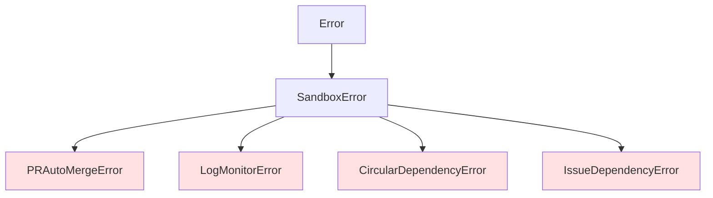

# v1.3.0機能 型定義・共通処理設計書

## メタ情報

| 項目 | 内容 |
|------|------|
| ドキュメントID | DETAILED-ORCH-002-COMMON-TYPES |
| バージョン | 1.0.0 |
| ステータス | ドラフト |
| 作成日 | 2026-01-25 |
| 最終更新日 | 2026-01-25 |
| 作成者 | AI Assistant |
| 承認者 | - |
| 関連基本設計書 | BASIC-ORCH-002 v1.0.0 |

---

## 1. 概要

v1.3.0で追加される機能（F-009〜F-012）に必要な型定義とエラークラスの設計を定義します。

---

## 2. ファイル変更一覧

| ファイル | 変更内容 | 新規/変更 |
|---------|---------|----------|
| `src/core/types.ts` | PRConfigSchema, StateConfigSchema拡張 | 変更 |
| `src/core/errors.ts` | 4つのエラークラス追加 | 変更 |

---

## 3. 型定義拡張

### 3.1 PRConfigSchema

#### ファイル: `src/core/types.ts`（追加分）

```typescript
/**
 * PR設定のzodスキーマ
 * 
 * PR自動マージ機能（F-009）の設定を定義します。
 */
export const PRConfigSchema = z.object({
  /**
   * PR自動マージを有効にするか
   * @default false
   */
  autoMerge: z.boolean().default(false),

  /**
   * マージ方式
   * - squash: コミットをまとめてマージ（推奨）
   * - merge: マージコミットを作成
   * - rebase: リベースしてマージ
   * @default "squash"
   */
  mergeMethod: z.enum(["squash", "merge", "rebase"]).default("squash"),

  /**
   * マージ後にブランチを削除するか
   * @default true
   */
  deleteBranch: z.boolean().default(true),

  /**
   * CIタイムアウト（秒）
   * @default 600 (10分)
   */
  ciTimeoutSecs: z.number().min(60).max(3600).default(600),
});

export type PRConfig = z.infer<typeof PRConfigSchema>;
```

### 3.2 StateConfigSchema拡張

```typescript
/**
 * 状態管理設定のzodスキーマ（拡張版）
 * 
 * v1.3.0でlabel_prefixを追加。
 */
export const StateConfigSchema = z.object({
  /**
   * GitHub Issueラベルを使用するか
   * @default true
   */
  use_github_labels: z.boolean().default(true),

  /**
   * Scratchpadを使用するか
   * @default true
   */
  use_scratchpad: z.boolean().default(true),

  /**
   * Scratchpadのパス
   * @default ".agent/scratchpad.md"
   */
  scratchpad_path: z.string().default(".agent/scratchpad.md"),

  /**
   * ステータスラベルのプレフィックス
   * @default "orch"
   * @example "orch" -> ラベル名 "orch:running"
   */
  label_prefix: z.string().min(1).max(20).default("orch"),
});

export type StateConfig = z.infer<typeof StateConfigSchema>;
```

### 3.3 ConfigSchema拡張

```typescript
/**
 * 設定ファイル全体のzodスキーマ（v1.3.0拡張版）
 */
export const ConfigSchema = z.object({
  version: z.string().default("1.0"),
  
  backend: z.object({
    type: z.enum(["claude", "opencode", "gemini", "container"]).default("claude"),
    model: z.string().optional(),
  }),

  container: ContainerConfigSchema,
  sandbox: SandboxConfigSchema.optional(),

  loop: z.object({
    max_iterations: z.number().default(100),
    completion_promise: z.string().default("LOOP_COMPLETE"),
    idle_timeout_secs: z.number().default(1800),
  }),

  hats: z.record(z.string(), HatSchema).optional(),

  gates: z.object({
    after_plan: z.boolean().default(true),
    after_implementation: z.boolean().default(false),
    before_pr: z.boolean().default(true),
  }).optional(),

  quality: z.object({
    min_score: z.number().default(8),
    auto_approve_above: z.number().default(9),
  }).optional(),

  state: StateConfigSchema.optional(),
  autoIssue: AutoIssueConfigSchema.optional(),

  // 新規: PR設定（v1.3.0）
  pr: PRConfigSchema.optional(),
});

export type Config = z.infer<typeof ConfigSchema>;
```

### 3.4 LoopContext拡張

```typescript
/**
 * ループ実行コンテキスト（v1.3.0拡張版）
 */
export interface LoopContext {
  // 既存フィールド
  issue: Issue;
  iteration: number;
  maxIterations: number;
  scratchpadPath: string;
  promptPath: string;
  completionPromise: string;
  autoMode: boolean;
  createPR: boolean;
  draftPR: boolean;
  useContainer: boolean;
  generateReport: boolean;
  reportPath: string;
  preset?: string;
  taskId?: string;
  logDir?: string;

  // 新規: PR設定（v1.3.0）
  /**
   * PR自動マージ設定
   */
  prConfig?: PRConfig;

  // 新規: 依存関係オプション（v1.3.0）
  /**
   * 依存Issueを先に実行するか
   */
  resolveDeps?: boolean;

  /**
   * 依存関係を無視するか
   */
  ignoreDeps?: boolean;
}
```

---

## 4. エラークラス追加

### 4.1 エラー階層図



### 4.2 PRAutoMergeError

#### ファイル: `src/core/errors.ts`（追加分）

```typescript
/**
 * PR自動マージエラー
 * 
 * PR自動マージ機能（F-009）で発生するエラーを表現します。
 * 
 * @example
 * ```typescript
 * // CI失敗時
 * throw new PRAutoMergeError(
 *   "PR #123 のCI失敗。マージを中断します。",
 *   { prNumber: 123 }
 * );
 * 
 * // タイムアウト時
 * throw new PRAutoMergeError(
 *   "PR #123 のCIがタイムアウトしました（600秒）",
 *   { prNumber: 123, timeout: 600 }
 * );
 * ```
 */
export class PRAutoMergeError extends SandboxError {
  constructor(message: string, details?: Record<string, unknown>) {
    super(message, {
      code: "PR_AUTO_MERGE_ERROR",
      details,
    });
    this.name = "PRAutoMergeError";
  }
}
```

### 4.3 LogMonitorError

```typescript
/**
 * ログ監視エラー
 * 
 * リアルタイムログ監視機能（F-010）で発生するエラーを表現します。
 * 
 * @example
 * ```typescript
 * // ログファイル不存在
 * throw new LogMonitorError(
 *   "ログファイルが見つかりません: .agent/task-123/output.log",
 *   { taskId: "task-123", logPath: ".agent/task-123/output.log" }
 * );
 * ```
 */
export class LogMonitorError extends SandboxError {
  constructor(message: string, details?: Record<string, unknown>) {
    super(message, {
      code: "LOG_MONITOR_ERROR",
      details,
    });
    this.name = "LogMonitorError";
  }
}
```

### 4.4 CircularDependencyError

```typescript
/**
 * 循環依存エラー
 * 
 * Issue依存関係管理機能（F-011）で循環依存を検出した場合にスローされます。
 * 
 * @example
 * ```typescript
 * throw new CircularDependencyError(
 *   "循環依存を検出: #42 -> #43 -> #44 -> #42",
 *   { cycle: [42, 43, 44, 42] }
 * );
 * ```
 */
export class CircularDependencyError extends SandboxError {
  constructor(message: string, details?: Record<string, unknown>) {
    super(message, {
      code: "CIRCULAR_DEPENDENCY_ERROR",
      details,
    });
    this.name = "CircularDependencyError";
  }
}
```

### 4.5 IssueDependencyError

```typescript
/**
 * Issue依存関係エラー
 * 
 * Issue依存関係管理機能（F-011）で依存関係の取得や解決に失敗した場合にスローされます。
 * 
 * @example
 * ```typescript
 * throw new IssueDependencyError(
 *   "Issue #42 の依存関係取得に失敗しました",
 *   { issueNumber: 42, cause: "API error" }
 * );
 * ```
 */
export class IssueDependencyError extends SandboxError {
  constructor(message: string, details?: Record<string, unknown>) {
    super(message, {
      code: "ISSUE_DEPENDENCY_ERROR",
      details,
    });
    this.name = "IssueDependencyError";
  }
}
```

---

## 5. 設定ファイル例

### 5.1 orch.yml（v1.3.0完全版）

```yaml
version: "1.0"

# バックエンド設定
backend:
  type: claude
  model: claude-sonnet-4-20250514

# サンドボックス設定（v1.2.0）
sandbox:
  type: docker
  fallback: host
  docker:
    image: node:20-alpine
    network: none
    timeout: 300
  containerUse:
    image: node:20
  host:
    warnOnStart: true

# ループ設定
loop:
  max_iterations: 100
  completion_promise: "LOOP_COMPLETE"
  idle_timeout_secs: 1800

# 承認ゲート
gates:
  after_plan: true
  after_implementation: false
  before_pr: true

# 品質基準
quality:
  min_score: 8
  auto_approve_above: 9

# PR設定（新規 v1.3.0）
pr:
  auto_merge: true
  merge_method: squash
  delete_branch: true
  ci_timeout_secs: 600

# 状態管理（拡張 v1.3.0）
state:
  use_github_labels: true
  use_scratchpad: true
  scratchpad_path: ".agent/scratchpad.md"
  label_prefix: "orch"  # 新規

# 改善Issue自動作成（v1.2.0）
autoIssue:
  enabled: true
  minPriority: medium
  labels:
    - auto-generated
    - improvement
```

---

## 6. 設定値バリデーション

### 6.1 PRConfigのバリデーション

| フィールド | 型 | 制約 | デフォルト |
|-----------|-----|------|-----------|
| autoMerge | boolean | - | false |
| mergeMethod | enum | "squash" / "merge" / "rebase" | "squash" |
| deleteBranch | boolean | - | true |
| ciTimeoutSecs | number | 60 <= x <= 3600 | 600 |

### 6.2 StateConfigのバリデーション

| フィールド | 型 | 制約 | デフォルト |
|-----------|-----|------|-----------|
| use_github_labels | boolean | - | true |
| use_scratchpad | boolean | - | true |
| scratchpad_path | string | - | ".agent/scratchpad.md" |
| label_prefix | string | 1 <= length <= 20 | "orch" |

---

## 7. 既存コードとの互換性

### 7.1 後方互換性

v1.2.0からv1.3.0へのアップグレードで、既存の設定ファイルはそのまま動作します。

```yaml
# v1.2.0の設定（そのまま動作）
state:
  use_github_labels: true
  use_scratchpad: true
# label_prefixがない場合はデフォルト値"orch"が使用される
```

### 7.2 新規フィールドのデフォルト値

| フィールド | デフォルト値 | 説明 |
|-----------|-------------|------|
| pr | undefined | PR自動マージ無効 |
| pr.autoMerge | false | 明示的に有効化が必要 |
| state.label_prefix | "orch" | 既存動作を維持 |

---

## 8. 実装手順

### 8.1 types.ts変更手順

1. `PRConfigSchema` を追加
2. `StateConfigSchema` に `label_prefix` を追加
3. `ConfigSchema` に `pr` を追加
4. `LoopContext` に `prConfig`, `resolveDeps`, `ignoreDeps` を追加
5. 型をエクスポート

### 8.2 errors.ts変更手順

1. `PRAutoMergeError` を追加
2. `LogMonitorError` を追加
3. `CircularDependencyError` を追加
4. `IssueDependencyError` を追加
5. エクスポートを更新

---

## 9. テスト

### 9.1 スキーマバリデーションテスト

```typescript
import { describe, it, expect } from "bun:test";
import { PRConfigSchema, StateConfigSchema, ConfigSchema } from "./types.js";

describe("PRConfigSchema", () => {
  it("デフォルト値が適用される", () => {
    const result = PRConfigSchema.parse({});
    
    expect(result.autoMerge).toBe(false);
    expect(result.mergeMethod).toBe("squash");
    expect(result.deleteBranch).toBe(true);
    expect(result.ciTimeoutSecs).toBe(600);
  });

  it("ciTimeoutSecsの範囲外はエラー", () => {
    expect(() => PRConfigSchema.parse({ ciTimeoutSecs: 30 })).toThrow();
    expect(() => PRConfigSchema.parse({ ciTimeoutSecs: 5000 })).toThrow();
  });

  it("mergeMethodの不正値はエラー", () => {
    expect(() => PRConfigSchema.parse({ mergeMethod: "invalid" })).toThrow();
  });
});

describe("StateConfigSchema", () => {
  it("label_prefixのデフォルト値", () => {
    const result = StateConfigSchema.parse({});
    expect(result.label_prefix).toBe("orch");
  });

  it("label_prefixの長さ制限", () => {
    expect(() => StateConfigSchema.parse({ label_prefix: "" })).toThrow();
    expect(() => StateConfigSchema.parse({ label_prefix: "a".repeat(21) })).toThrow();
  });
});
```

---

## 10. 変更履歴

| バージョン | 日付 | 変更内容 | 変更者 |
|-----------|------|---------|--------|
| 1.0.0 | 2026-01-25 | 初版作成 | AI Assistant |
