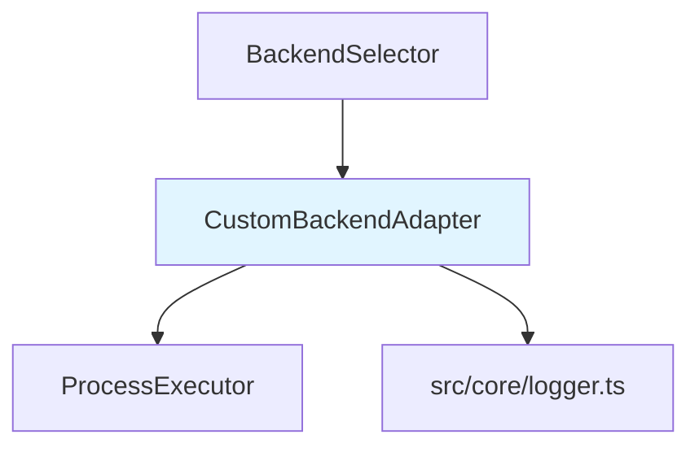

# Custom Backends バックエンド設計書

## メタ情報

| 項目 | 内容 |
|------|------|
| ドキュメントID | DETAILED-ORCH-004-F019-BE |
| バージョン | 1.0.0 |
| ステータス | ドラフト |
| 作成日 | 2026-01-26 |
| 最終更新日 | 2026-01-26 |
| 作成者 | AI Assistant |
| 承認者 | - |
| 関連詳細設計書 | DETAILED-ORCH-004-F019 |
| 対象機能 | F-019 |

---

## 1. 概要

Custom Backends機能のバックエンド実装仕様を定義します。

---

## 2. ファイル構成

| ファイル | 説明 | 新規/変更 |
|---------|------|----------|
| `src/adapters/custom-backend.ts` | CustomBackendAdapterクラス | 新規 |
| `src/adapters/custom-backend.test.ts` | 単体テスト | 新規 |
| `src/core/types.ts` | BackendConfigSchema拡張 | 変更 |
| `src/core/backend-selector.ts` | カスタムバックエンド判定追加 | 変更 |

---

## 3. クラス詳細設計

### 3.1 CustomBackendAdapter

#### ファイル: `src/adapters/custom-backend.ts`

```typescript
import { BackendAdapter } from "./base.js";
import { ProcessExecutor, BunProcessExecutor } from "../core/process-executor.js";
import { logger } from "../core/logger.js";

/**
 * カスタムバックエンド設定
 */
export interface CustomBackendAdapterConfig {
  /**
   * 実行するCLIコマンド
   */
  command: string;

  /**
   * プロンプト前に挿入される引数
   */
  args?: string[];

  /**
   * プロンプトの渡し方
   * - arg: コマンドライン引数
   * - stdin: 標準入力
   */
  promptMode?: "arg" | "stdin";

  /**
   * プロンプト前のフラグ
   */
  promptFlag?: string;
}

/**
 * カスタムバックエンドアダプター
 * 
 * @example
 * ```typescript
 * // コマンドライン引数でプロンプトを渡す
 * const adapter = new CustomBackendAdapter({
 *   command: "my-agent",
 *   args: ["--headless"],
 *   promptMode: "arg",
 *   promptFlag: "-p",
 * });
 * const result = await adapter.execute("Write a function");
 * // 実行: my-agent --headless -p "Write a function"
 * 
 * // 標準入力でプロンプトを渡す
 * const adapter2 = new CustomBackendAdapter({
 *   command: "another-agent",
 *   promptMode: "stdin",
 * });
 * const result2 = await adapter2.execute("Write a function");
 * // 実行: echo "Write a function" | another-agent
 * ```
 */
export class CustomBackendAdapter implements BackendAdapter {
  private readonly config: CustomBackendAdapterConfig;
  private readonly executor: ProcessExecutor;

  constructor(
    config: CustomBackendAdapterConfig,
    executor: ProcessExecutor = new BunProcessExecutor()
  ) {
    this.config = config;
    this.executor = executor;
  }

  /**
   * カスタムバックエンドでプロンプトを実行
   * 
   * @param prompt - プロンプト
   * @returns 実行結果
   * @throws Error - 実行失敗時
   */
  async execute(prompt: string): Promise<string> {
    logger.info(`カスタムバックエンド '${this.config.command}' で実行中...`);

    const promptMode = this.config.promptMode ?? "arg";

    let result;
    if (promptMode === "stdin") {
      // 標準入力でプロンプトを渡す
      result = await this.executor.spawn(
        this.config.command,
        this.config.args ?? [],
        {
          stdin: prompt,
        }
      );
    } else {
      // コマンドライン引数でプロンプトを渡す
      const args = this.buildArgs(prompt);
      result = await this.executor.spawn(this.config.command, args);
    }

    if (result.exitCode !== 0) {
      throw new Error(
        `カスタムバックエンド '${this.config.command}' 実行失敗: ${result.stderr}`
      );
    }

    if (!result.stdout.trim()) {
      logger.warn(`カスタムバックエンド '${this.config.command}' の出力が空です`);
    }

    return result.stdout;
  }

  /**
   * コマンドライン引数を構築
   * 
   * @param prompt - プロンプト
   * @returns 引数配列
   */
  private buildArgs(prompt: string): string[] {
    const args = [...(this.config.args ?? [])];

    if (this.config.promptFlag) {
      // フラグ付きで引数追加
      args.push(this.config.promptFlag, prompt);
    } else {
      // 位置引数として追加
      args.push(prompt);
    }

    return args;
  }
}
```

---

## 4. 型定義拡張

### ファイル: `src/core/types.ts`（追加分）

```typescript
/**
 * バックエンド設定のzodスキーマ（拡張）
 */
export const BackendConfigSchema = z.union([
  z.string(),  // Named backend
  z.object({
    type: z.literal("kiro"),
    agent: z.string(),
  }),
  z.object({
    command: z.string(),
    args: z.array(z.string()).optional(),
    prompt_mode: z.enum(["arg", "stdin"]).optional().default("arg"),
    prompt_flag: z.string().optional(),
  }),
]);

export type BackendConfig = z.infer<typeof BackendConfigSchema>;
```

---

## 5. BackendSelector統合

### ファイル: `src/core/backend-selector.ts`（変更分）

```typescript
import { CustomBackendAdapter } from "../adapters/custom-backend.js";

export class BackendSelector {
  // ... 既存メソッド

  /**
   * バックエンド設定からアダプターを作成
   */
  private createAdapter(backendConfig: BackendConfig): BackendAdapter {
    // Named backend（文字列形式）
    if (typeof backendConfig === "string") {
      return this.createNamedAdapter(backendConfig);
    }

    // Kiro agent形式
    if ("type" in backendConfig && backendConfig.type === "kiro") {
      return new KiroAdapter({
        agent: backendConfig.agent,
      });
    }

    // Custom backend形式
    if ("command" in backendConfig) {
      return new CustomBackendAdapter({
        command: backendConfig.command,
        args: backendConfig.args,
        promptMode: backendConfig.prompt_mode,
        promptFlag: backendConfig.prompt_flag,
      });
    }

    // デフォルト: Claude
    logger.warn(`不正なバックエンド設定: ${JSON.stringify(backendConfig)}。Claudeにフォールバック`);
    return new ClaudeAdapter();
  }
}
```

---

## 6. テスト設計

### ファイル: `src/adapters/custom-backend.test.ts`

```typescript
import { describe, it, expect, mock, beforeEach } from "bun:test";
import { CustomBackendAdapter, CustomBackendAdapterConfig } from "./custom-backend.js";
import type { ProcessExecutor, ProcessResult } from "../core/process-executor.js";

describe("CustomBackendAdapter", () => {
  let mockExecutor: ProcessExecutor;

  beforeEach(() => {
    mockExecutor = {
      spawn: mock(() => Promise.resolve({ stdout: "result", stderr: "", exitCode: 0 })),
    };
  });

  describe("execute", () => {
    it("prompt_mode: arg でコマンドライン引数を使用", async () => {
      const config: CustomBackendAdapterConfig = {
        command: "my-agent",
        args: ["--headless"],
        promptMode: "arg",
      };
      const adapter = new CustomBackendAdapter(config, mockExecutor);

      await adapter.execute("test prompt");

      expect(mockExecutor.spawn).toHaveBeenCalledWith(
        "my-agent",
        ["--headless", "test prompt"]
      );
    });

    it("prompt_mode: arg + prompt_flag でフラグ付き引数", async () => {
      const config: CustomBackendAdapterConfig = {
        command: "my-agent",
        args: ["--headless"],
        promptMode: "arg",
        promptFlag: "-p",
      };
      const adapter = new CustomBackendAdapter(config, mockExecutor);

      await adapter.execute("test prompt");

      expect(mockExecutor.spawn).toHaveBeenCalledWith(
        "my-agent",
        ["--headless", "-p", "test prompt"]
      );
    });

    it("prompt_mode: stdin で標準入力を使用", async () => {
      const config: CustomBackendAdapterConfig = {
        command: "my-agent",
        promptMode: "stdin",
      };
      const adapter = new CustomBackendAdapter(config, mockExecutor);

      await adapter.execute("test prompt");

      expect(mockExecutor.spawn).toHaveBeenCalledWith(
        "my-agent",
        [],
        { stdin: "test prompt" }
      );
    });

    it("promptMode省略時はargがデフォルト", async () => {
      const config: CustomBackendAdapterConfig = {
        command: "my-agent",
      };
      const adapter = new CustomBackendAdapter(config, mockExecutor);

      await adapter.execute("test prompt");

      expect(mockExecutor.spawn).toHaveBeenCalledWith(
        "my-agent",
        ["test prompt"]
      );
    });

    it("実行成功時に標準出力を返す", async () => {
      const config: CustomBackendAdapterConfig = {
        command: "my-agent",
      };
      const adapter = new CustomBackendAdapter(config, mockExecutor);

      const result = await adapter.execute("test prompt");

      expect(result).toBe("result");
    });

    it("実行失敗時にエラーをスロー", async () => {
      mockExecutor.spawn = mock(() =>
        Promise.resolve({ stdout: "", stderr: "error", exitCode: 1 })
      );

      const config: CustomBackendAdapterConfig = {
        command: "my-agent",
      };
      const adapter = new CustomBackendAdapter(config, mockExecutor);

      await expect(adapter.execute("test prompt")).rejects.toThrow(
        "カスタムバックエンド 'my-agent' 実行失敗: error"
      );
    });

    it("標準出力が空の場合は警告ログ", async () => {
      mockExecutor.spawn = mock(() =>
        Promise.resolve({ stdout: "", stderr: "", exitCode: 0 })
      );

      const config: CustomBackendAdapterConfig = {
        command: "my-agent",
      };
      const adapter = new CustomBackendAdapter(config, mockExecutor);

      const result = await adapter.execute("test prompt");

      expect(result).toBe("");
    });

    it("args省略時は空配列", async () => {
      const config: CustomBackendAdapterConfig = {
        command: "my-agent",
        promptMode: "arg",
      };
      const adapter = new CustomBackendAdapter(config, mockExecutor);

      await adapter.execute("test prompt");

      expect(mockExecutor.spawn).toHaveBeenCalledWith(
        "my-agent",
        ["test prompt"]
      );
    });
  });
});
```

---

## 7. 依存関係



---

## 8. 実装手順

1. `src/adapters/custom-backend.ts` を新規作成
2. `src/adapters/custom-backend.test.ts` を新規作成
3. テスト実行・パス確認
4. `src/core/types.ts` の `BackendConfigSchema` にカスタムバックエンド形式を追加
5. `src/core/backend-selector.ts` にカスタムバックエンド判定ロジックを追加

---

## 9. 変更履歴

| バージョン | 日付 | 変更内容 | 変更者 |
|-----------|------|---------|--------|
| 1.0.0 | 2026-01-26 | 初版作成 | AI Assistant |
