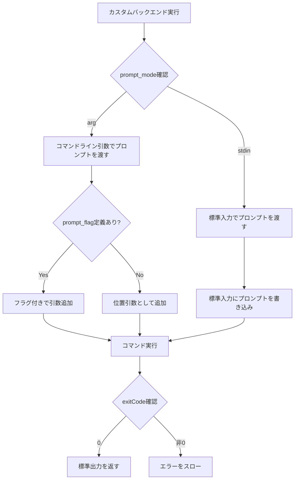
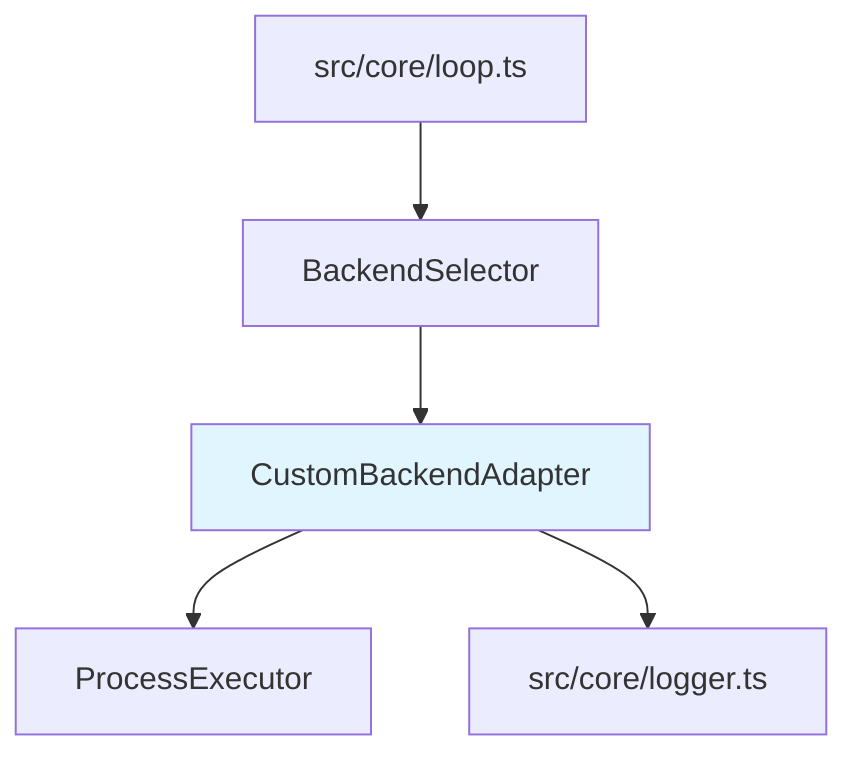

# Custom Backends 詳細設計書

## メタ情報

| 項目 | 内容 |
|------|------|
| ドキュメントID | DETAILED-ORCH-004-F019 |
| バージョン | 1.0.0 |
| ステータス | ドラフト |
| 作成日 | 2026-01-26 |
| 最終更新日 | 2026-01-26 |
| 作成者 | AI Assistant |
| 承認者 | - |
| 関連基本設計書 | BASIC-ORCH-004 v1.0.0 |
| 対象機能 | F-019 |

---

## 1. 概要

### 1.1 目的

任意のCLI AIエージェントをバックエンドとして統合可能にすることで、orchestrator-hybridの拡張性を高め、ユーザー独自のAIエージェントを活用できるようにします。

### 1.2 スコープ

#### スコープ内

- カスタムコマンドの実行
- プロンプトの渡し方（arg/stdin）の選択
- プロンプトフラグのカスタマイズ
- 標準出力の取得
- エラーハンドリング

#### スコープ外

- カスタムバックエンドの自動検出
- カスタムバックエンドの検証
- カスタムバックエンドのインストール支援

### 1.3 参照ドキュメント

| ドキュメント | パス | 参照箇所 |
|-------------|------|---------|
| 基本設計書 | docs/designs/basic/BASIC-ORCH-004_v1.4.0機能.md | セクション3.8 |
| 既存バックエンド実装 | src/adapters/base.ts | 参考実装 |

---

## 2. 処理フロー

### 2.1 全体フロー



### 2.2 シーケンス図

```mermaid
sequenceDiagram
    autonumber
    participant Loop as LoopEngine
    participant Adapter as CustomBackendAdapter
    participant Executor as ProcessExecutor
    participant CLI as Custom CLI

    Loop->>Adapter: execute(prompt)
    
    alt prompt_mode: arg
        Adapter->>Adapter: buildArgs(prompt)
        Adapter->>Executor: spawn(command, args)
    else prompt_mode: stdin
        Adapter->>Executor: spawn(command, args, stdin=prompt)
    end
    
    Executor->>CLI: 実行
    CLI-->>Executor: stdout, stderr, exitCode
    
    alt exitCode = 0
        Executor-->>Adapter: stdout
        Adapter-->>Loop: result
    else exitCode ≠ 0
        Executor-->>Adapter: stderr
        Adapter-->>Loop: throw Error
    end
```

---

## 3. インターフェース定義

### 3.1 CustomBackendAdapterConfig

```typescript
/**
 * カスタムバックエンド設定
 */
export interface CustomBackendAdapterConfig {
  /**
   * 実行するCLIコマンド
   * @example "my-agent"
   */
  command: string;

  /**
   * プロンプト前に挿入される引数
   * @example ["--headless", "--auto-approve"]
   */
  args?: string[];

  /**
   * プロンプトの渡し方
   * - arg: コマンドライン引数
   * - stdin: 標準入力
   * @default "arg"
   */
  promptMode?: "arg" | "stdin";

  /**
   * プロンプト前のフラグ
   * @example "-p", "--prompt"
   */
  promptFlag?: string;
}
```

### 3.2 CustomBackendAdapter

```typescript
/**
 * カスタムバックエンドアダプター
 */
export class CustomBackendAdapter implements BackendAdapter {
  /**
   * コンストラクタ
   * @param config - カスタムバックエンド設定
   * @param executor - プロセス実行器（DI用）
   */
  constructor(
    config: CustomBackendAdapterConfig,
    executor?: ProcessExecutor
  );

  /**
   * カスタムバックエンドでプロンプトを実行
   * 
   * @param prompt - プロンプト
   * @returns 実行結果
   * @throws Error - 実行失敗時
   */
  execute(prompt: string): Promise<string>;

  /**
   * コマンドライン引数を構築
   * 
   * @param prompt - プロンプト
   * @returns 引数配列
   */
  private buildArgs(prompt: string): string[];
}
```

---

## 4. 設定ファイル拡張

### 4.1 orch.yml

```yaml
# グローバルバックエンド設定
backend:
  type: custom
  command: "my-agent"
  args: ["--headless", "--auto-approve"]
  prompt_mode: arg        # "arg" or "stdin"
  prompt_flag: "-p"       # オプション

# Hat固有のカスタムバックエンド
hats:
  custom_hat:
    backend:
      command: "another-agent"
      args: ["--verbose"]
      prompt_mode: stdin
    triggers: ["custom.event"]
    publishes: ["custom.done"]
```

### 4.2 BackendConfigSchema拡張（zod）

```typescript
export const BackendConfigSchema = z.union([
  z.string(),  // Named backend
  z.object({
    type: z.literal("kiro"),
    agent: z.string(),
  }),
  z.object({
    command: z.string(),
    args: z.array(z.string()).optional(),
    prompt_mode: z.enum(["arg", "stdin"]).optional().default("arg"),
    prompt_flag: z.string().optional(),
  }),
]);
```

---

## 5. エラーハンドリング

### 5.1 エラーケース

| エラーケース | エラーメッセージ | 対処 |
|-------------|----------------|------|
| コマンドが見つからない | `カスタムバックエンド '${command}' が見つかりません` | エラーログ出力、実行を中断 |
| 実行失敗（exitCode≠0） | `カスタムバックエンド実行失敗: ${stderr}` | エラーログ出力、実行を中断 |
| 標準出力が空 | `カスタムバックエンドの出力が空です` | 警告ログ出力、空文字列を返す |

---

## 6. 依存関係

### 6.1 関連するビジネスルール

- BR-062: `prompt_mode: arg`時はコマンドライン引数でプロンプトを渡す
- BR-063: `prompt_mode: stdin`時は標準入力でプロンプトを渡す
- BR-064: `prompt_flag`が省略された場合はプロンプトを位置引数として渡す

### 6.2 依存モジュール



---

## 7. テスト方針

### 7.1 単体テスト

| テストケース | 期待結果 |
|-------------|---------|
| prompt_mode: arg | コマンドライン引数でプロンプトが渡される |
| prompt_mode: stdin | 標準入力でプロンプトが渡される |
| prompt_flag指定あり | フラグ付きで引数が構築される |
| prompt_flag指定なし | 位置引数として渡される |
| 実行成功 | 標準出力が返される |
| 実行失敗 | エラーがスローされる |

### 7.2 統合テスト

| テストケース | 期待結果 |
|-------------|---------|
| カスタムバックエンドでHat実行 | カスタムコマンドが正しく呼び出される |
| 複数のカスタムバックエンド | 各Hatが異なるカスタムバックエンドで実行される |

---

## 8. 実装チェックリスト

- [ ] `src/adapters/custom-backend.ts` 作成
  - [ ] CustomBackendAdapterConfigインターフェース定義
  - [ ] CustomBackendAdapterクラス実装
  - [ ] execute()メソッド実装
  - [ ] buildArgs()メソッド実装
- [ ] `src/core/types.ts` 拡張
  - [ ] BackendConfigSchemaにカスタムバックエンド形式を追加
- [ ] `src/core/backend-selector.ts` 統合
  - [ ] カスタムバックエンド判定ロジック追加
- [ ] テスト作成
  - [ ] `src/adapters/custom-backend.test.ts`

---

## 9. 変更履歴

| バージョン | 日付 | 変更内容 | 変更者 |
|-----------|------|---------|--------|
| 1.0.0 | 2026-01-26 | 初版作成 | AI Assistant |

---

## 10. 承認

| 役割 | 氏名 | 承認日 | 署名 |
|------|------|--------|------|
| 作成者 | AI Assistant | 2026-01-26 | - |
| レビュアー | - | - | - |
| 承認者 | - | - | - |
