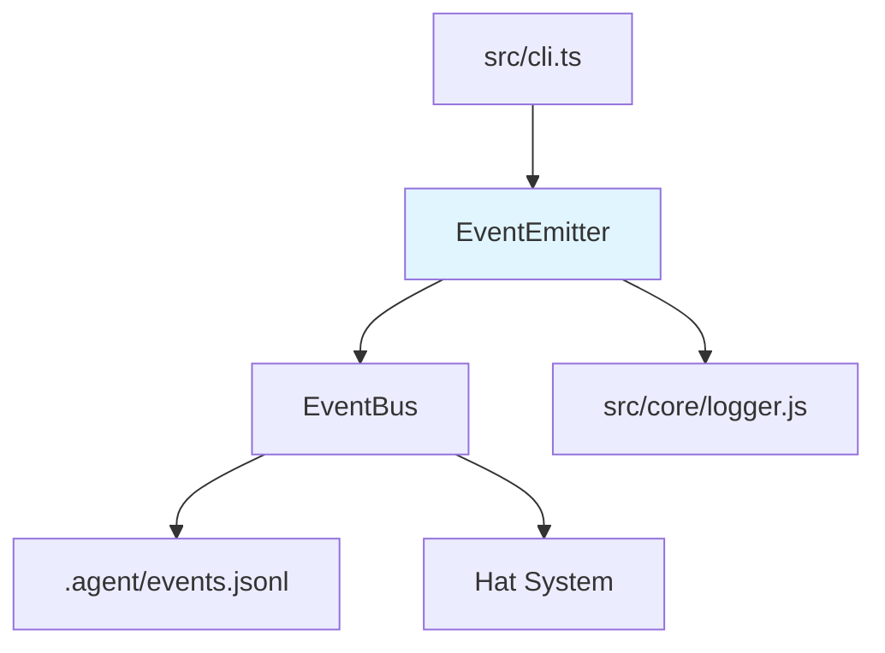

# Event Emission CLI バックエンド設計書

## メタ情報

| 項目 | 内容 |
|------|------|
| ドキュメントID | DETAILED-ORCH-004-F020-BE |
| バージョン | 1.0.0 |
| ステータス | ドラフト |
| 作成日 | 2026-01-26 |
| 最終更新日 | 2026-01-26 |
| 作成者 | AI Assistant |
| 承認者 | - |
| 関連詳細設計書 | DETAILED-ORCH-004-F020 |
| 対象機能 | F-020 |

---

## 1. 概要

Event Emission CLI機能のバックエンド実装仕様を定義します。

---

## 2. ファイル構成

| ファイル | 説明 | 新規/変更 |
|---------|------|----------|
| `src/core/event-emitter.ts` | EventEmitterクラス | 新規 |
| `src/core/event-emitter.test.ts` | 単体テスト | 新規 |
| `src/core/event.ts` | Eventインターフェース拡張 | 変更 |
| `src/cli.ts` | `emit`コマンド追加 | 変更 |

---

## 3. クラス詳細設計

### 3.1 EventEmitter

#### ファイル: `src/core/event-emitter.ts`

```typescript
import { EventBus, Event } from "./event.js";
import { logger } from "./logger.js";

/**
 * CLI経由でイベントを発行するクラス
 * 
 * @example
 * ```typescript
 * const emitter = new EventEmitter(eventBus);
 * 
 * // 基本的なイベント発行
 * await emitter.emit("build.done", "tests: pass");
 * 
 * // JSONペイロード
 * await emitter.emit("review.done", '{"status": "approved"}', { json: true });
 * 
 * // ハンドオフ
 * await emitter.emit("handoff", "Please review", { target: "reviewer" });
 * ```
 */
export class EventEmitter {
  private readonly eventBus: EventBus;

  constructor(eventBus: EventBus) {
    this.eventBus = eventBus;
  }

  /**
   * イベントを発行
   * 
   * @param topic - イベントトピック
   * @param message - メッセージまたはJSONペイロード
   * @param options - オプション
   * @returns 発行されたイベント
   * @throws Error - トピックまたはメッセージが空、JSON解析失敗時
   */
  async emit(
    topic: string,
    message: string,
    options?: {
      json?: boolean;
      target?: string;
    }
  ): Promise<Event> {
    // バリデーション
    if (!topic || topic.trim() === "") {
      throw new Error("イベントトピックが指定されていません");
    }

    if (!message || message.trim() === "") {
      throw new Error("イベントメッセージが指定されていません");
    }

    // メッセージの解析
    let parsedMessage: string | Record<string, unknown> = message;
    if (options?.json) {
      try {
        parsedMessage = JSON.parse(message);
      } catch (error) {
        throw new Error(`JSONペイロードの解析に失敗: ${error.message}`);
      }
    }

    // イベントオブジェクト作成
    const event: Event = {
      topic,
      message: parsedMessage,
      timestamp: new Date().toISOString(),
    };

    if (options?.target) {
      event.target = options.target;
    }

    // イベント発行
    logger.info(`イベント発行: ${topic}${options?.target ? ` → ${options.target}` : ""}`);
    await this.eventBus.publish(event);

    return event;
  }
}
```

---

## 4. 型定義拡張

### ファイル: `src/core/event.ts`（変更分）

```typescript
/**
 * イベント
 */
export interface Event {
  /**
   * イベントトピック
   */
  topic: string;

  /**
   * メッセージまたはJSONペイロード
   */
  message: string | Record<string, unknown>;

  /**
   * ターゲットHat（ハンドオフ用）
   * 新規追加
   */
  target?: string;

  /**
   * タイムスタンプ
   */
  timestamp: string;
}

/**
 * イベントバス
 */
export class EventBus {
  // ... 既存メソッド

  /**
   * イベントを発行
   * 
   * @param event - イベント
   */
  async publish(event: Event): Promise<void> {
    // events.jsonlに記録
    await this.writeToEventsFile(event);

    // 対応するHatをトリガー
    if (event.target) {
      // ターゲットHat指定時は特定Hatのみトリガー
      await this.triggerSpecificHat(event.target, event);
    } else {
      // トピックマッチングで対応するHatをトリガー
      await this.triggerMatchingHats(event);
    }
  }

  /**
   * 特定Hatをトリガー
   * 
   * @param hatName - Hat名
   * @param event - イベント
   */
  private async triggerSpecificHat(hatName: string, event: Event): Promise<void> {
    const hat = this.config.hats?.[hatName];
    if (!hat) {
      logger.warn(`ターゲットHat '${hatName}' が見つかりません`);
      return;
    }

    logger.info(`Hat '${hatName}' をトリガー`);
    // Hat実行ロジック
    // ... 既存のHat実行処理
  }

  /**
   * トピックマッチングで対応するHatをトリガー
   * 
   * @param event - イベント
   */
  private async triggerMatchingHats(event: Event): Promise<void> {
    // ... 既存のトピックマッチングロジック
  }
}
```

---

## 5. CLI統合

### ファイル: `src/cli.ts`（追加分）

```typescript
import { EventEmitter } from "./core/event-emitter.js";
import { EventBus } from "./core/event.js";

program
  .command("emit")
  .description("イベントを発行")
  .argument("<topic>", "イベントトピック")
  .argument("<message>", "メッセージまたはJSONペイロード")
  .option("-j, --json", "メッセージをJSONペイロードとして解析")
  .option("-t, --target <hat>", "特定Hatへのハンドオフ")
  .action(async (topic: string, message: string, options) => {
    try {
      // 設定読み込み
      const config = await loadConfig(options.config);

      // イベントバス初期化
      const eventBus = new EventBus(config);

      // イベント発行
      const emitter = new EventEmitter(eventBus);
      const event = await emitter.emit(topic, message, {
        json: options.json,
        target: options.target,
      });

      logger.success(`イベント発行完了: ${event.topic}`);
      
      if (options.json) {
        console.log(JSON.stringify(event, null, 2));
      }
    } catch (error) {
      logger.error(`イベント発行失敗: ${error.message}`);
      process.exit(1);
    }
  });
```

---

## 6. テスト設計

### ファイル: `src/core/event-emitter.test.ts`

```typescript
import { describe, it, expect, mock, beforeEach } from "bun:test";
import { EventEmitter } from "./event-emitter.js";
import type { EventBus, Event } from "./event.js";

describe("EventEmitter", () => {
  let mockEventBus: EventBus;

  beforeEach(() => {
    mockEventBus = {
      publish: mock(() => Promise.resolve()),
    } as unknown as EventBus;
  });

  describe("emit", () => {
    it("基本的なイベントを発行", async () => {
      const emitter = new EventEmitter(mockEventBus);

      const event = await emitter.emit("build.done", "tests: pass");

      expect(event.topic).toBe("build.done");
      expect(event.message).toBe("tests: pass");
      expect(event.timestamp).toBeDefined();
      expect(event.target).toBeUndefined();
      expect(mockEventBus.publish).toHaveBeenCalledWith(event);
    });

    it("JSONペイロードを解析", async () => {
      const emitter = new EventEmitter(mockEventBus);

      const event = await emitter.emit(
        "review.done",
        '{"status": "approved", "score": 9}',
        { json: true }
      );

      expect(event.topic).toBe("review.done");
      expect(event.message).toEqual({ status: "approved", score: 9 });
    });

    it("ターゲットHatを設定", async () => {
      const emitter = new EventEmitter(mockEventBus);

      const event = await emitter.emit(
        "handoff",
        "Please review",
        { target: "reviewer" }
      );

      expect(event.topic).toBe("handoff");
      expect(event.message).toBe("Please review");
      expect(event.target).toBe("reviewer");
    });

    it("トピックが空の場合はエラー", async () => {
      const emitter = new EventEmitter(mockEventBus);

      await expect(emitter.emit("", "message")).rejects.toThrow(
        "イベントトピックが指定されていません"
      );
    });

    it("メッセージが空の場合はエラー", async () => {
      const emitter = new EventEmitter(mockEventBus);

      await expect(emitter.emit("topic", "")).rejects.toThrow(
        "イベントメッセージが指定されていません"
      );
    });

    it("JSON解析失敗時はエラー", async () => {
      const emitter = new EventEmitter(mockEventBus);

      await expect(
        emitter.emit("topic", "invalid json", { json: true })
      ).rejects.toThrow("JSONペイロードの解析に失敗");
    });

    it("タイムスタンプがISO 8601形式", async () => {
      const emitter = new EventEmitter(mockEventBus);

      const event = await emitter.emit("topic", "message");

      expect(event.timestamp).toMatch(/^\d{4}-\d{2}-\d{2}T\d{2}:\d{2}:\d{2}\.\d{3}Z$/);
    });
  });
});
```

---

## 7. 依存関係



---

## 8. 実装手順

1. `src/core/event.ts` の `Event` インターフェースに `target` フィールドを追加
2. `src/core/event.ts` の `EventBus` に `triggerSpecificHat()` メソッドを追加
3. `src/core/event-emitter.ts` を新規作成
4. `src/core/event-emitter.test.ts` を新規作成
5. テスト実行・パス確認
6. `src/cli.ts` に `emit` コマンドを追加

---

## 9. 変更履歴

| バージョン | 日付 | 変更内容 | 変更者 |
|-----------|------|---------|--------|
| 1.0.0 | 2026-01-26 | 初版作成 | AI Assistant |
