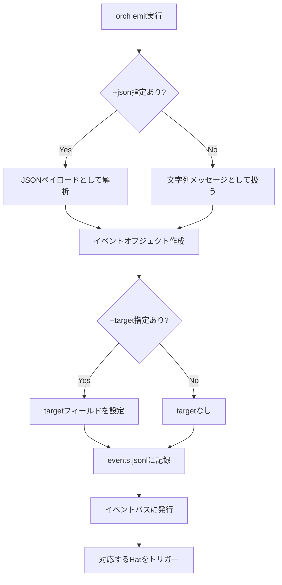
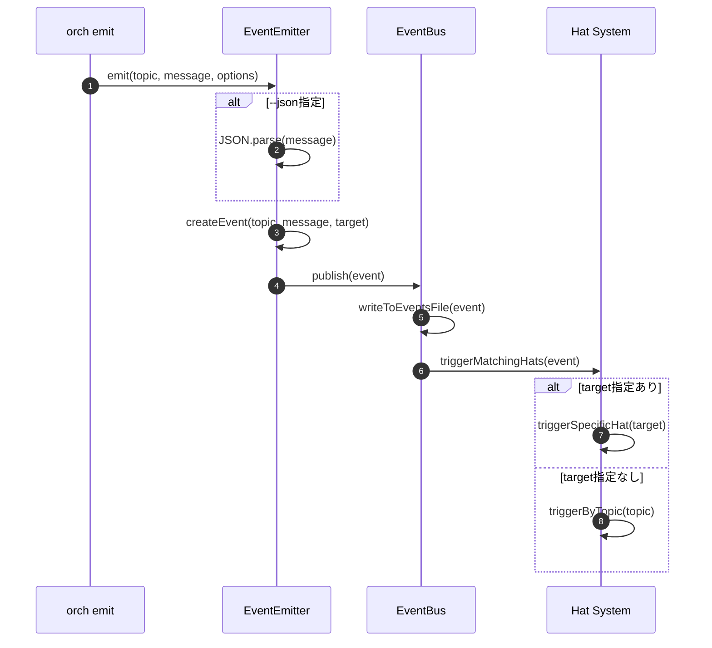
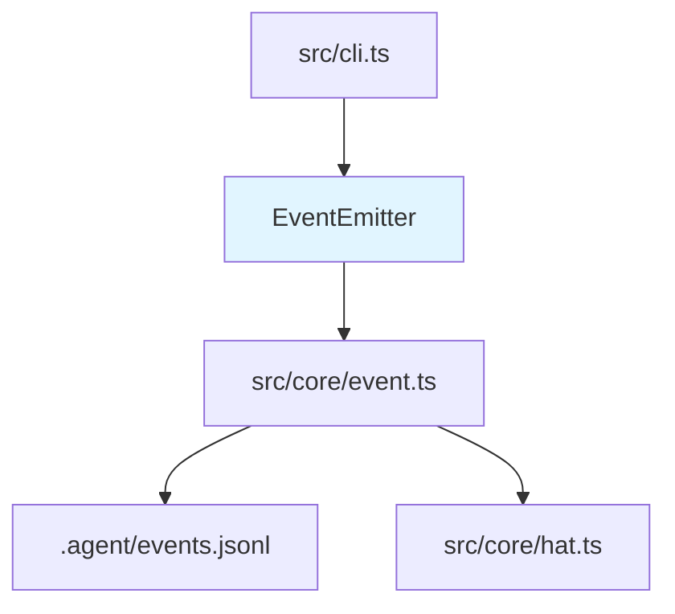

# Event Emission CLI 詳細設計書

## メタ情報

| 項目 | 内容 |
|------|------|
| ドキュメントID | DETAILED-ORCH-004-F020 |
| バージョン | 1.0.0 |
| ステータス | ドラフト |
| 作成日 | 2026-01-26 |
| 最終更新日 | 2026-01-26 |
| 作成者 | AI Assistant |
| 承認者 | - |
| 関連基本設計書 | BASIC-ORCH-004 v1.0.0 |
| 対象機能 | F-020 |

---

## 1. 概要

### 1.1 目的

CLI経由で明示的にイベントを発行できるようにすることで、外部システムやスクリプトからオーケストレーターのイベントバスを操作可能にします。

### 1.2 スコープ

#### スコープ内

- `orch emit`コマンドの実装
- イベントトピックとメッセージの指定
- JSONペイロードのサポート
- ターゲットHat指定（ハンドオフ）
- events.jsonlへの記録
- 対応するHatのトリガー

#### スコープ外

- イベントの永続化（既存のevents.jsonlを使用）
- イベントの検索・フィルタリング
- イベントの削除・編集

### 1.3 参照ドキュメント

| ドキュメント | パス | 参照箇所 |
|-------------|------|---------|
| 基本設計書 | docs/designs/basic/BASIC-ORCH-004_v1.4.0機能.md | セクション3.9 |
| 既存イベントバス | src/core/event.ts | 参考実装 |

---

## 2. 処理フロー

### 2.1 全体フロー



### 2.2 シーケンス図



---

## 3. インターフェース定義

### 3.1 EventEmitter

```typescript
/**
 * CLI経由でイベントを発行するクラス
 */
export class EventEmitter {
  /**
   * コンストラクタ
   * @param eventBus - イベントバス
   */
  constructor(eventBus: EventBus);

  /**
   * イベントを発行
   * 
   * @param topic - イベントトピック
   * @param message - メッセージまたはJSONペイロード
   * @param options - オプション
   * @returns 発行されたイベント
   */
  emit(
    topic: string,
    message: string,
    options?: {
      json?: boolean;
      target?: string;
    }
  ): Promise<Event>;
}
```

### 3.2 Event

```typescript
/**
 * イベント
 */
export interface Event {
  /**
   * イベントトピック
   */
  topic: string;

  /**
   * メッセージまたはJSONペイロード
   */
  message: string | Record<string, unknown>;

  /**
   * ターゲットHat（ハンドオフ用）
   */
  target?: string;

  /**
   * タイムスタンプ
   */
  timestamp: string;
}
```

---

## 4. CLIコマンド定義

### 4.1 コマンド構文

```bash
orch emit <topic> <message> [options]
```

### 4.2 オプション

| オプション | 短縮形 | 説明 | デフォルト |
|-----------|--------|------|-----------|
| `--json` | `-j` | メッセージをJSONペイロードとして解析 | false |
| `--target <hat>` | `-t` | 特定Hatへのハンドオフ | - |

### 4.3 使用例

```bash
# 基本的なイベント発行
orch emit "build.done" "tests: pass, lint: pass"

# JSONペイロード
orch emit "review.done" --json '{"status": "approved", "score": 9}'

# ターゲットHat指定（ハンドオフ）
orch emit "handoff" --target reviewer "Please review the implementation"

# 短縮形
orch emit "task.start" "Starting task #42" -t planner
```

---

## 5. エラーハンドリング

### 5.1 エラーケース

| エラーケース | エラーメッセージ | 対処 |
|-------------|----------------|------|
| トピックが空 | `イベントトピックが指定されていません` | エラーログ出力、終了コード1 |
| メッセージが空 | `イベントメッセージが指定されていません` | エラーログ出力、終了コード1 |
| JSON解析失敗 | `JSONペイロードの解析に失敗: ${error}` | エラーログ出力、終了コード1 |
| ターゲットHatが存在しない | `ターゲットHat '${target}' が見つかりません` | 警告ログ出力、イベントは発行 |

---

## 6. 依存関係

### 6.1 関連するビジネスルール

- BR-065: イベントトピックは任意の文字列
- BR-066: `--json`オプション時はJSONペイロードとして解析
- BR-067: `--target`オプション時は特定Hatへのハンドオフ
- BR-068: イベントはevents.jsonlに記録される

### 6.2 依存モジュール



---

## 7. テスト方針

### 7.1 単体テスト

| テストケース | 期待結果 |
|-------------|---------|
| 基本的なイベント発行 | events.jsonlに記録される |
| JSONペイロード | JSON.parseが呼ばれる |
| ターゲットHat指定 | targetフィールドが設定される |
| JSON解析失敗 | エラーがスローされる |
| トピックが空 | エラーがスローされる |

### 7.2 統合テスト

| テストケース | 期待結果 |
|-------------|---------|
| `orch emit`コマンド実行 | イベントが発行され、Hatがトリガーされる |
| ハンドオフイベント | 特定Hatのみがトリガーされる |

---

## 8. 実装チェックリスト

- [ ] `src/core/event-emitter.ts` 作成
  - [ ] EventEmitterクラス実装
  - [ ] emit()メソッド実装
- [ ] `src/cli.ts` 拡張
  - [ ] `emit`コマンド追加
  - [ ] `--json`, `--target`オプション追加
- [ ] `src/core/event.ts` 拡張
  - [ ] Eventインターフェースにtargetフィールド追加
- [ ] テスト作成
  - [ ] `src/core/event-emitter.test.ts`

---

## 9. 変更履歴

| バージョン | 日付 | 変更内容 | 変更者 |
|-----------|------|---------|--------|
| 1.0.0 | 2026-01-26 | 初版作成 | AI Assistant |

---

## 10. 承認

| 役割 | 氏名 | 承認日 | 署名 |
|------|------|--------|------|
| 作成者 | AI Assistant | 2026-01-26 | - |
| レビュアー | - | - | - |
| 承認者 | - | - | - |
