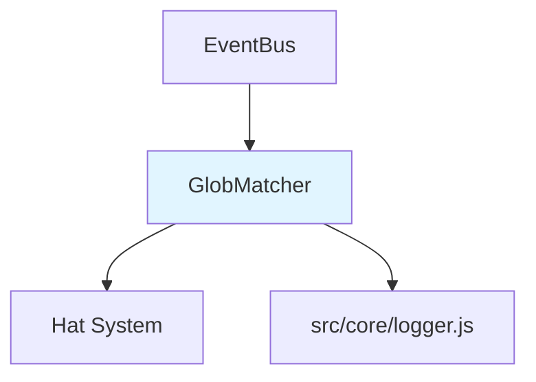

# Glob Pattern Event Matching バックエンド設計書

## メタ情報

| 項目 | 内容 |
|------|------|
| ドキュメントID | DETAILED-ORCH-004-F021-BE |
| バージョン | 1.0.0 |
| ステータス | ドラフト |
| 作成日 | 2026-01-26 |
| 最終更新日 | 2026-01-26 |
| 作成者 | AI Assistant |
| 承認者 | - |
| 関連詳細設計書 | DETAILED-ORCH-004-F021 |
| 対象機能 | F-021 |

---

## 1. 概要

Glob Pattern Event Matching機能のバックエンド実装仕様を定義します。

---

## 2. ファイル構成

| ファイル | 説明 | 新規/変更 |
|---------|------|----------|
| `src/core/glob-matcher.ts` | GlobMatcherクラス | 新規 |
| `src/core/glob-matcher.test.ts` | 単体テスト | 新規 |
| `src/core/event.ts` | GlobMatcher統合 | 変更 |

---

## 3. クラス詳細設計

### 3.1 GlobMatcher

#### ファイル: `src/core/glob-matcher.ts`

```typescript
import { Hat } from "./types.js";
import { logger } from "./logger.js";

/**
 * Globパターンマッチャー
 * 
 * @example
 * ```typescript
 * const matcher = new GlobMatcher({
 *   builder: {
 *     triggers: ["build.*"],
 *     publishes: ["build.done"],
 *   },
 *   reviewer: {
 *     triggers: ["*.done"],
 *     publishes: ["review.done"],
 *   },
 *   fallback: {
 *     triggers: ["*"],
 *     publishes: [],
 *   },
 * });
 * 
 * const hats = matcher.match("build.done");
 * // ["builder", "reviewer"]
 * ```
 */
export class GlobMatcher {
  private readonly hats: Record<string, Hat>;

  constructor(hats: Record<string, Hat>) {
    this.hats = hats;
  }

  /**
   * イベントトピックにマッチするHatを検索
   * 
   * 優先度:
   * 1. 具体的パターン（完全一致）
   * 2. ワイルドカードパターン（build.*, *.done）
   * 3. グローバルワイルドカード（*）
   * 
   * @param topic - イベントトピック
   * @returns マッチしたHat名の配列
   * @throws Error - 曖昧なルーティング時
   */
  match(topic: string): string[] {
    // 1. 具体的パターンでマッチ
    const exactMatches = this.findExactMatches(topic);
    if (exactMatches.length > 1) {
      throw new Error(
        `イベント '${topic}' が複数のHatにマッチ: ${exactMatches.join(", ")}`
      );
    }
    if (exactMatches.length === 1) {
      return exactMatches;
    }

    // 2. ワイルドカードパターンでマッチ
    const wildcardMatches = this.findWildcardMatches(topic);
    if (wildcardMatches.length > 0) {
      return wildcardMatches;
    }

    // 3. グローバルワイルドカード（*）
    const globalMatches = this.findGlobalWildcard();
    if (globalMatches.length > 0) {
      return globalMatches;
    }

    // マッチなし
    logger.warn(`イベント '${topic}' にマッチするHatがありません`);
    return [];
  }

  /**
   * 具体的パターンでマッチするHatを検索
   * 
   * @param topic - イベントトピック
   * @returns マッチしたHat名の配列
   */
  private findExactMatches(topic: string): string[] {
    const matches: string[] = [];

    for (const [hatName, hat] of Object.entries(this.hats)) {
      for (const trigger of hat.triggers) {
        // ワイルドカードを含まない完全一致
        if (!trigger.includes("*") && trigger === topic) {
          matches.push(hatName);
          break;
        }
      }
    }

    return matches;
  }

  /**
   * ワイルドカードパターンでマッチするHatを検索
   * 
   * @param topic - イベントトピック
   * @returns マッチしたHat名の配列
   */
  private findWildcardMatches(topic: string): string[] {
    const matches: string[] = [];

    for (const [hatName, hat] of Object.entries(this.hats)) {
      for (const trigger of hat.triggers) {
        // グローバルワイルドカード（*）は除外
        if (trigger === "*") {
          continue;
        }

        // ワイルドカードパターンでマッチ
        if (trigger.includes("*") && this.isMatch(trigger, topic)) {
          matches.push(hatName);
          break;
        }
      }
    }

    return matches;
  }

  /**
   * グローバルワイルドカード（*）を持つHatを検索
   * 
   * @returns マッチしたHat名の配列
   */
  private findGlobalWildcard(): string[] {
    const matches: string[] = [];

    for (const [hatName, hat] of Object.entries(this.hats)) {
      if (hat.triggers.includes("*")) {
        matches.push(hatName);
      }
    }

    return matches;
  }

  /**
   * パターンがトピックにマッチするか判定
   * 
   * @param pattern - トリガーパターン
   * @param topic - イベントトピック
   * @returns マッチする場合はtrue
   */
  private isMatch(pattern: string, topic: string): boolean {
    // ワイルドカードを正規表現に変換
    // build.* → ^build\\..*$
    // *.done → ^.*\\.done$
    const regexPattern = pattern
      .replace(/\./g, "\\.")  // . をエスケープ
      .replace(/\*/g, ".*");  // * を .* に変換

    const regex = new RegExp(`^${regexPattern}$`);
    return regex.test(topic);
  }
}
```

---

## 4. EventBus統合

### ファイル: `src/core/event.ts`（変更分）

```typescript
import { GlobMatcher } from "./glob-matcher.js";

export class EventBus {
  private readonly config: Config;
  private readonly matcher: GlobMatcher;

  constructor(config: Config) {
    this.config = config;
    this.matcher = new GlobMatcher(config.hats ?? {});
  }

  /**
   * トピックマッチングで対応するHatをトリガー
   * 
   * @param event - イベント
   */
  private async triggerMatchingHats(event: Event): Promise<void> {
    try {
      const matchedHats = this.matcher.match(event.topic);

      if (matchedHats.length === 0) {
        return;
      }

      logger.info(`イベント '${event.topic}' → Hats: ${matchedHats.join(", ")}`);

      // マッチしたすべてのHatをトリガー
      for (const hatName of matchedHats) {
        await this.triggerHat(hatName, event);
      }
    } catch (error) {
      logger.error(`イベントルーティング失敗: ${error.message}`);
      throw error;
    }
  }

  /**
   * Hatをトリガー
   * 
   * @param hatName - Hat名
   * @param event - イベント
   */
  private async triggerHat(hatName: string, event: Event): Promise<void> {
    // ... 既存のHat実行ロジック
  }
}
```

---

## 5. テスト設計

### ファイル: `src/core/glob-matcher.test.ts`

```typescript
import { describe, it, expect } from "bun:test";
import { GlobMatcher } from "./glob-matcher.js";
import type { Hat } from "./types.js";

describe("GlobMatcher", () => {
  const hats: Record<string, Hat> = {
    builder: {
      triggers: ["build.*"],
      publishes: ["build.done"],
    },
    tester: {
      triggers: ["test.start", "test.done"],
      publishes: ["test.result"],
    },
    reviewer: {
      triggers: ["*.done"],
      publishes: ["review.done"],
    },
    fallback: {
      triggers: ["*"],
      publishes: [],
    },
  };

  describe("match", () => {
    it("完全一致でマッチ", () => {
      const matcher = new GlobMatcher(hats);
      const result = matcher.match("test.start");

      expect(result).toEqual(["tester"]);
    });

    it("プレフィックスワイルドカードでマッチ", () => {
      const matcher = new GlobMatcher(hats);
      const result = matcher.match("build.done");

      // builder（build.*）とreviewer（*.done）がマッチ
      expect(result).toContain("builder");
      expect(result).toContain("reviewer");
    });

    it("サフィックスワイルドカードでマッチ", () => {
      const matcher = new GlobMatcher(hats);
      const result = matcher.match("custom.done");

      // reviewer（*.done）のみマッチ
      expect(result).toEqual(["reviewer"]);
    });

    it("グローバルワイルドカードでマッチ", () => {
      const matcher = new GlobMatcher(hats);
      const result = matcher.match("unknown.event");

      // fallback（*）のみマッチ
      expect(result).toEqual(["fallback"]);
    });

    it("具体的パターンがワイルドカードより優先", () => {
      const hatsWithPriority: Record<string, Hat> = {
        specific: {
          triggers: ["build.done"],
          publishes: [],
        },
        wildcard: {
          triggers: ["build.*"],
          publishes: [],
        },
      };

      const matcher = new GlobMatcher(hatsWithPriority);
      const result = matcher.match("build.done");

      // specific（完全一致）が優先
      expect(result).toEqual(["specific"]);
    });

    it("複数の具体的パターンでマッチした場合はエラー", () => {
      const hatsWithAmbiguity: Record<string, Hat> = {
        hat1: {
          triggers: ["build.done"],
          publishes: [],
        },
        hat2: {
          triggers: ["build.done"],
          publishes: [],
        },
      };

      const matcher = new GlobMatcher(hatsWithAmbiguity);

      expect(() => matcher.match("build.done")).toThrow(
        "イベント 'build.done' が複数のHatにマッチ: hat1, hat2"
      );
    });

    it("マッチなしの場合は空配列", () => {
      const hatsWithoutFallback: Record<string, Hat> = {
        builder: {
          triggers: ["build.*"],
          publishes: [],
        },
      };

      const matcher = new GlobMatcher(hatsWithoutFallback);
      const result = matcher.match("test.start");

      expect(result).toEqual([]);
    });

    it("複数のワイルドカードパターンでマッチ", () => {
      const matcher = new GlobMatcher(hats);
      const result = matcher.match("build.done");

      // builder（build.*）とreviewer（*.done）がマッチ
      expect(result.length).toBe(2);
      expect(result).toContain("builder");
      expect(result).toContain("reviewer");
    });

    it("グローバルワイルドカードは他にマッチがない場合のみ", () => {
      const matcher = new GlobMatcher(hats);
      const result = matcher.match("build.done");

      // fallback（*）はマッチしない（他にマッチがあるため）
      expect(result).not.toContain("fallback");
    });
  });
});
```

---

## 6. 依存関係



---

## 7. 実装手順

1. `src/core/glob-matcher.ts` を新規作成
2. `src/core/glob-matcher.test.ts` を新規作成
3. テスト実行・パス確認
4. `src/core/event.ts` に GlobMatcher 統合

---

## 8. 変更履歴

| バージョン | 日付 | 変更内容 | 変更者 |
|-----------|------|---------|--------|
| 1.0.0 | 2026-01-26 | 初版作成 | AI Assistant |
