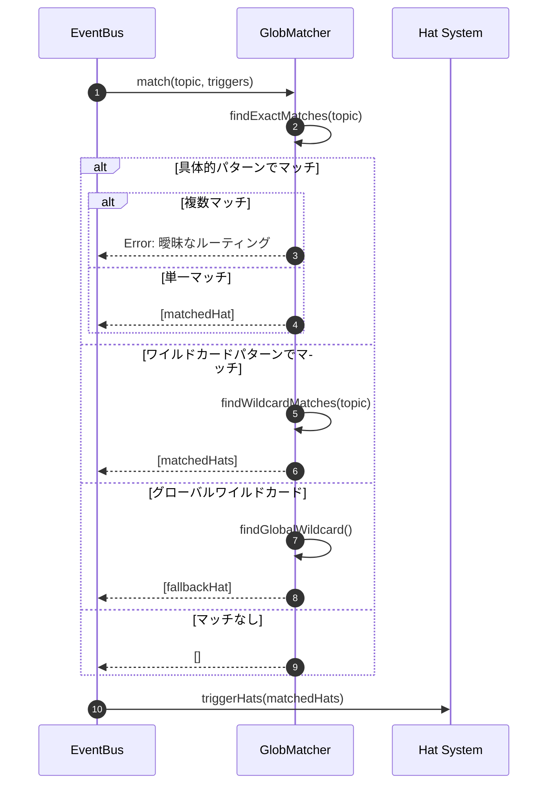
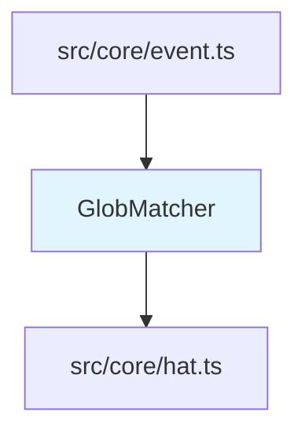

# Glob Pattern Event Matching 詳細設計書

## メタ情報

| 項目 | 内容 |
|------|------|
| ドキュメントID | DETAILED-ORCH-004-F021 |
| バージョン | 1.0.0 |
| ステータス | ドラフト |
| 作成日 | 2026-01-26 |
| 最終更新日 | 2026-01-26 |
| 作成者 | AI Assistant |
| 承認者 | - |
| 関連基本設計書 | BASIC-ORCH-004 v1.0.0 |
| 対象機能 | F-021 |

---

## 1. 概要

### 1.1 目的

イベントトピックのワイルドカード（`*`）マッチングを実装することで、柔軟なイベントルーティングを実現します。

### 1.2 スコープ

#### スコープ内

- ワイルドカード（`*`）のサポート
- 具体的パターンの優先
- グローバルワイルドカード（`*`）のフォールバック
- 曖昧なルーティングの検出

#### スコープ外

- 階層的なワイルドカード（`**`）
- 正規表現パターン
- 複数のワイルドカード（`*.*.done`）
- イベントトピックの階層的管理

### 1.3 参照ドキュメント

| ドキュメント | パス | 参照箇所 |
|-------------|------|---------|
| 基本設計書 | docs/designs/basic/BASIC-ORCH-004_v1.4.0機能.md | セクション3.10 |
| 既存イベントバス | src/core/event.ts | 参考実装 |

---

## 2. 処理フロー

### 2.1 全体フロー

```mermaid
flowchart TD
    A[イベント発行] --> B[トピックマッチング開始]
    B --> C{具体的パターンでマッチ?}
    C -->|Yes| D{複数のHatがマッチ?}
    D -->|Yes| E[エラー: 曖昧なルーティング]
    D -->|No| F[マッチしたHatをトリガー]
    C -->|No| G{ワイルドカードパターンでマッチ?}
    G -->|Yes| H{複数のHatがマッチ?}
    H -->|Yes| I[すべてのマッチしたHatをトリガー]
    H -->|No| F
    G -->|No| J{グローバルワイルドカード(*)?}
    J -->|Yes| K[フォールバックHatをトリガー]
    J -->|No| L[警告: マッチするHatなし]
```

### 2.2 シーケンス図



---

## 3. インターフェース定義

### 3.1 GlobMatcher

```typescript
/**
 * Globパターンマッチャー
 */
export class GlobMatcher {
  /**
   * コンストラクタ
   * @param hats - Hat定義
   */
  constructor(hats: Record<string, Hat>);

  /**
   * イベントトピックにマッチするHatを検索
   * 
   * @param topic - イベントトピック
   * @returns マッチしたHat名の配列
   * @throws Error - 曖昧なルーティング時
   */
  match(topic: string): string[];

  /**
   * 具体的パターンでマッチするHatを検索
   * 
   * @param topic - イベントトピック
   * @returns マッチしたHat名の配列
   */
  private findExactMatches(topic: string): string[];

  /**
   * ワイルドカードパターンでマッチするHatを検索
   * 
   * @param topic - イベントトピック
   * @returns マッチしたHat名の配列
   */
  private findWildcardMatches(topic: string): string[];

  /**
   * グローバルワイルドカード（*）を持つHatを検索
   * 
   * @returns マッチしたHat名の配列
   */
  private findGlobalWildcard(): string[];

  /**
   * パターンがトピックにマッチするか判定
   * 
   * @param pattern - トリガーパターン
   * @param topic - イベントトピック
   * @returns マッチする場合はtrue
   */
  private isMatch(pattern: string, topic: string): boolean;
}
```

---

## 4. マッチングルール

### 4.1 パターン種別

| パターン | 説明 | 例 |
|---------|------|-----|
| 具体的パターン | 完全一致 | `task.start` |
| プレフィックスワイルドカード | 前方一致 | `build.*` |
| サフィックスワイルドカード | 後方一致 | `*.done` |
| グローバルワイルドカード | すべてにマッチ | `*` |

### 4.2 優先度ルール

1. **具体的パターン**（完全一致）が最優先
2. **ワイルドカードパターン**（`build.*`, `*.done`）が次
3. **グローバルワイルドカード**（`*`）がフォールバック

### 4.3 マッチング例

| トピック | パターン | マッチ |
|---------|---------|--------|
| `task.start` | `task.start` | ✅ 完全一致 |
| `build.done` | `build.*` | ✅ プレフィックス |
| `review.done` | `*.done` | ✅ サフィックス |
| `custom.event` | `*` | ✅ グローバル |
| `build.done` | `task.*` | ❌ マッチしない |

---

## 5. エラーハンドリング

### 5.1 エラーケース

| エラーケース | エラーメッセージ | 対処 |
|-------------|----------------|------|
| 曖昧なルーティング | `イベント '${topic}' が複数のHatにマッチ: ${hats}` | エラーログ出力、実行を中断 |
| マッチするHatなし | `イベント '${topic}' にマッチするHatがありません` | 警告ログ出力、イベントを無視 |

---

## 6. 依存関係

### 6.1 関連するビジネスルール

- BR-069: 具体的パターンがワイルドカードより優先
- BR-070: 複数のHatが同じ具体的パターンでマッチした場合はエラー
- BR-071: グローバルワイルドカード（`*`）はフォールバックとして機能

### 6.2 依存モジュール



---

## 7. テスト方針

### 7.1 単体テスト

| テストケース | 期待結果 |
|-------------|---------|
| 完全一致 | 具体的パターンのHatがマッチ |
| プレフィックスワイルドカード | `build.*`が`build.done`にマッチ |
| サフィックスワイルドカード | `*.done`が`build.done`にマッチ |
| グローバルワイルドカード | `*`がすべてにマッチ |
| 具体的パターン優先 | ワイルドカードより具体的パターンが優先 |
| 曖昧なルーティング | 複数の具体的パターンでエラー |
| マッチなし | 警告ログ出力 |

### 7.2 統合テスト

| テストケース | 期待結果 |
|-------------|---------|
| 複数のワイルドカードパターン | すべてのマッチしたHatがトリガーされる |
| フォールバックHat | 他にマッチがない場合のみトリガーされる |

---

## 8. 実装チェックリスト

- [ ] `src/core/glob-matcher.ts` 作成
  - [ ] GlobMatcherクラス実装
  - [ ] match()メソッド実装
  - [ ] findExactMatches()メソッド実装
  - [ ] findWildcardMatches()メソッド実装
  - [ ] findGlobalWildcard()メソッド実装
  - [ ] isMatch()メソッド実装
- [ ] `src/core/event.ts` 統合
  - [ ] GlobMatcher呼び出し追加
- [ ] テスト作成
  - [ ] `src/core/glob-matcher.test.ts`

---

## 9. 変更履歴

| バージョン | 日付 | 変更内容 | 変更者 |
|-----------|------|---------|--------|
| 1.0.0 | 2026-01-26 | 初版作成 | AI Assistant |

---

## 10. 承認

| 役割 | 氏名 | 承認日 | 署名 |
|------|------|--------|------|
| 作成者 | AI Assistant | 2026-01-26 | - |
| レビュアー | - | - | - |
| 承認者 | - | - | - |
