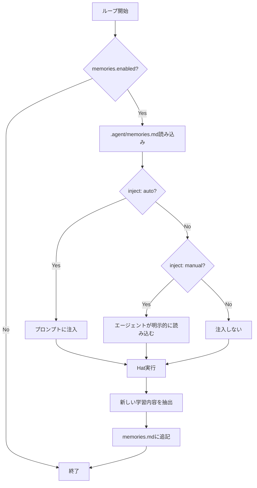

# Memories System 詳細設計書

## メタ情報

| 項目 | 内容 |
|------|------|
| ドキュメントID | DETAILED-ORCH-004-F014 |
| バージョン | 1.0.0 |
| ステータス | ドラフト |
| 作成日 | 2026-01-26 |
| 最終更新日 | 2026-01-26 |
| 作成者 | AI Assistant |
| 承認者 | - |
| 関連基本設計書 | BASIC-ORCH-004 v1.0.0 |
| 対象機能 | F-014 |

---

## 1. 概要

### 1.1 目的

セッション間で学習内容を`.agent/memories.md`に永続化し、プロジェクト固有の知識を蓄積します。これにより、同じ問題を繰り返し解決する無駄を削減します。

### 1.2 スコープ

#### スコープ内

- `.agent/memories.md`への学習内容の追記
- Memoriesの読み込み・検索・削除
- プロンプトへの自動注入（inject: auto/manual/none）
- Worktree間でのシンボリックリンク共有
- CLIコマンド（`orch tools memory`）

#### スコープ外

- Memoriesの自動要約・圧縮
- Memoriesのバージョン管理
- Memoriesの自動分類

### 1.3 参照ドキュメント

| ドキュメント | パス | 参照箇所 |
|-------------|------|---------|
| 基本設計書 | docs/designs/basic/BASIC-ORCH-004_v1.4.0機能.md | セクション3.3 |
| Scratchpad実装 | src/core/scratchpad.ts | 参考実装 |

---

## 2. 処理フロー

### 2.1 全体フロー



### 2.2 シーケンス図

```mermaid
sequenceDiagram
    autonumber
    participant Loop as LoopEngine
    participant Manager as MemoryManager
    participant File as .agent/memories.md
    participant Hat as HatExecutor

    Loop->>Manager: loadMemories()
    Manager->>File: 読み込み
    File-->>Manager: Markdown内容
    Manager-->>Loop: Memory[]
    
    alt inject: auto
        Loop->>Loop: プロンプトに注入
    else inject: manual
        Loop->>Hat: Memoriesを渡す
        Hat->>Hat: 必要に応じて参照
    end
    
    Loop->>Hat: 実行
    Hat-->>Loop: 出力
    
    Loop->>Manager: addMemory(content, tags)
    Manager->>File: 追記
    File-->>Manager: 成功
    Manager-->>Loop: 完了
```

---

## 3. インターフェース定義

### 3.1 MemoryManager

```typescript
/**
 * Memory管理クラス
 */
export class MemoryManager {
  /**
   * コンストラクタ
   * @param config - Memories設定
   * @param baseDir - .agentディレクトリのパス
   */
  constructor(config: MemoriesConfig, baseDir: string);

  /**
   * Memoriesを読み込み
   * @returns Memory配列
   */
  loadMemories(): Promise<Memory[]>;

  /**
   * Memoryを追加
   * @param content - 学習内容
   * @param tags - タグ（オプション）
   */
  addMemory(content: string, tags?: string[]): Promise<void>;

  /**
   * Memoryを検索
   * @param query - 検索クエリ
   * @returns マッチしたMemory配列
   */
  searchMemories(query: string): Promise<Memory[]>;

  /**
   * Memoryを削除
   * @param id - MemoryのID（見出し行番号）
   */
  deleteMemory(id: number): Promise<void>;

  /**
   * すべてのMemoriesを取得（一覧表示用）
   * @returns Memory配列
   */
  listMemories(): Promise<Memory[]>;
}
```

### 3.2 Memory型

```typescript
/**
 * Memory
 */
export interface Memory {
  /**
   * ID（見出し行番号）
   */
  id: number;

  /**
   * タイトル（見出し）
   */
  title: string;

  /**
   * タグ
   */
  tags: string[];

  /**
   * 日付
   */
  date: string;

  /**
   * 内容
   */
  content: string;
}
```

---

## 4. データ構造

### 4.1 memories.md形式

```markdown
# Memories

## Pattern: Error Handling
- Tags: pattern, error-handling
- Date: 2026-01-26
- Content: Always use try-catch blocks for async operations

## Architecture Decision: Database
- Tags: architecture, database
- Date: 2026-01-25
- Content: Use PostgreSQL for relational data, Redis for caching

## Solution: CI Timeout
- Tags: solution, ci
- Date: 2026-01-24
- Content: Increase CI timeout to 600 seconds for integration tests
```

### 4.2 パース規則

- `##` で始まる行が見出し（タイトル）
- `- Tags:` でタグを抽出
- `- Date:` で日付を抽出
- `- Content:` で内容を抽出

---

## 5. 設定ファイル拡張

### 5.1 orch.yml

```yaml
# Memories設定（新規 v1.4.0）
memories:
  enabled: true
  inject: auto  # auto | manual | none
```

### 5.2 MemoriesConfigSchema（zod）

```typescript
export const MemoriesConfigSchema = z.object({
  /**
   * Memoriesを有効にするか
   */
  enabled: z.boolean().default(true),

  /**
   * プロンプトへの注入モード
   * - auto: 自動注入
   * - manual: エージェントが明示的に読み込む
   * - none: 注入しない
   */
  inject: z.enum(["auto", "manual", "none"]).default("auto"),
});

export type MemoriesConfig = z.infer<typeof MemoriesConfigSchema>;
```

---

## 6. Worktree間での共有

### 6.1 シンボリックリンク

Worktree作成時に`.agent/memories.md`をシンボリックリンクで共有:

```bash
# プライマリ環境
project/.agent/memories.md

# セカンダリ環境（worktree）
.worktrees/orch-20260126-a3f2/.agent/memories.md -> ../../.agent/memories.md
```

### 6.2 実装

```typescript
// src/core/worktree-manager.ts

async createWorktree(loopId: string): Promise<string> {
  // ... worktree作成処理

  // .agentディレクトリ作成
  await fs.mkdir(path.join(worktreePath, ".agent"), { recursive: true });

  // memories.mdをシンボリックリンク
  const memoriesPath = path.join(worktreePath, ".agent", "memories.md");
  const primaryMemoriesPath = path.join(this.baseDir, ".agent", "memories.md");
  await fs.symlink(primaryMemoriesPath, memoriesPath);

  return worktreePath;
}
```

---

## 7. CLI統合

### 7.1 新規コマンド

```bash
# Memoryを追加
orch tools memory add "content" -t pattern --tags tag1,tag2

# Memoryを検索
orch tools memory search "query"

# Memoryを一覧表示
orch tools memory list

# Memoryを表示
orch tools memory show <id>

# Memoryを削除
orch tools memory delete <id>
```

### 7.2 コマンド詳細

| コマンド | 説明 | オプション |
|---------|------|-----------|
| `add <content>` | Memoryを追加 | `-t <type>`, `--tags <tags>` |
| `search <query>` | Memoryを検索 | なし |
| `list` | Memoryを一覧表示 | なし |
| `show <id>` | Memoryを表示 | なし |
| `delete <id>` | Memoryを削除 | なし |

---

## 8. プロンプト注入

### 8.1 inject: auto

プロンプトの先頭に注入:

```markdown
# Memories

## Pattern: Error Handling
- Tags: pattern, error-handling
- Date: 2026-01-26
- Content: Always use try-catch blocks for async operations

---

# Task

[既存のプロンプト]
```

### 8.2 inject: manual

Memoriesをコンテキストに渡すが、プロンプトには注入しない。エージェントが明示的に読み込む。

### 8.3 inject: none

Memoriesを読み込まない。

---

## 9. エラーハンドリング

### 9.1 エラーケース

| エラーケース | エラーメッセージ | 対処 |
|-------------|----------------|------|
| memories.mdが破損 | `memories.mdの読み込みに失敗しました。空のmemoriesとして扱います。` | 空のmemoriesとして扱う |
| memories.mdのサイズが上限超過 | `memories.mdのサイズが上限（10MB）を超えました。古いエントリを削除してください。` | 警告ログ出力、古いエントリを削除 |

---

## 10. テスト方針

### 10.1 単体テスト

| テストケース | 期待結果 |
|-------------|---------|
| Memoryを追加 | memories.mdに追記される |
| Memoryを検索 | マッチしたMemoryが返される |
| Memoryを削除 | memories.mdから削除される |
| inject: auto | プロンプトに注入される |
| inject: manual | プロンプトに注入されない |

### 10.2 統合テスト

| テストケース | 期待結果 |
|-------------|---------|
| Worktree間でmemoriesを共有 | シンボリックリンクが作成される |
| 複数ループで同時にMemoryを追加 | 競合なく追記される |

---

## 11. 実装タスク

| タスクID | タスク内容 | 見積もり |
|---------|-----------|---------|
| TASK-014-1 | MemoryManagerクラス実装 | 4h |
| TASK-014-2 | MemoriesConfigSchema追加 | 1h |
| TASK-014-3 | CLI `orch tools memory`コマンド追加 | 3h |
| TASK-014-4 | プロンプト注入ロジック実装 | 2h |
| TASK-014-5 | Worktreeシンボリックリンク実装 | 2h |
| TASK-014-6 | 単体テスト作成 | 3h |
| TASK-014-7 | 統合テスト作成 | 2h |

---

## 12. 変更履歴

| バージョン | 日付 | 変更内容 | 変更者 |
|-----------|------|---------|--------|
| 1.0.0 | 2026-01-26 | 初版作成 | AI Assistant |
