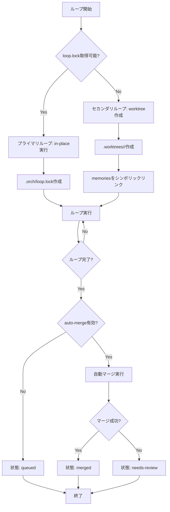

# Multi-Loop Concurrency 詳細設計書

## メタ情報

| 項目 | 内容 |
|------|------|
| ドキュメントID | DETAILED-ORCH-004-F017 |
| バージョン | 1.0.0 |
| ステータス | ドラフト |
| 作成日 | 2026-01-26 |
| 最終更新日 | 2026-01-26 |
| 作成者 | AI Assistant |
| 承認者 | - |
| 関連基本設計書 | BASIC-ORCH-004 v1.0.0 |
| 対象機能 | F-017 |

---

## 1. 概要

### 1.1 目的

git worktreeを使った完全に隔離された並列実行を実現します。これにより、複数のループを同時に実行でき、ファイルシステムの競合を回避します。

### 1.2 スコープ

#### スコープ内

- プライマリループ（in-place実行、`.orch/loop.lock`で排他制御）
- セカンダリループ（worktreeに分離、`.worktrees/<loop-id>/`）
- Memoriesのシンボリックリンク共有
- 自動マージ（AI駆動のコンフリクト解決）
- ループレジストリ（`.orch/loops.json`）
- ループ状態管理（running/queued/merging/merged/needs-review/crashed/orphan/discarded）

#### スコープ外

- Worktreeの自動ガベージコレクション
- マージコンフリクトの自動解決（AI駆動のみ）
- ループの優先度管理

### 1.3 参照ドキュメント

| ドキュメント | パス | 参照箇所 |
|-------------|------|---------|
| 基本設計書 | docs/designs/basic/BASIC-ORCH-004_v1.4.0機能.md | セクション3.6 |
| Git Worktree | https://git-scm.com/docs/git-worktree | 公式ドキュメント |

---

## 2. 処理フロー

### 2.1 全体フロー



### 2.2 シーケンス図

```mermaid
sequenceDiagram
    autonumber
    participant CLI as CLI
    participant Manager as WorktreeManager
    participant Git as git worktree
    participant Loop as LoopEngine
    participant Merger as AutoMerger

    CLI->>Manager: createWorktree(loopId)
    Manager->>Git: git worktree add .worktrees/<loop-id>
    Git-->>Manager: worktree作成完了
    Manager->>Manager: シンボリックリンク作成
    Manager-->>CLI: worktreePath
    
    CLI->>Loop: runLoop(context)
    Loop-->>CLI: 完了
    
    alt auto-merge有効
        CLI->>Merger: autoMerge(loopId)
        Merger->>Git: git merge
        
        alt マージ成功
            Git-->>Merger: 成功
            Merger->>Manager: updateLoopState(merged)
        else マージ失敗
            Git-->>Merger: コンフリクト
            Merger->>Manager: updateLoopState(needs-review)
        end
    end
```

---

## 3. インターフェース定義

### 3.1 WorktreeManager

```typescript
/**
 * Worktree管理クラス
 */
export class WorktreeManager {
  /**
   * コンストラクタ
   * @param baseDir - プロジェクトルートディレクトリ
   */
  constructor(baseDir: string);

  /**
   * Worktreeを作成
   * @param loopId - ループID
   * @returns worktreeパス
   */
  createWorktree(loopId: string): Promise<string>;

  /**
   * Worktreeを削除
   * @param loopId - ループID
   */
  removeWorktree(loopId: string): Promise<void>;

  /**
   * すべてのWorktreeを一覧表示
   * @returns Worktree配列
   */
  listWorktrees(): Promise<Worktree[]>;

  /**
   * Worktreeをマージ
   * @param loopId - ループID
   * @returns マージ成功時はtrue
   */
  mergeWorktree(loopId: string): Promise<boolean>;
}
```

### 3.2 LoopRegistry

```typescript
/**
 * ループレジストリクラス
 */
export class LoopRegistry {
  /**
   * コンストラクタ
   * @param baseDir - プロジェクトルートディレクトリ
   */
  constructor(baseDir: string);

  /**
   * ループを登録
   * @param loop - Loop情報
   */
  registerLoop(loop: Loop): Promise<void>;

  /**
   * ループ状態を更新
   * @param loopId - ループID
   * @param state - 新しい状態
   */
  updateLoopState(loopId: string, state: LoopState): Promise<void>;

  /**
   * すべてのループを取得
   * @returns Loop配列
   */
  listLoops(): Promise<Loop[]>;

  /**
   * ループを削除
   * @param loopId - ループID
   */
  deleteLoop(loopId: string): Promise<void>;
}
```

### 3.3 Loop型

```typescript
/**
 * Loop
 */
export interface Loop {
  /**
   * ループID（orch-20260126-a3f2）
   */
  id: string;

  /**
   * 状態
   */
  state: LoopState;

  /**
   * worktreeパス（プライマリループの場合はnull）
   */
  worktree_path: string | null;

  /**
   * 作成日時
   */
  created_at: string;

  /**
   * 更新日時
   */
  updated_at: string;
}

/**
 * Loop状態
 */
export type LoopState =
  | "running"       // 実行中
  | "queued"        // 完了、マージ待ち
  | "merging"       // マージ中
  | "merged"        // マージ完了
  | "needs-review"  // マージ失敗、手動解決必要
  | "crashed"       // プロセス異常終了
  | "orphan"        // worktree存在、未追跡
  | "discarded";    // ユーザーが明示的に破棄
```

---

## 4. データ構造

### 4.1 ディレクトリ構造

| パス | 説明 |
|------|------|
| `project/` | プロジェクトルート |
| `project/.orch/` | orchestrator-hybrid管理ディレクトリ |
| `project/.orch/loop.lock` | プライマリループロック |
| `project/.orch/loops.json` | ループレジストリ |
| `project/.orch/merge-queue.jsonl` | マージイベントログ |
| `project/.agent/` | エージェント作業ディレクトリ |
| `project/.agent/memories.md` | 全ループで共有されるMemories |
| `project/.worktrees/` | worktree基底ディレクトリ |
| `project/.worktrees/orch-20260126-a3f2/` | セカンダリループのworktree |
| `project/.worktrees/orch-20260126-a3f2/.orch/events.jsonl` | ループ固有イベント |
| `project/.worktrees/orch-20260126-a3f2/.agent/` | ループ固有エージェントディレクトリ |
| `project/.worktrees/orch-20260126-a3f2/.agent/memories.md` | シンボリックリンク（../../.agent/memories.md） |
| `project/.worktrees/orch-20260126-a3f2/.agent/scratchpad.md` | ループ固有スクラッチパッド |
| `project/.worktrees/orch-20260126-a3f2/.agent/tasks.jsonl` | ループ固有タスク |

### 4.2 loops.json形式

```json
{
  "loops": [
    {
      "id": "orch-20260126-a3f2",
      "state": "running",
      "worktree_path": ".worktrees/orch-20260126-a3f2",
      "created_at": "2026-01-26T10:00:00Z",
      "updated_at": "2026-01-26T10:00:00Z"
    },
    {
      "id": "orch-20260126-b7d1",
      "state": "merged",
      "worktree_path": null,
      "created_at": "2026-01-26T09:00:00Z",
      "updated_at": "2026-01-26T09:30:00Z"
    }
  ]
}
```

---

## 5. ループ状態遷移

```mermaid
stateDiagram-v2
    [*] --> running: ループ開始
    running --> queued: 完了（auto-merge無効）
    running --> merging: 完了（auto-merge有効）
    running --> crashed: プロセス異常終了
    
    merging --> merged: マージ成功
    merging --> needs-review: マージ失敗
    
    queued --> merging: 手動マージ開始
    needs-review --> merging: 手動解決後
    
    merged --> [*]
    discarded --> [*]
```

---

## 6. CLI統合

### 6.1 新規コマンド

```bash
# ループ一覧
orch loops

# 特定ループのログ
orch loops logs <loop-id> --follow

# 自動マージをスキップ
orch run --issue 44 --no-auto-merge
```

### 6.2 コマンド詳細

| コマンド | 説明 | オプション |
|---------|------|-----------|
| `orch loops` | ループ一覧を表示 | なし |
| `orch loops logs <loop-id>` | 特定ループのログを表示 | `--follow` |
| `orch run --no-auto-merge` | 自動マージをスキップ | なし |

---

## 7. 自動マージ

### 7.1 マージ戦略

1. **コンフリクトなし**: 自動マージ成功
2. **コンフリクトあり**: AI駆動のコンフリクト解決
3. **解決失敗**: `needs-review`状態に遷移、手動解決を促す

### 7.2 AI駆動のコンフリクト解決

```typescript
// src/core/auto-merger.ts

export class AutoMerger {
  async resolveConflicts(loopId: string): Promise<boolean> {
    // コンフリクトファイルを取得
    const conflicts = await this.getConflictFiles();
    
    // AIにコンフリクト解決を依頼
    const prompt = `
      以下のコンフリクトを解決してください:
      ${conflicts.map((c) => c.content).join("\n\n")}
    `;
    
    const result = await this.executeAI(prompt);
    
    // 解決結果を適用
    for (const conflict of conflicts) {
      await this.applyResolution(conflict, result);
    }
    
    return true;
  }
}
```

---

## 8. エラーハンドリング

### 8.1 エラーケース

| エラーケース | エラーメッセージ | 対処 |
|-------------|----------------|------|
| worktree作成失敗 | `worktreeの作成に失敗しました。プライマリループの完了を待機してください。` | エラーログ出力、プライマリループの完了を待機 |
| 自動マージ失敗 | `自動マージに失敗しました。手動で解決してください。` | `needs-review`状態に遷移、手動解決を促す |
| loop.lock取得失敗 | `プライマリループが実行中です。worktreeに分離します。` | エラーログ出力、worktreeに分離 |

---

## 9. テスト方針

### 9.1 単体テスト

| テストケース | 期待結果 |
|-------------|---------|
| Worktreeを作成 | .worktrees/<loop-id>/が作成される |
| Memoriesをシンボリックリンク | シンボリックリンクが作成される |
| ループ状態を更新 | loops.jsonが更新される |
| 自動マージ成功 | 状態がmergedに遷移 |
| 自動マージ失敗 | 状態がneeds-reviewに遷移 |

### 9.2 統合テスト

| テストケース | 期待結果 |
|-------------|---------|
| 複数ループを並列実行 | ファイルシステムの競合なし |
| プライマリループ完了後、セカンダリループをマージ | マージ成功 |

---

## 10. 実装タスク

| タスクID | タスク内容 | 見積もり |
|---------|-----------|---------|
| TASK-017-1 | WorktreeManagerクラス実装 | 5h |
| TASK-017-2 | LoopRegistryクラス実装 | 3h |
| TASK-017-3 | AutoMergerクラス実装 | 4h |
| TASK-017-4 | CLI `orch loops`コマンド追加 | 2h |
| TASK-017-5 | Loop Engine統合 | 3h |
| TASK-017-6 | 単体テスト作成 | 4h |
| TASK-017-7 | 統合テスト作成 | 3h |

---

## 11. 変更履歴

| バージョン | 日付 | 変更内容 | 変更者 |
|-----------|------|---------|--------|
| 1.0.0 | 2026-01-26 | 初版作成 | AI Assistant |
