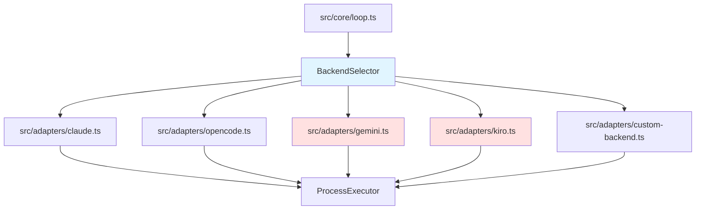

# Per-Hat Backend Configuration バックエンド設計書

## メタ情報

| 項目 | 内容 |
|------|------|
| ドキュメントID | DETAILED-ORCH-004-F018-BE |
| バージョン | 1.0.0 |
| ステータス | ドラフト |
| 作成日 | 2026-01-26 |
| 最終更新日 | 2026-01-26 |
| 作成者 | AI Assistant |
| 承認者 | - |
| 関連詳細設計書 | DETAILED-ORCH-004-F018 |
| 対象機能 | F-018 |

---

## 1. 概要

Per-Hat Backend Configuration機能のバックエンド実装仕様を定義します。

---

## 2. ファイル構成

| ファイル | 説明 | 新規/変更 |
|---------|------|----------|
| `src/core/backend-selector.ts` | BackendSelectorクラス | 新規 |
| `src/core/backend-selector.test.ts` | 単体テスト | 新規 |
| `src/adapters/kiro.ts` | Kiroアダプター（F-019で実装） | 新規 |
| `src/core/types.ts` | HatSchema拡張 | 変更 |
| `src/core/loop.ts` | BackendSelector統合 | 変更 |

---

## 3. クラス詳細設計

### 3.1 BackendSelector

#### ファイル: `src/core/backend-selector.ts`

```typescript
import { Config, Hat, BackendConfig } from "./types.js";
import { BackendAdapter } from "../adapters/base.js";
import { ClaudeAdapter } from "../adapters/claude.js";
import { OpencodeAdapter } from "../adapters/opencode.js";
import { GeminiAdapter } from "../adapters/gemini.js";
import { KiroAdapter } from "../adapters/kiro.js";
import { CustomBackendAdapter } from "../adapters/custom-backend.js";
import { logger } from "./logger.js";

/**
 * Hat毎のバックエンドを選択するクラス
 * 
 * @example
 * ```typescript
 * const selector = new BackendSelector(config);
 * const adapter = selector.selectBackend("builder");
 * await adapter.execute(prompt);
 * ```
 */
export class BackendSelector {
  private readonly config: Config;

  constructor(config: Config) {
    this.config = config;
  }

  /**
   * Hat用のバックエンドアダプターを取得
   * 
   * 解決優先度:
   * 1. hats.<hat>.backend
   * 2. backend.type
   * 
   * @param hatName - Hat名
   * @returns バックエンドアダプター
   */
  selectBackend(hatName: string): BackendAdapter {
    // Hat固有のバックエンド設定を確認
    const hatBackend = this.resolveHatBackend(hatName);
    const backendConfig = hatBackend ?? this.resolveGlobalBackend();

    logger.debug(`Hat '${hatName}' のバックエンド: ${JSON.stringify(backendConfig)}`);

    return this.createAdapter(backendConfig);
  }

  /**
   * Hat固有のバックエンド設定を解決
   * 
   * @param hatName - Hat名
   * @returns バックエンド設定（未定義の場合はundefined）
   */
  private resolveHatBackend(hatName: string): BackendConfig | undefined {
    const hat = this.config.hats?.[hatName];
    if (!hat?.backend) {
      return undefined;
    }

    return hat.backend;
  }

  /**
   * グローバルバックエンド設定を解決
   * 
   * @returns バックエンド設定
   */
  private resolveGlobalBackend(): BackendConfig {
    return this.config.backend?.type ?? "claude";
  }

  /**
   * バックエンド設定からアダプターを作成
   * 
   * @param backendConfig - バックエンド設定
   * @returns バックエンドアダプター
   */
  private createAdapter(backendConfig: BackendConfig): BackendAdapter {
    // Named backend（文字列形式）
    if (typeof backendConfig === "string") {
      return this.createNamedAdapter(backendConfig);
    }

    // Kiro agent形式
    if ("type" in backendConfig && backendConfig.type === "kiro") {
      return new KiroAdapter({
        agent: backendConfig.agent,
      });
    }

    // Custom backend形式
    if ("command" in backendConfig) {
      return new CustomBackendAdapter({
        command: backendConfig.command,
        args: backendConfig.args,
        promptMode: backendConfig.prompt_mode,
        promptFlag: backendConfig.prompt_flag,
      });
    }

    // デフォルト: Claude
    logger.warn(`不正なバックエンド設定: ${JSON.stringify(backendConfig)}。Claudeにフォールバック`);
    return new ClaudeAdapter();
  }

  /**
   * Named backendからアダプターを作成
   * 
   * @param name - バックエンド名
   * @returns バックエンドアダプター
   */
  private createNamedAdapter(name: string): BackendAdapter {
    switch (name) {
      case "claude":
        return new ClaudeAdapter();
      case "opencode":
        return new OpencodeAdapter();
      case "gemini":
        return new GeminiAdapter();
      default:
        logger.warn(`未知のバックエンド '${name}'。Claudeにフォールバック`);
        return new ClaudeAdapter();
    }
  }
}
```

---

## 4. 型定義拡張

### ファイル: `src/core/types.ts`（追加分）

```typescript
/**
 * バックエンド設定（Hat固有またはグローバル）
 */
export type BackendConfig = 
  | string  // Named backend: "claude" | "gemini" | "opencode"
  | {
      type: "kiro";
      agent: string;  // Kiro agent名
    }
  | {
      command: string;
      args?: string[];
      prompt_mode?: "arg" | "stdin";
      prompt_flag?: string;
    };

/**
 * Hat定義のzodスキーマ（拡張）
 */
export const HatSchema = z.object({
  name: z.string().optional(),
  triggers: z.array(z.string()),
  publishes: z.array(z.string()),
  instructions: z.string().optional(),

  // 新規: Hat固有のバックエンド設定
  backend: z.union([
    z.string(),  // Named backend
    z.object({
      type: z.literal("kiro"),
      agent: z.string(),
    }),
    z.object({
      command: z.string(),
      args: z.array(z.string()).optional(),
      prompt_mode: z.enum(["arg", "stdin"]).optional(),
      prompt_flag: z.string().optional(),
    }),
  ]).optional(),
});

export type Hat = z.infer<typeof HatSchema>;
```

---

## 5. Loop Engine統合

### ファイル: `src/core/loop.ts`（変更分）

```typescript
import { BackendSelector } from "./backend-selector.js";

export async function runLoop(context: LoopContext): Promise<LoopResult> {
  const selector = new BackendSelector(config);

  // ... 既存処理

  // Hat実行時
  for (const hatName of hatSequence) {
    const hat = config.hats[hatName];
    
    // Hat固有のバックエンドを選択
    const adapter = selector.selectBackend(hatName);

    // Hat実行
    const result = await adapter.execute(prompt);

    // ... 既存処理
  }

  return result;
}
```

---

## 6. アダプター実装

### 6.1 GeminiAdapter（新規）

#### ファイル: `src/adapters/gemini.ts`

```typescript
import { BackendAdapter } from "./base.js";
import { ProcessExecutor, BunProcessExecutor } from "../core/process-executor.js";
import { logger } from "../core/logger.js";

/**
 * Gemini CLIアダプター
 * 
 * @example
 * ```typescript
 * const adapter = new GeminiAdapter();
 * const result = await adapter.execute("Write a function");
 * ```
 */
export class GeminiAdapter implements BackendAdapter {
  private readonly executor: ProcessExecutor;

  constructor(executor: ProcessExecutor = new BunProcessExecutor()) {
    this.executor = executor;
  }

  async execute(prompt: string): Promise<string> {
    logger.info("Geminiバックエンドで実行中...");

    const result = await this.executor.spawn("gemini", [prompt]);

    if (result.exitCode !== 0) {
      throw new Error(`Gemini実行失敗: ${result.stderr}`);
    }

    return result.stdout;
  }
}
```

### 6.2 KiroAdapter（F-019で実装）

#### ファイル: `src/adapters/kiro.ts`

```typescript
import { BackendAdapter } from "./base.js";
import { ProcessExecutor, BunProcessExecutor } from "../core/process-executor.js";
import { logger } from "../core/logger.js";

export interface KiroAdapterConfig {
  agent: string;
}

/**
 * Kiro CLIアダプター
 * 
 * @example
 * ```typescript
 * const adapter = new KiroAdapter({ agent: "researcher" });
 * const result = await adapter.execute("Research topic X");
 * ```
 */
export class KiroAdapter implements BackendAdapter {
  private readonly config: KiroAdapterConfig;
  private readonly executor: ProcessExecutor;

  constructor(
    config: KiroAdapterConfig,
    executor: ProcessExecutor = new BunProcessExecutor()
  ) {
    this.config = config;
    this.executor = executor;
  }

  async execute(prompt: string): Promise<string> {
    logger.info(`Kiro agent '${this.config.agent}' で実行中...`);

    const result = await this.executor.spawn("kiro-cli", [
      "--agent",
      this.config.agent,
      prompt,
    ]);

    if (result.exitCode !== 0) {
      throw new Error(`Kiro実行失敗: ${result.stderr}`);
    }

    return result.stdout;
  }
}
```

---

## 7. テスト設計

### ファイル: `src/core/backend-selector.test.ts`

```typescript
import { describe, it, expect, beforeEach } from "bun:test";
import { BackendSelector } from "./backend-selector.js";
import { Config } from "./types.js";
import { ClaudeAdapter } from "../adapters/claude.js";
import { GeminiAdapter } from "../adapters/gemini.js";
import { KiroAdapter } from "../adapters/kiro.js";

describe("BackendSelector", () => {
  let config: Config;

  beforeEach(() => {
    config = {
      version: "1.0",
      backend: {
        type: "claude",
      },
      hats: {
        builder: {
          triggers: ["task.start"],
          publishes: ["build.done"],
          backend: "claude",
        },
        researcher: {
          triggers: ["research.needed"],
          publishes: ["research.done"],
          backend: {
            type: "kiro",
            agent: "researcher",
          },
        },
        reviewer: {
          triggers: ["build.done"],
          publishes: ["review.done"],
          backend: "gemini",
        },
      },
    };
  });

  describe("selectBackend", () => {
    it("Named backend（claude）を返す", () => {
      const selector = new BackendSelector(config);
      const adapter = selector.selectBackend("builder");

      expect(adapter).toBeInstanceOf(ClaudeAdapter);
    });

    it("Named backend（gemini）を返す", () => {
      const selector = new BackendSelector(config);
      const adapter = selector.selectBackend("reviewer");

      expect(adapter).toBeInstanceOf(GeminiAdapter);
    });

    it("Kiro agent形式を返す", () => {
      const selector = new BackendSelector(config);
      const adapter = selector.selectBackend("researcher");

      expect(adapter).toBeInstanceOf(KiroAdapter);
    });

    it("Hat未定義時はグローバルバックエンドを使用", () => {
      const selector = new BackendSelector(config);
      const adapter = selector.selectBackend("unknown_hat");

      expect(adapter).toBeInstanceOf(ClaudeAdapter);
    });

    it("Hat固有のバックエンドがグローバルより優先される", () => {
      config.backend.type = "opencode";
      config.hats.builder.backend = "gemini";

      const selector = new BackendSelector(config);
      const adapter = selector.selectBackend("builder");

      expect(adapter).toBeInstanceOf(GeminiAdapter);
    });
  });
});
```

---

## 8. 依存関係



---

## 9. 実装手順

1. `src/core/types.ts` に `BackendConfig` 型定義を追加
2. `src/core/types.ts` の `HatSchema` に `backend` フィールドを追加
3. `src/adapters/gemini.ts` を新規作成
4. `src/adapters/kiro.ts` を新規作成（F-019で実装）
5. `src/core/backend-selector.ts` を新規作成
6. `src/core/backend-selector.test.ts` を新規作成
7. テスト実行・パス確認
8. `src/core/loop.ts` に BackendSelector 統合

---

## 10. 変更履歴

| バージョン | 日付 | 変更内容 | 変更者 |
|-----------|------|---------|--------|
| 1.0.0 | 2026-01-26 | 初版作成 | AI Assistant |
