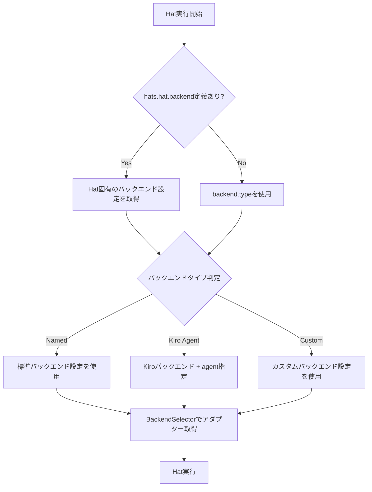
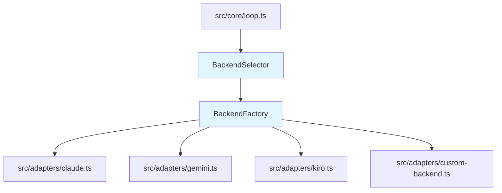

# Per-Hat Backend Configuration 詳細設計書

## メタ情報

| 項目 | 内容 |
|------|------|
| ドキュメントID | DETAILED-ORCH-004-F018 |
| バージョン | 1.0.0 |
| ステータス | ドラフト |
| 作成日 | 2026-01-26 |
| 最終更新日 | 2026-01-26 |
| 作成者 | AI Assistant |
| 承認者 | - |
| 関連基本設計書 | BASIC-ORCH-004 v1.0.0 |
| 対象機能 | F-018 |

---

## 1. 概要

### 1.1 目的

Hat毎に異なるバックエンド（Claude/Gemini/Kiro/カスタム）を指定可能にすることで、タスクの特性に応じた最適なAIエージェントを使い分けられるようにします。

### 1.2 スコープ

#### スコープ内

- Hat毎のバックエンド指定（`hats.<hat>.backend`）
- Named backend（文字列形式）のサポート
- Kiro agent形式のサポート
- バックエンド解決優先度の実装
- 既存バックエンドアダプターの拡張

#### スコープ外

- バックエンドの自動選択
- バックエンド間の自動フォールバック
- バックエンドの動的切り替え

### 1.3 参照ドキュメント

| ドキュメント | パス | 参照箇所 |
|-------------|------|---------|
| 基本設計書 | docs/designs/basic/BASIC-ORCH-004_v1.4.0機能.md | セクション3.7 |
| 既存バックエンド実装 | src/adapters/base.ts | 参考実装 |

---

## 2. 処理フロー

### 2.1 全体フロー



### 2.2 シーケンス図

```mermaid
sequenceDiagram
    autonumber
    participant Loop as LoopEngine
    participant Selector as BackendSelector
    participant Factory as BackendFactory
    participant Adapter as BackendAdapter

    Loop->>Selector: selectBackend(hat, config)
    
    alt Hat固有のバックエンド定義あり
        Selector->>Selector: resolveHatBackend(hat)
    else グローバルバックエンド
        Selector->>Selector: resolveGlobalBackend()
    end
    
    Selector->>Factory: createAdapter(backendConfig)
    
    alt Named backend
        Factory->>Adapter: new ClaudeAdapter()
    else Kiro agent
        Factory->>Adapter: new KiroAdapter(agent)
    else Custom
        Factory->>Adapter: new CustomBackendAdapter()
    end
    
    Factory-->>Selector: adapter
    Selector-->>Loop: adapter
    Loop->>Adapter: execute(prompt)
```

---

## 3. インターフェース定義

### 3.1 BackendConfig

```typescript
/**
 * バックエンド設定（Hat固有またはグローバル）
 */
export type BackendConfig = 
  | string  // Named backend: "claude" | "gemini" | "opencode"
  | {
      type: "kiro";
      agent: string;  // Kiro agent名
    }
  | {
      command: string;
      args?: string[];
      prompt_mode?: "arg" | "stdin";
      prompt_flag?: string;
    };
```

### 3.2 BackendSelector

```typescript
/**
 * Hat毎のバックエンドを選択するクラス
 */
export class BackendSelector {
  /**
   * コンストラクタ
   * @param config - 全体設定
   */
  constructor(config: Config);

  /**
   * Hat用のバックエンドアダプターを取得
   * 
   * @param hatName - Hat名
   * @returns バックエンドアダプター
   */
  selectBackend(hatName: string): BackendAdapter;

  /**
   * Hat固有のバックエンド設定を解決
   * 
   * @param hatName - Hat名
   * @returns バックエンド設定（未定義の場合はundefined）
   */
  private resolveHatBackend(hatName: string): BackendConfig | undefined;

  /**
   * グローバルバックエンド設定を解決
   * 
   * @returns バックエンド設定
   */
  private resolveGlobalBackend(): BackendConfig;
}
```

---

## 4. 設定ファイル拡張

### 4.1 orch.yml

```yaml
# グローバルバックエンド設定
backend:
  type: claude  # デフォルトバックエンド

# Hat定義
hats:
  builder:
    backend: claude  # Named backend
    triggers: ["task.start"]
    publishes: ["build.done"]

  researcher:
    backend:
      type: kiro
      agent: researcher  # Kiro agent形式
    triggers: ["research.needed"]
    publishes: ["research.done"]

  reviewer:
    backend: gemini  # 異なるバックエンドで新鮮な視点
    triggers: ["build.done"]
    publishes: ["review.done"]
```

### 4.2 HatSchema拡張（zod）

```typescript
export const HatSchema = z.object({
  name: z.string().optional(),
  triggers: z.array(z.string()),
  publishes: z.array(z.string()),
  instructions: z.string().optional(),

  // 新規: Hat固有のバックエンド設定
  backend: z.union([
    z.string(),  // Named backend
    z.object({
      type: z.literal("kiro"),
      agent: z.string(),
    }),
    z.object({
      command: z.string(),
      args: z.array(z.string()).optional(),
      prompt_mode: z.enum(["arg", "stdin"]).optional(),
      prompt_flag: z.string().optional(),
    }),
  ]).optional(),
});

export type Hat = z.infer<typeof HatSchema>;
```

---

## 5. エラーハンドリング

### 5.1 エラーケース

| エラーケース | エラーメッセージ | 対処 |
|-------------|----------------|------|
| バックエンドが利用不可 | `バックエンド '${backend}' が利用できません` | デフォルトバックエンドにフォールバック |
| バックエンド設定が不正 | `Hat '${hat}' のバックエンド設定が不正です` | グローバルバックエンドにフォールバック |
| Kiro agentが存在しない | `Kiro agent '${agent}' が見つかりません` | エラーログ出力、実行を中断 |

---

## 6. 依存関係

### 6.1 関連するビジネスルール

- BR-059: バックエンド解決優先度は `hats.<hat>.backend` → `backend.type`
- BR-060: Kiro agentは`{ type: "kiro", agent: "<name>" }`形式で指定
- BR-061: カスタムバックエンドは`{ command: "...", args: [...] }`形式で指定

### 6.2 依存モジュール



---

## 7. テスト方針

### 7.1 単体テスト

| テストケース | 期待結果 |
|-------------|---------|
| Named backend指定 | 対応するアダプターが返される |
| Kiro agent形式 | KiroAdapterが返される |
| Hat固有のバックエンド優先 | Hat固有の設定が使用される |
| グローバルバックエンドフォールバック | Hat未定義時はグローバル設定が使用される |
| 不正なバックエンド設定 | エラーログ出力、フォールバック |

### 7.2 統合テスト

| テストケース | 期待結果 |
|-------------|---------|
| 複数Hatで異なるバックエンド | 各Hatが指定されたバックエンドで実行される |
| Kiro agentでのHat実行 | Kiroバックエンドが正しく呼び出される |

---

## 8. 実装チェックリスト

- [ ] `src/core/backend-selector.ts` 作成
  - [ ] BackendSelectorクラス実装
  - [ ] selectBackend()メソッド実装
  - [ ] resolveHatBackend()メソッド実装
  - [ ] resolveGlobalBackend()メソッド実装
- [ ] `src/adapters/kiro.ts` 作成（F-019で実装）
- [ ] `src/core/types.ts` 拡張
  - [ ] HatSchemaにbackendフィールド追加
  - [ ] BackendConfig型定義追加
- [ ] `src/core/loop.ts` 統合
  - [ ] BackendSelector呼び出し追加
- [ ] テスト作成
  - [ ] `src/core/backend-selector.test.ts`

---

## 9. 変更履歴

| バージョン | 日付 | 変更内容 | 変更者 |
|-----------|------|---------|--------|
| 1.0.0 | 2026-01-26 | 初版作成 | AI Assistant |

---

## 10. 承認

| 役割 | 氏名 | 承認日 | 署名 |
|------|------|--------|------|
| 作成者 | AI Assistant | 2026-01-26 | - |
| レビュアー | - | - | - |
| 承認者 | - | - | - |
