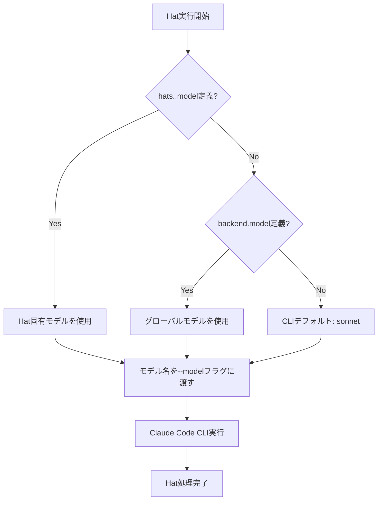

# Per-Hat Model Selection 詳細設計書

## メタ情報

| 項目 | 内容 |
|------|------|
| ドキュメントID | DETAILED-ORCH-004-F013 |
| バージョン | 1.0.0 |
| ステータス | ドラフト |
| 作成日 | 2026-01-26 |
| 最終更新日 | 2026-01-26 |
| 作成者 | AI Assistant |
| 承認者 | - |
| 関連基本設計書 | BASIC-ORCH-004 v1.0.0 |
| 対象機能 | F-013 |

---

## 1. 概要

### 1.1 目的

Hat毎に異なるAIモデル（opus/sonnet/haiku）を指定可能にし、コスト最適化とタスク特化を実現します。

### 1.2 スコープ

#### スコープ内

- Hat毎のモデル指定（`hats.<hat>.model`）
- グローバルデフォルトモデル（`backend.model`）
- モデル解決優先度（Hat固有 → グローバル → CLIデフォルト）
- Claude Code CLIのモデルエイリアス対応（opus/sonnet/haiku）
- フルモデル名対応（claude-sonnet-4-5-20250929）

#### スコープ外

- モデルの自動選択（コスト/性能に基づく）
- モデル使用量の追跡
- モデル切り替えの動的最適化

### 1.3 参照ドキュメント

| ドキュメント | パス | 参照箇所 |
|-------------|------|---------|
| 基本設計書 | docs/designs/basic/BASIC-ORCH-004_v1.4.0機能.md | セクション3.2 |
| 既存Hat実装 | src/core/hat.ts | 参考実装 |

---

## 2. 処理フロー

### 2.1 全体フロー



### 2.2 シーケンス図

```mermaid
sequenceDiagram
    autonumber
    participant Loop as LoopEngine
    participant Selector as ModelSelector
    participant Hat as HatExecutor
    participant CLI as Claude Code CLI

    Loop->>Selector: resolveModel(hatName)
    
    alt Hat固有モデル定義あり
        Selector->>Selector: hats.<hat>.model を取得
        Selector-->>Loop: "opus"
    else グローバルモデル定義あり
        Selector->>Selector: backend.model を取得
        Selector-->>Loop: "sonnet"
    else デフォルト
        Selector-->>Loop: "sonnet"
    end
    
    Loop->>Hat: execute(model="opus")
    Hat->>CLI: claude --model opus ...
    CLI-->>Hat: 実行結果
    Hat-->>Loop: 完了
```

---

## 3. インターフェース定義

### 3.1 ModelSelector

モデル解決ロジックを担当するクラス。

```typescript
/**
 * Hat毎のモデル選択を解決するクラス
 */
export class ModelSelector {
  /**
   * コンストラクタ
   * @param config - orchestrator設定
   */
  constructor(config: Config);

  /**
   * 指定されたHatのモデルを解決
   * 
   * 優先順位:
   * 1. hats.<hat>.model
   * 2. backend.model
   * 3. デフォルト（sonnet）
   * 
   * @param hatName - Hat名
   * @returns モデル名（opus/sonnet/haiku またはフルモデル名）
   */
  resolveModel(hatName: string): string;
}
```

### 3.2 HatConfig拡張

```typescript
/**
 * Hat設定（v1.4.0拡張）
 */
export interface HatConfig {
  name: string;
  triggers: string[];
  publishes: string[];
  instructions: string;
  
  // v1.4.0追加
  /**
   * このHat専用のモデル
   * 未指定の場合は backend.model を継承
   */
  model?: string;
}
```

---

## 4. 設定ファイル拡張

### 4.1 orch.yml

```yaml
# バックエンド設定
backend:
  type: claude
  model: sonnet  # グローバルデフォルト

# Hat定義
hats:
  planner:
    name: "📋 Planner"
    model: opus  # 計画フェーズは高性能モデル
    triggers: ["task.start"]
    publishes: ["plan.ready"]
    instructions: |
      タスクの計画を立てる
  
  implementer:
    name: "🔨 Implementer"
    # model省略 → backend.model (sonnet) を継承
    triggers: ["plan.ready"]
    publishes: ["code.written"]
    instructions: |
      計画に基づいて実装する
  
  reviewer:
    name: "🔍 Reviewer"
    model: haiku  # レビューは軽量モデルで高速化
    triggers: ["code.written"]
    publishes: ["review.approved", "LOOP_COMPLETE"]
    instructions: |
      実装をレビューする
```

### 4.2 HatConfigSchema（zod）

```typescript
export const HatConfigSchema = z.object({
  name: z.string(),
  triggers: z.array(z.string()),
  publishes: z.array(z.string()),
  instructions: z.string(),
  
  // v1.4.0追加
  model: z.string().optional(),
});

export type HatConfig = z.infer<typeof HatConfigSchema>;
```

---

## 5. エラーハンドリング

### 5.1 エラーケース

| エラーケース | エラーメッセージ | 対処 |
|-------------|----------------|------|
| モデル名が不正 | `不正なモデル名: ${model}。デフォルト（sonnet）を使用します。` | デフォルトモデルにフォールバック |
| Claude CLIが利用不可 | `Claude Code CLIが見つかりません。インストールしてください。` | 実行を中断 |

### 5.2 エラーハンドリング方針

- モデル名が不正な場合: 警告ログを出力し、デフォルトモデル（sonnet）にフォールバック
- Claude CLIが利用不可の場合: エラーログを出力し、実行を中断

---

## 6. CLI統合

### 6.1 新規オプション

```bash
# Hat固有のモデルを上書き
orch run --issue 42 --model opus
```

| オプション | 説明 |
|-----------|------|
| `--model <model>` | すべてのHatで使用するモデルを上書き |

### 6.2 設定ファイルとの優先順位

1. CLIオプション（`--model`）
2. Hat固有設定（`hats.<hat>.model`）
3. グローバル設定（`backend.model`）
4. デフォルト値（`sonnet`）

---

## 7. Loop Engine統合

### 7.1 統合ポイント

```typescript
// src/core/loop.ts

export async function runLoop(context: LoopContext): Promise<LoopResult> {
  const modelSelector = new ModelSelector(context.config);
  
  // Hat実行時にモデルを解決
  for (const hat of hats) {
    const model = context.overrideModel ?? modelSelector.resolveModel(hat.name);
    
    logger.info(`Hat: ${hat.name}, Model: ${model}`);
    
    const result = await executeHat(hat, model, context);
    // ...
  }
  
  return result;
}
```

---

## 8. テスト方針

### 8.1 単体テスト

| テストケース | 期待結果 |
|-------------|---------|
| Hat固有モデル定義あり | Hat固有モデルを返す |
| Hat固有モデル未定義、グローバルモデルあり | グローバルモデルを返す |
| すべて未定義 | デフォルト（sonnet）を返す |
| 不正なモデル名 | 警告ログ、デフォルトにフォールバック |

### 8.2 統合テスト

| テストケース | 期待結果 |
|-------------|---------|
| `--model opus`フラグ | すべてのHatでopusを使用 |
| 設定ファイルのみ | 設定値が適用される |

---

## 9. 実装タスク

| タスクID | タスク内容 | 見積もり |
|---------|-----------|---------|
| TASK-013-1 | ModelSelectorクラス実装 | 2h |
| TASK-013-2 | HatConfigSchema拡張 | 1h |
| TASK-013-3 | Loop Engine統合 | 2h |
| TASK-013-4 | CLI `--model`オプション追加 | 1h |
| TASK-013-5 | 単体テスト作成 | 2h |
| TASK-013-6 | 統合テスト作成 | 2h |

---

## 10. 変更履歴

| バージョン | 日付 | 変更内容 | 変更者 |
|-----------|------|---------|--------|
| 1.0.0 | 2026-01-26 | 初版作成 | AI Assistant |
