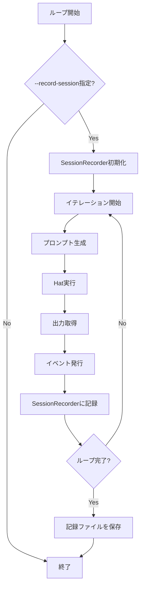

# Session Recording 詳細設計書

## メタ情報

| 項目 | 内容 |
|------|------|
| ドキュメントID | DETAILED-ORCH-004-F016 |
| バージョン | 1.0.0 |
| ステータス | ドラフト |
| 作成日 | 2026-01-26 |
| 最終更新日 | 2026-01-26 |
| 作成者 | AI Assistant |
| 承認者 | - |
| 関連基本設計書 | BASIC-ORCH-004 v1.0.0 |
| 対象機能 | F-016 |

---

## 1. 概要

### 1.1 目的

セッションをJSONL形式で記録し、デバッグやテストに活用します。リプレイ時はAPIコールせずに記録された出力を使用することで、Smoke testを実現します。

### 1.2 スコープ

#### スコープ内

- セッション記録（`--record-session <FILE>`）
- JSONL形式での記録（各イテレーション毎に1行）
- リプレイ機能（`orch replay <FILE>`）
- Smoke test用フィクスチャ

#### スコープ外

- セッションの自動要約
- セッションの自動分類
- セッションのバージョン管理

### 1.3 参照ドキュメント

| ドキュメント | パス | 参照箇所 |
|-------------|------|---------|
| 基本設計書 | docs/designs/basic/BASIC-ORCH-004_v1.4.0機能.md | セクション3.5 |
| イベントバス実装 | src/core/event.ts | 参考実装 |

---

## 2. 処理フロー

### 2.1 全体フロー（記録）



### 2.2 シーケンス図（記録）

```mermaid
sequenceDiagram
    autonumber
    participant Loop as LoopEngine
    participant Recorder as SessionRecorder
    participant File as session.jsonl
    participant Hat as HatExecutor

    Loop->>Recorder: startRecording(filePath)
    Recorder->>File: ファイル作成
    
    loop 各イテレーション
        Loop->>Hat: 実行
        Hat-->>Loop: 出力
        Loop->>Recorder: recordIteration(iteration, hat, prompt, output, events)
        Recorder->>File: JSONL追記
    end
    
    Loop->>Recorder: stopRecording()
    Recorder-->>Loop: 完了
```

### 2.3 シーケンス図（リプレイ）

```mermaid
sequenceDiagram
    autonumber
    participant CLI as CLI
    participant Replayer as SessionReplayer
    participant File as session.jsonl
    participant Loop as LoopEngine

    CLI->>Replayer: replay(filePath)
    Replayer->>File: 読み込み
    File-->>Replayer: JSONL内容
    
    loop 各イテレーション
        Replayer->>Loop: 記録された出力を使用
        Loop-->>Replayer: 完了
    end
    
    Replayer-->>CLI: リプレイ完了
```

---

## 3. インターフェース定義

### 3.1 SessionRecorder

```typescript
/**
 * Session記録クラス
 */
export class SessionRecorder {
  /**
   * コンストラクタ
   * @param filePath - 記録ファイルパス
   */
  constructor(filePath: string);

  /**
   * 記録を開始
   */
  startRecording(): Promise<void>;

  /**
   * イテレーションを記録
   * @param iteration - イテレーション番号
   * @param hat - Hat名
   * @param prompt - プロンプト
   * @param output - 出力
   * @param events - 発行されたイベント
   */
  recordIteration(
    iteration: number,
    hat: string,
    prompt: string,
    output: string,
    events: string[]
  ): Promise<void>;

  /**
   * 記録を停止
   */
  stopRecording(): Promise<void>;
}
```

### 3.2 SessionReplayer

```typescript
/**
 * Sessionリプレイクラス
 */
export class SessionReplayer {
  /**
   * コンストラクタ
   * @param filePath - 記録ファイルパス
   */
  constructor(filePath: string);

  /**
   * セッションをリプレイ
   * @returns リプレイ結果
   */
  replay(): Promise<ReplayResult>;
}
```

### 3.3 SessionRecord型

```typescript
/**
 * Session記録
 */
export interface SessionRecord {
  /**
   * イテレーション番号
   */
  iteration: number;

  /**
   * Hat名
   */
  hat: string;

  /**
   * プロンプト
   */
  prompt: string;

  /**
   * 出力
   */
  output: string;

  /**
   * 発行されたイベント
   */
  events: string[];

  /**
   * タイムスタンプ
   */
  timestamp: string;
}
```

---

## 4. データ構造

### 4.1 session.jsonl形式

```jsonl
{"iteration": 1, "hat": "planner", "prompt": "...", "output": "...", "events": ["plan.ready"], "timestamp": "2026-01-26T10:00:00Z"}
{"iteration": 2, "hat": "implementer", "prompt": "...", "output": "...", "events": ["code.written"], "timestamp": "2026-01-26T10:05:00Z"}
{"iteration": 3, "hat": "reviewer", "prompt": "...", "output": "...", "events": ["review.approved", "LOOP_COMPLETE"], "timestamp": "2026-01-26T10:10:00Z"}
```

### 4.2 JSONL形式の利点

- 追記型のログ形式
- 各行が独立したJSONオブジェクト
- ストリーミング処理が可能

---

## 5. CLI統合

### 5.1 新規オプション

```bash
# セッション記録
orch run --issue 42 --record-session session.jsonl

# リプレイ
orch replay session.jsonl
```

| オプション | 説明 |
|-----------|------|
| `--record-session <FILE>` | セッションを記録 |

### 5.2 新規コマンド

| コマンド | 説明 |
|---------|------|
| `orch replay <FILE>` | セッションをリプレイ |

---

## 6. リプレイ機能

### 6.1 リプレイ時の動作

- APIコールせずに記録された出力を使用
- イベントも記録された通りに発行
- Smoke testとして使用可能

### 6.2 リプレイ検証

```typescript
// src/core/session-replayer.ts

export class SessionReplayer {
  async replay(): Promise<ReplayResult> {
    const records = await this.loadRecords();
    
    for (const record of records) {
      logger.info(`Replaying iteration ${record.iteration}: ${record.hat}`);
      
      // 記録された出力を使用（APIコールなし）
      const output = record.output;
      
      // イベントを発行
      for (const event of record.events) {
        await eventBus.emit(event, {});
      }
      
      // 検証（オプション）
      // - 出力が期待通りか
      // - イベントが期待通りか
    }
    
    return { success: true };
  }
}
```

---

## 7. Smoke Test統合

### 7.1 テストフィクスチャ

記録されたセッションをテストフィクスチャとして使用:

```typescript
// tests/smoke/session-replay.test.ts

import { SessionReplayer } from "../../src/core/session-replayer.js";

describe("Session Replay Smoke Test", () => {
  test("recorded session replays successfully", async () => {
    const replayer = new SessionReplayer("fixtures/session-001.jsonl");
    const result = await replayer.replay();
    
    expect(result.success).toBe(true);
  });
});
```

---

## 8. エラーハンドリング

### 8.1 エラーケース

| エラーケース | エラーメッセージ | 対処 |
|-------------|----------------|------|
| 記録ファイルへの書き込み失敗 | `セッション記録の書き込みに失敗しました。記録をスキップして実行継続します。` | エラーログ出力、記録をスキップして実行継続 |
| 記録ファイルのサイズが上限超過 | `セッション記録のサイズが上限（100MB）を超えました。記録を停止します。` | 警告ログ出力、記録を停止 |
| リプレイファイルが存在しない | `セッション記録ファイルが見つかりません: ${filePath}` | エラーログ出力、実行を中断 |

---

## 9. テスト方針

### 9.1 単体テスト

| テストケース | 期待結果 |
|-------------|---------|
| セッションを記録 | session.jsonlに追記される |
| セッションをリプレイ | 記録された出力が使用される |
| リプレイ時にAPIコールしない | APIコールが発生しない |

### 9.2 統合テスト

| テストケース | 期待結果 |
|-------------|---------|
| 記録したセッションをリプレイ | 同じ結果が得られる |
| Smoke test | フィクスチャが正常にリプレイされる |

---

## 10. 実装タスク

| タスクID | タスク内容 | 見積もり |
|---------|-----------|---------|
| TASK-016-1 | SessionRecorderクラス実装 | 3h |
| TASK-016-2 | SessionReplayerクラス実装 | 3h |
| TASK-016-3 | CLI `--record-session`オプション追加 | 1h |
| TASK-016-4 | CLI `orch replay`コマンド追加 | 2h |
| TASK-016-5 | Loop Engine統合 | 2h |
| TASK-016-6 | 単体テスト作成 | 2h |
| TASK-016-7 | Smoke test作成 | 2h |

---

## 11. 変更履歴

| バージョン | 日付 | 変更内容 | 変更者 |
|-----------|------|---------|--------|
| 1.0.0 | 2026-01-26 | 初版作成 | AI Assistant |
