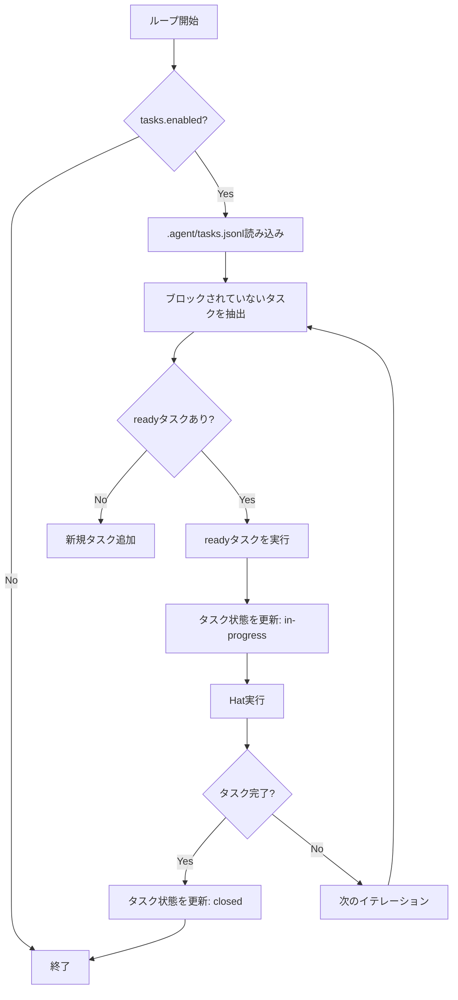

# Tasks System 詳細設計書

## メタ情報

| 項目 | 内容 |
|------|------|
| ドキュメントID | DETAILED-ORCH-004-F015 |
| バージョン | 1.0.0 |
| ステータス | ドラフト |
| 作成日 | 2026-01-26 |
| 最終更新日 | 2026-01-26 |
| 作成者 | AI Assistant |
| 承認者 | - |
| 関連基本設計書 | BASIC-ORCH-004 v1.0.0 |
| 対象機能 | F-015 |

---

## 1. 概要

### 1.1 目的

タスクをJSONL形式で`.agent/tasks.jsonl`に管理し、依存関係を追跡します。これにより、ループ完了検証とタスク管理を実現します。

### 1.2 スコープ

#### スコープ内

- `.agent/tasks.jsonl`へのタスク追記
- タスクの依存関係追跡（`blocked_by`）
- タスク状態管理（open/in-progress/closed）
- ブロックされていないタスクの抽出（`ready`）
- CLIコマンド（`orch tools task`）

#### スコープ外

- タスクの自動優先度調整
- タスクの自動分類
- タスクのバージョン管理

### 1.3 参照ドキュメント

| ドキュメント | パス | 参照箇所 |
|-------------|------|---------|
| 基本設計書 | docs/designs/basic/BASIC-ORCH-004_v1.4.0機能.md | セクション3.4 |
| イベントバス実装 | src/core/event.ts | 参考実装 |

---

## 2. 処理フロー

### 2.1 全体フロー



### 2.2 シーケンス図

```mermaid
sequenceDiagram
    autonumber
    participant Loop as LoopEngine
    participant Manager as TaskManager
    participant File as .agent/tasks.jsonl
    participant Hat as HatExecutor

    Loop->>Manager: loadTasks()
    Manager->>File: 読み込み
    File-->>Manager: JSONL内容
    Manager-->>Loop: Task[]
    
    Loop->>Manager: getReadyTasks()
    Manager-->>Loop: ブロックされていないTask[]
    
    Loop->>Manager: updateStatus(taskId, "in-progress")
    Manager->>File: 追記
    
    Loop->>Hat: 実行
    Hat-->>Loop: 完了
    
    Loop->>Manager: updateStatus(taskId, "closed")
    Manager->>File: 追記
```

---

## 3. インターフェース定義

### 3.1 TaskManager

```typescript
/**
 * Task管理クラス
 */
export class TaskManager {
  /**
   * コンストラクタ
   * @param config - Tasks設定
   * @param baseDir - .agentディレクトリのパス
   */
  constructor(config: TasksConfig, baseDir: string);

  /**
   * Tasksを読み込み
   * @returns Task配列
   */
  loadTasks(): Promise<Task[]>;

  /**
   * Taskを追加
   * @param title - タスクタイトル
   * @param priority - 優先度（1-5）
   * @param blockedBy - 依存タスクID配列
   */
  addTask(title: string, priority: number, blockedBy?: string[]): Promise<string>;

  /**
   * ブロックされていないTaskを取得
   * @returns ready状態のTask配列
   */
  getReadyTasks(): Promise<Task[]>;

  /**
   * Task状態を更新
   * @param taskId - タスクID
   * @param status - 新しい状態
   */
  updateStatus(taskId: string, status: TaskStatus): Promise<void>;

  /**
   * すべてのTasksを取得（一覧表示用）
   * @returns Task配列
   */
  listTasks(): Promise<Task[]>;

  /**
   * Taskを削除
   * @param taskId - タスクID
   */
  deleteTask(taskId: string): Promise<void>;
}
```

### 3.2 Task型

```typescript
/**
 * Task
 */
export interface Task {
  /**
   * タスクID（自動生成: task-001, task-002...）
   */
  id: string;

  /**
   * タスクタイトル
   */
  title: string;

  /**
   * 優先度（1-5、1が最高）
   */
  priority: number;

  /**
   * 状態
   */
  status: TaskStatus;

  /**
   * 依存タスクID配列
   */
  blocked_by: string[];

  /**
   * 作成日時
   */
  created_at: string;

  /**
   * 更新日時
   */
  updated_at: string;
}

/**
 * Task状態
 */
export type TaskStatus = "open" | "in-progress" | "closed";
```

---

## 4. データ構造

### 4.1 tasks.jsonl形式

```jsonl
{"id": "task-001", "title": "Add auth", "priority": 2, "status": "open", "blocked_by": [], "created_at": "2026-01-26T10:00:00Z", "updated_at": "2026-01-26T10:00:00Z"}
{"id": "task-002", "title": "Add tests", "priority": 3, "status": "open", "blocked_by": ["task-001"], "created_at": "2026-01-26T10:05:00Z", "updated_at": "2026-01-26T10:05:00Z"}
{"id": "task-001", "title": "Add auth", "priority": 2, "status": "in-progress", "blocked_by": [], "created_at": "2026-01-26T10:00:00Z", "updated_at": "2026-01-26T10:10:00Z"}
{"id": "task-001", "title": "Add auth", "priority": 2, "status": "closed", "blocked_by": [], "created_at": "2026-01-26T10:00:00Z", "updated_at": "2026-01-26T10:30:00Z"}
```

### 4.2 JSONL形式の利点

- 追記型のログ形式
- 各行が独立したJSONオブジェクト
- 状態更新は新しい行を追記
- 最新の状態は同じIDの最後の行

---

## 5. 設定ファイル拡張

### 5.1 orch.yml

```yaml
# Tasks設定（新規 v1.4.0）
tasks:
  enabled: true
```

### 5.2 TasksConfigSchema（zod）

```typescript
export const TasksConfigSchema = z.object({
  /**
   * Tasksを有効にするか
   */
  enabled: z.boolean().default(true),
});

export type TasksConfig = z.infer<typeof TasksConfigSchema>;
```

---

## 6. 依存関係の解決

### 6.1 ブロック判定

タスクがブロックされているかを判定:

```typescript
function isBlocked(task: Task, allTasks: Task[]): boolean {
  if (task.blocked_by.length === 0) {
    return false;
  }

  // 依存タスクがすべて完了しているか確認
  for (const depId of task.blocked_by) {
    const depTask = allTasks.find((t) => t.id === depId);
    if (!depTask || depTask.status !== "closed") {
      return true; // 依存タスクが未完了
    }
  }

  return false; // すべての依存タスクが完了
}
```

### 6.2 ready状態の判定

```typescript
function getReadyTasks(tasks: Task[]): Task[] {
  return tasks.filter(
    (task) => task.status === "open" && !isBlocked(task, tasks)
  );
}
```

---

## 7. CLI統合

### 7.1 新規コマンド

```bash
# Taskを追加
orch tools task add "Title" -p 2

# 依存関係を指定してTaskを追加
orch tools task add "X" --blocked-by Y

# Taskを一覧表示
orch tools task list

# ブロックされていないTaskを表示
orch tools task ready

# Taskを完了
orch tools task close <id>
```

### 7.2 コマンド詳細

| コマンド | 説明 | オプション |
|---------|------|-----------|
| `add <title>` | Taskを追加 | `-p <priority>`, `--blocked-by <id>` |
| `list` | Taskを一覧表示 | なし |
| `ready` | ブロックされていないTaskを表示 | なし |
| `close <id>` | Taskを完了 | なし |

---

## 8. ループ完了検証

### 8.1 完了条件

すべてのタスクが完了（`status: closed`）している場合、ループを完了とみなす。

```typescript
function isLoopComplete(tasks: Task[]): boolean {
  return tasks.every((task) => task.status === "closed");
}
```

### 8.2 Loop Engine統合

```typescript
// src/core/loop.ts

export async function runLoop(context: LoopContext): Promise<LoopResult> {
  const taskManager = new TaskManager(
    context.config.tasks ?? { enabled: true },
    ".agent"
  );
  
  // Tasksを読み込み
  const tasks = await taskManager.loadTasks();
  
  // ループ完了検証
  if (isLoopComplete(tasks)) {
    logger.success("すべてのタスクが完了しました");
    return { success: true };
  }
  
  // readyタスクを取得
  const readyTasks = await taskManager.getReadyTasks();
  
  if (readyTasks.length === 0) {
    logger.warn("実行可能なタスクがありません");
    return { success: false };
  }
  
  // 最優先タスクを実行
  const task = readyTasks[0];
  await taskManager.updateStatus(task.id, "in-progress");
  
  // Hat実行
  const result = await executeHat(hat, context);
  
  // タスク完了
  await taskManager.updateStatus(task.id, "closed");
  
  return result;
}
```

---

## 9. エラーハンドリング

### 9.1 エラーケース

| エラーケース | エラーメッセージ | 対処 |
|-------------|----------------|------|
| tasks.jsonlが破損 | `tasks.jsonlの読み込みに失敗しました。空のtasksとして扱います。` | 空のtasksとして扱う |
| 依存タスクが存在しない | `依存タスク ${depId} が存在しません。依存関係を無視します。` | 警告ログ出力、依存関係を無視 |

---

## 10. テスト方針

### 10.1 単体テスト

| テストケース | 期待結果 |
|-------------|---------|
| Taskを追加 | tasks.jsonlに追記される |
| Task状態を更新 | 新しい行が追記される |
| ブロックされていないTaskを取得 | 依存タスクが完了しているTaskのみ返される |
| ループ完了検証 | すべてのTaskが完了している場合はtrue |

### 10.2 統合テスト

| テストケース | 期待結果 |
|-------------|---------|
| 依存関係のあるタスクを実行 | 依存タスクが先に実行される |
| すべてのタスクが完了 | ループが完了する |

---

## 11. 実装タスク

| タスクID | タスク内容 | 見積もり |
|---------|-----------|---------|
| TASK-015-1 | TaskManagerクラス実装 | 4h |
| TASK-015-2 | TasksConfigSchema追加 | 1h |
| TASK-015-3 | CLI `orch tools task`コマンド追加 | 3h |
| TASK-015-4 | ループ完了検証ロジック実装 | 2h |
| TASK-015-5 | 単体テスト作成 | 3h |
| TASK-015-6 | 統合テスト作成 | 2h |

---

## 12. 変更履歴

| バージョン | 日付 | 変更内容 | 変更者 |
|-----------|------|---------|--------|
| 1.0.0 | 2026-01-26 | 初版作成 | AI Assistant |
