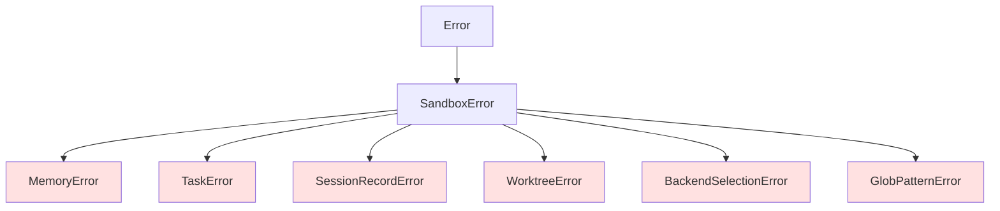

# v1.4.0機能 型定義・共通処理設計書

## メタ情報

| 項目 | 内容 |
|------|------|
| ドキュメントID | DETAILED-ORCH-004-COMMON-TYPES |
| バージョン | 1.0.0 |
| ステータス | ドラフト |
| 作成日 | 2026-01-26 |
| 最終更新日 | 2026-01-26 |
| 作成者 | AI Assistant |
| 承認者 | - |
| 関連基本設計書 | BASIC-ORCH-004 v1.0.0 |

---

## 1. 概要

v1.4.0で追加される機能（F-013〜F-021）に必要な型定義とエラークラスの設計を定義します。

---

## 2. ファイル変更一覧

| ファイル | 変更内容 | 新規/変更 |
|---------|---------|----------|
| `src/core/types.ts` | HatSchema拡張、MemorySchema、TaskSchema追加 | 変更 |
| `src/core/errors.ts` | 6つのエラークラス追加 | 変更 |

---

## 3. 型定義拡張

### 3.1 HatSchema拡張（F-013, F-018）

#### ファイル: `src/core/types.ts`（追加分）

```typescript
/**
 * Per-Hat Model Selectionのモデル指定
 * 
 * Claude Code CLIのエイリアス（opus/sonnet/haiku）または
 * フルモデル名をサポートします。
 */
export const ModelAliasSchema = z.union([
  z.enum(["opus", "sonnet", "haiku"]),
  z.string().regex(/^claude-[a-z0-9-]+$/),
]);

export type ModelAlias = z.infer<typeof ModelAliasSchema>;

/**
 * Per-Hat Backend Configurationのバックエンド指定
 * 
 * - 文字列: 標準バックエンド名（claude/opencode/gemini）
 * - オブジェクト: Kiro agentまたはカスタムバックエンド
 */
export const HatBackendSchema = z.union([
  z.enum(["claude", "opencode", "gemini"]),
  z.object({
    type: z.literal("kiro"),
    agent: z.string().min(1),
  }),
  z.object({
    command: z.string().min(1),
    args: z.array(z.string()).optional(),
    prompt_mode: z.enum(["arg", "stdin"]).default("arg"),
    prompt_flag: z.string().optional(),
  }),
]);

export type HatBackend = z.infer<typeof HatBackendSchema>;

/**
 * Hat定義のzodスキーマ（v1.4.0拡張版）
 */
export const HatSchema = z.object({
  /**
   * Hat表示名
   * @example "Planner"
   */
  name: z.string().min(1),

  /**
   * このHatをトリガーするイベント一覧
   * globパターン対応（F-021）
   * @example ["task.start", "build.*"]
   */
  triggers: z.array(z.string()),

  /**
   * このHatが発行可能なイベント一覧
   * @example ["plan.ready", "LOOP_COMPLETE"]
   */
  publishes: z.array(z.string()),

  /**
   * Hat固有の指示
   */
  instructions: z.string().optional(),

  /**
   * Hat固有のモデル指定（F-013）
   * 未指定時はbackend.modelを継承
   * @example "opus"
   */
  model: ModelAliasSchema.optional(),

  /**
   * Hat固有のバックエンド指定（F-018）
   * 未指定時はbackend.typeを継承
   * @example "claude" または { type: "kiro", agent: "researcher" }
   */
  backend: HatBackendSchema.optional(),
});

export type Hat = z.infer<typeof HatSchema>;
```

### 3.2 MemorySchema（F-014）

```typescript
/**
 * Memory注入モード
 */
export const MemoryInjectModeSchema = z.enum(["auto", "manual", "none"]);

export type MemoryInjectMode = z.infer<typeof MemoryInjectModeSchema>;

/**
 * Memory設定のzodスキーマ
 */
export const MemoriesConfigSchema = z.object({
  /**
   * Memoriesシステムを有効にするか
   * @default true
   */
  enabled: z.boolean().default(true),

  /**
   * プロンプトへの注入モード
   * - auto: 自動的にプロンプト先頭に注入
   * - manual: エージェントが明示的に読み込む
   * - none: 注入しない
   * @default "auto"
   */
  inject: MemoryInjectModeSchema.default("auto"),

  /**
   * Memoriesファイルのパス
   * @default ".agent/memories.md"
   */
  path: z.string().default(".agent/memories.md"),

  /**
   * 最大サイズ（バイト）
   * @default 102400 (100KB)
   */
  max_size_bytes: z.number().min(1024).max(1048576).default(102400),
});

export type MemoriesConfig = z.infer<typeof MemoriesConfigSchema>;

/**
 * 単一Memoryエントリ
 */
export interface MemoryEntry {
  /**
   * 一意のID（自動生成）
   * @example "mem-001"
   */
  id: string;

  /**
   * Memory種別
   * - pattern: 発見したパターン
   * - architecture: アーキテクチャ決定
   * - solution: 問題の解決策
   * - lesson: 学んだ教訓
   */
  type: "pattern" | "architecture" | "solution" | "lesson";

  /**
   * Memory内容
   */
  content: string;

  /**
   * タグ（検索用）
   * @example ["error-handling", "async"]
   */
  tags: string[];

  /**
   * 作成日時
   */
  createdAt: string;
}
```

### 3.3 TaskSchema（F-015）

```typescript
/**
 * Task状態
 */
export const TaskStatusSchema = z.enum(["open", "in-progress", "closed"]);

export type TaskStatus = z.infer<typeof TaskStatusSchema>;

/**
 * Tasks設定のzodスキーマ
 */
export const TasksConfigSchema = z.object({
  /**
   * Tasksシステムを有効にするか
   * @default true
   */
  enabled: z.boolean().default(true),

  /**
   * Tasksファイルのパス
   * @default ".agent/tasks.jsonl"
   */
  path: z.string().default(".agent/tasks.jsonl"),
});

export type TasksConfig = z.infer<typeof TasksConfigSchema>;

/**
 * 単一Taskエントリ
 */
export interface TaskEntry {
  /**
   * 一意のID（自動生成）
   * @example "task-001"
   */
  id: string;

  /**
   * タスクタイトル
   * @example "Add authentication"
   */
  title: string;

  /**
   * 優先度（1が最高、5が最低）
   * @default 3
   */
  priority: 1 | 2 | 3 | 4 | 5;

  /**
   * タスク状態
   */
  status: TaskStatus;

  /**
   * 依存タスクIDリスト
   * @example ["task-001", "task-002"]
   */
  blocked_by: string[];

  /**
   * 作成日時
   */
  createdAt: string;

  /**
   * 完了日時（closed時のみ）
   */
  closedAt?: string;
}
```

### 3.4 SessionRecordingSchema（F-016）

```typescript
/**
 * セッション記録エントリ
 */
export interface SessionRecordEntry {
  /**
   * イテレーション番号
   */
  iteration: number;

  /**
   * 実行したHat名
   * @example "planner"
   */
  hat: string;

  /**
   * 入力プロンプト
   */
  prompt: string;

  /**
   * AIエージェントの出力
   */
  output: string;

  /**
   * 発行されたイベント
   * @example ["plan.ready"]
   */
  events: string[];

  /**
   * 使用したモデル
   * @example "opus"
   */
  model?: string;

  /**
   * 使用したバックエンド
   * @example "claude"
   */
  backend?: string;

  /**
   * 実行時間（ミリ秒）
   */
  durationMs: number;

  /**
   * 記録日時
   */
  timestamp: string;
}
```

### 3.5 WorktreeSchema（F-017）

```typescript
/**
 * ループ状態
 */
export const LoopStateSchema = z.enum([
  "running",      // 実行中
  "queued",       // 完了、マージ待ち
  "merging",      // マージ中
  "merged",       // マージ完了
  "needs-review", // マージ失敗、手動解決必要
  "crashed",      // プロセス異常終了
  "orphan",       // worktree存在、未追跡
  "discarded",    // ユーザーが明示的に破棄
]);

export type LoopState = z.infer<typeof LoopStateSchema>;

/**
 * ループレジストリエントリ
 */
export interface LoopEntry {
  /**
   * ループID（自動生成）
   * @example "orch-20260126-a3f2"
   */
  id: string;

  /**
   * Issue番号
   */
  issueNumber: number;

  /**
   * worktreeパス（セカンダリループのみ）
   * @example ".worktrees/orch-20260126-a3f2"
   */
  worktreePath?: string;

  /**
   * ブランチ名
   * @example "feature/issue-42"
   */
  branch: string;

  /**
   * ループ状態
   */
  state: LoopState;

  /**
   * プライマリループかどうか
   */
  isPrimary: boolean;

  /**
   * 開始日時
   */
  startedAt: string;

  /**
   * 完了日時
   */
  completedAt?: string;

  /**
   * PID（プロセスID）
   */
  pid?: number;
}
```

### 3.6 CustomBackendSchema（F-019）

```typescript
/**
 * カスタムバックエンド設定のzodスキーマ
 */
export const CustomBackendSchema = z.object({
  /**
   * バックエンドタイプ
   */
  type: z.literal("custom"),

  /**
   * 実行するCLIコマンド
   * @example "my-agent"
   */
  command: z.string().min(1),

  /**
   * プロンプト前に挿入される引数
   * @example ["--headless", "--auto-approve"]
   */
  args: z.array(z.string()).default([]),

  /**
   * プロンプトの渡し方
   * - arg: コマンドライン引数として渡す
   * - stdin: 標準入力として渡す
   * @default "arg"
   */
  prompt_mode: z.enum(["arg", "stdin"]).default("arg"),

  /**
   * プロンプト前のフラグ
   * @example "-p", "--prompt"
   */
  prompt_flag: z.string().optional(),
});

export type CustomBackend = z.infer<typeof CustomBackendSchema>;
```

### 3.7 EventEmissionSchema（F-020, F-021）

```typescript
/**
 * イベント発行リクエスト
 */
export interface EventEmission {
  /**
   * イベントトピック
   * @example "build.done"
   */
  topic: string;

  /**
   * メッセージまたはJSONペイロード
   */
  message: string | Record<string, unknown>;

  /**
   * ターゲットHat（明示的なハンドオフ）
   * @example "reviewer"
   */
  target?: string;

  /**
   * 発行日時
   */
  timestamp: string;
}

/**
 * Globパターンマッチ結果
 */
export interface GlobMatchResult {
  /**
   * マッチしたHat名
   */
  hatName: string;

  /**
   * マッチしたパターン
   */
  matchedPattern: string;

  /**
   * パターンの具体性スコア（高いほど具体的）
   */
  specificityScore: number;
}
```

### 3.8 ConfigSchema拡張

```typescript
/**
 * 設定ファイル全体のzodスキーマ（v1.4.0拡張版）
 */
export const ConfigSchema = z.object({
  version: z.string().default("1.0"),
  
  backend: z.object({
    type: z.enum(["claude", "opencode", "gemini", "container", "custom"]).default("claude"),
    model: ModelAliasSchema.optional(),
    // カスタムバックエンド設定（type: "custom"時のみ有効）
    command: z.string().optional(),
    args: z.array(z.string()).optional(),
    prompt_mode: z.enum(["arg", "stdin"]).optional(),
    prompt_flag: z.string().optional(),
  }),

  container: ContainerConfigSchema,
  sandbox: SandboxConfigSchema.optional(),

  loop: z.object({
    max_iterations: z.number().default(100),
    completion_promise: z.string().default("LOOP_COMPLETE"),
    idle_timeout_secs: z.number().default(1800),
  }),

  hats: z.record(z.string(), HatSchema).optional(),

  gates: z.object({
    after_plan: z.boolean().default(true),
    after_implementation: z.boolean().default(false),
    before_pr: z.boolean().default(true),
  }).optional(),

  quality: z.object({
    min_score: z.number().default(8),
    auto_approve_above: z.number().default(9),
  }).optional(),

  state: StateConfigSchema.optional(),
  autoIssue: AutoIssueConfigSchema.optional(),
  pr: PRConfigSchema.optional(),

  // 新規: Memories設定（v1.4.0）
  memories: MemoriesConfigSchema.optional(),

  // 新規: Tasks設定（v1.4.0）
  tasks: TasksConfigSchema.optional(),
});

export type Config = z.infer<typeof ConfigSchema>;
```

### 3.9 LoopContext拡張

```typescript
/**
 * ループ実行コンテキスト（v1.4.0拡張版）
 */
export interface LoopContext {
  // 既存フィールド（v1.3.0以前）
  issue: Issue;
  iteration: number;
  maxIterations: number;
  scratchpadPath: string;
  promptPath: string;
  completionPromise: string;
  autoMode: boolean;
  createPR: boolean;
  draftPR: boolean;
  useContainer: boolean;
  generateReport: boolean;
  reportPath: string;
  preset?: string;
  taskId?: string;
  logDir?: string;
  prConfig?: PRConfig;
  resolveDeps?: boolean;
  ignoreDeps?: boolean;

  // 新規: Per-Hat Model Selection（v1.4.0）
  /**
   * 現在のHat固有モデル（上書き用）
   */
  currentHatModel?: ModelAlias;

  // 新規: Per-Hat Backend（v1.4.0）
  /**
   * 現在のHat固有バックエンド
   */
  currentHatBackend?: HatBackend;

  // 新規: Memories（v1.4.0）
  /**
   * Memories設定
   */
  memoriesConfig?: MemoriesConfig;

  // 新規: Tasks（v1.4.0）
  /**
   * Tasks設定
   */
  tasksConfig?: TasksConfig;

  // 新規: Session Recording（v1.4.0）
  /**
   * セッション記録ファイルパス（指定時のみ記録）
   */
  recordSessionPath?: string;

  // 新規: Multi-Loop（v1.4.0）
  /**
   * ループID
   */
  loopId?: string;

  /**
   * プライマリループかどうか
   */
  isPrimaryLoop?: boolean;

  /**
   * worktreeパス（セカンダリループのみ）
   */
  worktreePath?: string;

  /**
   * 自動マージを無効化するか
   */
  noAutoMerge?: boolean;
}
```

---

## 4. エラークラス追加

### 4.1 エラー階層図



### 4.2 MemoryError

#### ファイル: `src/core/errors.ts`（追加分）

```typescript
/**
 * Memoryエラー
 * 
 * Memoriesシステム（F-014）で発生するエラーを表現します。
 * 
 * @example
 * ```typescript
 * // ファイル破損時
 * throw new MemoryError(
 *   "memoriesファイルが破損しています: .agent/memories.md",
 *   { path: ".agent/memories.md" }
 * );
 * 
 * // サイズ上限超過時
 * throw new MemoryError(
 *   "memoriesファイルがサイズ上限を超えました（100KB）",
 *   { currentSize: 150000, maxSize: 102400 }
 * );
 * ```
 */
export class MemoryError extends SandboxError {
  constructor(message: string, details?: Record<string, unknown>) {
    super(message, {
      code: "MEMORY_ERROR",
      details,
    });
    this.name = "MemoryError";
  }
}
```

### 4.3 TaskError

```typescript
/**
 * Taskエラー
 * 
 * Tasksシステム（F-015）で発生するエラーを表現します。
 * 
 * @example
 * ```typescript
 * // 依存タスク不存在
 * throw new TaskError(
 *   "依存タスクが見つかりません: task-999",
 *   { taskId: "task-002", missingDependency: "task-999" }
 * );
 * 
 * // タスクファイル破損
 * throw new TaskError(
 *   "tasksファイルが破損しています",
 *   { path: ".agent/tasks.jsonl", line: 5 }
 * );
 * ```
 */
export class TaskError extends SandboxError {
  constructor(message: string, details?: Record<string, unknown>) {
    super(message, {
      code: "TASK_ERROR",
      details,
    });
    this.name = "TaskError";
  }
}
```

### 4.4 SessionRecordError

```typescript
/**
 * セッション記録エラー
 * 
 * Session Recording（F-016）で発生するエラーを表現します。
 * 
 * @example
 * ```typescript
 * // 書き込み失敗
 * throw new SessionRecordError(
 *   "セッション記録の書き込みに失敗しました",
 *   { path: "session.jsonl", cause: "EACCES" }
 * );
 * 
 * // リプレイファイル不正
 * throw new SessionRecordError(
 *   "リプレイファイルの形式が不正です",
 *   { path: "session.jsonl", line: 3 }
 * );
 * ```
 */
export class SessionRecordError extends SandboxError {
  constructor(message: string, details?: Record<string, unknown>) {
    super(message, {
      code: "SESSION_RECORD_ERROR",
      details,
    });
    this.name = "SessionRecordError";
  }
}
```

### 4.5 WorktreeError

```typescript
/**
 * Worktreeエラー
 * 
 * Multi-Loop Concurrency（F-017）で発生するエラーを表現します。
 * 
 * @example
 * ```typescript
 * // worktree作成失敗
 * throw new WorktreeError(
 *   "worktreeの作成に失敗しました",
 *   { path: ".worktrees/orch-20260126-a3f2", cause: "branch exists" }
 * );
 * 
 * // マージ失敗
 * throw new WorktreeError(
 *   "自動マージに失敗しました。手動での解決が必要です。",
 *   { loopId: "orch-20260126-a3f2", conflicts: ["src/index.ts"] }
 * );
 * ```
 */
export class WorktreeError extends SandboxError {
  constructor(message: string, details?: Record<string, unknown>) {
    super(message, {
      code: "WORKTREE_ERROR",
      details,
    });
    this.name = "WorktreeError";
  }
}
```

### 4.6 BackendSelectionError

```typescript
/**
 * バックエンド選択エラー
 * 
 * Per-Hat Backend Configuration（F-018）およびCustom Backends（F-019）で
 * 発生するエラーを表現します。
 * 
 * @example
 * ```typescript
 * // バックエンド利用不可
 * throw new BackendSelectionError(
 *   "バックエンド 'gemini' が見つかりません",
 *   { backend: "gemini", hat: "reviewer" }
 * );
 * 
 * // カスタムバックエンド設定不正
 * throw new BackendSelectionError(
 *   "カスタムバックエンドの設定が不正です",
 *   { command: "my-agent", error: "command not found" }
 * );
 * ```
 */
export class BackendSelectionError extends SandboxError {
  constructor(message: string, details?: Record<string, unknown>) {
    super(message, {
      code: "BACKEND_SELECTION_ERROR",
      details,
    });
    this.name = "BackendSelectionError";
  }
}
```

### 4.7 GlobPatternError

```typescript
/**
 * Globパターンエラー
 * 
 * Glob Pattern Event Matching（F-021）で発生するエラーを表現します。
 * 
 * @example
 * ```typescript
 * // 曖昧なルーティング
 * throw new GlobPatternError(
 *   "複数のHatが同じパターンでマッチしました",
 *   { topic: "build.done", matchedHats: ["builder", "tester"] }
 * );
 * 
 * // パターン構文エラー
 * throw new GlobPatternError(
 *   "無効なglobパターン: [invalid",
 *   { pattern: "[invalid", hat: "builder" }
 * );
 * ```
 */
export class GlobPatternError extends SandboxError {
  constructor(message: string, details?: Record<string, unknown>) {
    super(message, {
      code: "GLOB_PATTERN_ERROR",
      details,
    });
    this.name = "GlobPatternError";
  }
}
```

---

## 5. 設定ファイル例

### 5.1 orch.yml（v1.4.0完全版）

```yaml
version: "1.0"

# バックエンド設定
backend:
  type: claude
  model: sonnet  # グローバルデフォルト

# サンドボックス設定（v1.2.0）
sandbox:
  type: docker
  fallback: host
  docker:
    image: node:20-alpine
    network: none
    timeout: 300
  containerUse:
    image: node:20
  host:
    warnOnStart: true

# ループ設定
loop:
  max_iterations: 100
  completion_promise: "LOOP_COMPLETE"
  idle_timeout_secs: 1800

# 承認ゲート
gates:
  after_plan: true
  after_implementation: false
  before_pr: true

# 品質基準
quality:
  min_score: 8
  auto_approve_above: 9

# PR設定（v1.3.0）
pr:
  auto_merge: true
  merge_method: squash
  delete_branch: true
  ci_timeout_secs: 600

# 状態管理（v1.3.0）
state:
  use_github_labels: true
  use_scratchpad: true
  scratchpad_path: ".agent/scratchpad.md"
  label_prefix: "orch"

# 改善Issue自動作成（v1.2.0）
autoIssue:
  enabled: true
  minPriority: medium
  labels:
    - auto-generated
    - improvement

# Memories設定（新規 v1.4.0）
memories:
  enabled: true
  inject: auto  # auto, manual, none
  path: ".agent/memories.md"
  max_size_bytes: 102400  # 100KB

# Tasks設定（新規 v1.4.0）
tasks:
  enabled: true
  path: ".agent/tasks.jsonl"

# Hat定義（Per-Hat Model/Backend Selection v1.4.0）
hats:
  planner:
    name: "Planner"
    triggers: ["task.start"]
    publishes: ["plan.ready"]
    model: opus  # 高精度モデル
    instructions: |
      Create a detailed implementation plan.

  builder:
    name: "Builder"
    triggers: ["plan.ready", "build.*"]  # globパターン
    publishes: ["build.done", "build.blocked"]
    # model省略 → backend.model (sonnet) を継承
    instructions: |
      Implement the plan step by step.

  researcher:
    name: "Researcher"
    triggers: ["research.*"]
    publishes: ["research.done"]
    backend:
      type: kiro
      agent: researcher  # Kiro agent with MCP tools
    instructions: |
      Research the topic using available tools.

  reviewer:
    name: "Reviewer"
    triggers: ["*.done"]  # 任意の完了イベント
    publishes: ["review.approved", "review.revise", "LOOP_COMPLETE"]
    model: haiku  # 軽量モデルで高速レビュー
    instructions: |
      Review the changes and provide feedback.

  fallback:
    name: "Fallback Handler"
    triggers: ["*"]  # グローバルワイルドカード
    publishes: ["fallback.handled"]
    instructions: |
      Handle any unmatched events.
```

---

## 6. 設定値バリデーション

### 6.1 MemoriesConfigのバリデーション

| フィールド | 型 | 制約 | デフォルト |
|-----------|-----|------|-----------|
| enabled | boolean | - | true |
| inject | enum | "auto" / "manual" / "none" | "auto" |
| path | string | - | ".agent/memories.md" |
| max_size_bytes | number | 1024 <= x <= 1048576 | 102400 |

### 6.2 TasksConfigのバリデーション

| フィールド | 型 | 制約 | デフォルト |
|-----------|-----|------|-----------|
| enabled | boolean | - | true |
| path | string | - | ".agent/tasks.jsonl" |

### 6.3 HatSchemaのバリデーション

| フィールド | 型 | 制約 | デフォルト |
|-----------|-----|------|-----------|
| name | string | 1文字以上 | - |
| triggers | string[] | 1要素以上 | - |
| publishes | string[] | 1要素以上 | - |
| instructions | string | - | undefined |
| model | ModelAlias | opus/sonnet/haiku またはフルモデル名 | undefined（継承） |
| backend | HatBackend | claude/opencode/gemini/Kiro/Custom | undefined（継承） |

---

## 7. 既存コードとの互換性

### 7.1 後方互換性

v1.3.0からv1.4.0へのアップグレードで、既存の設定ファイルはそのまま動作します。

```yaml
# v1.3.0の設定（そのまま動作）
hats:
  planner:
    name: "Planner"
    triggers: ["task.start"]
    publishes: ["plan.ready"]
# model/backendがない場合はグローバル設定を継承
```

### 7.2 新規フィールドのデフォルト値

| フィールド | デフォルト値 | 説明 |
|-----------|-------------|------|
| memories | undefined | Memoriesシステム無効（未設定時） |
| memories.enabled | true | 設定されている場合は有効 |
| tasks | undefined | Tasksシステム無効（未設定時） |
| tasks.enabled | true | 設定されている場合は有効 |
| hats.\<hat\>.model | undefined | backend.modelを継承 |
| hats.\<hat\>.backend | undefined | backend.typeを継承 |

---

## 8. 実装手順

### 8.1 types.ts変更手順

1. `ModelAliasSchema` を追加
2. `HatBackendSchema` を追加
3. `HatSchema` に `model`, `backend` を追加
4. `MemoriesConfigSchema` を追加
5. `TasksConfigSchema` を追加
6. `SessionRecordEntry` を追加
7. `LoopStateSchema`, `LoopEntry` を追加
8. `CustomBackendSchema` を追加
9. `EventEmission`, `GlobMatchResult` を追加
10. `ConfigSchema` に `memories`, `tasks` を追加
11. `LoopContext` を拡張
12. 型をエクスポート

### 8.2 errors.ts変更手順

1. `MemoryError` を追加
2. `TaskError` を追加
3. `SessionRecordError` を追加
4. `WorktreeError` を追加
5. `BackendSelectionError` を追加
6. `GlobPatternError` を追加
7. エクスポートを更新

---

## 9. テスト

### 9.1 スキーマバリデーションテスト

```typescript
import { describe, it, expect } from "bun:test";
import { 
  MemoriesConfigSchema, 
  TasksConfigSchema, 
  HatSchema,
  ModelAliasSchema,
} from "./types.js";

describe("MemoriesConfigSchema", () => {
  it("デフォルト値が適用される", () => {
    const result = MemoriesConfigSchema.parse({});
    
    expect(result.enabled).toBe(true);
    expect(result.inject).toBe("auto");
    expect(result.path).toBe(".agent/memories.md");
    expect(result.max_size_bytes).toBe(102400);
  });

  it("max_size_bytesの範囲外はエラー", () => {
    expect(() => MemoriesConfigSchema.parse({ max_size_bytes: 500 })).toThrow();
    expect(() => MemoriesConfigSchema.parse({ max_size_bytes: 2000000 })).toThrow();
  });

  it("injectの不正値はエラー", () => {
    expect(() => MemoriesConfigSchema.parse({ inject: "invalid" })).toThrow();
  });
});

describe("HatSchema", () => {
  it("Per-Hat Model Selectionが機能する", () => {
    const result = HatSchema.parse({
      name: "Planner",
      triggers: ["task.start"],
      publishes: ["plan.ready"],
      model: "opus",
    });
    
    expect(result.model).toBe("opus");
  });

  it("Per-Hat Backend Configurationが機能する", () => {
    const result = HatSchema.parse({
      name: "Researcher",
      triggers: ["research.*"],
      publishes: ["research.done"],
      backend: { type: "kiro", agent: "researcher" },
    });
    
    expect(result.backend).toEqual({ type: "kiro", agent: "researcher" });
  });
});

describe("ModelAliasSchema", () => {
  it("エイリアスを受け付ける", () => {
    expect(ModelAliasSchema.parse("opus")).toBe("opus");
    expect(ModelAliasSchema.parse("sonnet")).toBe("sonnet");
    expect(ModelAliasSchema.parse("haiku")).toBe("haiku");
  });

  it("フルモデル名を受け付ける", () => {
    expect(ModelAliasSchema.parse("claude-sonnet-4-5-20250929")).toBe("claude-sonnet-4-5-20250929");
  });
});
```

---

## 10. 変更履歴

| バージョン | 日付 | 変更内容 | 変更者 |
|-----------|------|---------|--------|
| 1.0.0 | 2026-01-26 | 初版作成 | AI Assistant |
