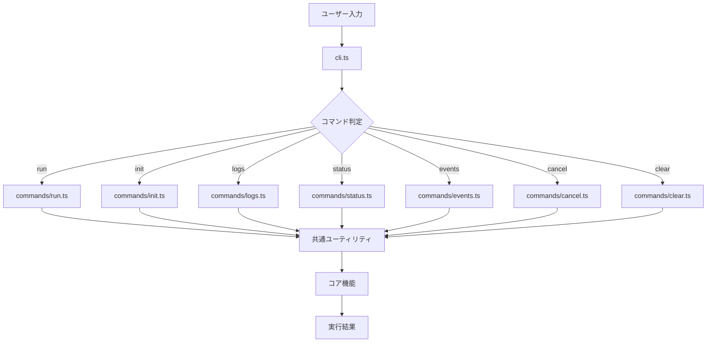
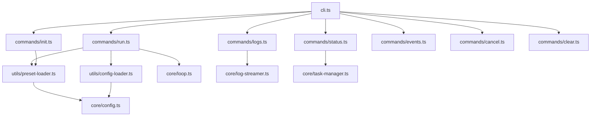

# CLIリファクタリング 詳細設計書

## メタ情報

| 項目 | 内容 |
|------|------|
| ドキュメントID | DETAILED-ORCH-003-F102 |
| バージョン | 1.0.0 |
| ステータス | ドラフト |
| 作成日 | 2026-01-26 |
| 最終更新日 | 2026-01-26 |
| 作成者 | AI Assistant |
| 承認者 | - |
| 関連基本設計書 | BASIC-ORCH-003 v1.0.0 |
| 対象機能 | F-102 |

---

## 1. 概要

### 1.1 目的

現在の`cli.ts`（1000行超）を`src/cli/commands/`配下に分離し、保守性と拡張性を向上させます。各コマンドを独立したモジュールとして管理することで、テストの容易性とコードの可読性を高めます。

### 1.2 スコープ

#### スコープ内

- `cli.ts`を以下のファイルに分離:
  - `src/cli.ts` - エントリーポイント（100行以下）
  - `src/cli/commands/run.ts` - runコマンド
  - `src/cli/commands/init.ts` - initコマンド
  - `src/cli/commands/logs.ts` - logsコマンド
  - `src/cli/commands/status.ts` - statusコマンド
  - `src/cli/commands/events.ts` - eventsコマンド
  - `src/cli/commands/cancel.ts` - cancelコマンド
  - `src/cli/commands/clear.ts` - clearコマンド
- 共通ロジックの抽出（`src/cli/utils/`）
- 各コマンドの単体テスト

#### スコープ外

- 新規コマンドの追加
- CLIフレームワークの変更（commanderを継続使用）
- コマンドの動作変更

### 1.3 参照ドキュメント

| ドキュメント | パス | 参照箇所 |
|-------------|------|---------|
| 基本設計書 | docs/designs/basic/BASIC-ORCH-003_v2.0.0機能.md | セクション3.1 |
| 既存CLI | src/cli.ts | リファクタリング対象 |

---

## 2. 処理フロー

### 2.1 リファクタリング前後の構造

#### Before（現状）

| ファイル | 説明 |
|---------|------|
| `src/cli.ts` | 1000行以上。run/init/logs/status/events/cancel/clearコマンドを含む |
| `src/cli-logs.ts` | ヘルパー関数 |

#### After（リファクタリング後）

| ファイル | 説明 |
|---------|------|
| `src/cli.ts` | エントリーポイント（100行以下） |
| `src/cli/commands/run.ts` | runコマンド |
| `src/cli/commands/init.ts` | initコマンド |
| `src/cli/commands/logs.ts` | logsコマンド |
| `src/cli/commands/status.ts` | statusコマンド |
| `src/cli/commands/events.ts` | eventsコマンド |
| `src/cli/commands/cancel.ts` | cancelコマンド |
| `src/cli/commands/clear.ts` | clearコマンド |
| `src/cli/utils/preset-loader.ts` | プリセット読み込み |
| `src/cli/utils/config-loader.ts` | 設定読み込み |
| `src/cli-logs.ts` | 削除予定（logs.tsに統合） |

### 2.2 コマンド実行フロー



---

## 3. 機能要件

### 3.1 各コマンドの責務

| コマンド | ファイル | 責務 | 行数目安 |
|---------|---------|------|---------|
| run | `commands/run.ts` | タスク実行（単一/並列） | 150行 |
| init | `commands/init.ts` | 設定ファイル初期化 | 100行 |
| logs | `commands/logs.ts` | ログ表示・監視 | 100行 |
| status | `commands/status.ts` | タスク状態確認 | 80行 |
| events | `commands/events.ts` | イベント履歴表示 | 60行 |
| cancel | `commands/cancel.ts` | タスクキャンセル | 60行 |
| clear | `commands/clear.ts` | タスク履歴クリア | 50行 |

### 3.2 共通ユーティリティ

| ユーティリティ | ファイル | 責務 |
|--------------|---------|------|
| プリセット読み込み | `utils/preset-loader.ts` | プリセット設定の読み込み |
| 設定読み込み | `utils/config-loader.ts` | 設定ファイルの読み込み・統合 |

---

## 4. 設計方針

### 4.1 設計原則

| 原則 | 説明 |
|------|------|
| **単一責任** | 各コマンドファイルは1つのコマンドのみを担当 |
| **DRY** | 共通ロジックはutilsに抽出 |
| **テスタビリティ** | 各コマンドを独立してテスト可能に |
| **後方互換性** | CLIインターフェースは変更しない |

### 4.2 ファイルサイズ制約

| ファイル | 最大行数 |
|---------|---------|
| `cli.ts` | 100行 |
| 各コマンドファイル | 200行 |
| 各ユーティリティ | 150行 |

---

## 5. インターフェース設計

### 5.1 コマンドインターフェース

```typescript
// src/cli/commands/types.ts

import type { Command } from "commander";

/**
 * コマンドハンドラーインターフェース
 */
export interface CommandHandler {
  /**
   * コマンドを登録する
   * 
   * @param program - commanderプログラム
   */
  register(program: Command): void;
}
```

### 5.2 runコマンドオプション

```typescript
// src/cli/commands/run.ts

export interface RunCommandOptions {
  issue?: string;
  issues?: string;
  backend?: string;
  preset?: string;
  maxIterations?: number;
  auto?: boolean;
  createPr?: boolean;
  draft?: boolean;
  container?: boolean;
  autoMerge?: boolean;
  resolveDeps?: boolean;
  ignoreDeps?: boolean;
  report?: string | boolean;
  config?: string;
  verbose?: boolean;
}
```

---

## 6. データ構造

### 6.1 ディレクトリ構造

| パス | 説明 |
|------|------|
| `src/cli/commands/` | コマンドディレクトリ |
| `src/cli/commands/types.ts` | 共通型定義 |
| `src/cli/commands/run.ts` | runコマンド |
| `src/cli/commands/init.ts` | initコマンド |
| `src/cli/commands/logs.ts` | logsコマンド |
| `src/cli/commands/status.ts` | statusコマンド |
| `src/cli/commands/events.ts` | eventsコマンド |
| `src/cli/commands/cancel.ts` | cancelコマンド |
| `src/cli/commands/clear.ts` | clearコマンド |
| `src/cli/utils/` | ユーティリティディレクトリ |
| `src/cli/utils/preset-loader.ts` | プリセット読み込み |
| `src/cli/utils/config-loader.ts` | 設定読み込み |

---

## 7. エラーハンドリング

### 7.1 エラーケース

| エラーケース | 処理 |
|-------------|------|
| コマンドハンドラーが例外をスロー | cli.tsでキャッチし、エラーメッセージを表示してexit(1) |
| 必須オプションが未指定 | commanderが自動的にエラーメッセージを表示 |
| 設定ファイル読み込み失敗 | 警告ログを出力し、デフォルト値を使用 |

### 7.2 エラーメッセージ

```typescript
// 統一されたエラーハンドリング
try {
  await commandHandler.execute(options);
} catch (error) {
  logger.error(error instanceof Error ? error.message : String(error));
  process.exit(1);
}
```

---

## 8. 依存関係

### 8.1 依存モジュール



### 8.2 影響範囲

| ファイル | 変更内容 | 影響度 |
|---------|---------|--------|
| `src/cli.ts` | 大幅削減（1000行 → 100行） | 高 |
| `src/cli/commands/*.ts` | 新規作成 | 中 |
| `src/cli/utils/*.ts` | 新規作成 | 低 |
| `src/cli-logs.ts` | 削除（logs.tsに統合） | 低 |

---

## 9. テスト方針

### 9.1 テストケース

| # | テストケース | 対象ファイル |
|---|-------------|-------------|
| 1 | runコマンド単体テスト | `commands/run.test.ts` |
| 2 | initコマンド単体テスト | `commands/init.test.ts` |
| 3 | logsコマンド単体テスト | `commands/logs.test.ts` |
| 4 | statusコマンド単体テスト | `commands/status.test.ts` |
| 5 | eventsコマンド単体テスト | `commands/events.test.ts` |
| 6 | cancelコマンド単体テスト | `commands/cancel.test.ts` |
| 7 | clearコマンド単体テスト | `commands/clear.test.ts` |
| 8 | preset-loader単体テスト | `utils/preset-loader.test.ts` |
| 9 | config-loader単体テスト | `utils/config-loader.test.ts` |
| 10 | CLI統合テスト | `cli.test.ts` |

### 9.2 テストコード例

```typescript
// src/cli/commands/run.test.ts

import { describe, expect, it, mock } from "bun:test";
import { RunCommand } from "./run.js";

describe("RunCommand", () => {
  it("should execute single issue", async () => {
    const runLoop = mock(() => Promise.resolve());
    const command = new RunCommand({ runLoop });

    await command.execute({
      issue: "42",
      auto: true,
    });

    expect(runLoop).toHaveBeenCalledWith(
      expect.objectContaining({
        issueNumber: 42,
        autoApprove: true,
      })
    );
  });

  it("should execute multiple issues", async () => {
    const runMultipleLoops = mock(() => Promise.resolve());
    const command = new RunCommand({ runMultipleLoops });

    await command.execute({
      issues: "42,43,44",
      auto: true,
    });

    expect(runMultipleLoops).toHaveBeenCalledWith(
      expect.objectContaining({
        issueNumbers: [42, 43, 44],
      })
    );
  });

  it("should throw error when no issue specified", async () => {
    const command = new RunCommand();

    await expect(command.execute({})).rejects.toThrow(
      "Either --issue or --issues is required"
    );
  });
});
```

---

## 10. 実装タスク

| タスクID | タスク名 | 見積もり | 依存 |
|---------|---------|---------|------|
| TASK-102-1 | ディレクトリ構造作成 | 0.5h | なし |
| TASK-102-2 | 共通型定義（types.ts） | 1h | TASK-102-1 |
| TASK-102-3 | utils/preset-loader.ts実装 | 2h | TASK-102-2 |
| TASK-102-4 | utils/config-loader.ts実装 | 2h | TASK-102-2 |
| TASK-102-5 | commands/run.ts実装 | 4h | TASK-102-3, TASK-102-4 |
| TASK-102-6 | commands/init.ts実装 | 2h | TASK-102-3 |
| TASK-102-7 | commands/logs.ts実装 | 2h | TASK-102-2 |
| TASK-102-8 | commands/status.ts実装 | 1.5h | TASK-102-2 |
| TASK-102-9 | commands/events.ts実装 | 1h | TASK-102-2 |
| TASK-102-10 | commands/cancel.ts実装 | 1h | TASK-102-2 |
| TASK-102-11 | commands/clear.ts実装 | 1h | TASK-102-2 |
| TASK-102-12 | cli.tsリファクタリング | 2h | TASK-102-5〜11 |
| TASK-102-13 | 単体テスト作成 | 4h | TASK-102-12 |
| TASK-102-14 | 統合テスト | 2h | TASK-102-13 |
| TASK-102-15 | ドキュメント更新 | 1h | TASK-102-14 |

**合計見積もり**: 27時間

---

## 11. 変更履歴

| バージョン | 日付 | 変更内容 | 作成者 |
|-----------|------|----------|--------|
| 1.0.0 | 2026-01-26 | 初版作成 | AI Assistant |
