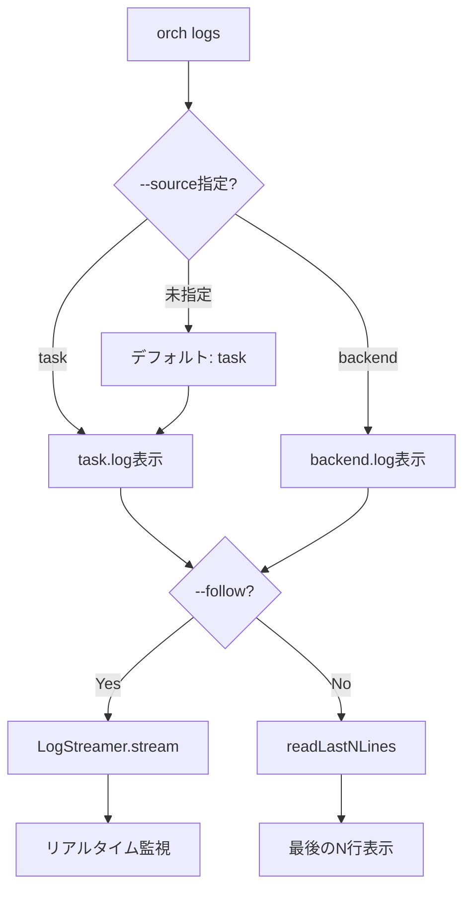
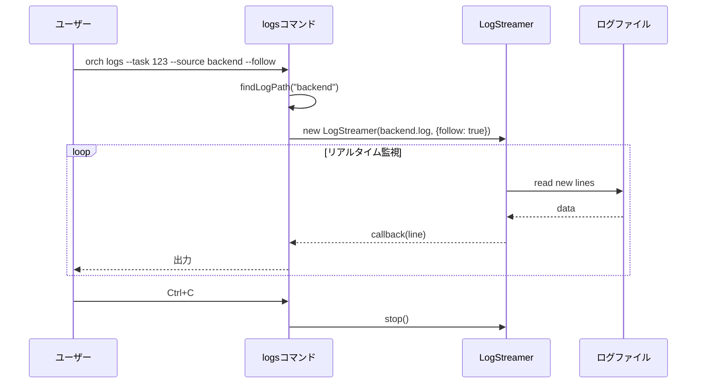
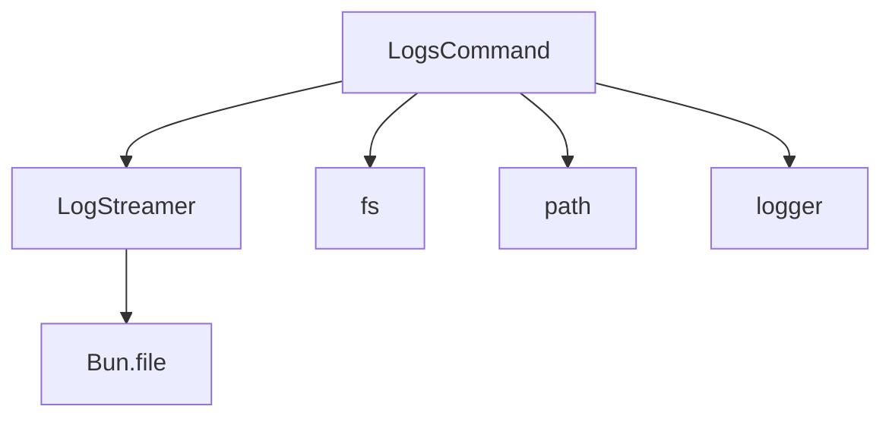

# logsコマンド拡張 詳細設計書

## メタ情報

| 項目 | 内容 |
|------|------|
| ドキュメントID | DETAILED-ORCH-003-F104 |
| バージョン | 1.0.0 |
| ステータス | ドラフト |
| 作成日 | 2026-01-26 |
| 最終更新日 | 2026-01-26 |
| 作成者 | AI Assistant |
| 承認者 | - |
| 関連基本設計書 | BASIC-ORCH-003 v1.0.0 |
| 対象機能 | F-104 |

---

## 1. 概要

### 1.1 目的

`orch logs`コマンドに`--source backend`オプションを追加し、AIエージェントの出力（`backend.log`）を監視できるようにします。これにより、orchestrator-hybridのログ（`task.log`）とAIエージェントのログを切り替えて表示できます。

### 1.2 スコープ

#### スコープ内

- `--source`オプションの追加（`task` | `backend`）
- `backend.log`の表示・監視機能
- 既存の`--follow`, `--lines`オプションとの統合

#### スコープ外

- 新規オプションの追加（`--source`以外）
- ログフィルタリング機能
- ログフォーマット変換機能

### 1.3 参照ドキュメント

| ドキュメント | パス | 参照箇所 |
|-------------|------|---------|
| 基本設計書 | docs/designs/basic/BASIC-ORCH-003_v2.0.0機能.md | セクション3.1 |
| 既存logsコマンド | src/cli/commands/logs.ts | 拡張対象 |
| LogStreamer | src/core/log-streamer.ts | 使用 |

---

## 2. 処理フロー

### 2.1 コマンド実行フロー



### 2.2 シーケンス図



---

## 3. 機能要件

### 3.1 新規オプション

| オプション | 短縮形 | 説明 | デフォルト |
|-----------|--------|------|-----------|
| `--source <type>` | `-s` | ログソース（`task` \| `backend`） | `task` |

### 3.2 使用例

#### 例1: バックエンドログをリアルタイム監視

```bash
orch logs --task task-1234567890-42 --source backend --follow
```

#### 例2: バックエンドログの最後の50行を表示

```bash
orch logs --task task-1234567890-42 --source backend --lines 50
```

#### 例3: タスクログを表示（デフォルト）

```bash
orch logs --task task-1234567890-42
# または
orch logs --task task-1234567890-42 --source task
```

---

## 4. 設計方針

### 4.1 設計原則

| 原則 | 説明 |
|------|------|
| **後方互換性** | `--source`未指定時は従来通り`task.log`を表示 |
| **一貫性** | `--follow`, `--lines`は両方のログソースで動作 |
| **拡張性** | 将来的に他のログソース（`events`等）を追加可能 |

### 4.2 非機能要件

| 要件 | 目標値 | 測定方法 |
|------|--------|----------|
| ログ表示遅延 | 500ms以内 | 統合テスト |
| メモリ使用量 | 10MB以内 | プロファイリング |

---

## 5. インターフェース設計

### 5.1 logsコマンドオプション

```typescript
// src/cli/commands/logs.ts

export interface LogsCommandOptions {
  task?: string;
  source?: "task" | "backend";  // 新規追加
  follow?: boolean;
  lines?: number;
  table?: boolean;
  interval?: number;
}
```

### 5.2 ログパス解決

```typescript
/**
 * ログソースに応じたログファイルパスを取得
 * 
 * @param taskId - タスクID
 * @param source - ログソース
 * @returns ログファイルパス
 */
function findLogPath(taskId: string, source: "task" | "backend"): string | null {
  const baseDir = ".agent";
  const logFileName = source === "backend" ? "backend.log" : "task.log";
  const logPath = join(baseDir, taskId, logFileName);
  return existsSync(logPath) ? logPath : null;
}
```

---

## 6. データ構造

### 6.1 ログファイル構成

| パス | 説明 |
|------|------|
| `.agent/` | エージェント作業ディレクトリ |
| `.agent/task-1234567890-42/` | タスクログディレクトリ |
| `.agent/task-1234567890-42/task.log` | orchestrator-hybridのログ |
| `.agent/task-1234567890-42/backend.log` | AIエージェントのログ（新規） |
| `.agent/task-1234567890-42/events.jsonl` | イベント履歴 |

### 6.2 ログソース列挙型

```typescript
// src/cli/commands/types.ts

export type LogSource = "task" | "backend";
```

---

## 7. エラーハンドリング

### 7.1 エラーケース

| エラーケース | 処理 |
|-------------|------|
| ログファイルが存在しない | エラーメッセージを表示してexit(1) |
| 無効なログソース指定 | エラーメッセージを表示してexit(1) |
| タスクIDが未指定 | エラーメッセージを表示してexit(1) |

### 7.2 エラーメッセージ

```typescript
// ログファイルが存在しない
throw new Error(`Log file not found: ${logPath}`);

// 無効なログソース
throw new Error(`Invalid log source: ${source}. Must be 'task' or 'backend'`);

// タスクIDが未指定
throw new Error("--task is required (or use --table for legacy mode)");
```

---

## 8. 依存関係

### 8.1 依存モジュール



### 8.2 影響範囲

| ファイル | 変更内容 | 影響度 |
|---------|---------|--------|
| `src/cli/commands/logs.ts` | `--source`オプション追加 | 低 |
| `src/cli/commands/types.ts` | LogSource型追加 | 低 |

---

## 9. テスト方針

### 9.1 テストケース

| # | テストケース | 期待結果 |
|---|-------------|---------|
| 1 | `--source task`指定 | task.logが表示される |
| 2 | `--source backend`指定 | backend.logが表示される |
| 3 | `--source`未指定 | task.logが表示される（デフォルト） |
| 4 | `--source backend --follow` | backend.logをリアルタイム監視 |
| 5 | `--source backend --lines 50` | backend.logの最後の50行を表示 |
| 6 | ログファイルが存在しない | エラーメッセージを表示 |
| 7 | 無効なログソース指定 | エラーメッセージを表示 |

### 9.2 テストコード例

```typescript
// src/cli/commands/logs.test.ts

import { describe, expect, it } from "bun:test";
import { existsSync, mkdirSync, rmSync, writeFileSync } from "node:fs";
import { LogsCommand } from "./logs.js";

const TEST_DIR = ".test-logs";
const TEST_TASK_ID = "task-123";
const TEST_TASK_DIR = `${TEST_DIR}/${TEST_TASK_ID}`;

describe("LogsCommand", () => {
  beforeEach(() => {
    if (existsSync(TEST_DIR)) {
      rmSync(TEST_DIR, { recursive: true });
    }
    mkdirSync(TEST_TASK_DIR, { recursive: true });
  });

  afterEach(() => {
    if (existsSync(TEST_DIR)) {
      rmSync(TEST_DIR, { recursive: true });
    }
  });

  it("should display task.log by default", async () => {
    writeFileSync(`${TEST_TASK_DIR}/task.log`, "Task log content");

    const command = new LogsCommand();
    // モックで出力をキャプチャ
    // ...
  });

  it("should display backend.log when --source backend", async () => {
    writeFileSync(`${TEST_TASK_DIR}/backend.log`, "Backend log content");

    const command = new LogsCommand();
    await command.execute({
      task: TEST_TASK_ID,
      source: "backend",
    });
    // 出力を検証
    // ...
  });

  it("should throw error when log file not found", async () => {
    const command = new LogsCommand();
    await expect(
      command.execute({
        task: TEST_TASK_ID,
        source: "backend",
      })
    ).rejects.toThrow("Log file not found");
  });

  it("should throw error when invalid source", async () => {
    const command = new LogsCommand();
    await expect(
      command.execute({
        task: TEST_TASK_ID,
        source: "invalid" as any,
      })
    ).rejects.toThrow("Invalid log source");
  });
});
```

---

## 10. 実装タスク

| タスクID | タスク名 | 見積もり | 依存 |
|---------|---------|---------|------|
| TASK-104-1 | LogSource型定義 | 0.5h | なし |
| TASK-104-2 | findLogPath関数拡張 | 1h | TASK-104-1 |
| TASK-104-3 | LogsCommand拡張 | 2h | TASK-104-2 |
| TASK-104-4 | 単体テスト | 2h | TASK-104-3 |
| TASK-104-5 | 統合テスト | 1.5h | TASK-104-4 |
| TASK-104-6 | ドキュメント更新 | 1h | TASK-104-5 |

**合計見積もり**: 8時間

---

## 11. 変更履歴

| バージョン | 日付 | 変更内容 | 作成者 |
|-----------|------|----------|--------|
| 1.0.0 | 2026-01-26 | 初版作成 | AI Assistant |
