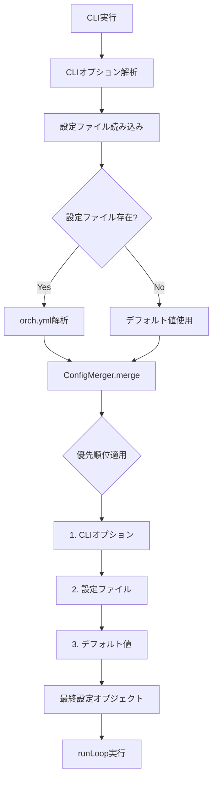
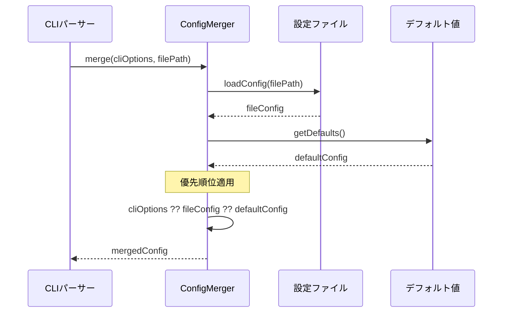
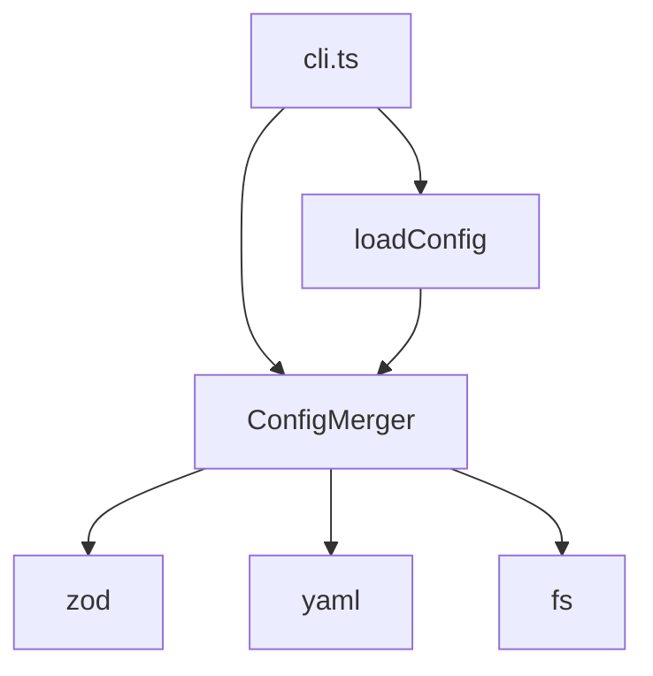

# run設定デフォルト化 詳細設計書

## メタ情報

| 項目 | 内容 |
|------|------|
| ドキュメントID | DETAILED-ORCH-003-F101 |
| バージョン | 1.0.0 |
| ステータス | ドラフト |
| 作成日 | 2026-01-26 |
| 最終更新日 | 2026-01-26 |
| 作成者 | AI Assistant |
| 承認者 | - |
| 関連基本設計書 | BASIC-ORCH-003 v1.0.0 |
| 対象機能 | F-101 |

---

## 1. 概要

### 1.1 目的

`orch.yml`設定ファイルで`--auto`, `--create-pr`, `--draft`等のCLIオプションをデフォルト値として設定可能にします。これにより、毎回同じオプションを指定する手間を省き、プロジェクト固有のワークフローを標準化できます。

### 1.2 スコープ

#### スコープ内

- `orch.yml`に`run`セクションを追加
- CLIオプション、設定ファイル、デフォルト値の優先順位制御
- ConfigMergerクラスによる設定統合ロジック
- 以下のオプションのデフォルト化:
  - `auto_mode` (--auto)
  - `create_pr` (--create-pr)
  - `draft_pr` (--draft)

#### スコープ外

- 既存のPR設定（`pr.auto_merge`等）の変更
- 新規CLIオプションの追加
- 設定ファイルのバージョン管理

### 1.3 参照ドキュメント

| ドキュメント | パス | 参照箇所 |
|-------------|------|---------|
| 基本設計書 | docs/designs/basic/BASIC-ORCH-003_v2.0.0機能.md | セクション3.1, 6.1 |
| 既存Config | src/core/config.ts | 参考実装 |
| 既存Types | src/core/types.ts | 型定義拡張 |

---

## 2. 処理フロー

### 2.1 設定統合フロー



### 2.2 優先順位の適用



---

## 3. 機能要件

### 3.1 設定ファイル拡張

`orch.yml`に以下のセクションを追加します：

```yaml
run:
  auto_mode: true       # --auto のデフォルト
  create_pr: true       # --create-pr のデフォルト
  draft_pr: false       # --draft のデフォルト
```

### 3.2 優先順位ルール

設定値の優先順位（高い順）：

1. **CLIオプション**: `--auto`, `--create-pr`, `--draft`
2. **設定ファイル**: `orch.yml`の`run`セクション
3. **デフォルト値**: `auto_mode: false`, `create_pr: false`, `draft_pr: false`

### 3.3 使用例

#### 例1: 設定ファイルでデフォルト化

```yaml
# orch.yml
run:
  auto_mode: true
  create_pr: true
```

```bash
# 設定ファイルの値が使用される（auto=true, create_pr=true）
orch run --issue 42

# CLIオプションが優先される（auto=false, create_pr=true）
orch run --issue 42 --no-auto
```

#### 例2: CLIオプションで上書き

```yaml
# orch.yml
run:
  auto_mode: false
  create_pr: false
```

```bash
# CLIオプションが優先される（auto=true, create_pr=true）
orch run --issue 42 --auto --create-pr
```

---

## 4. 設計方針

### 4.1 設計原則

| 原則 | 説明 |
|------|------|
| **明示性優先** | CLIオプションが最優先（ユーザーの意図を尊重） |
| **後方互換性** | 既存の動作を変更しない（デフォルト値は従来通り） |
| **単一責任** | ConfigMergerは設定統合のみを担当 |
| **テスタビリティ** | 依存性注入でテスト容易性を確保 |

### 4.2 非機能要件

| 要件 | 目標値 | 測定方法 |
|------|--------|----------|
| 設定統合時間 | 50ms以内 | ユニットテスト |
| メモリ使用量 | 1MB以内 | プロファイリング |
| テストカバレッジ | 90%以上 | bun test --coverage |

---

## 5. インターフェース設計

### 5.1 設定ファイルスキーマ

```typescript
// src/core/types.ts に追加

/**
 * run設定のzodスキーマ
 */
export const RunConfigSchema = z.object({
  /**
   * 承認ゲートを自動承認するか
   * @default false
   */
  auto_mode: z.boolean().default(false),

  /**
   * 完了後にPRを自動作成するか
   * @default false
   */
  create_pr: z.boolean().default(false),

  /**
   * PRをドラフトとして作成するか
   * @default false
   */
  draft_pr: z.boolean().default(false),
});

export type RunConfig = z.infer<typeof RunConfigSchema>;
```

### 5.2 ConfigMergerインターフェース

```typescript
// src/core/config-merger.ts

export interface MergeOptions {
  /**
   * CLIオプション（最優先）
   */
  cliOptions: Partial<RunConfig>;

  /**
   * 設定ファイルパス
   */
  configPath?: string;
}

export interface ConfigMerger {
  /**
   * 設定を統合する
   * 
   * @param options - マージオプション
   * @returns 統合された設定
   */
  merge(options: MergeOptions): RunConfig;
}
```

---

## 6. データ構造

### 6.1 設定オブジェクト構造

```typescript
// 最終的な設定オブジェクト
interface MergedConfig {
  run: RunConfig;
  backend: BackendConfig;
  loop: LoopConfig;
  gates: GatesConfig;
  pr: PRConfig;
  state: StateConfig;
  // ... 既存の設定
}
```

### 6.2 デフォルト値定義

```typescript
// src/core/config-merger.ts

const DEFAULT_RUN_CONFIG: RunConfig = {
  auto_mode: false,
  create_pr: false,
  draft_pr: false,
};
```

---

## 7. エラーハンドリング

### 7.1 エラーケース

| エラーケース | 処理 |
|-------------|------|
| 設定ファイルが不正なYAML | ConfigValidationErrorをスロー、デフォルト値を使用 |
| run設定が不正な型 | zodバリデーションエラー、デフォルト値を使用 |
| 設定ファイルが存在しない | 警告ログ、デフォルト値を使用 |

### 7.2 エラーメッセージ

```typescript
// 設定ファイル解析エラー
throw new ConfigValidationError(
  `Invalid run configuration in ${configPath}: ${error.message}`
);

// 型検証エラー
throw new ConfigValidationError(
  `run.auto_mode must be boolean, got ${typeof value}`
);
```

---

## 8. 依存関係

### 8.1 依存モジュール



### 8.2 影響範囲

| ファイル | 変更内容 | 影響度 |
|---------|---------|--------|
| `src/core/types.ts` | RunConfigSchema追加 | 低 |
| `src/core/config-merger.ts` | 新規作成 | 中 |
| `src/core/config.ts` | ConfigMerger統合 | 中 |
| `src/cli.ts` | ConfigMerger使用 | 低 |

---

## 9. テスト方針

### 9.1 テストケース

| # | テストケース | 期待結果 |
|---|-------------|---------|
| 1 | CLIオプションのみ指定 | CLIオプションが使用される |
| 2 | 設定ファイルのみ存在 | 設定ファイルの値が使用される |
| 3 | 両方指定 | CLIオプションが優先される |
| 4 | 両方未指定 | デフォルト値が使用される |
| 5 | 設定ファイルが不正 | デフォルト値が使用され、警告ログ |
| 6 | 部分的な設定 | 指定された値のみ上書き、残りはデフォルト |

### 9.2 テストコード例

```typescript
// src/core/config-merger.test.ts

describe("ConfigMerger", () => {
  it("should prioritize CLI options over file config", () => {
    const merger = new ConfigMerger();
    const result = merger.merge({
      cliOptions: { auto_mode: true },
      configPath: "test-fixtures/orch.yml", // auto_mode: false
    });
    expect(result.auto_mode).toBe(true);
  });

  it("should use file config when CLI option is not provided", () => {
    const merger = new ConfigMerger();
    const result = merger.merge({
      cliOptions: {},
      configPath: "test-fixtures/orch.yml", // create_pr: true
    });
    expect(result.create_pr).toBe(true);
  });

  it("should use default values when both are not provided", () => {
    const merger = new ConfigMerger();
    const result = merger.merge({
      cliOptions: {},
    });
    expect(result.auto_mode).toBe(false);
    expect(result.create_pr).toBe(false);
    expect(result.draft_pr).toBe(false);
  });
});
```

---

## 10. 実装タスク

| タスクID | タスク名 | 見積もり | 依存 |
|---------|---------|---------|------|
| TASK-101-1 | RunConfigSchema定義 | 1h | なし |
| TASK-101-2 | ConfigMergerクラス実装 | 3h | TASK-101-1 |
| TASK-101-3 | ConfigMerger単体テスト | 2h | TASK-101-2 |
| TASK-101-4 | cli.ts統合 | 2h | TASK-101-2 |
| TASK-101-5 | 統合テスト | 2h | TASK-101-4 |
| TASK-101-6 | ドキュメント更新 | 1h | TASK-101-5 |

**合計見積もり**: 11時間

---

## 11. 変更履歴

| バージョン | 日付 | 変更内容 | 作成者 |
|-----------|------|----------|--------|
| 1.0.0 | 2026-01-26 | 初版作成 | AI Assistant |
