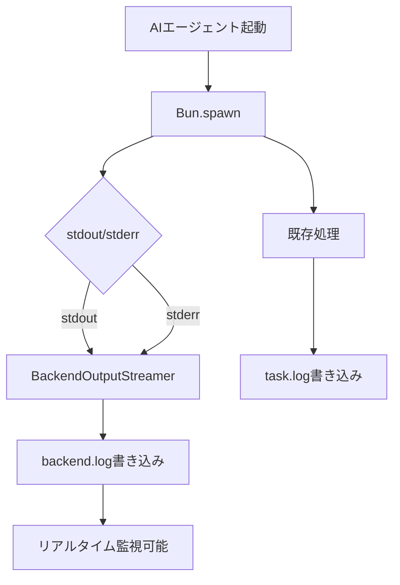
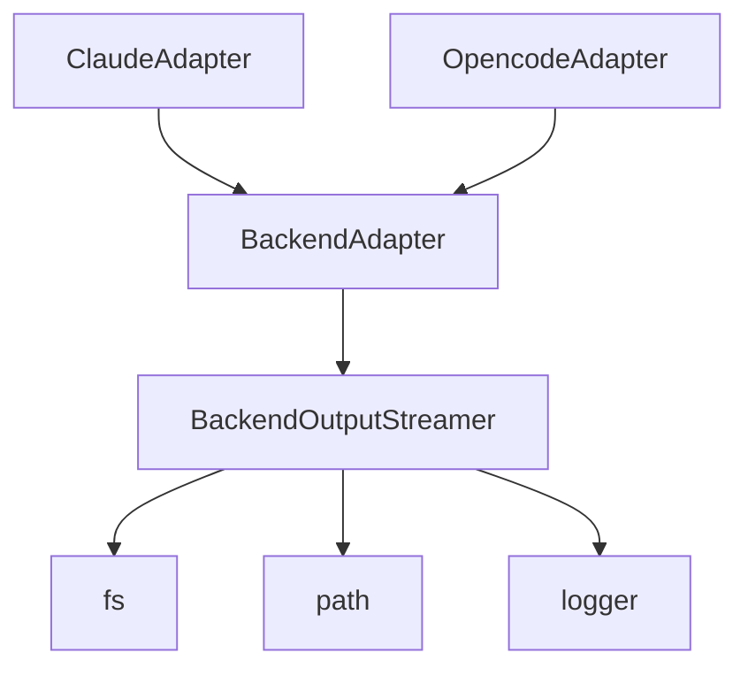

# バックエンド出力ストリーミング 詳細設計書

## メタ情報

| 項目 | 内容 |
|------|------|
| ドキュメントID | DETAILED-ORCH-003-F103 |
| バージョン | 1.0.0 |
| ステータス | ドラフト |
| 作成日 | 2026-01-26 |
| 最終更新日 | 2026-01-26 |
| 作成者 | AI Assistant |
| 承認者 | - |
| 関連基本設計書 | BASIC-ORCH-003 v1.0.0 |
| 対象機能 | F-103 |

---

## 1. 概要

### 1.1 目的

AIエージェント（claude/opencode）の標準出力・標準エラー出力をリアルタイムで`backend.log`に書き込みます。これにより、AIエージェントの動作をリアルタイムで監視でき、デバッグやトラブルシューティングが容易になります。

### 1.2 スコープ

#### スコープ内

- AIエージェントの標準出力・標準エラー出力のキャプチャ
- `.agent/<task-id>/backend.log`へのリアルタイム書き込み
- BackendOutputStreamerクラスの実装
- 既存のLogWriterとの統合

#### スコープ外

- ログローテーション機能
- ログフィルタリング機能
- ログ圧縮機能
- 既存の`task.log`の変更

### 1.3 参照ドキュメント

| ドキュメント | パス | 参照箇所 |
|-------------|------|---------|
| 基本設計書 | docs/designs/basic/BASIC-ORCH-003_v2.0.0機能.md | セクション3.1, 6.3 |
| 既存LogWriter | src/core/log-writer.ts | 参考実装 |
| 既存LogStreamer | src/core/log-streamer.ts | 参考実装 |

---

## 2. 処理フロー

### 2.1 ストリーミングフロー



### 2.2 シーケンス図

```mermaid
sequenceDiagram
    participant Loop as LoopEngine
    participant Adapter as BackendAdapter
    participant Streamer as BackendOutputStreamer
    participant File as backend.log
    participant Agent as AIエージェント
    
    Loop->>Adapter: execute()
    Adapter->>Streamer: new BackendOutputStreamer(logPath)
    Adapter->>Agent: Bun.spawn(command)
    
    loop AIエージェント実行中
        Agent->>Streamer: stdout data
        Streamer->>File: write(data)
        Agent->>Streamer: stderr data
        Streamer->>File: write(data)
    end
    
    Agent-->>Adapter: exit
    Adapter->>Streamer: close()
    Streamer->>File: flush & close
    Adapter-->>Loop: result
```

---

## 3. 機能要件

### 3.1 ログファイル構成

| パス | 説明 |
|------|------|
| `.agent/` | エージェント作業ディレクトリ |
| `.agent/task-1234567890-42/` | タスクログディレクトリ |
| `.agent/task-1234567890-42/task.log` | orchestrator-hybridのログ（既存） |
| `.agent/task-1234567890-42/backend.log` | バックエンド出力（新規） |
| `.agent/task-1234567890-42/events.jsonl` | イベント履歴（既存） |

### 3.2 ログフォーマット

```
[2026-01-26T10:00:00.123Z] [stdout] AIエージェントの出力
[2026-01-26T10:00:01.456Z] [stderr] エラーメッセージ
[2026-01-26T10:00:02.789Z] [stdout] 続きの出力
```

### 3.3 使用例

```bash
# AIエージェント実行中に別ターミナルで監視
orch logs --task task-1234567890-42 --source backend --follow

# 最後の50行を表示
orch logs --task task-1234567890-42 --source backend --lines 50
```

---

## 4. 設計方針

### 4.1 設計原則

| 原則 | 説明 |
|------|------|
| **リアルタイム性** | データを受信次第、即座にファイルに書き込む |
| **非ブロッキング** | ストリーミングがメイン処理をブロックしない |
| **エラー耐性** | ログ書き込み失敗がAIエージェント実行を停止させない |
| **既存機能との共存** | 既存のLogWriterと競合しない |

### 4.2 非機能要件

| 要件 | 目標値 | 測定方法 |
|------|--------|----------|
| 書き込み遅延 | 500ms以内 | 統合テスト |
| メモリ使用量 | 5MB以内 | プロファイリング |
| ファイルサイズ上限 | 100MB（警告） | ログローテーション推奨 |

---

## 5. インターフェース設計

### 5.1 BackendOutputStreamerインターフェース

```typescript
// src/core/backend-output-streamer.ts

export interface BackendOutputStreamerConfig {
  /**
   * ログファイルパス
   */
  logPath: string;

  /**
   * タイムスタンプを付与するか
   * @default true
   */
  includeTimestamp?: boolean;

  /**
   * バッファサイズ（バイト）
   * @default 4096
   */
  bufferSize?: number;
}

export interface BackendOutputStreamer {
  /**
   * stdoutデータを書き込む
   * 
   * @param data - データ
   */
  writeStdout(data: string | Buffer): void;

  /**
   * stderrデータを書き込む
   * 
   * @param data - データ
   */
  writeStderr(data: string | Buffer): void;

  /**
   * ストリーマーを閉じる
   */
  close(): void;
}
```

---

## 6. データ構造

### 6.1 ログエントリ構造

```typescript
interface LogEntry {
  timestamp: string;      // ISO 8601形式
  stream: "stdout" | "stderr";
  content: string;
}
```

### 6.2 ファイル書き込みフォーマット

```typescript
function formatLogEntry(entry: LogEntry): string {
  return `[${entry.timestamp}] [${entry.stream}] ${entry.content}\n`;
}
```

---

## 7. エラーハンドリング

### 7.1 エラーケース

| エラーケース | 処理 |
|-------------|------|
| ログディレクトリが存在しない | 自動作成 |
| ログファイル書き込み失敗 | 警告ログを出力、処理は継続 |
| ディスク容量不足 | エラーログを出力、処理は継続 |
| ログファイルサイズ超過 | 警告ログを出力、ローテーション推奨 |

### 7.2 エラーメッセージ

```typescript
// ログファイル書き込み失敗
logger.warn(`Failed to write to backend.log: ${error.message}`);

// ファイルサイズ超過
logger.warn(`backend.log size exceeds 100MB, consider log rotation`);
```

---

## 8. 依存関係

### 8.1 依存モジュール



### 8.2 影響範囲

| ファイル | 変更内容 | 影響度 |
|---------|---------|--------|
| `src/core/backend-output-streamer.ts` | 新規作成 | 中 |
| `src/adapters/base.ts` | BackendOutputStreamer統合 | 中 |
| `src/adapters/claude.ts` | ストリーミング有効化 | 低 |
| `src/adapters/opencode.ts` | ストリーミング有効化 | 低 |

---

## 9. テスト方針

### 9.1 テストケース

| # | テストケース | 期待結果 |
|---|-------------|---------|
| 1 | stdoutデータ書き込み | backend.logに[stdout]タグ付きで書き込まれる |
| 2 | stderrデータ書き込み | backend.logに[stderr]タグ付きで書き込まれる |
| 3 | タイムスタンプ付与 | 各行にISO 8601形式のタイムスタンプが付与される |
| 4 | バッファリング | bufferSizeに達するまでメモリにバッファリング |
| 5 | close()呼び出し | バッファをフラッシュしてファイルを閉じる |
| 6 | ログディレクトリ自動作成 | 存在しない場合は自動作成される |
| 7 | 書き込み失敗時の継続 | エラーログを出力し、処理は継続 |

### 9.2 テストコード例

```typescript
// src/core/backend-output-streamer.test.ts

import { describe, expect, it } from "bun:test";
import { existsSync, mkdirSync, readFileSync, rmSync } from "node:fs";
import { BackendOutputStreamer } from "./backend-output-streamer.js";

const TEST_DIR = ".test-backend-output";
const TEST_LOG_PATH = `${TEST_DIR}/backend.log`;

describe("BackendOutputStreamer", () => {
  beforeEach(() => {
    if (existsSync(TEST_DIR)) {
      rmSync(TEST_DIR, { recursive: true });
    }
    mkdirSync(TEST_DIR, { recursive: true });
  });

  afterEach(() => {
    if (existsSync(TEST_DIR)) {
      rmSync(TEST_DIR, { recursive: true });
    }
  });

  it("should write stdout data to log file", () => {
    const streamer = new BackendOutputStreamer({
      logPath: TEST_LOG_PATH,
      includeTimestamp: false,
    });

    streamer.writeStdout("Hello, World!");
    streamer.close();

    const content = readFileSync(TEST_LOG_PATH, "utf-8");
    expect(content).toContain("[stdout] Hello, World!");
  });

  it("should write stderr data to log file", () => {
    const streamer = new BackendOutputStreamer({
      logPath: TEST_LOG_PATH,
      includeTimestamp: false,
    });

    streamer.writeStderr("Error occurred");
    streamer.close();

    const content = readFileSync(TEST_LOG_PATH, "utf-8");
    expect(content).toContain("[stderr] Error occurred");
  });

  it("should include timestamp when enabled", () => {
    const streamer = new BackendOutputStreamer({
      logPath: TEST_LOG_PATH,
      includeTimestamp: true,
    });

    streamer.writeStdout("Test");
    streamer.close();

    const content = readFileSync(TEST_LOG_PATH, "utf-8");
    expect(content).toMatch(/\[\d{4}-\d{2}-\d{2}T\d{2}:\d{2}:\d{2}\.\d{3}Z\]/);
  });

  it("should create log directory if not exists", () => {
    const nestedPath = `${TEST_DIR}/nested/dir/backend.log`;
    const streamer = new BackendOutputStreamer({
      logPath: nestedPath,
    });

    streamer.writeStdout("Test");
    streamer.close();

    expect(existsSync(nestedPath)).toBe(true);
  });
});
```

---

## 10. 実装タスク

| タスクID | タスク名 | 見積もり | 依存 |
|---------|---------|---------|------|
| TASK-103-1 | BackendOutputStreamerクラス実装 | 3h | なし |
| TASK-103-2 | BackendOutputStreamer単体テスト | 2h | TASK-103-1 |
| TASK-103-3 | BackendAdapter統合 | 2h | TASK-103-1 |
| TASK-103-4 | ClaudeAdapter統合 | 1h | TASK-103-3 |
| TASK-103-5 | OpencodeAdapter統合 | 1h | TASK-103-3 |
| TASK-103-6 | 統合テスト | 2h | TASK-103-4, TASK-103-5 |
| TASK-103-7 | ドキュメント更新 | 1h | TASK-103-6 |

**合計見積もり**: 12時間

---

## 11. 変更履歴

| バージョン | 日付 | 変更内容 | 作成者 |
|-----------|------|----------|--------|
| 1.0.0 | 2026-01-26 | 初版作成 | AI Assistant |
