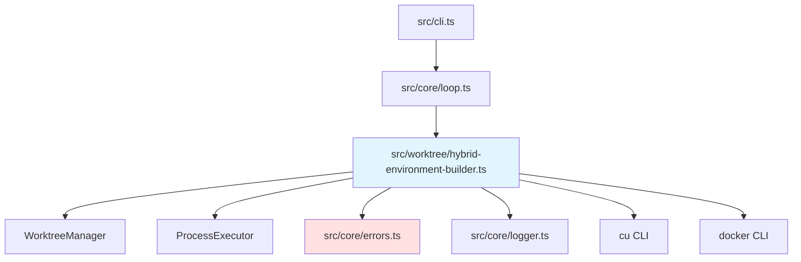

# Worktree + Container-Use統合 バックエンド設計書

## メタ情報

| 項目 | 内容 |
|------|------|
| ドキュメントID | DETAILED-ORCH-003-F202-BE |
| バージョン | 1.0.0 |
| ステータス | ドラフト |
| 作成日 | 2026-01-26 |
| 最終更新日 | 2026-01-26 |
| 作成者 | AI Assistant |
| 承認者 | - |
| 関連詳細設計書 | DETAILED-ORCH-003-F202 |
| 対象機能 | F-202 |

---

## 1. 概要

Worktree + Container-Use統合機能のバックエンド実装仕様を定義します。

---

## 2. ファイル構成

| ファイル | 説明 | 新規/変更 |
|---------|------|----------|
| `src/worktree/hybrid-environment-builder.ts` | HybridEnvironmentBuilderクラス | 新規 |
| `src/worktree/hybrid-environment-builder.test.ts` | 単体テスト | 新規 |
| `src/core/errors.ts` | HybridEnvironmentError追加 | 変更 |

---

## 3. クラス詳細設計

### 3.1 HybridEnvironmentBuilder

#### ファイル: `src/worktree/hybrid-environment-builder.ts`

```typescript
import { ProcessExecutor, BunProcessExecutor } from "../core/process-executor.js";
import { WorktreeManager, WorktreeInfo } from "./worktree-manager.js";
import { HybridEnvironmentError } from "../core/errors.js";
import { logger } from "../core/logger.js";
import type { WorktreeConfig, SandboxConfig, ContainerConfig } from "../core/types.js";

/**
 * ハイブリッド環境ビルダー設定
 */
export interface HybridEnvironmentBuilderConfig {
  worktree: WorktreeConfig;
  sandbox: SandboxConfig;
  container?: ContainerConfig;
}

/**
 * 構築された環境情報
 */
export interface EnvironmentInfo {
  issueNumber: number;
  type: "hybrid" | "worktree-only" | "container-only" | "host";
  worktree?: WorktreeInfo;
  environmentType: "container-use" | "docker" | "host";
  environmentId?: string;
  workingDirectory: string;
}

/**
 * ハイブリッド環境を構築するクラス
 * 
 * @example
 * ```typescript
 * const builder = new HybridEnvironmentBuilder(
 *   {
 *     worktree: { enabled: true, baseDir: ".worktrees", ... },
 *     sandbox: { type: "container-use", ... },
 *   },
 *   worktreeManager
 * );
 * 
 * const env = await builder.buildEnvironment(42);
 * console.log(env.type); // "hybrid"
 * console.log(env.workingDirectory); // ".worktrees/issue-42"
 * ```
 */
export class HybridEnvironmentBuilder {
  private readonly config: HybridEnvironmentBuilderConfig;
  private readonly worktreeManager: WorktreeManager;
  private readonly executor: ProcessExecutor;

  constructor(
    config: HybridEnvironmentBuilderConfig,
    worktreeManager: WorktreeManager,
    executor: ProcessExecutor = new BunProcessExecutor()
  ) {
    this.config = config;
    this.worktreeManager = worktreeManager;
    this.executor = executor;
  }

  /**
   * 環境を構築
   * 
   * @param issueNumber - Issue番号
   * @returns EnvironmentInfo
   * @throws HybridEnvironmentError - 構築失敗時
   */
  async buildEnvironment(issueNumber: number): Promise<EnvironmentInfo> {
    const worktreeEnabled = this.config.worktree.enabled;
    const sandboxType = this.config.sandbox.type;

    logger.info(`環境構築開始: Issue #${issueNumber}`);
    logger.debug(`worktree: ${worktreeEnabled}, sandbox: ${sandboxType}`);

    // パターンA: ハイブリッド（worktree + container-use）
    if (worktreeEnabled && sandboxType === "container-use") {
      return await this.buildHybridContainerUse(issueNumber);
    }

    // パターンB: ハイブリッド（worktree + docker）
    if (worktreeEnabled && sandboxType === "docker") {
      return await this.buildHybridDocker(issueNumber);
    }

    // パターンC: worktreeのみ（ホスト実行）
    if (worktreeEnabled && sandboxType === "host") {
      return await this.buildWorktreeOnly(issueNumber);
    }

    // パターンD: container-useのみ
    if (!worktreeEnabled && sandboxType === "container-use") {
      return await this.buildContainerUseOnly(issueNumber);
    }

    // パターンE: Dockerのみ
    if (!worktreeEnabled && sandboxType === "docker") {
      return await this.buildDockerOnly(issueNumber);
    }

    // パターンF: ホスト実行
    return await this.buildHostOnly(issueNumber);
  }

  /**
   * 環境を削除
   * 
   * @param issueNumber - Issue番号
   * @throws HybridEnvironmentError - 削除失敗時
   */
  async destroyEnvironment(issueNumber: number): Promise<void> {
    logger.info(`環境削除開始: Issue #${issueNumber}`);

    const worktree = await this.worktreeManager.getWorktree(issueNumber);
    if (!worktree) {
      logger.warn(`環境が見つかりません: Issue #${issueNumber}`);
      return;
    }

    try {
      // container-use環境削除
      if (worktree.environmentType === "container-use" && worktree.environmentId) {
        await this.destroyContainerUse(worktree.environmentId);
      }

      // Docker環境削除
      if (worktree.environmentType === "docker" && worktree.environmentId) {
        await this.destroyDocker(worktree.environmentId);
      }

      // worktree削除
      if (this.config.worktree.enabled) {
        await this.worktreeManager.removeWorktree(issueNumber, true);
      }

      logger.success(`環境削除完了: Issue #${issueNumber}`);
    } catch (error) {
      throw new HybridEnvironmentError(
        `環境削除失敗: ${error.message}`,
        { issueNumber, error }
      );
    }
  }

  /**
   * パターンA: worktree + container-use
   */
  private async buildHybridContainerUse(issueNumber: number): Promise<EnvironmentInfo> {
    // worktree作成
    const worktree = await this.worktreeManager.createWorktree(
      issueNumber,
      "container-use"
    );

    if (!worktree) {
      throw new HybridEnvironmentError("worktree作成失敗", { issueNumber });
    }

    // container-use環境作成（worktreeパスをソースとして指定）
    const envId = await this.createContainerUse(worktree.path);

    // worktreeにenvironmentIdを保存
    // Note: WorktreeManagerにupdateメソッドを追加する必要がある
    // ここでは簡易的にworktrees.jsonを直接更新する想定

    return {
      issueNumber,
      type: "hybrid",
      worktree,
      environmentType: "container-use",
      environmentId: envId,
      workingDirectory: worktree.path,
    };
  }

  /**
   * パターンB: worktree + docker
   */
  private async buildHybridDocker(issueNumber: number): Promise<EnvironmentInfo> {
    // worktree作成
    const worktree = await this.worktreeManager.createWorktree(
      issueNumber,
      "docker"
    );

    if (!worktree) {
      throw new HybridEnvironmentError("worktree作成失敗", { issueNumber });
    }

    // Docker環境作成（worktreeパスをマウント）
    const containerId = await this.createDocker(worktree.path);

    return {
      issueNumber,
      type: "hybrid",
      worktree,
      environmentType: "docker",
      environmentId: containerId,
      workingDirectory: worktree.path,
    };
  }

  /**
   * パターンC: worktreeのみ
   */
  private async buildWorktreeOnly(issueNumber: number): Promise<EnvironmentInfo> {
    const worktree = await this.worktreeManager.createWorktree(
      issueNumber,
      "host"
    );

    if (!worktree) {
      throw new HybridEnvironmentError("worktree作成失敗", { issueNumber });
    }

    return {
      issueNumber,
      type: "worktree-only",
      worktree,
      environmentType: "host",
      workingDirectory: worktree.path,
    };
  }

  /**
   * パターンD: container-useのみ
   */
  private async buildContainerUseOnly(issueNumber: number): Promise<EnvironmentInfo> {
    const envId = await this.createContainerUse(process.cwd());

    return {
      issueNumber,
      type: "container-only",
      environmentType: "container-use",
      environmentId: envId,
      workingDirectory: process.cwd(),
    };
  }

  /**
   * パターンE: Dockerのみ
   */
  private async buildDockerOnly(issueNumber: number): Promise<EnvironmentInfo> {
    const containerId = await this.createDocker(process.cwd());

    return {
      issueNumber,
      type: "container-only",
      environmentType: "docker",
      environmentId: containerId,
      workingDirectory: process.cwd(),
    };
  }

  /**
   * パターンF: ホスト実行
   */
  private async buildHostOnly(issueNumber: number): Promise<EnvironmentInfo> {
    return {
      issueNumber,
      type: "host",
      environmentType: "host",
      workingDirectory: process.cwd(),
    };
  }

  /**
   * container-use環境を作成
   * 
   * @param sourcePath - ソースパス
   * @returns 環境ID
   */
  private async createContainerUse(sourcePath: string): Promise<string> {
    const image = this.config.container?.image || "node:20";
    const title = `orchestrator-hybrid-${Date.now()}`;

    const result = await this.executor.spawn("cu", [
      "env",
      "create",
      "--source",
      sourcePath,
      "--title",
      title,
      "--image",
      image,
    ]);

    if (result.exitCode !== 0) {
      throw new HybridEnvironmentError(
        `container-use環境作成失敗: ${result.stderr}`,
        { stderr: result.stderr }
      );
    }

    // 環境IDを抽出（cu env createの出力から）
    const envId = this.extractEnvId(result.stdout);
    logger.success(`container-use環境作成完了: ${envId}`);
    return envId;
  }

  /**
   * Docker環境を作成
   * 
   * @param sourcePath - ソースパス
   * @returns コンテナID
   */
  private async createDocker(sourcePath: string): Promise<string> {
    const image = this.config.sandbox.docker?.image || "node:20-alpine";
    const network = this.config.sandbox.docker?.network || "none";

    const result = await this.executor.spawn("docker", [
      "run",
      "-d",
      "-v",
      `${sourcePath}:/workspace`,
      `--network=${network}`,
      image,
      "tail",
      "-f",
      "/dev/null", // コンテナを起動したままにする
    ]);

    if (result.exitCode !== 0) {
      throw new HybridEnvironmentError(
        `Docker環境作成失敗: ${result.stderr}`,
        { stderr: result.stderr }
      );
    }

    const containerId = result.stdout.trim();
    logger.success(`Docker環境作成完了: ${containerId}`);
    return containerId;
  }

  /**
   * container-use環境を削除
   * 
   * @param envId - 環境ID
   */
  private async destroyContainerUse(envId: string): Promise<void> {
    const result = await this.executor.spawn("cu", [
      "env",
      "delete",
      envId,
      "--yes",
    ]);

    if (result.exitCode !== 0) {
      logger.warn(`container-use環境削除失敗: ${result.stderr}`);
    } else {
      logger.success(`container-use環境削除完了: ${envId}`);
    }
  }

  /**
   * Docker環境を削除
   * 
   * @param containerId - コンテナID
   */
  private async destroyDocker(containerId: string): Promise<void> {
    const result = await this.executor.spawn("docker", [
      "rm",
      "-f",
      containerId,
    ]);

    if (result.exitCode !== 0) {
      logger.warn(`Docker環境削除失敗: ${result.stderr}`);
    } else {
      logger.success(`Docker環境削除完了: ${containerId}`);
    }
  }

  /**
   * cu env createの出力から環境IDを抽出
   * 
   * @param stdout - 標準出力
   * @returns 環境ID
   */
  private extractEnvId(stdout: string): string {
    // cu env createの出力例:
    // "Created environment: abc-123"
    // または
    // "abc-123"
    const match = stdout.match(/([a-z]+-[a-z]+)/);
    if (!match) {
      throw new HybridEnvironmentError(
        "環境IDの抽出に失敗しました",
        { stdout }
      );
    }
    return match[1];
  }
}
```

---

## 4. エラークラス追加

### ファイル: `src/core/errors.ts`（追加分）

```typescript
/**
 * ハイブリッド環境構築エラー
 * 
 * @example
 * ```typescript
 * throw new HybridEnvironmentError("環境構築失敗", { issueNumber: 42 });
 * ```
 */
export class HybridEnvironmentError extends Error {
  public readonly details?: Record<string, unknown>;

  constructor(message: string, details?: Record<string, unknown>) {
    super(message);
    this.name = "HybridEnvironmentError";
    this.details = details;
  }
}
```

---

## 5. テスト設計

### ファイル: `src/worktree/hybrid-environment-builder.test.ts`

```typescript
import { describe, it, expect, mock, beforeEach } from "bun:test";
import { HybridEnvironmentBuilder, HybridEnvironmentBuilderConfig } from "./hybrid-environment-builder.js";
import { WorktreeManager } from "./worktree-manager.js";
import { HybridEnvironmentError } from "../core/errors.js";
import type { ProcessExecutor } from "../core/process-executor.js";

describe("HybridEnvironmentBuilder", () => {
  let mockExecutor: ProcessExecutor;
  let mockWorktreeManager: WorktreeManager;
  let defaultConfig: HybridEnvironmentBuilderConfig;

  beforeEach(() => {
    mockExecutor = {
      spawn: mock(() => Promise.resolve({ stdout: "abc-123", stderr: "", exitCode: 0 })),
    };

    mockWorktreeManager = {
      createWorktree: mock(() =>
        Promise.resolve({
          issueNumber: 42,
          path: ".worktrees/issue-42",
          branch: "feature/issue-42",
          environmentType: "container-use",
          environmentId: null,
          createdAt: new Date().toISOString(),
          status: "active",
        })
      ),
      removeWorktree: mock(() => Promise.resolve()),
      getWorktree: mock(() => Promise.resolve(null)),
      listWorktrees: mock(() => Promise.resolve([])),
    } as any;

    defaultConfig = {
      worktree: {
        enabled: true,
        baseDir: ".worktrees",
        autoCleanup: true,
        copyEnvFiles: [".env"],
      },
      sandbox: {
        type: "container-use",
      },
      container: {
        enabled: true,
        image: "node:20",
      },
    };
  });

  describe("buildEnvironment", () => {
    it("パターンA: worktree + container-use", async () => {
      const builder = new HybridEnvironmentBuilder(
        defaultConfig,
        mockWorktreeManager,
        mockExecutor
      );

      const env = await builder.buildEnvironment(42);

      expect(env.type).toBe("hybrid");
      expect(env.environmentType).toBe("container-use");
      expect(env.worktree).toBeDefined();
      expect(env.environmentId).toBe("abc-123");
      expect(env.workingDirectory).toBe(".worktrees/issue-42");

      // worktree作成が呼ばれたか確認
      expect(mockWorktreeManager.createWorktree).toHaveBeenCalledWith(
        42,
        "container-use"
      );

      // cu env create が呼ばれたか確認
      expect(mockExecutor.spawn).toHaveBeenCalledWith("cu", [
        "env",
        "create",
        "--source",
        ".worktrees/issue-42",
        "--title",
        expect.any(String),
        "--image",
        "node:20",
      ]);
    });

    it("パターンB: worktree + docker", async () => {
      const dockerConfig = {
        ...defaultConfig,
        sandbox: {
          type: "docker" as const,
          docker: {
            image: "node:20-alpine",
            network: "none" as const,
            timeout: 300,
          },
        },
      };

      const builder = new HybridEnvironmentBuilder(
        dockerConfig,
        mockWorktreeManager,
        mockExecutor
      );

      const env = await builder.buildEnvironment(42);

      expect(env.type).toBe("hybrid");
      expect(env.environmentType).toBe("docker");
      expect(env.worktree).toBeDefined();

      // docker run が呼ばれたか確認
      expect(mockExecutor.spawn).toHaveBeenCalledWith("docker", [
        "run",
        "-d",
        "-v",
        ".worktrees/issue-42:/workspace",
        "--network=none",
        "node:20-alpine",
        "tail",
        "-f",
        "/dev/null",
      ]);
    });

    it("パターンC: worktreeのみ", async () => {
      const worktreeOnlyConfig = {
        ...defaultConfig,
        sandbox: {
          type: "host" as const,
        },
      };

      const builder = new HybridEnvironmentBuilder(
        worktreeOnlyConfig,
        mockWorktreeManager,
        mockExecutor
      );

      const env = await builder.buildEnvironment(42);

      expect(env.type).toBe("worktree-only");
      expect(env.environmentType).toBe("host");
      expect(env.worktree).toBeDefined();
      expect(env.environmentId).toBeUndefined();

      // container-use/docker は呼ばれていないか確認
      expect(mockExecutor.spawn).not.toHaveBeenCalled();
    });

    it("パターンD: container-useのみ", async () => {
      const containerOnlyConfig = {
        ...defaultConfig,
        worktree: {
          ...defaultConfig.worktree,
          enabled: false,
        },
      };

      const builder = new HybridEnvironmentBuilder(
        containerOnlyConfig,
        mockWorktreeManager,
        mockExecutor
      );

      const env = await builder.buildEnvironment(42);

      expect(env.type).toBe("container-only");
      expect(env.environmentType).toBe("container-use");
      expect(env.worktree).toBeUndefined();

      // worktree作成が呼ばれていないか確認
      expect(mockWorktreeManager.createWorktree).not.toHaveBeenCalled();
    });

    it("パターンF: ホスト実行", async () => {
      const hostOnlyConfig = {
        ...defaultConfig,
        worktree: {
          ...defaultConfig.worktree,
          enabled: false,
        },
        sandbox: {
          type: "host" as const,
        },
      };

      const builder = new HybridEnvironmentBuilder(
        hostOnlyConfig,
        mockWorktreeManager,
        mockExecutor
      );

      const env = await builder.buildEnvironment(42);

      expect(env.type).toBe("host");
      expect(env.environmentType).toBe("host");
      expect(env.worktree).toBeUndefined();
      expect(env.environmentId).toBeUndefined();

      // 何も呼ばれていないか確認
      expect(mockWorktreeManager.createWorktree).not.toHaveBeenCalled();
      expect(mockExecutor.spawn).not.toHaveBeenCalled();
    });
  });

  describe("destroyEnvironment", () => {
    it("ハイブリッド環境を削除する", async () => {
      mockWorktreeManager.getWorktree = mock(() =>
        Promise.resolve({
          issueNumber: 42,
          path: ".worktrees/issue-42",
          branch: "feature/issue-42",
          environmentType: "container-use",
          environmentId: "abc-123",
          createdAt: new Date().toISOString(),
          status: "active",
        })
      );

      const builder = new HybridEnvironmentBuilder(
        defaultConfig,
        mockWorktreeManager,
        mockExecutor
      );

      await builder.destroyEnvironment(42);

      // cu env delete が呼ばれたか確認
      expect(mockExecutor.spawn).toHaveBeenCalledWith("cu", [
        "env",
        "delete",
        "abc-123",
        "--yes",
      ]);

      // worktree削除が呼ばれたか確認
      expect(mockWorktreeManager.removeWorktree).toHaveBeenCalledWith(42, true);
    });

    it("存在しない環境の削除は何もしない", async () => {
      const builder = new HybridEnvironmentBuilder(
        defaultConfig,
        mockWorktreeManager,
        mockExecutor
      );

      await builder.destroyEnvironment(999);

      expect(mockExecutor.spawn).not.toHaveBeenCalled();
      expect(mockWorktreeManager.removeWorktree).not.toHaveBeenCalled();
    });
  });
});
```

---

## 6. 依存関係



---

## 7. 実装手順

1. `src/core/errors.ts` に `HybridEnvironmentError` を追加
2. `src/worktree/hybrid-environment-builder.ts` を新規作成
3. `src/worktree/hybrid-environment-builder.test.ts` を新規作成
4. テスト実行・パス確認

---

## 8. 変更履歴

| バージョン | 日付 | 変更内容 | 変更者 |
|-----------|------|---------|--------|
| 1.0.0 | 2026-01-26 | 初版作成 | AI Assistant |
