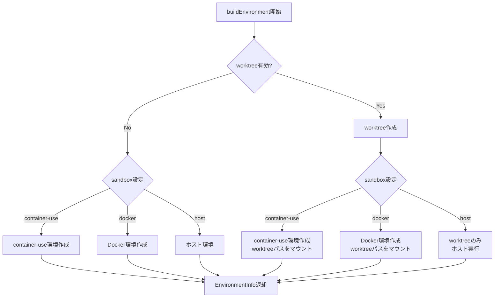

# Worktree + Container-Use統合 詳細設計書

## メタ情報

| 項目 | 内容 |
|------|------|
| ドキュメントID | DETAILED-ORCH-003-F202 |
| バージョン | 1.0.0 |
| ステータス | ドラフト |
| 作成日 | 2026-01-26 |
| 最終更新日 | 2026-01-26 |
| 作成者 | AI Assistant |
| 承認者 | - |
| 関連基本設計書 | BASIC-ORCH-003 v1.0.0 |
| 対象機能 | F-202 |

---

## 1. 概要

### 1.1 目的

worktree（ファイルシステム分離）とcontainer-use（環境分離）を組み合わせたハイブリッド環境を自動構築します。これにより、最も安全で完全に分離された並列実行環境を実現します。

### 1.2 スコープ

#### スコープ内

- worktree + container-use環境の自動構築
- worktree + Docker環境の自動構築
- worktreeのみ（ホスト実行）の構築
- 環境タイプの自動判定とフォールバック
- container-use環境のworktreeパスへのマウント

#### スコープ外

- container-use環境の詳細設定（既存機能を使用）
- Docker環境の詳細設定（既存機能を使用）
- worktree内でのコード実行（Loop Engineで実装）

### 1.3 参照ドキュメント

| ドキュメント | パス | 参照箇所 |
|-------------|------|---------|
| 基本設計書 | docs/designs/basic/BASIC-ORCH-003_v2.0.0機能.md | セクション3.2, 3.3 |
| WorktreeManager設計書 | docs/designs/detailed/v2.0.0機能/phase2-並列実行環境/WorktreeManager/詳細設計書.md | - |

---

## 2. 処理フロー

### 2.1 ハイブリッド環境構築フロー



### 2.2 環境組み合わせパターン

| パターン | worktree | sandbox | 動作 |
|---------|----------|---------|------|
| **A: ハイブリッド** | ✅ enabled | container-use | worktree + container-use環境 |
| **B: worktree + Docker** | ✅ enabled | docker | worktree + Dockerコンテナ |
| **C: worktreeのみ** | ✅ enabled | host | worktreeのみ（ホスト実行） |
| **D: container-useのみ** | ❌ disabled | container-use | container-use環境のみ |
| **E: Dockerのみ** | ❌ disabled | docker | Dockerコンテナのみ |
| **F: ホスト実行** | ❌ disabled | host | ホスト環境で直接実行 |

### 2.3 シーケンス図

```mermaid
sequenceDiagram
    autonumber
    participant Loop as LoopEngine
    participant HEB as HybridEnvironmentBuilder
    participant WM as WorktreeManager
    participant CU as container-use CLI
    participant Docker as Docker CLI

    Loop->>HEB: buildEnvironment(issueNumber, config)
    
    alt worktree有効 & sandbox=container-use
        HEB->>WM: createWorktree(issueNumber, "container-use")
        WM-->>HEB: WorktreeInfo
        HEB->>CU: cu env create --source <worktree-path>
        CU-->>HEB: environmentId
        HEB->>WM: updateEnvironmentId(issueNumber, envId)
        HEB-->>Loop: EnvironmentInfo (hybrid)
    
    else worktree有効 & sandbox=docker
        HEB->>WM: createWorktree(issueNumber, "docker")
        WM-->>HEB: WorktreeInfo
        HEB->>Docker: docker run -v <worktree-path>:/workspace
        Docker-->>HEB: containerId
        HEB->>WM: updateEnvironmentId(issueNumber, containerId)
        HEB-->>Loop: EnvironmentInfo (hybrid)
    
    else worktree有効 & sandbox=host
        HEB->>WM: createWorktree(issueNumber, "host")
        WM-->>HEB: WorktreeInfo
        HEB-->>Loop: EnvironmentInfo (worktree-only)
    
    else worktree無効 & sandbox=container-use
        HEB->>CU: cu env create
        CU-->>HEB: environmentId
        HEB-->>Loop: EnvironmentInfo (container-only)
    end
```

---

## 3. インターフェース定義

### 3.1 HybridEnvironmentBuilderConfig

```typescript
/**
 * ハイブリッド環境ビルダー設定
 */
export interface HybridEnvironmentBuilderConfig {
  /**
   * worktree設定
   */
  worktree: WorktreeConfig;

  /**
   * sandbox設定
   */
  sandbox: SandboxConfig;

  /**
   * container設定（既存）
   */
  container?: ContainerConfig;
}
```

### 3.2 EnvironmentInfo

```typescript
/**
 * 構築された環境情報
 */
export interface EnvironmentInfo {
  /**
   * Issue番号
   */
  issueNumber: number;

  /**
   * 環境タイプ
   * - hybrid: worktree + container-use/docker
   * - worktree-only: worktreeのみ
   * - container-only: container-use/dockerのみ
   * - host: ホスト環境
   */
  type: "hybrid" | "worktree-only" | "container-only" | "host";

  /**
   * worktree情報（worktree使用時）
   */
  worktree?: WorktreeInfo;

  /**
   * 実行環境タイプ
   */
  environmentType: "container-use" | "docker" | "host";

  /**
   * 環境ID（container-use/dockerの場合）
   */
  environmentId?: string;

  /**
   * 作業ディレクトリ
   * - hybrid: worktreeパス
   * - worktree-only: worktreeパス
   * - container-only: カレントディレクトリ
   * - host: カレントディレクトリ
   */
  workingDirectory: string;
}
```

### 3.3 HybridEnvironmentBuilderクラス

```typescript
/**
 * ハイブリッド環境を構築するクラス
 */
export class HybridEnvironmentBuilder {
  /**
   * コンストラクタ
   * @param config - 設定
   * @param worktreeManager - WorktreeManager
   * @param executor - プロセス実行器（DI用）
   */
  constructor(
    config: HybridEnvironmentBuilderConfig,
    worktreeManager: WorktreeManager,
    executor?: ProcessExecutor
  );

  /**
   * 環境を構築
   * 
   * @param issueNumber - Issue番号
   * @returns EnvironmentInfo
   * @throws HybridEnvironmentError - 構築失敗時
   */
  buildEnvironment(issueNumber: number): Promise<EnvironmentInfo>;

  /**
   * 環境を削除
   * 
   * @param issueNumber - Issue番号
   * @throws HybridEnvironmentError - 削除失敗時
   */
  destroyEnvironment(issueNumber: number): Promise<void>;
}
```

---

## 4. 設定例

### 4.1 パターンA: ハイブリッド（worktree + container-use）

```yaml
worktree:
  enabled: true
  base_dir: ".worktrees"
  auto_cleanup: true
  copy_env_files:
    - ".env"

container:
  enabled: true
  image: node:20

sandbox:
  type: container-use
```

**動作**:
1. `.worktrees/issue-42/` にworktreeを作成
2. container-use環境を作成し、worktreeパスをソースとして指定
3. container-use環境内でworktreeのコードが実行される

### 4.2 パターンB: worktree + Docker

```yaml
worktree:
  enabled: true
  base_dir: ".worktrees"
  auto_cleanup: true

container:
  enabled: false

sandbox:
  type: docker
  docker:
    image: node:20-alpine
    network: none
```

**動作**:
1. `.worktrees/issue-42/` にworktreeを作成
2. Dockerコンテナを起動し、worktreeパスを `/workspace` にマウント
3. コンテナ内でworktreeのコードが実行される

### 4.3 パターンC: worktreeのみ（ホスト実行）

```yaml
worktree:
  enabled: true
  base_dir: ".worktrees"
  auto_cleanup: true

container:
  enabled: false

sandbox:
  type: host
```

**動作**:
1. `.worktrees/issue-42/` にworktreeを作成
2. worktree内でホスト環境として直接AIエージェントが作業
3. 最も軽量だが、環境分離はない

---

## 5. エラーハンドリング

### 5.1 HybridEnvironmentError

```typescript
/**
 * ハイブリッド環境構築エラー
 */
export class HybridEnvironmentError extends Error {
  constructor(message: string, details?: Record<string, unknown>) {
    super(message);
    this.name = "HybridEnvironmentError";
    this.details = details;
  }
}
```

### 5.2 エラーケース

| エラーケース | エラーメッセージ | 対処 |
|-------------|----------------|------|
| worktree作成失敗 | `worktree作成失敗: ${error}` | WorktreeManagerのエラーを確認 |
| container-use作成失敗 | `container-use環境作成失敗: ${stderr}` | cu CLIのエラーを確認 |
| Docker起動失敗 | `Docker環境作成失敗: ${stderr}` | Dockerのエラーを確認 |
| 環境削除失敗 | `環境削除失敗: ${error}` | 手動でクリーンアップが必要 |

---

## 6. テスト方針

### 6.1 単体テスト

| テストケース | 期待結果 |
|-------------|---------|
| ハイブリッド環境構築（container-use） | type=hybrid, worktree作成, container-use作成 |
| ハイブリッド環境構築（docker） | type=hybrid, worktree作成, Docker起動 |
| worktreeのみ構築 | type=worktree-only, worktree作成のみ |
| container-useのみ構築 | type=container-only, container-use作成のみ |
| ホスト環境構築 | type=host, 何も作成しない |
| 環境削除（ハイブリッド） | worktree削除, container-use削除 |

### 6.2 統合テスト

| テストケース | 期待結果 |
|-------------|---------|
| 複数ハイブリッド環境の並列構築 | 各環境が独立して作成される |
| フォールバック動作 | container-use失敗時にdockerにフォールバック |

---

## 7. 実装チェックリスト

- [ ] `src/worktree/hybrid-environment-builder.ts` 作成
  - [ ] HybridEnvironmentBuilderConfigインターフェース定義
  - [ ] EnvironmentInfoインターフェース定義
  - [ ] HybridEnvironmentBuilderクラス実装
  - [ ] buildEnvironment()メソッド実装
  - [ ] destroyEnvironment()メソッド実装
- [ ] `src/core/errors.ts` 拡張
  - [ ] HybridEnvironmentError追加
- [ ] テスト作成
  - [ ] `src/worktree/hybrid-environment-builder.test.ts`

---

## 8. 変更履歴

| バージョン | 日付 | 変更内容 | 変更者 |
|-----------|------|---------|--------|
| 1.0.0 | 2026-01-26 | 初版作成 | AI Assistant |

---

## 9. 承認

| 役割 | 氏名 | 承認日 | 署名 |
|------|------|--------|------|
| 作成者 | AI Assistant | 2026-01-26 | - |
| レビュアー | - | - | - |
| 承認者 | - | - | - |
