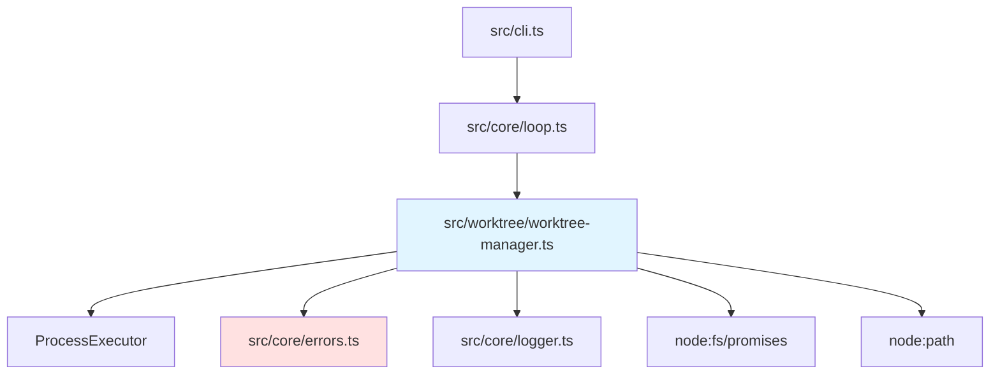

# WorktreeManager バックエンド設計書

## メタ情報

| 項目 | 内容 |
|------|------|
| ドキュメントID | DETAILED-ORCH-003-F201-BE |
| バージョン | 1.0.0 |
| ステータス | ドラフト |
| 作成日 | 2026-01-26 |
| 最終更新日 | 2026-01-26 |
| 作成者 | AI Assistant |
| 承認者 | - |
| 関連詳細設計書 | DETAILED-ORCH-003-F201 |
| 対象機能 | F-201 |

---

## 1. 概要

WorktreeManager機能のバックエンド実装仕様を定義します。

---

## 2. ファイル構成

| ファイル | 説明 | 新規/変更 |
|---------|------|----------|
| `src/worktree/worktree-manager.ts` | WorktreeManagerクラス | 新規 |
| `src/worktree/worktree-manager.test.ts` | 単体テスト | 新規 |
| `src/core/errors.ts` | WorktreeError追加 | 変更 |
| `src/core/types.ts` | WorktreeConfigSchema追加 | 変更 |

---

## 3. クラス詳細設計

### 3.1 WorktreeManager

#### ファイル: `src/worktree/worktree-manager.ts`

```typescript
import { ProcessExecutor, BunProcessExecutor } from "../core/process-executor.js";
import { WorktreeError } from "../core/errors.js";
import { logger } from "../core/logger.js";
import { lock } from "proper-lockfile";
import * as fs from "node:fs/promises";
import * as path from "node:path";

/**
 * WorktreeManager設定
 */
export interface WorktreeManagerConfig {
  enabled: boolean;
  baseDir: string;
  autoCleanup: boolean;
  copyEnvFiles: string[];
}

/**
 * worktree情報
 */
export interface WorktreeInfo {
  issueNumber: number;
  path: string;
  branch: string;
  environmentType: "container-use" | "docker" | "host";
  environmentId: string | null;
  createdAt: string;
  status: "active" | "merged" | "abandoned";
}

/**
 * worktrees.jsonの構造
 */
interface WorktreesData {
  worktrees: WorktreeInfo[];
}

/**
 * git worktreeを管理するクラス
 * 
 * @example
 * ```typescript
 * const manager = new WorktreeManager({
 *   enabled: true,
 *   baseDir: ".worktrees",
 *   autoCleanup: true,
 *   copyEnvFiles: [".env"],
 * });
 * 
 * // worktree作成
 * const info = await manager.createWorktree(42, "container-use", "abc-123");
 * console.log(info.path); // ".worktrees/issue-42"
 * 
 * // worktree削除
 * await manager.removeWorktree(42, true);
 * ```
 */
export class WorktreeManager {
  private readonly config: WorktreeManagerConfig;
  private readonly executor: ProcessExecutor;
  private readonly worktreesFile: string;

  constructor(
    config: WorktreeManagerConfig,
    executor: ProcessExecutor = new BunProcessExecutor()
  ) {
    this.config = config;
    this.executor = executor;
    this.worktreesFile = ".worktrees.json";
  }

  /**
   * worktreeを作成
   * 
   * @param issueNumber - Issue番号
   * @param environmentType - 実行環境タイプ
   * @param environmentId - 環境ID（オプション）
   * @returns WorktreeInfo（無効時はnull）
   * @throws WorktreeError - 作成失敗時
   */
  async createWorktree(
    issueNumber: number,
    environmentType: "container-use" | "docker" | "host",
    environmentId: string | null = null
  ): Promise<WorktreeInfo | null> {
    if (!this.config.enabled) {
      logger.info("worktree機能は無効です");
      return null;
    }

    const branch = `feature/issue-${issueNumber}`;
    const worktreePath = path.join(this.config.baseDir, `issue-${issueNumber}`);

    // ディレクトリ存在確認
    try {
      await fs.access(worktreePath);
      throw new WorktreeError(
        `worktree ${worktreePath} は既に存在します`,
        { issueNumber, path: worktreePath }
      );
    } catch (error) {
      if (error instanceof WorktreeError) throw error;
      // ディレクトリが存在しない場合は続行
    }

    // git worktree add
    logger.info(`worktree作成中: ${worktreePath} (${branch})`);
    const result = await this.executor.spawn("git", [
      "worktree",
      "add",
      worktreePath,
      "-b",
      branch,
    ]);

    if (result.exitCode !== 0) {
      throw new WorktreeError(
        `worktree作成失敗: ${result.stderr}`,
        { issueNumber, stderr: result.stderr }
      );
    }

    // 環境ファイルをコピー
    await this.copyEnvFiles(worktreePath);

    // worktrees.jsonに保存
    const info: WorktreeInfo = {
      issueNumber,
      path: worktreePath,
      branch,
      environmentType,
      environmentId,
      createdAt: new Date().toISOString(),
      status: "active",
    };

    await this.saveWorktreeInfo(info);

    logger.success(`worktree作成完了: ${worktreePath}`);
    return info;
  }

  /**
   * worktreeを削除
   * 
   * @param issueNumber - Issue番号
   * @param deleteBranch - ブランチも削除するか
   * @throws WorktreeError - 削除失敗時
   */
  async removeWorktree(
    issueNumber: number,
    deleteBranch: boolean = true
  ): Promise<void> {
    const info = await this.getWorktree(issueNumber);
    if (!info) {
      logger.warn(`worktree for Issue #${issueNumber} が見つかりません`);
      return;
    }

    logger.info(`worktree削除中: ${info.path}`);

    // git worktree remove
    const removeResult = await this.executor.spawn("git", [
      "worktree",
      "remove",
      info.path,
    ]);

    if (removeResult.exitCode !== 0) {
      throw new WorktreeError(
        `worktree削除失敗: ${removeResult.stderr}`,
        { issueNumber, stderr: removeResult.stderr }
      );
    }

    // ブランチ削除
    if (deleteBranch) {
      const branchResult = await this.executor.spawn("git", [
        "branch",
        "-d",
        info.branch,
      ]);

      if (branchResult.exitCode !== 0) {
        logger.warn(`ブランチ削除失敗: ${branchResult.stderr}`);
        // ブランチ削除失敗はエラーとしない（マージされていない場合など）
      }
    }

    // worktrees.jsonから削除
    await this.removeWorktreeInfo(issueNumber);

    logger.success(`worktree削除完了: ${info.path}`);
  }

  /**
   * worktree一覧を取得
   * 
   * @returns WorktreeInfo配列
   */
  async listWorktrees(): Promise<WorktreeInfo[]> {
    const data = await this.loadWorktreesData();
    return data.worktrees;
  }

  /**
   * 特定Issueのworktree情報を取得
   * 
   * @param issueNumber - Issue番号
   * @returns WorktreeInfo（存在しない場合はnull）
   */
  async getWorktree(issueNumber: number): Promise<WorktreeInfo | null> {
    const data = await this.loadWorktreesData();
    return data.worktrees.find((w) => w.issueNumber === issueNumber) || null;
  }

  /**
   * worktree情報を更新
   * 
   * F-202（HybridEnvironmentBuilder）等から環境構築後に
   * 環境IDやステータスを更新する際に使用。
   * 
   * @param issueNumber - Issue番号
   * @param updates - 更新するフィールド
   * @throws WorktreeError - 対象worktreeが存在しない場合
   */
  async updateWorktree(
    issueNumber: number,
    updates: Partial<Pick<WorktreeInfo, "environmentId" | "environmentType" | "status">>
  ): Promise<void> {
    await this.withLock(async () => {
      const data = await this.loadWorktreesData();
      const index = data.worktrees.findIndex((w) => w.issueNumber === issueNumber);

      if (index === -1) {
        throw new WorktreeError(
          `worktree for Issue #${issueNumber} が見つかりません`,
          { issueNumber }
        );
      }

      // 指定されたフィールドのみ更新
      data.worktrees[index] = {
        ...data.worktrees[index],
        ...updates,
      };

      await this.saveWorktreesData(data);
      logger.info(`worktree情報更新完了: Issue #${issueNumber}`);
    });
  }

  /**
   * 環境ファイルをworktreeにコピー
   * 
   * @param worktreePath - worktreeのパス
   */
  private async copyEnvFiles(worktreePath: string): Promise<void> {
    for (const file of this.config.copyEnvFiles) {
      try {
        const src = path.join(process.cwd(), file);
        const dest = path.join(worktreePath, file);
        await fs.copyFile(src, dest);
        logger.debug(`環境ファイルコピー: ${file} -> ${dest}`);
      } catch (error) {
        // ファイルが存在しない場合はスキップ
        logger.debug(`環境ファイル ${file} が見つかりません（スキップ）`);
      }
    }
  }

  /**
   * worktrees.jsonを読み込み
   * 
   * @returns WorktreesData
   */
  private async loadWorktreesData(): Promise<WorktreesData> {
    try {
      const content = await fs.readFile(this.worktreesFile, "utf-8");
      return JSON.parse(content);
    } catch (error) {
      // ファイルが存在しない場合は空データ
      return { worktrees: [] };
    }
  }

  /**
   * worktrees.jsonに保存
   * 
   * @param data - WorktreesData
   */
  private async saveWorktreesData(data: WorktreesData): Promise<void> {
    await fs.writeFile(
      this.worktreesFile,
      JSON.stringify(data, null, 2),
      "utf-8"
    );
  }

  /**
   * worktree情報を保存
   * 
   * @param info - WorktreeInfo
   */
  private async saveWorktreeInfo(info: WorktreeInfo): Promise<void> {
    await this.withLock(async () => {
      const data = await this.loadWorktreesData();
      
      // 既存エントリを削除（重複防止）
      data.worktrees = data.worktrees.filter(
        (w) => w.issueNumber !== info.issueNumber
      );
      
      data.worktrees.push(info);
      await this.saveWorktreesData(data);
    });
  }

  /**
   * worktree情報を削除
   * 
   * @param issueNumber - Issue番号
   */
  private async removeWorktreeInfo(issueNumber: number): Promise<void> {
    await this.withLock(async () => {
      const data = await this.loadWorktreesData();
      data.worktrees = data.worktrees.filter(
        (w) => w.issueNumber !== issueNumber
      );
      await this.saveWorktreesData(data);
    });
  }

  /**
   * 排他制御付きでファイル操作を実行
   * 
   * 並列実行環境でのworktrees.json競合を防止。
   * proper-lockfileパッケージを使用したファイルロックを実装。
   * 
   * @param fn - ロック中に実行する関数
   * @returns 関数の戻り値
   */
  private async withLock<T>(fn: () => Promise<T>): Promise<T> {
    // ロックファイル用にworktrees.jsonが存在することを確認
    try {
      await fs.access(this.worktreesFile);
    } catch {
      // ファイルが存在しない場合は空ファイルを作成
      await fs.writeFile(this.worktreesFile, JSON.stringify({ worktrees: [] }, null, 2), "utf-8");
    }

    const release = await lock(this.worktreesFile, {
      retries: {
        retries: 5,
        minTimeout: 100,
        maxTimeout: 1000,
      },
    });

    try {
      return await fn();
    } finally {
      await release();
    }
  }
}
```

---

## 4. エラークラス追加

### ファイル: `src/core/errors.ts`（追加分）

```typescript
/**
 * worktree操作エラー
 * 
 * @example
 * ```typescript
 * throw new WorktreeError("worktree already exists", { path: ".worktrees/issue-42" });
 * ```
 */
export class WorktreeError extends Error {
  public readonly details?: Record<string, unknown>;

  constructor(message: string, details?: Record<string, unknown>) {
    super(message);
    this.name = "WorktreeError";
    this.details = details;
  }
}
```

---

## 5. 型定義追加

### ファイル: `src/core/types.ts`（追加分）

```typescript
/**
 * worktree設定のzodスキーマ
 */
export const WorktreeConfigSchema = z.object({
  /**
   * worktree機能を有効にするか
   */
  enabled: z.boolean().default(false),

  /**
   * worktreeのベースディレクトリ
   */
  baseDir: z.string().default(".worktrees"),

  /**
   * マージ後に自動クリーンアップするか
   */
  autoCleanup: z.boolean().default(true),

  /**
   * worktreeにコピーする環境ファイル
   */
  copyEnvFiles: z.array(z.string()).default([".env", ".envrc", ".env.local"]),
});

export type WorktreeConfig = z.infer<typeof WorktreeConfigSchema>;

// ConfigSchema に追加
export const ConfigSchema = z.object({
  // ... 既存フィールド

  // 新規: worktree設定
  worktree: WorktreeConfigSchema.optional(),
});
```

---

## 6. テスト設計

### ファイル: `src/worktree/worktree-manager.test.ts`

```typescript
import { describe, it, expect, mock, beforeEach, afterEach } from "bun:test";
import { WorktreeManager, WorktreeManagerConfig } from "./worktree-manager.js";
import { WorktreeError } from "../core/errors.js";
import type { ProcessExecutor } from "../core/process-executor.js";
import * as fs from "node:fs/promises";

describe("WorktreeManager", () => {
  let mockExecutor: ProcessExecutor;
  let defaultConfig: WorktreeManagerConfig;
  const testWorktreesFile = ".worktrees.test.json";

  beforeEach(() => {
    mockExecutor = {
      spawn: mock(() => Promise.resolve({ stdout: "", stderr: "", exitCode: 0 })),
    };

    defaultConfig = {
      enabled: true,
      baseDir: ".worktrees",
      autoCleanup: true,
      copyEnvFiles: [".env"],
    };
  });

  afterEach(async () => {
    // テスト用ファイルをクリーンアップ
    try {
      await fs.unlink(testWorktreesFile);
    } catch {
      // ファイルが存在しない場合は無視
    }
  });

  describe("createWorktree", () => {
    it("worktreeを作成する", async () => {
      const manager = new WorktreeManager(defaultConfig, mockExecutor);

      const info = await manager.createWorktree(42, "container-use", "abc-123");

      expect(info).not.toBeNull();
      expect(info?.issueNumber).toBe(42);
      expect(info?.path).toBe(".worktrees/issue-42");
      expect(info?.branch).toBe("feature/issue-42");
      expect(info?.environmentType).toBe("container-use");
      expect(info?.environmentId).toBe("abc-123");
      expect(info?.status).toBe("active");

      // git worktree add が呼ばれたか確認
      expect(mockExecutor.spawn).toHaveBeenCalledWith("git", [
        "worktree",
        "add",
        ".worktrees/issue-42",
        "-b",
        "feature/issue-42",
      ]);
    });

    it("worktree無効時はnullを返す", async () => {
      const disabledConfig = { ...defaultConfig, enabled: false };
      const manager = new WorktreeManager(disabledConfig, mockExecutor);

      const info = await manager.createWorktree(42, "host");

      expect(info).toBeNull();
      expect(mockExecutor.spawn).not.toHaveBeenCalled();
    });

    it("git worktree add失敗時にエラーをスローする", async () => {
      mockExecutor.spawn = mock(() =>
        Promise.resolve({ stdout: "", stderr: "fatal: invalid reference", exitCode: 1 })
      );

      const manager = new WorktreeManager(defaultConfig, mockExecutor);

      await expect(manager.createWorktree(42, "host")).rejects.toThrow(WorktreeError);
    });

    it("environmentType=hostの場合、environmentIdはnull", async () => {
      const manager = new WorktreeManager(defaultConfig, mockExecutor);

      const info = await manager.createWorktree(42, "host");

      expect(info?.environmentType).toBe("host");
      expect(info?.environmentId).toBeNull();
    });

    it("environmentType=dockerの場合、environmentIdを保存", async () => {
      const manager = new WorktreeManager(defaultConfig, mockExecutor);

      const info = await manager.createWorktree(42, "docker", "container-xyz");

      expect(info?.environmentType).toBe("docker");
      expect(info?.environmentId).toBe("container-xyz");
    });
  });

  describe("removeWorktree", () => {
    it("worktreeを削除する", async () => {
      const manager = new WorktreeManager(defaultConfig, mockExecutor);

      // 先に作成
      await manager.createWorktree(42, "host");

      // 削除
      await manager.removeWorktree(42, true);

      // git worktree remove が呼ばれたか確認
      expect(mockExecutor.spawn).toHaveBeenCalledWith("git", [
        "worktree",
        "remove",
        ".worktrees/issue-42",
      ]);

      // git branch -d が呼ばれたか確認
      expect(mockExecutor.spawn).toHaveBeenCalledWith("git", [
        "branch",
        "-d",
        "feature/issue-42",
      ]);
    });

    it("deleteBranch=falseの場合、ブランチを削除しない", async () => {
      const manager = new WorktreeManager(defaultConfig, mockExecutor);

      await manager.createWorktree(42, "host");
      await manager.removeWorktree(42, false);

      // git branch -d が呼ばれていないか確認
      const branchDeleteCalls = (mockExecutor.spawn as any).mock.calls.filter(
        (call: any) => call[0] === "git" && call[1][0] === "branch"
      );
      expect(branchDeleteCalls.length).toBe(0);
    });

    it("存在しないworktreeの削除は何もしない", async () => {
      const manager = new WorktreeManager(defaultConfig, mockExecutor);

      // 削除（存在しない）
      await manager.removeWorktree(999);

      // git worktree remove が呼ばれていないか確認
      expect(mockExecutor.spawn).not.toHaveBeenCalled();
    });
  });

  describe("listWorktrees", () => {
    it("worktree一覧を取得する", async () => {
      const manager = new WorktreeManager(defaultConfig, mockExecutor);

      await manager.createWorktree(42, "container-use", "abc-123");
      await manager.createWorktree(43, "docker", "container-xyz");

      const list = await manager.listWorktrees();

      expect(list.length).toBe(2);
      expect(list[0].issueNumber).toBe(42);
      expect(list[1].issueNumber).toBe(43);
    });

    it("worktreeが存在しない場合は空配列を返す", async () => {
      const manager = new WorktreeManager(defaultConfig, mockExecutor);

      const list = await manager.listWorktrees();

      expect(list).toEqual([]);
    });
  });

  describe("getWorktree", () => {
    it("特定Issueのworktree情報を取得する", async () => {
      const manager = new WorktreeManager(defaultConfig, mockExecutor);

      await manager.createWorktree(42, "host");

      const info = await manager.getWorktree(42);

      expect(info).not.toBeNull();
      expect(info?.issueNumber).toBe(42);
    });

    it("存在しないIssueの場合はnullを返す", async () => {
      const manager = new WorktreeManager(defaultConfig, mockExecutor);

      const info = await manager.getWorktree(999);

      expect(info).toBeNull();
    });
  });

  describe("updateWorktree", () => {
    it("worktree情報を更新する", async () => {
      const manager = new WorktreeManager(defaultConfig, mockExecutor);

      // 先に作成（host環境、environmentId=null）
      await manager.createWorktree(42, "host");

      // container-use環境に更新
      await manager.updateWorktree(42, {
        environmentType: "container-use",
        environmentId: "abc-123",
      });

      const info = await manager.getWorktree(42);
      expect(info?.environmentType).toBe("container-use");
      expect(info?.environmentId).toBe("abc-123");
    });

    it("ステータスを更新する", async () => {
      const manager = new WorktreeManager(defaultConfig, mockExecutor);

      await manager.createWorktree(42, "host");

      await manager.updateWorktree(42, {
        status: "merged",
      });

      const info = await manager.getWorktree(42);
      expect(info?.status).toBe("merged");
    });

    it("存在しないworktreeの更新はエラーをスローする", async () => {
      const manager = new WorktreeManager(defaultConfig, mockExecutor);

      await expect(
        manager.updateWorktree(999, { status: "merged" })
      ).rejects.toThrow(WorktreeError);
    });
  });
});
```

---

## 7. 依存関係



---

## 8. 実装手順

1. `src/core/errors.ts` に `WorktreeError` を追加
2. `src/core/types.ts` に `WorktreeConfigSchema` を追加
3. `src/worktree/worktree-manager.ts` を新規作成
4. `src/worktree/worktree-manager.test.ts` を新規作成
5. テスト実行・パス確認

---

## 9. 変更履歴

| バージョン | 日付 | 変更内容 | 変更者 |
|-----------|------|---------|--------|
| 1.0.0 | 2026-01-26 | 初版作成 | AI Assistant |
