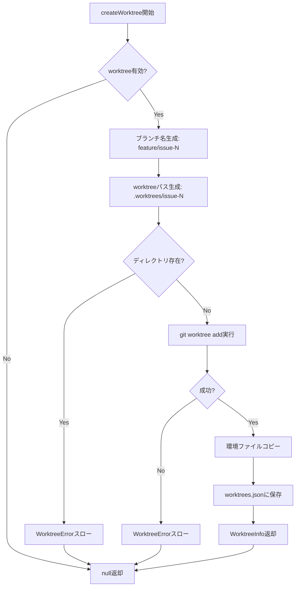
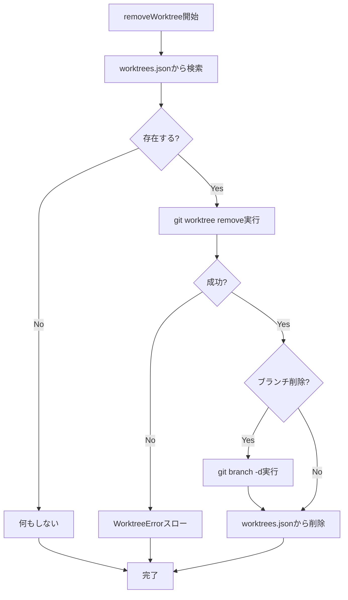

# WorktreeManager 詳細設計書

## メタ情報

| 項目 | 内容 |
|------|------|
| ドキュメントID | DETAILED-ORCH-003-F201 |
| バージョン | 1.0.0 |
| ステータス | ドラフト |
| 作成日 | 2026-01-26 |
| 最終更新日 | 2026-01-26 |
| 作成者 | AI Assistant |
| 承認者 | - |
| 関連基本設計書 | BASIC-ORCH-003 v1.0.0 |
| 対象機能 | F-201 |

---

## 1. 概要

### 1.1 目的

git worktreeの作成・削除・一覧管理を行うWorktreeManagerクラスを提供します。これにより、同一リポジトリの複数ブランチを別ディレクトリで管理し、ファイルシステムレベルで完全に分離された並列実行環境を実現します。

### 1.2 スコープ

#### スコープ内

- worktreeの作成（`git worktree add`）
- worktreeの削除（`git worktree remove`）
- worktree一覧の取得（`git worktree list`）
- worktrees.jsonへの状態保存
- 環境ファイル（.env等）のコピー
- ブランチの自動作成

#### スコープ外

- container-use環境との統合（F-202で実装）
- GitHub Issueラベル更新（F-203で実装）
- 自動クリーンアップ（F-204で実装）
- worktree内でのコード実行

### 1.3 参照ドキュメント

| ドキュメント | パス | 参照箇所 |
|-------------|------|---------|
| 基本設計書 | docs/designs/basic/BASIC-ORCH-003_v2.0.0機能.md | セクション3.2, 6.2 |
| git worktree公式ドキュメント | https://git-scm.com/docs/git-worktree | - |

---

## 2. 処理フロー

### 2.1 worktree作成フロー



### 2.2 worktree削除フロー



### 2.3 シーケンス図

```mermaid
sequenceDiagram
    autonumber
    participant Loop as LoopEngine
    participant WM as WorktreeManager
    participant Git as git CLI
    participant FS as FileSystem
    participant JSON as worktrees.json

    Loop->>WM: createWorktree(issueNumber, envType, envId)
    WM->>WM: ブランチ名生成
    WM->>FS: ディレクトリ存在確認
    FS-->>WM: 存在しない
    WM->>Git: git worktree add .worktrees/issue-N feature/issue-N
    Git-->>WM: 成功
    WM->>FS: .envファイルをコピー
    WM->>JSON: WorktreeInfo保存
    WM-->>Loop: WorktreeInfo返却
    
    Note over Loop,WM: タスク完了後
    
    Loop->>WM: removeWorktree(issueNumber, deleteBranch=true)
    WM->>JSON: WorktreeInfo取得
    WM->>Git: git worktree remove .worktrees/issue-N
    Git-->>WM: 成功
    WM->>Git: git branch -d feature/issue-N
    Git-->>WM: 成功
    WM->>JSON: エントリ削除
    WM-->>Loop: 完了
```

---

## 3. インターフェース定義

### 3.1 WorktreeManagerConfig

```typescript
/**
 * WorktreeManager設定
 */
export interface WorktreeManagerConfig {
  /**
   * worktree機能を有効にするか
   * @default false
   */
  enabled: boolean;

  /**
   * worktreeのベースディレクトリ
   * @default ".worktrees"
   */
  baseDir: string;

  /**
   * マージ後に自動クリーンアップするか
   * @default true
   */
  autoCleanup: boolean;

  /**
   * worktreeにコピーする環境ファイル
   * @default [".env", ".envrc", ".env.local"]
   */
  copyEnvFiles: string[];
}
```

### 3.2 WorktreeInfo

```typescript
/**
 * worktree情報
 */
export interface WorktreeInfo {
  /**
   * Issue番号
   */
  issueNumber: number;

  /**
   * worktreeのパス
   * @example ".worktrees/issue-42"
   */
  path: string;

  /**
   * ブランチ名
   * @example "feature/issue-42"
   */
  branch: string;

  /**
   * 実行環境タイプ
   * - container-use: container-use環境
   * - docker: Dockerコンテナ
   * - host: ホスト環境
   */
  environmentType: "container-use" | "docker" | "host";

  /**
   * 環境ID（hostの場合はnull）
   * @example "abc-123" (container-use)
   * @example "container-xyz" (docker)
   */
  environmentId: string | null;

  /**
   * 作成日時（ISO 8601形式）
   */
  createdAt: string;

  /**
   * ステータス
   * - active: 使用中
   * - merged: マージ済み
   * - abandoned: 放棄
   */
  status: "active" | "merged" | "abandoned";
}
```

### 3.3 WorktreeManagerクラス

```typescript
/**
 * git worktreeを管理するクラス
 */
export class WorktreeManager {
  /**
   * コンストラクタ
   * @param config - 設定
   * @param executor - プロセス実行器（DI用）
   */
  constructor(
    config: WorktreeManagerConfig,
    executor?: ProcessExecutor
  );

  /**
   * worktreeを作成
   * 
   * @param issueNumber - Issue番号
   * @param environmentType - 実行環境タイプ
   * @param environmentId - 環境ID（オプション）
   * @returns WorktreeInfo（無効時はnull）
   * @throws WorktreeError - 作成失敗時
   */
  createWorktree(
    issueNumber: number,
    environmentType: "container-use" | "docker" | "host",
    environmentId?: string | null
  ): Promise<WorktreeInfo | null>;

  /**
   * worktreeを削除
   * 
   * @param issueNumber - Issue番号
   * @param deleteBranch - ブランチも削除するか
   * @throws WorktreeError - 削除失敗時
   */
  removeWorktree(
    issueNumber: number,
    deleteBranch?: boolean
  ): Promise<void>;

  /**
   * worktree一覧を取得
   * 
   * @returns WorktreeInfo配列
   */
  listWorktrees(): Promise<WorktreeInfo[]>;

  /**
   * 特定Issueのworktree情報を取得
   * 
   * @param issueNumber - Issue番号
   * @returns WorktreeInfo（存在しない場合はnull）
   */
  getWorktree(issueNumber: number): Promise<WorktreeInfo | null>;

  /**
   * worktree情報を更新
   * 
   * F-202（HybridEnvironmentBuilder）等から環境構築後に
   * 環境IDやステータスを更新する際に使用。
   * 
   * @param issueNumber - Issue番号
   * @param updates - 更新するフィールド
   * @throws WorktreeError - 対象worktreeが存在しない場合
   */
  updateWorktree(
    issueNumber: number,
    updates: Partial<Pick<WorktreeInfo, "environmentId" | "environmentType" | "status">>
  ): Promise<void>;
}
```

---

## 4. データ構造

### 4.1 worktrees.json

```json
{
  "worktrees": [
    {
      "issueNumber": 42,
      "path": ".worktrees/issue-42",
      "branch": "feature/issue-42",
      "environmentType": "container-use",
      "environmentId": "abc-123",
      "createdAt": "2026-01-26T10:00:00Z",
      "status": "active"
    },
    {
      "issueNumber": 43,
      "path": ".worktrees/issue-43",
      "branch": "feature/issue-43",
      "environmentType": "docker",
      "environmentId": "container-xyz",
      "createdAt": "2026-01-26T11:00:00Z",
      "status": "active"
    },
    {
      "issueNumber": 44,
      "path": ".worktrees/issue-44",
      "branch": "feature/issue-44",
      "environmentType": "host",
      "environmentId": null,
      "createdAt": "2026-01-26T12:00:00Z",
      "status": "active"
    }
  ]
}
```

### 4.2 ディレクトリ構造

| パス | 説明 |
|------|------|
| `プロジェクトルート/` | プロジェクトのルートディレクトリ |
| `.worktrees/` | worktree基底ディレクトリ |
| `.worktrees/issue-42/` | Issue #42用worktree |
| `.worktrees/issue-42/.env` | コピーされた環境ファイル |
| `.worktrees/issue-42/src/` | ソースコード |
| `.worktrees/issue-43/` | Issue #43用worktree |
| `.worktrees/issue-44/` | Issue #44用worktree |
| `.worktrees.json` | worktree管理ファイル |
| `src/` | メインworktree（プロジェクトルート） |

---

## 5. エラーハンドリング

### 5.1 WorktreeError

```typescript
/**
 * worktree操作エラー
 */
export class WorktreeError extends Error {
  constructor(message: string, details?: Record<string, unknown>) {
    super(message);
    this.name = "WorktreeError";
    this.details = details;
  }
}
```

### 5.2 エラーケース

| エラーケース | エラーメッセージ | 対処 |
|-------------|----------------|------|
| ディレクトリ既存 | `worktree ${path} は既に存在します` | 既存worktreeを削除してから再作成 |
| git worktree add失敗 | `worktree作成失敗: ${stderr}` | gitコマンドのエラーメッセージを確認 |
| git worktree remove失敗 | `worktree削除失敗: ${stderr}` | worktreeが使用中でないか確認 |
| ブランチ削除失敗 | `ブランチ削除失敗: ${stderr}` | マージされていないブランチの可能性 |
| worktree情報更新対象不在 | `worktree for Issue #${issueNumber} が見つかりません` | 先にcreateWorktreeを実行 |

---

## 6. 設定ファイル拡張

### 6.1 orch.yml

```yaml
# worktree設定（新規 v2.0.0 Phase 2）
worktree:
  enabled: true                # worktree機能を有効化
  base_dir: ".worktrees"       # worktreeのベースディレクトリ
  auto_cleanup: true           # マージ後に自動削除
  copy_env_files:              # worktreeにコピーする環境ファイル
    - ".env"
    - ".envrc"
    - ".env.local"
```

### 6.2 WorktreeConfigSchema（zod）

```typescript
export const WorktreeConfigSchema = z.object({
  enabled: z.boolean().default(false),
  baseDir: z.string().default(".worktrees"),
  autoCleanup: z.boolean().default(true),
  copyEnvFiles: z.array(z.string()).default([".env", ".envrc", ".env.local"]),
});

export type WorktreeConfig = z.infer<typeof WorktreeConfigSchema>;
```

---

## 7. テスト方針

### 7.1 単体テスト

| テストケース | 期待結果 |
|-------------|---------|
| worktree作成成功 | WorktreeInfo返却、worktrees.jsonに保存 |
| worktree作成（無効時） | null返却、何も実行しない |
| worktree作成（既存ディレクトリ） | WorktreeErrorスロー |
| worktree削除成功 | worktrees.jsonから削除 |
| worktree削除（ブランチも削除） | ブランチも削除される |
| worktree一覧取得 | 全WorktreeInfo配列返却 |
| 環境ファイルコピー | .envがworktreeにコピーされる |
| worktree情報更新成功 | 環境IDやステータスが更新される |
| worktree情報更新（存在しない） | WorktreeErrorスロー |

### 7.2 統合テスト

| テストケース | 期待結果 |
|-------------|---------|
| 複数worktree作成 | 各worktreeが独立したディレクトリに作成 |
| worktree削除後の再作成 | 同じIssue番号で再作成可能 |
| 並列プロセスからの同時更新 | 排他制御により整合性が保たれる |

---

## 8. 排他制御

### 8.1 問題

並列実行環境において、複数のプロセスが同時に`worktrees.json`を読み書きする可能性があります。
排他制御がない場合、以下のデータ破損リスクがあります：

- 読み取り後、書き込み前に別プロセスが書き込み → 別プロセスの変更が消失
- 同時書き込み → ファイル内容が破損

### 8.2 対策

**ファイルロック方式**を採用します：

```typescript
// proper-lockfile パッケージを使用
import { lock, unlock } from "proper-lockfile";

private async withLock<T>(fn: () => Promise<T>): Promise<T> {
  const release = await lock(this.worktreesFile, {
    retries: {
      retries: 5,
      minTimeout: 100,
      maxTimeout: 1000,
    },
  });
  try {
    return await fn();
  } finally {
    await release();
  }
}

// 使用例
async saveWorktreeInfo(info: WorktreeInfo): Promise<void> {
  await this.withLock(async () => {
    const data = await this.loadWorktreesData();
    data.worktrees = data.worktrees.filter(
      (w) => w.issueNumber !== info.issueNumber
    );
    data.worktrees.push(info);
    await this.saveWorktreesData(data);
  });
}
```

### 8.3 代替案

| 方式 | メリット | デメリット |
|------|---------|-----------|
| **proper-lockfile**（採用） | シンプル、クロスプラットフォーム | 依存パッケージ追加 |
| Atomic Write | 依存なし | 読み取り競合は防げない |
| SQLite | 堅牢な排他制御 | オーバーキル |

---

## 9. 実装チェックリスト

- [ ] `src/worktree/worktree-manager.ts` 作成
  - [ ] WorktreeManagerConfigインターフェース定義
  - [ ] WorktreeInfoインターフェース定義
  - [ ] WorktreeManagerクラス実装
  - [ ] createWorktree()メソッド実装
  - [ ] removeWorktree()メソッド実装
  - [ ] listWorktrees()メソッド実装
  - [ ] getWorktree()メソッド実装
  - [ ] updateWorktree()メソッド実装
  - [ ] withLock()排他制御メソッド実装
- [ ] `src/core/errors.ts` 拡張
  - [ ] WorktreeError追加
- [ ] `src/core/types.ts` 拡張
  - [ ] WorktreeConfigSchema追加
  - [ ] ConfigSchemaにworktree追加
- [ ] テスト作成
  - [ ] `src/worktree/worktree-manager.test.ts`

- [ ] `package.json` 更新
  - [ ] `proper-lockfile` 依存追加

---

## 10. 変更履歴

| バージョン | 日付 | 変更内容 | 変更者 |
|-----------|------|---------|--------|
| 1.0.0 | 2026-01-26 | 初版作成 | AI Assistant |

---

## 11. 承認

| 役割 | 氏名 | 承認日 | 署名 |
|------|------|--------|------|
| 作成者 | AI Assistant | 2026-01-26 | - |
| レビュアー | - | - | - |
| 承認者 | - | - | - |
