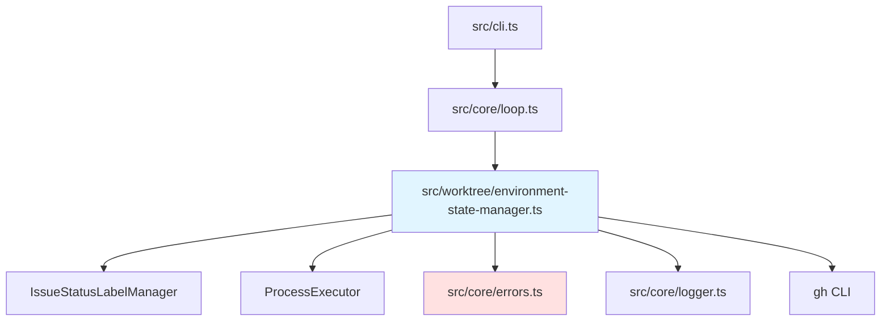

# 環境状態管理 バックエンド設計書

## メタ情報

| 項目 | 内容 |
|------|------|
| ドキュメントID | DETAILED-ORCH-003-F203-BE |
| バージョン | 1.0.0 |
| ステータス | ドラフト |
| 作成日 | 2026-01-26 |
| 最終更新日 | 2026-01-26 |
| 作成者 | AI Assistant |
| 承認者 | - |
| 関連詳細設計書 | DETAILED-ORCH-003-F203 |
| 対象機能 | F-203 |

---

## 1. 概要

環境状態管理機能のバックエンド実装仕様を定義します。

---

## 2. ファイル構成

| ファイル | 説明 | 新規/変更 |
|---------|------|----------|
| `src/worktree/environment-state-manager.ts` | EnvironmentStateManagerクラス | 新規 |
| `src/worktree/environment-state-manager.test.ts` | 単体テスト | 新規 |
| `src/core/errors.ts` | EnvironmentStateError追加 | 変更 |

---

## 3. クラス詳細設計

### 3.1 EnvironmentStateManager

#### ファイル: `src/worktree/environment-state-manager.ts`

```typescript
import { ProcessExecutor, BunProcessExecutor } from "../core/process-executor.js";
import { IssueStatusLabelManager } from "../output/issue-status-label-manager.js";
import { EnvironmentStateError } from "../core/errors.js";
import { logger } from "../core/logger.js";
import type { EnvironmentInfo } from "./hybrid-environment-builder.js";

/**
 * 環境状態管理設定
 */
export interface EnvironmentStateManagerConfig {
  enabled: boolean;
  useLabels: boolean;
  labelPrefix: string;
}

/**
 * GitHub Issueに保存する環境メタデータ
 */
export interface EnvironmentMetadata {
  type: "hybrid" | "worktree-only" | "container-only" | "host";
  worktreePath?: string;
  branch?: string;
  environmentType: "container-use" | "docker" | "host";
  environmentId?: string;
  createdAt: string;
  updatedAt: string;
}

/**
 * 環境状態を管理するクラス
 * 
 * @example
 * ```typescript
 * const manager = new EnvironmentStateManager(
 *   {
 *     enabled: true,
 *     useLabels: true,
 *     labelPrefix: "orch",
 *   },
 *   labelManager
 * );
 * 
 * await manager.updateEnvironmentState(42, envInfo);
 * const state = await manager.getEnvironmentState(42);
 * ```
 */
export class EnvironmentStateManager {
  private readonly config: EnvironmentStateManagerConfig;
  private readonly labelManager: IssueStatusLabelManager;
  private readonly executor: ProcessExecutor;

  constructor(
    config: EnvironmentStateManagerConfig,
    labelManager: IssueStatusLabelManager,
    executor: ProcessExecutor = new BunProcessExecutor()
  ) {
    this.config = config;
    this.labelManager = labelManager;
    this.executor = executor;
  }

  /**
   * 環境状態を更新
   * 
   * @param issueNumber - Issue番号
   * @param envInfo - 環境情報
   * @throws EnvironmentStateError - 更新失敗時
   */
  async updateEnvironmentState(
    issueNumber: number,
    envInfo: EnvironmentInfo
  ): Promise<void> {
    if (!this.config.enabled) {
      logger.debug("環境状態管理は無効です");
      return;
    }

    logger.info(`環境状態更新: Issue #${issueNumber}`);

    // メタデータ構築
    const metadata: EnvironmentMetadata = {
      type: envInfo.type,
      worktreePath: envInfo.worktree?.path,
      branch: envInfo.worktree?.branch,
      environmentType: envInfo.environmentType,
      environmentId: envInfo.environmentId,
      createdAt: envInfo.worktree?.createdAt || new Date().toISOString(),
      updatedAt: new Date().toISOString(),
    };

    // GitHub Issueメタデータに保存
    await this.saveMetadata(issueNumber, metadata);

    // ラベル更新
    if (this.config.useLabels) {
      await this.labelManager.updateStatus(issueNumber, "running");
    }

    logger.success(`環境状態更新完了: Issue #${issueNumber}`);
  }

  /**
   * 環境状態を取得
   * 
   * @param issueNumber - Issue番号
   * @returns EnvironmentMetadata（存在しない場合はnull）
   */
  async getEnvironmentState(issueNumber: number): Promise<EnvironmentMetadata | null> {
    if (!this.config.enabled) {
      return null;
    }

    try {
      const result = await this.executor.spawn("gh", [
        "issue",
        "view",
        String(issueNumber),
        "--json",
        "body",
      ]);

      if (result.exitCode !== 0) {
        throw new EnvironmentStateError(
          `環境状態取得失敗: ${result.stderr}`,
          { issueNumber, stderr: result.stderr }
        );
      }

      // Issue本文から環境メタデータを抽出
      const metadata = this.extractMetadata(result.stdout);
      return metadata;
    } catch (error) {
      if (error instanceof EnvironmentStateError) throw error;
      logger.warn(`環境状態取得失敗: ${error.message}`);
      return null;
    }
  }

  /**
   * 環境状態をクリア
   * 
   * @param issueNumber - Issue番号
   */
  async clearEnvironmentState(issueNumber: number): Promise<void> {
    if (!this.config.enabled) {
      return;
    }

    logger.info(`環境状態クリア: Issue #${issueNumber}`);

    // メタデータを削除（空のメタデータで上書き）
    await this.removeMetadata(issueNumber);

    logger.success(`環境状態クリア完了: Issue #${issueNumber}`);
  }

  /**
   * メタデータをGitHub Issueに保存
   * 
   * @param issueNumber - Issue番号
   * @param metadata - EnvironmentMetadata
   */
  private async saveMetadata(
    issueNumber: number,
    metadata: EnvironmentMetadata
  ): Promise<void> {
    // GitHub Issueの本文にメタデータを追加
    // Note: GitHub APIのカスタムフィールドは組織レベルの設定が必要なため、
    // ここでは本文の末尾に<!-- ENVIRONMENT_METADATA -->マーカーで埋め込む方式を採用

    const metadataBlock = this.buildMetadataBlock(metadata);

    const result = await this.executor.spawn("gh", [
      "issue",
      "view",
      String(issueNumber),
      "--json",
      "body",
    ]);

    if (result.exitCode !== 0) {
      throw new EnvironmentStateError(
        `Issue取得失敗: ${result.stderr}`,
        { issueNumber, stderr: result.stderr }
      );
    }

    const issueData = JSON.parse(result.stdout);
    let body = issueData.body || "";

    // 既存のメタデータブロックを削除
    body = body.replace(/<!-- ENVIRONMENT_METADATA_START -->[\s\S]*?<!-- ENVIRONMENT_METADATA_END -->/g, "");

    // 新しいメタデータブロックを追加
    body += `\n\n${metadataBlock}`;

    // Issue本文を更新
    const editResult = await this.executor.spawn("gh", [
      "issue",
      "edit",
      String(issueNumber),
      "--body",
      body,
    ]);

    if (editResult.exitCode !== 0) {
      throw new EnvironmentStateError(
        `環境状態更新失敗: ${editResult.stderr}`,
        { issueNumber, stderr: editResult.stderr }
      );
    }
  }

  /**
   * メタデータをGitHub Issueから削除
   * 
   * @param issueNumber - Issue番号
   */
  private async removeMetadata(issueNumber: number): Promise<void> {
    const result = await this.executor.spawn("gh", [
      "issue",
      "view",
      String(issueNumber),
      "--json",
      "body",
    ]);

    if (result.exitCode !== 0) {
      return; // Issue取得失敗時は何もしない
    }

    const issueData = JSON.parse(result.stdout);
    let body = issueData.body || "";

    // メタデータブロックを削除
    body = body.replace(/<!-- ENVIRONMENT_METADATA_START -->[\s\S]*?<!-- ENVIRONMENT_METADATA_END -->/g, "");

    // Issue本文を更新
    await this.executor.spawn("gh", [
      "issue",
      "edit",
      String(issueNumber),
      "--body",
      body.trim(),
    ]);
  }

  /**
   * メタデータブロックを構築
   * 
   * @param metadata - EnvironmentMetadata
   * @returns メタデータブロック
   */
  private buildMetadataBlock(metadata: EnvironmentMetadata): string {
    const json = JSON.stringify(metadata, null, 2);
    return `<!-- ENVIRONMENT_METADATA_START -->
\`\`\`json
${json}
\`\`\`
<!-- ENVIRONMENT_METADATA_END -->`;
  }

  /**
   * Issue本文からメタデータを抽出
   * 
   * @param stdout - gh issue viewの出力
   * @returns EnvironmentMetadata（存在しない場合はnull）
   */
  private extractMetadata(stdout: string): EnvironmentMetadata | null {
    try {
      const issueData = JSON.parse(stdout);
      const body = issueData.body || "";

      // メタデータブロックを抽出
      const match = body.match(/<!-- ENVIRONMENT_METADATA_START -->\s*```json\s*([\s\S]*?)\s*```\s*<!-- ENVIRONMENT_METADATA_END -->/);
      if (!match) {
        return null;
      }

      const metadata = JSON.parse(match[1]);
      return metadata;
    } catch (error) {
      logger.warn(`メタデータのパースに失敗: ${error.message}`);
      return null;
    }
  }
}
```

---

## 4. エラークラス追加

### ファイル: `src/core/errors.ts`（追加分）

```typescript
/**
 * 環境状態管理エラー
 * 
 * @example
 * ```typescript
 * throw new EnvironmentStateError("環境状態更新失敗", { issueNumber: 42 });
 * ```
 */
export class EnvironmentStateError extends Error {
  public readonly details?: Record<string, unknown>;

  constructor(message: string, details?: Record<string, unknown>) {
    super(message);
    this.name = "EnvironmentStateError";
    this.details = details;
  }
}
```

---

## 5. テスト設計

### ファイル: `src/worktree/environment-state-manager.test.ts`

```typescript
import { describe, it, expect, mock, beforeEach } from "bun:test";
import { EnvironmentStateManager, EnvironmentStateManagerConfig } from "./environment-state-manager.js";
import { IssueStatusLabelManager } from "../output/issue-status-label-manager.js";
import { EnvironmentStateError } from "../core/errors.js";
import type { ProcessExecutor } from "../core/process-executor.js";
import type { EnvironmentInfo } from "./hybrid-environment-builder.js";

describe("EnvironmentStateManager", () => {
  let mockExecutor: ProcessExecutor;
  let mockLabelManager: IssueStatusLabelManager;
  let defaultConfig: EnvironmentStateManagerConfig;

  beforeEach(() => {
    mockExecutor = {
      spawn: mock(() =>
        Promise.resolve({
          stdout: JSON.stringify({ body: "" }),
          stderr: "",
          exitCode: 0,
        })
      ),
    };

    mockLabelManager = {
      updateStatus: mock(() => Promise.resolve()),
    } as any;

    defaultConfig = {
      enabled: true,
      useLabels: true,
      labelPrefix: "orch",
    };
  });

  describe("updateEnvironmentState", () => {
    it("環境状態を更新する", async () => {
      const manager = new EnvironmentStateManager(
        defaultConfig,
        mockLabelManager,
        mockExecutor
      );

      const envInfo: EnvironmentInfo = {
        issueNumber: 42,
        type: "hybrid",
        worktree: {
          issueNumber: 42,
          path: ".worktrees/issue-42",
          branch: "feature/issue-42",
          environmentType: "container-use",
          environmentId: "abc-123",
          createdAt: "2026-01-26T10:00:00Z",
          status: "active",
        },
        environmentType: "container-use",
        environmentId: "abc-123",
        workingDirectory: ".worktrees/issue-42",
      };

      await manager.updateEnvironmentState(42, envInfo);

      // gh issue view が呼ばれたか確認
      expect(mockExecutor.spawn).toHaveBeenCalledWith("gh", [
        "issue",
        "view",
        "42",
        "--json",
        "body",
      ]);

      // gh issue edit が呼ばれたか確認
      expect(mockExecutor.spawn).toHaveBeenCalledWith("gh", [
        "issue",
        "edit",
        "42",
        "--body",
        expect.stringContaining("ENVIRONMENT_METADATA"),
      ]);

      // ラベル更新が呼ばれたか確認
      expect(mockLabelManager.updateStatus).toHaveBeenCalledWith(42, "running");
    });

    it("無効時は何もしない", async () => {
      const disabledConfig = { ...defaultConfig, enabled: false };
      const manager = new EnvironmentStateManager(
        disabledConfig,
        mockLabelManager,
        mockExecutor
      );

      const envInfo: EnvironmentInfo = {
        issueNumber: 42,
        type: "host",
        environmentType: "host",
        workingDirectory: process.cwd(),
      };

      await manager.updateEnvironmentState(42, envInfo);

      expect(mockExecutor.spawn).not.toHaveBeenCalled();
      expect(mockLabelManager.updateStatus).not.toHaveBeenCalled();
    });

    it("worktreeのみの場合、worktree情報を保存", async () => {
      const manager = new EnvironmentStateManager(
        defaultConfig,
        mockLabelManager,
        mockExecutor
      );

      const envInfo: EnvironmentInfo = {
        issueNumber: 42,
        type: "worktree-only",
        worktree: {
          issueNumber: 42,
          path: ".worktrees/issue-42",
          branch: "feature/issue-42",
          environmentType: "host",
          environmentId: null,
          createdAt: "2026-01-26T10:00:00Z",
          status: "active",
        },
        environmentType: "host",
        workingDirectory: ".worktrees/issue-42",
      };

      await manager.updateEnvironmentState(42, envInfo);

      // メタデータにworktree情報が含まれているか確認
      const editCall = (mockExecutor.spawn as any).mock.calls.find(
        (call: any) => call[0] === "gh" && call[1][0] === "issue" && call[1][1] === "edit"
      );
      expect(editCall).toBeDefined();
      const body = editCall[1][3];
      expect(body).toContain(".worktrees/issue-42");
      expect(body).toContain("feature/issue-42");
    });
  });

  describe("getEnvironmentState", () => {
    it("環境状態を取得する", async () => {
      const metadata = {
        type: "hybrid",
        worktreePath: ".worktrees/issue-42",
        branch: "feature/issue-42",
        environmentType: "container-use",
        environmentId: "abc-123",
        createdAt: "2026-01-26T10:00:00Z",
        updatedAt: "2026-01-26T10:00:00Z",
      };

      const body = `<!-- ENVIRONMENT_METADATA_START -->
\`\`\`json
${JSON.stringify(metadata, null, 2)}
\`\`\`
<!-- ENVIRONMENT_METADATA_END -->`;

      mockExecutor.spawn = mock(() =>
        Promise.resolve({
          stdout: JSON.stringify({ body }),
          stderr: "",
          exitCode: 0,
        })
      );

      const manager = new EnvironmentStateManager(
        defaultConfig,
        mockLabelManager,
        mockExecutor
      );

      const state = await manager.getEnvironmentState(42);

      expect(state).not.toBeNull();
      expect(state?.type).toBe("hybrid");
      expect(state?.worktreePath).toBe(".worktrees/issue-42");
      expect(state?.environmentId).toBe("abc-123");
    });

    it("メタデータが存在しない場合はnullを返す", async () => {
      const manager = new EnvironmentStateManager(
        defaultConfig,
        mockLabelManager,
        mockExecutor
      );

      const state = await manager.getEnvironmentState(42);

      expect(state).toBeNull();
    });

    it("無効時はnullを返す", async () => {
      const disabledConfig = { ...defaultConfig, enabled: false };
      const manager = new EnvironmentStateManager(
        disabledConfig,
        mockLabelManager,
        mockExecutor
      );

      const state = await manager.getEnvironmentState(42);

      expect(state).toBeNull();
      expect(mockExecutor.spawn).not.toHaveBeenCalled();
    });
  });

  describe("clearEnvironmentState", () => {
    it("環境状態をクリアする", async () => {
      const body = `Some content

<!-- ENVIRONMENT_METADATA_START -->
\`\`\`json
{"type": "hybrid"}
\`\`\`
<!-- ENVIRONMENT_METADATA_END -->`;

      mockExecutor.spawn = mock((cmd, args) => {
        if (args[1] === "view") {
          return Promise.resolve({
            stdout: JSON.stringify({ body }),
            stderr: "",
            exitCode: 0,
          });
        }
        return Promise.resolve({ stdout: "", stderr: "", exitCode: 0 });
      });

      const manager = new EnvironmentStateManager(
        defaultConfig,
        mockLabelManager,
        mockExecutor
      );

      await manager.clearEnvironmentState(42);

      // gh issue edit が呼ばれたか確認
      const editCall = (mockExecutor.spawn as any).mock.calls.find(
        (call: any) => call[0] === "gh" && call[1][0] === "issue" && call[1][1] === "edit"
      );
      expect(editCall).toBeDefined();
      const updatedBody = editCall[1][3];
      expect(updatedBody).not.toContain("ENVIRONMENT_METADATA");
    });
  });
});
```

---

## 6. 依存関係



---

## 7. 実装手順

1. `src/core/errors.ts` に `EnvironmentStateError` を追加
2. `src/worktree/environment-state-manager.ts` を新規作成
3. `src/worktree/environment-state-manager.test.ts` を新規作成
4. テスト実行・パス確認

---

## 8. 変更履歴

| バージョン | 日付 | 変更内容 | 変更者 |
|-----------|------|---------|--------|
| 1.0.0 | 2026-01-26 | 初版作成 | AI Assistant |
