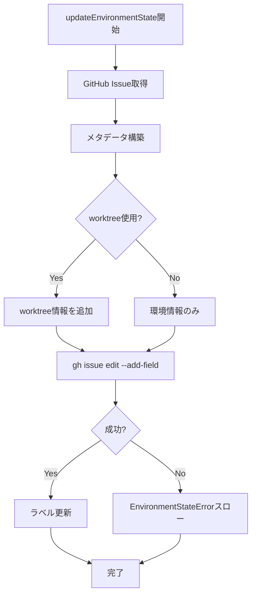

# 環境状態管理 詳細設計書

## メタ情報

| 項目 | 内容 |
|------|------|
| ドキュメントID | DETAILED-ORCH-003-F203 |
| バージョン | 1.0.0 |
| ステータス | ドラフト |
| 作成日 | 2026-01-26 |
| 最終更新日 | 2026-01-26 |
| 作成者 | AI Assistant |
| 承認者 | - |
| 関連基本設計書 | BASIC-ORCH-003 v1.0.0 |
| 対象機能 | F-203 |

---

## 1. 概要

### 1.1 目的

GitHub Issueのラベルとメタデータを使用して、worktree + container-use環境の状態を追跡します。これにより、どのIssueがどの環境で実行中かを一元管理し、環境の可視化とクリーンアップを容易にします。

### 1.2 スコープ

#### スコープ内

- GitHub Issueメタデータへの環境情報の保存
- GitHub Issueラベルでの環境状態の可視化
- 環境情報の取得・更新
- 環境タイプ（worktree/container-use/docker/host）の記録

#### スコープ外

- GitHub Issue本文の編集
- GitHub Issueのクローズ/オープン
- GitHub Issueのアサイン

### 1.3 参照ドキュメント

| ドキュメント | パス | 参照箇所 |
|-------------|------|---------|
| 基本設計書 | docs/designs/basic/BASIC-ORCH-003_v2.0.0機能.md | セクション3.2 |
| IssueStatusLabelManager設計書 | docs/designs/detailed/v1.3.0機能/issue-status-label/詳細設計書.md | 参考 |

---

## 2. 処理フロー

### 2.1 環境状態更新フロー



### 2.2 シーケンス図

```mermaid
sequenceDiagram
    autonumber
    participant Loop as LoopEngine
    participant ESM as EnvironmentStateManager
    participant GH as gh CLI
    participant Label as LabelManager

    Loop->>ESM: updateEnvironmentState(issueNumber, envInfo)
    ESM->>GH: gh issue view <issue> --json customFields
    GH-->>ESM: 現在のメタデータ
    ESM->>ESM: メタデータ構築
    ESM->>GH: gh issue edit <issue> --add-field environment=...
    GH-->>ESM: 成功
    ESM->>Label: updateStatus(issueNumber, "running")
    Label-->>ESM: 成功
    ESM-->>Loop: 完了
```

---

## 3. インターフェース定義

### 3.1 EnvironmentStateManagerConfig

```typescript
/**
 * 環境状態管理設定
 */
export interface EnvironmentStateManagerConfig {
  /**
   * GitHub Issueメタデータを使用するか
   * @default true
   */
  enabled: boolean;

  /**
   * ラベル管理を有効にするか
   * @default true
   */
  useLabels: boolean;

  /**
   * ラベル接頭辞
   * @default "orch"
   */
  labelPrefix: string;
}
```

### 3.2 EnvironmentMetadata

```typescript
/**
 * GitHub Issueに保存する環境メタデータ
 */
export interface EnvironmentMetadata {
  /**
   * 環境タイプ
   */
  type: "hybrid" | "worktree-only" | "container-only" | "host";

  /**
   * worktreeパス（worktree使用時）
   */
  worktreePath?: string;

  /**
   * ブランチ名（worktree使用時）
   */
  branch?: string;

  /**
   * 実行環境タイプ
   */
  environmentType: "container-use" | "docker" | "host";

  /**
   * 環境ID（container-use/dockerの場合）
   */
  environmentId?: string;

  /**
   * 作成日時（ISO 8601形式）
   */
  createdAt: string;

  /**
   * 最終更新日時（ISO 8601形式）
   */
  updatedAt: string;
}
```

### 3.3 EnvironmentStateManagerクラス

```typescript
/**
 * 環境状態を管理するクラス
 */
export class EnvironmentStateManager {
  /**
   * コンストラクタ
   * @param config - 設定
   * @param labelManager - IssueStatusLabelManager
   * @param executor - プロセス実行器（DI用）
   */
  constructor(
    config: EnvironmentStateManagerConfig,
    labelManager: IssueStatusLabelManager,
    executor?: ProcessExecutor
  );

  /**
   * 環境状態を更新
   * 
   * @param issueNumber - Issue番号
   * @param envInfo - 環境情報
   * @throws EnvironmentStateError - 更新失敗時
   */
  updateEnvironmentState(
    issueNumber: number,
    envInfo: EnvironmentInfo
  ): Promise<void>;

  /**
   * 環境状態を取得
   * 
   * @param issueNumber - Issue番号
   * @returns EnvironmentMetadata（存在しない場合はnull）
   */
  getEnvironmentState(issueNumber: number): Promise<EnvironmentMetadata | null>;

  /**
   * 環境状態をクリア
   * 
   * @param issueNumber - Issue番号
   */
  clearEnvironmentState(issueNumber: number): Promise<void>;
}
```

---

## 4. GitHub Issueメタデータ

### 4.1 カスタムフィールド

GitHub Issueのカスタムフィールドに以下の情報を保存します：

| フィールド名 | 型 | 説明 |
|-------------|-----|------|
| `environment` | JSON | 環境メタデータ全体 |

### 4.2 メタデータ例

```json
{
  "type": "hybrid",
  "worktreePath": ".worktrees/issue-42",
  "branch": "feature/issue-42",
  "environmentType": "container-use",
  "environmentId": "abc-123",
  "createdAt": "2026-01-26T10:00:00Z",
  "updatedAt": "2026-01-26T10:00:00Z"
}
```

### 4.3 ラベル

既存のIssueStatusLabelManagerを使用して、以下のラベルを付与します：

| ラベル | 説明 |
|--------|------|
| `orch:running` | 環境構築完了、実行中 |
| `orch:completed` | タスク完了 |
| `orch:pr-created` | PR作成済み |
| `orch:merged` | マージ完了 |

---

## 5. エラーハンドリング

### 5.1 EnvironmentStateError

```typescript
/**
 * 環境状態管理エラー
 */
export class EnvironmentStateError extends Error {
  constructor(message: string, details?: Record<string, unknown>) {
    super(message);
    this.name = "EnvironmentStateError";
    this.details = details;
  }
}
```

### 5.2 エラーケース

| エラーケース | エラーメッセージ | 対処 |
|-------------|----------------|------|
| gh issue edit失敗 | `環境状態更新失敗: ${stderr}` | GitHub認証を確認 |
| gh issue view失敗 | `環境状態取得失敗: ${stderr}` | Issue番号を確認 |
| メタデータパース失敗 | `メタデータのパースに失敗: ${error}` | メタデータ形式を確認 |

---

## 6. テスト方針

### 6.1 単体テスト

| テストケース | 期待結果 |
|-------------|---------|
| 環境状態更新（ハイブリッド） | メタデータ保存、ラベル更新 |
| 環境状態更新（worktreeのみ） | worktree情報のみ保存 |
| 環境状態更新（無効時） | 何もしない |
| 環境状態取得 | EnvironmentMetadata返却 |
| 環境状態取得（存在しない） | null返却 |
| 環境状態クリア | メタデータ削除 |

### 6.2 統合テスト

| テストケース | 期待結果 |
|-------------|---------|
| 環境構築→状態更新→取得 | 正しいメタデータが取得できる |
| 環境削除→状態クリア | メタデータが削除される |

---

## 7. 実装チェックリスト

- [ ] `src/worktree/environment-state-manager.ts` 作成
  - [ ] EnvironmentStateManagerConfigインターフェース定義
  - [ ] EnvironmentMetadataインターフェース定義
  - [ ] EnvironmentStateManagerクラス実装
  - [ ] updateEnvironmentState()メソッド実装
  - [ ] getEnvironmentState()メソッド実装
  - [ ] clearEnvironmentState()メソッド実装
- [ ] `src/core/errors.ts` 拡張
  - [ ] EnvironmentStateError追加
- [ ] テスト作成
  - [ ] `src/worktree/environment-state-manager.test.ts`

---

## 8. 変更履歴

| バージョン | 日付 | 変更内容 | 変更者 |
|-----------|------|---------|--------|
| 1.0.0 | 2026-01-26 | 初版作成 | AI Assistant |

---

## 9. 承認

| 役割 | 氏名 | 承認日 | 署名 |
|------|------|--------|------|
| 作成者 | AI Assistant | 2026-01-26 | - |
| レビュアー | - | - | - |
| 承認者 | - | - | - |
