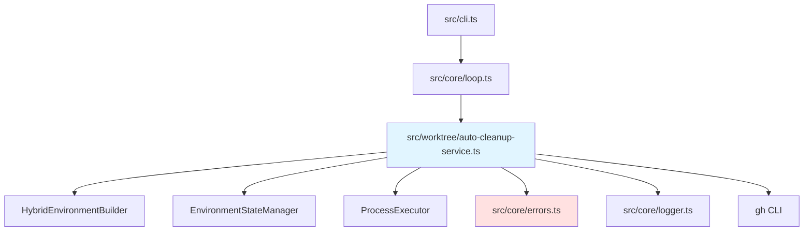

# 自動クリーンアップ バックエンド設計書

## メタ情報

| 項目 | 内容 |
|------|------|
| ドキュメントID | DETAILED-ORCH-003-F204-BE |
| バージョン | 1.0.0 |
| ステータス | ドラフト |
| 作成日 | 2026-01-26 |
| 最終更新日 | 2026-01-26 |
| 作成者 | AI Assistant |
| 承認者 | - |
| 関連詳細設計書 | DETAILED-ORCH-003-F204 |
| 対象機能 | F-204 |

---

## 1. 概要

自動クリーンアップ機能のバックエンド実装仕様を定義します。

---

## 2. ファイル構成

| ファイル | 説明 | 新規/変更 |
|---------|------|----------|
| `src/worktree/auto-cleanup-service.ts` | AutoCleanupServiceクラス | 新規 |
| `src/worktree/auto-cleanup-service.test.ts` | 単体テスト | 新規 |
| `src/core/errors.ts` | AutoCleanupError追加 | 変更 |
| `src/core/loop.ts` | AutoCleanupService統合 | 変更 |

---

## 3. クラス詳細設計

### 3.1 AutoCleanupService

#### ファイル: `src/worktree/auto-cleanup-service.ts`

```typescript
import { ProcessExecutor, BunProcessExecutor } from "../core/process-executor.js";
import { HybridEnvironmentBuilder } from "./hybrid-environment-builder.js";
import { EnvironmentStateManager } from "./environment-state-manager.js";
import { AutoCleanupError } from "../core/errors.js";
import { logger } from "../core/logger.js";

/**
 * 自動クリーンアップ設定
 */
export interface AutoCleanupServiceConfig {
  enabled: boolean;
  mergeCheckTimeoutSecs: number;
  deleteBranch: boolean;
}

/**
 * クリーンアップ結果
 */
export interface CleanupResult {
  issueNumber: number;
  cleaned: boolean;
  environmentType?: "container-use" | "docker" | "host";
  worktreeRemoved: boolean;
  branchRemoved: boolean;
  error?: string;
}

/**
 * 自動クリーンアップを実行するクラス
 * 
 * @example
 * ```typescript
 * const service = new AutoCleanupService(
 *   {
 *     enabled: true,
 *     mergeCheckTimeoutSecs: 60,
 *     deleteBranch: true,
 *   },
 *   environmentBuilder,
 *   stateManager
 * );
 * 
 * const result = await service.cleanup(42);
 * console.log(result.cleaned); // true
 * ```
 */
export class AutoCleanupService {
  private readonly config: AutoCleanupServiceConfig;
  private readonly environmentBuilder: HybridEnvironmentBuilder;
  private readonly stateManager: EnvironmentStateManager;
  private readonly executor: ProcessExecutor;

  constructor(
    config: AutoCleanupServiceConfig,
    environmentBuilder: HybridEnvironmentBuilder,
    stateManager: EnvironmentStateManager,
    executor: ProcessExecutor = new BunProcessExecutor()
  ) {
    this.config = config;
    this.environmentBuilder = environmentBuilder;
    this.stateManager = stateManager;
    this.executor = executor;
  }

  /**
   * PRマージ後のクリーンアップを実行
   * 
   * @param issueNumber - Issue番号
   * @returns CleanupResult
   * @throws AutoCleanupError - クリーンアップ失敗時
   */
  async cleanup(issueNumber: number): Promise<CleanupResult> {
    if (!this.config.enabled) {
      logger.debug("自動クリーンアップは無効です");
      return {
        issueNumber,
        cleaned: false,
        worktreeRemoved: false,
        branchRemoved: false,
      };
    }

    logger.info(`自動クリーンアップ開始: Issue #${issueNumber}`);

    try {
      // PRマージ確認
      const merged = await this.isPRMerged(issueNumber);
      if (!merged) {
        logger.warn(`PR #${issueNumber} はまだマージされていません`);
        return {
          issueNumber,
          cleaned: false,
          worktreeRemoved: false,
          branchRemoved: false,
          error: "PR not merged",
        };
      }

      // 環境状態取得
      const state = await this.stateManager.getEnvironmentState(issueNumber);
      if (!state) {
        logger.warn(`環境状態が見つかりません: Issue #${issueNumber}`);
        return {
          issueNumber,
          cleaned: false,
          worktreeRemoved: false,
          branchRemoved: false,
        };
      }

      // 環境削除
      await this.environmentBuilder.destroyEnvironment(issueNumber);

      // 環境状態クリア
      await this.stateManager.clearEnvironmentState(issueNumber);

      logger.success(`自動クリーンアップ完了: Issue #${issueNumber}`);

      return {
        issueNumber,
        cleaned: true,
        environmentType: state.environmentType,
        worktreeRemoved: !!state.worktreePath,
        branchRemoved: this.config.deleteBranch,
      };
    } catch (error) {
      logger.error(`自動クリーンアップ失敗: ${error.message}`);
      return {
        issueNumber,
        cleaned: false,
        worktreeRemoved: false,
        branchRemoved: false,
        error: error.message,
      };
    }
  }

  /**
   * PRがマージされているか確認
   * 
   * @param issueNumber - Issue番号
   * @returns マージ済みの場合はtrue
   */
  async isPRMerged(issueNumber: number): Promise<boolean> {
    try {
      // Issue番号からPR番号を取得
      // Note: GitHub IssueとPRは同じ番号空間を共有
      const result = await this.executor.spawn("gh", [
        "pr",
        "view",
        String(issueNumber),
        "--json",
        "state,mergedAt",
      ]);

      if (result.exitCode !== 0) {
        // PRが存在しない場合
        logger.debug(`PR #${issueNumber} が見つかりません`);
        return false;
      }

      const prData = JSON.parse(result.stdout);
      return prData.state === "MERGED" && !!prData.mergedAt;
    } catch (error) {
      logger.warn(`PRマージ確認失敗: ${error.message}`);
      return false;
    }
  }
}
```

---

## 4. エラークラス追加

### ファイル: `src/core/errors.ts`（追加分）

```typescript
/**
 * 自動クリーンアップエラー
 * 
 * @example
 * ```typescript
 * throw new AutoCleanupError("クリーンアップ失敗", { issueNumber: 42 });
 * ```
 */
export class AutoCleanupError extends Error {
  public readonly details?: Record<string, unknown>;

  constructor(message: string, details?: Record<string, unknown>) {
    super(message);
    this.name = "AutoCleanupError";
    this.details = details;
  }
}
```

---

## 5. Loop Engine統合

### ファイル: `src/core/loop.ts`（変更分）

```typescript
import { AutoCleanupService } from "../worktree/auto-cleanup-service.js";
import { HybridEnvironmentBuilder } from "../worktree/hybrid-environment-builder.js";
import { EnvironmentStateManager } from "../worktree/environment-state-manager.js";

export async function runLoop(context: LoopContext): Promise<LoopResult> {
  // ... 既存処理

  // 環境構築
  const environmentBuilder = new HybridEnvironmentBuilder(
    {
      worktree: config.worktree,
      sandbox: config.sandbox,
      container: config.container,
    },
    worktreeManager
  );

  const envInfo = await environmentBuilder.buildEnvironment(context.issue.number);

  // 環境状態管理
  const stateManager = new EnvironmentStateManager(
    {
      enabled: config.state?.use_github_labels ?? true,
      useLabels: config.state?.use_github_labels ?? true,
      labelPrefix: config.state?.label_prefix ?? "orch",
    },
    labelManager
  );

  await stateManager.updateEnvironmentState(context.issue.number, envInfo);

  try {
    // ... 既存のループ処理

    // PR作成時
    if (context.createPR) {
      const prNumber = await createPR(context);
      await labelManager.updateStatus(context.issue.number, "pr-created");

      // PR自動マージ
      if (context.prConfig?.autoMerge) {
        const merger = new PRAutoMerger(context.prConfig);
        await merger.autoMerge(prNumber);
        await labelManager.updateStatus(context.issue.number, "merged");

        // 自動クリーンアップ
        if (config.worktree?.autoCleanup) {
          const cleanupService = new AutoCleanupService(
            {
              enabled: true,
              mergeCheckTimeoutSecs: 60,
              deleteBranch: true,
            },
            environmentBuilder,
            stateManager
          );

          const cleanupResult = await cleanupService.cleanup(context.issue.number);
          if (cleanupResult.cleaned) {
            logger.success(`環境クリーンアップ完了: Issue #${context.issue.number}`);
          }
        }
      }
    }

    return result;
  } catch (error) {
    // エラー時も環境状態をクリア
    await stateManager.clearEnvironmentState(context.issue.number);
    throw error;
  }
}
```

---

## 6. テスト設計

### ファイル: `src/worktree/auto-cleanup-service.test.ts`

```typescript
import { describe, it, expect, mock, beforeEach } from "bun:test";
import { AutoCleanupService, AutoCleanupServiceConfig } from "./auto-cleanup-service.js";
import { HybridEnvironmentBuilder } from "./hybrid-environment-builder.js";
import { EnvironmentStateManager } from "./environment-state-manager.js";
import type { ProcessExecutor } from "../core/process-executor.js";

describe("AutoCleanupService", () => {
  let mockExecutor: ProcessExecutor;
  let mockEnvironmentBuilder: HybridEnvironmentBuilder;
  let mockStateManager: EnvironmentStateManager;
  let defaultConfig: AutoCleanupServiceConfig;

  beforeEach(() => {
    mockExecutor = {
      spawn: mock(() =>
        Promise.resolve({
          stdout: JSON.stringify({ state: "MERGED", mergedAt: "2026-01-26T10:00:00Z" }),
          stderr: "",
          exitCode: 0,
        })
      ),
    };

    mockEnvironmentBuilder = {
      destroyEnvironment: mock(() => Promise.resolve()),
    } as any;

    mockStateManager = {
      getEnvironmentState: mock(() =>
        Promise.resolve({
          type: "hybrid",
          worktreePath: ".worktrees/issue-42",
          branch: "feature/issue-42",
          environmentType: "container-use",
          environmentId: "abc-123",
          createdAt: "2026-01-26T10:00:00Z",
          updatedAt: "2026-01-26T10:00:00Z",
        })
      ),
      clearEnvironmentState: mock(() => Promise.resolve()),
    } as any;

    defaultConfig = {
      enabled: true,
      mergeCheckTimeoutSecs: 60,
      deleteBranch: true,
    };
  });

  describe("cleanup", () => {
    it("PRマージ後にクリーンアップする", async () => {
      const service = new AutoCleanupService(
        defaultConfig,
        mockEnvironmentBuilder,
        mockStateManager,
        mockExecutor
      );

      const result = await service.cleanup(42);

      expect(result.cleaned).toBe(true);
      expect(result.worktreeRemoved).toBe(true);
      expect(result.branchRemoved).toBe(true);
      expect(result.environmentType).toBe("container-use");

      // 環境削除が呼ばれたか確認
      expect(mockEnvironmentBuilder.destroyEnvironment).toHaveBeenCalledWith(42);

      // 環境状態クリアが呼ばれたか確認
      expect(mockStateManager.clearEnvironmentState).toHaveBeenCalledWith(42);
    });

    it("PR未マージ時はクリーンアップしない", async () => {
      mockExecutor.spawn = mock(() =>
        Promise.resolve({
          stdout: JSON.stringify({ state: "OPEN", mergedAt: null }),
          stderr: "",
          exitCode: 0,
        })
      );

      const service = new AutoCleanupService(
        defaultConfig,
        mockEnvironmentBuilder,
        mockStateManager,
        mockExecutor
      );

      const result = await service.cleanup(42);

      expect(result.cleaned).toBe(false);
      expect(result.error).toBe("PR not merged");

      // 環境削除が呼ばれていないか確認
      expect(mockEnvironmentBuilder.destroyEnvironment).not.toHaveBeenCalled();
    });

    it("無効時は何もしない", async () => {
      const disabledConfig = { ...defaultConfig, enabled: false };
      const service = new AutoCleanupService(
        disabledConfig,
        mockEnvironmentBuilder,
        mockStateManager,
        mockExecutor
      );

      const result = await service.cleanup(42);

      expect(result.cleaned).toBe(false);
      expect(mockExecutor.spawn).not.toHaveBeenCalled();
      expect(mockEnvironmentBuilder.destroyEnvironment).not.toHaveBeenCalled();
    });

    it("環境状態が存在しない場合はスキップ", async () => {
      mockStateManager.getEnvironmentState = mock(() => Promise.resolve(null));

      const service = new AutoCleanupService(
        defaultConfig,
        mockEnvironmentBuilder,
        mockStateManager,
        mockExecutor
      );

      const result = await service.cleanup(42);

      expect(result.cleaned).toBe(false);
      expect(mockEnvironmentBuilder.destroyEnvironment).not.toHaveBeenCalled();
    });

    it("クリーンアップ失敗時はエラーを返す", async () => {
      mockEnvironmentBuilder.destroyEnvironment = mock(() =>
        Promise.reject(new Error("削除失敗"))
      );

      const service = new AutoCleanupService(
        defaultConfig,
        mockEnvironmentBuilder,
        mockStateManager,
        mockExecutor
      );

      const result = await service.cleanup(42);

      expect(result.cleaned).toBe(false);
      expect(result.error).toBe("削除失敗");
    });
  });

  describe("isPRMerged", () => {
    it("PRがマージされている場合はtrueを返す", async () => {
      const service = new AutoCleanupService(
        defaultConfig,
        mockEnvironmentBuilder,
        mockStateManager,
        mockExecutor
      );

      const merged = await service.isPRMerged(42);

      expect(merged).toBe(true);

      // gh pr view が呼ばれたか確認
      expect(mockExecutor.spawn).toHaveBeenCalledWith("gh", [
        "pr",
        "view",
        "42",
        "--json",
        "state,mergedAt",
      ]);
    });

    it("PRがマージされていない場合はfalseを返す", async () => {
      mockExecutor.spawn = mock(() =>
        Promise.resolve({
          stdout: JSON.stringify({ state: "OPEN", mergedAt: null }),
          stderr: "",
          exitCode: 0,
        })
      );

      const service = new AutoCleanupService(
        defaultConfig,
        mockEnvironmentBuilder,
        mockStateManager,
        mockExecutor
      );

      const merged = await service.isPRMerged(42);

      expect(merged).toBe(false);
    });

    it("PRが存在しない場合はfalseを返す", async () => {
      mockExecutor.spawn = mock(() =>
        Promise.resolve({
          stdout: "",
          stderr: "PR not found",
          exitCode: 1,
        })
      );

      const service = new AutoCleanupService(
        defaultConfig,
        mockEnvironmentBuilder,
        mockStateManager,
        mockExecutor
      );

      const merged = await service.isPRMerged(42);

      expect(merged).toBe(false);
    });
  });
});
```

---

## 7. 依存関係



---

## 8. 実装手順

1. `src/core/errors.ts` に `AutoCleanupError` を追加
2. `src/worktree/auto-cleanup-service.ts` を新規作成
3. `src/worktree/auto-cleanup-service.test.ts` を新規作成
4. テスト実行・パス確認
5. `src/core/loop.ts` に AutoCleanupService 統合

---

## 9. 変更履歴

| バージョン | 日付 | 変更内容 | 変更者 |
|-----------|------|---------|--------|
| 1.0.0 | 2026-01-26 | 初版作成 | AI Assistant |
