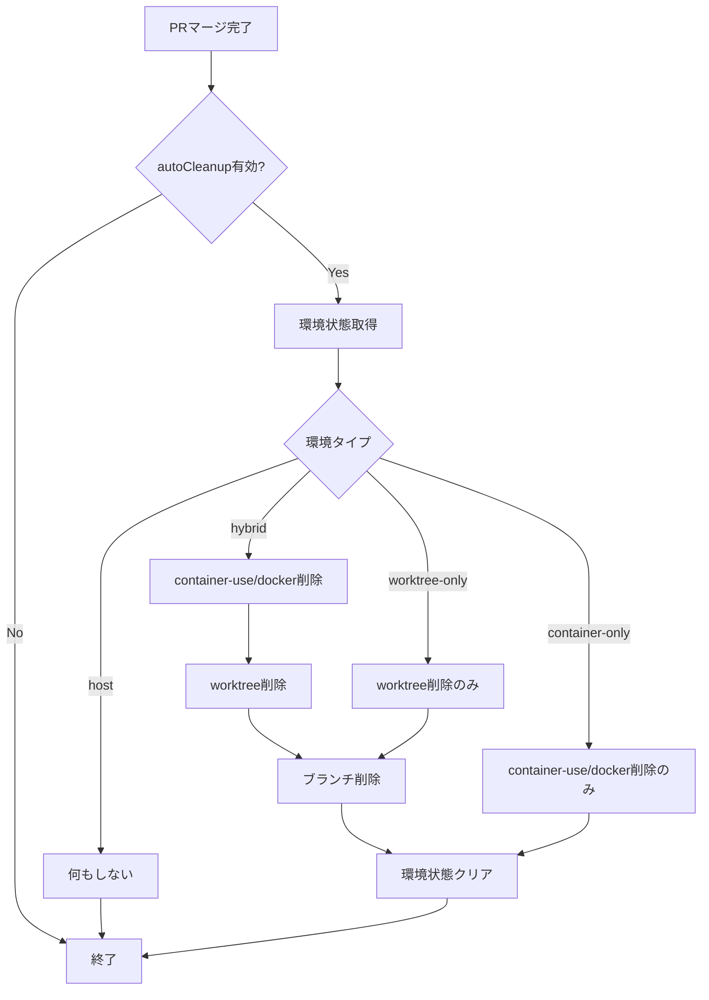

# 自動クリーンアップ 詳細設計書

## メタ情報

| 項目 | 内容 |
|------|------|
| ドキュメントID | DETAILED-ORCH-003-F204 |
| バージョン | 1.0.0 |
| ステータス | ドラフト |
| 作成日 | 2026-01-26 |
| 最終更新日 | 2026-01-26 |
| 作成者 | AI Assistant |
| 承認者 | - |
| 関連基本設計書 | BASIC-ORCH-003 v1.0.0 |
| 対象機能 | F-204 |

---

## 1. 概要

### 1.1 目的

PRマージ後に、worktree + container-use/docker環境を自動的に削除します。これにより、ディスクスペースの節約と環境の整理を自動化します。

### 1.2 スコープ

#### スコープ内

- PRマージ検出
- worktreeの自動削除
- container-use環境の自動削除
- Docker環境の自動削除
- ブランチの自動削除
- 環境状態のクリア

#### スコープ外

- PRの自動マージ（F-009で実装済み）
- 手動でのクリーンアップコマンド（別途実装）
- 未マージブランチの削除

### 1.3 参照ドキュメント

| ドキュメント | パス | 参照箇所 |
|-------------|------|---------|
| 基本設計書 | docs/designs/basic/BASIC-ORCH-003_v2.0.0機能.md | セクション3.2, 3.4 |
| PRAutoMerger設計書 | docs/designs/detailed/v1.3.0機能/pr-auto-merger/詳細設計書.md | 参考 |

---

## 2. 処理フロー

### 2.1 自動クリーンアップフロー



### 2.2 シーケンス図

```mermaid
sequenceDiagram
    autonumber
    participant Loop as LoopEngine
    participant ACS as AutoCleanupService
    participant ESM as EnvironmentStateManager
    participant HEB as HybridEnvironmentBuilder
    participant GH as gh CLI

    Loop->>ACS: cleanup(issueNumber)
    ACS->>ESM: getEnvironmentState(issueNumber)
    ESM-->>ACS: EnvironmentMetadata
    
    alt PRマージ済み確認
        ACS->>GH: gh pr view --json state,mergedAt
        GH-->>ACS: merged=true
        
        ACS->>HEB: destroyEnvironment(issueNumber)
        HEB-->>ACS: 削除完了
        
        ACS->>ESM: clearEnvironmentState(issueNumber)
        ESM-->>ACS: クリア完了
        
        ACS-->>Loop: 完了
    else PRマージされていない
        ACS-->>Loop: スキップ
    end
```

---

## 3. インターフェース定義

### 3.1 AutoCleanupServiceConfig

```typescript
/**
 * 自動クリーンアップ設定
 */
export interface AutoCleanupServiceConfig {
  /**
   * 自動クリーンアップを有効にするか
   * @default true
   */
  enabled: boolean;

  /**
   * PRマージ確認のタイムアウト（秒）
   * @default 60
   */
  mergeCheckTimeoutSecs: number;

  /**
   * ブランチも削除するか
   * @default true
   */
  deleteBranch: boolean;
}
```

### 3.2 CleanupResult

```typescript
/**
 * クリーンアップ結果
 */
export interface CleanupResult {
  /**
   * Issue番号
   */
  issueNumber: number;

  /**
   * クリーンアップが実行されたか
   */
  cleaned: boolean;

  /**
   * 削除された環境タイプ
   */
  environmentType?: "container-use" | "docker" | "host";

  /**
   * worktreeが削除されたか
   */
  worktreeRemoved: boolean;

  /**
   * ブランチが削除されたか
   */
  branchRemoved: boolean;

  /**
   * エラーメッセージ（失敗時）
   */
  error?: string;
}
```

### 3.3 AutoCleanupServiceクラス

```typescript
/**
 * 自動クリーンアップを実行するクラス
 */
export class AutoCleanupService {
  /**
   * コンストラクタ
   * @param config - 設定
   * @param environmentBuilder - HybridEnvironmentBuilder
   * @param stateManager - EnvironmentStateManager
   * @param executor - プロセス実行器（DI用）
   */
  constructor(
    config: AutoCleanupServiceConfig,
    environmentBuilder: HybridEnvironmentBuilder,
    stateManager: EnvironmentStateManager,
    executor?: ProcessExecutor
  );

  /**
   * PRマージ後のクリーンアップを実行
   * 
   * @param issueNumber - Issue番号
   * @returns CleanupResult
   * @throws AutoCleanupError - クリーンアップ失敗時
   */
  cleanup(issueNumber: number): Promise<CleanupResult>;

  /**
   * PRがマージされているか確認
   * 
   * @param issueNumber - Issue番号
   * @returns マージ済みの場合はtrue
   */
  isPRMerged(issueNumber: number): Promise<boolean>;
}
```

---

## 4. クリーンアップ対象

### 4.1 環境タイプ別の削除対象

| 環境タイプ | worktree | ブランチ | container-use | Docker |
|-----------|----------|---------|---------------|--------|
| **hybrid (container-use)** | ✅ 削除 | ✅ 削除 | ✅ 削除 | - |
| **hybrid (docker)** | ✅ 削除 | ✅ 削除 | - | ✅ 削除 |
| **worktree-only** | ✅ 削除 | ✅ 削除 | - | - |
| **container-only** | - | - | ✅ 削除 | - |
| **host** | - | - | - | - |

### 4.2 削除コマンド

| 対象 | コマンド |
|------|---------|
| worktree | `git worktree remove <path>` |
| ブランチ | `git branch -d <branch>` |
| container-use | `cu env delete <env-id> --yes` |
| Docker | `docker rm -f <container-id>` |

---

## 5. エラーハンドリング

### 5.1 AutoCleanupError

```typescript
/**
 * 自動クリーンアップエラー
 */
export class AutoCleanupError extends Error {
  constructor(message: string, details?: Record<string, unknown>) {
    super(message);
    this.name = "AutoCleanupError";
    this.details = details;
  }
}
```

### 5.2 エラーケース

| エラーケース | エラーメッセージ | 対処 |
|-------------|----------------|------|
| PR未マージ | `PR #${prNumber} はまだマージされていません` | 警告のみ、クリーンアップスキップ |
| 環境削除失敗 | `環境削除失敗: ${error}` | 手動でクリーンアップが必要 |
| worktree削除失敗 | `worktree削除失敗: ${stderr}` | 手動でクリーンアップが必要 |

---

## 6. テスト方針

### 6.1 単体テスト

| テストケース | 期待結果 |
|-------------|---------|
| PRマージ後のクリーンアップ（ハイブリッド） | worktree削除、container-use削除、ブランチ削除 |
| PRマージ後のクリーンアップ（worktreeのみ） | worktree削除、ブランチ削除 |
| PR未マージ時 | クリーンアップスキップ |
| autoCleanup無効時 | 何もしない |
| 環境が存在しない場合 | エラーなし、スキップ |

### 6.2 統合テスト

| テストケース | 期待結果 |
|-------------|---------|
| 環境構築→PRマージ→自動クリーンアップ | すべての環境が削除される |
| 複数環境の同時クリーンアップ | 各環境が独立して削除される |

---

## 7. 実装チェックリスト

- [ ] `src/worktree/auto-cleanup-service.ts` 作成
  - [ ] AutoCleanupServiceConfigインターフェース定義
  - [ ] CleanupResultインターフェース定義
  - [ ] AutoCleanupServiceクラス実装
  - [ ] cleanup()メソッド実装
  - [ ] isPRMerged()メソッド実装
- [ ] `src/core/errors.ts` 拡張
  - [ ] AutoCleanupError追加
- [ ] テスト作成
  - [ ] `src/worktree/auto-cleanup-service.test.ts`

---

## 8. 変更履歴

| バージョン | 日付 | 変更内容 | 変更者 |
|-----------|------|---------|--------|
| 1.0.0 | 2026-01-26 | 初版作成 | AI Assistant |

---

## 9. 承認

| 役割 | 氏名 | 承認日 | 署名 |
|------|------|--------|------|
| 作成者 | AI Assistant | 2026-01-26 | - |
| レビュアー | - | - | - |
| 承認者 | - | - | - |
