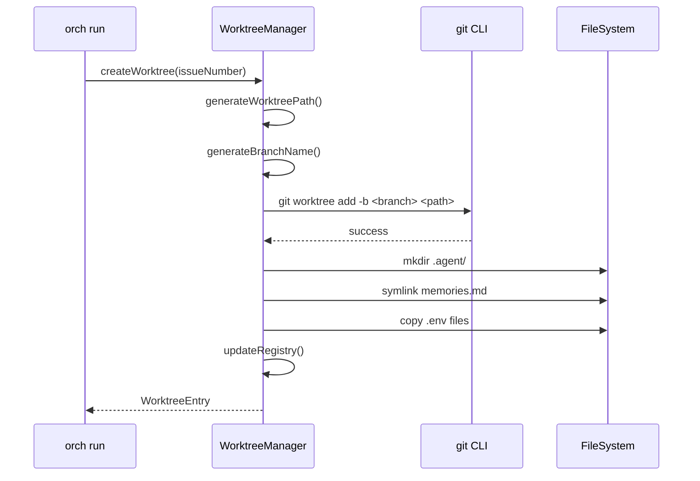
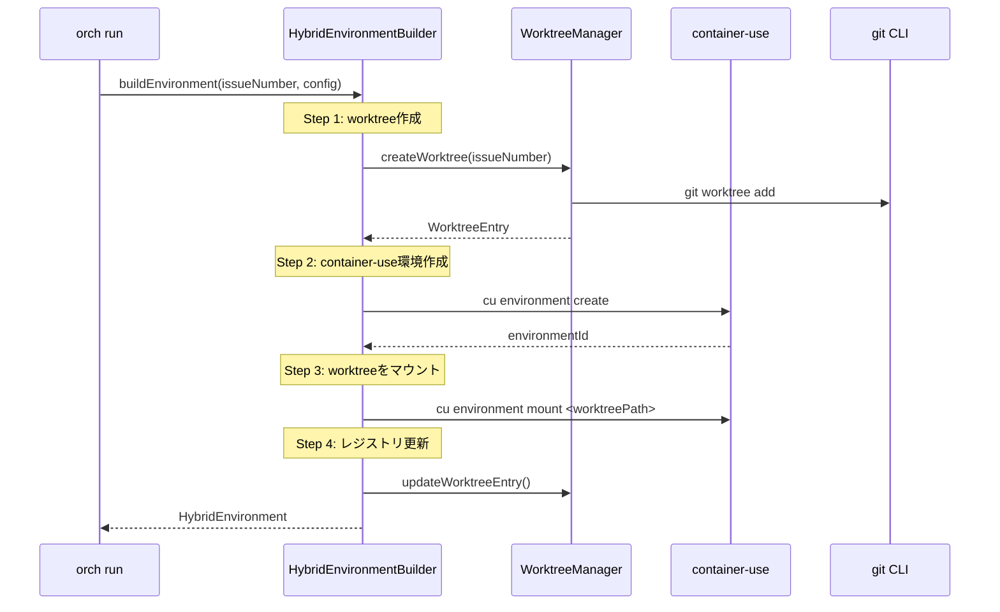
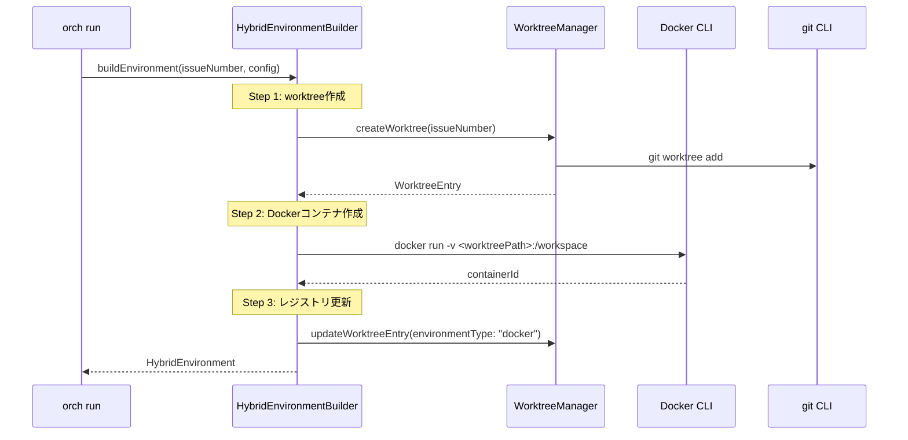
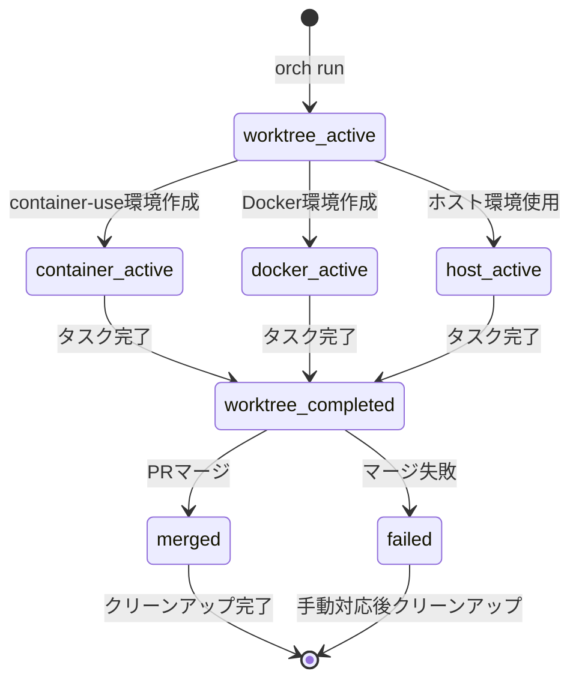
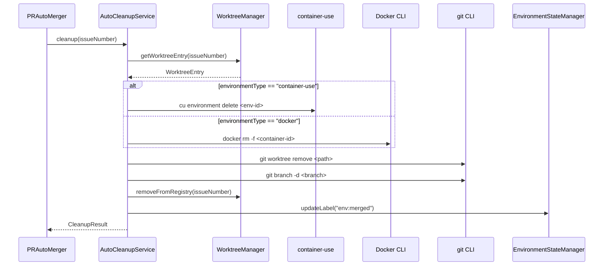
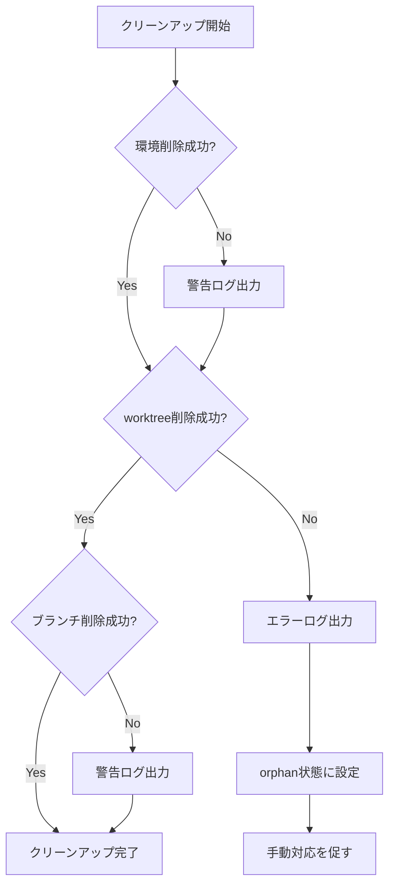

# v2.0.0機能 インフラ設計書

## メタ情報

| 項目 | 内容 |
|------|------|
| ドキュメントID | DETAILED-ORCH-003-COMMON-INFRA |
| バージョン | 1.0.0 |
| ステータス | ドラフト |
| 作成日 | 2026-01-26 |
| 最終更新日 | 2026-01-26 |
| 作成者 | AI Assistant |
| 承認者 | - |
| 関連基本設計書 | BASIC-ORCH-003 v1.0.0 |

---

## 1. 概要

v2.0.0で追加される機能（F-201〜F-204）に関するインフラ設計を定義します。
主にgit worktree、container-use、Docker sandboxの統合と環境管理に焦点を当てます。

---

## 2. インフラ要件

### 2.1 基本設計書からの要件

| ID | 要件 | 詳細 |
|----|------|------|
| NFR-P-009 | worktree作成時間 | 5秒以内 |
| NFR-P-010 | container-use環境作成時間 | 30秒以内 |

### 2.2 v2.0.0追加インフラ要件

| ID | 要件 | 対象機能 |
|----|------|---------|
| INFRA-001 | git worktree環境の分離 | F-201 |
| INFRA-002 | ハイブリッド環境の自動構築 | F-202 |
| INFRA-003 | 環境状態のリアルタイム追跡 | F-203 |
| INFRA-004 | 自動クリーンアップの確実な実行 | F-204 |

---

## 3. git worktree構成（F-201）

### 3.1 ディレクトリ構成

| パス | 説明 |
|------|------|
| `project/` | プロジェクトルート |
| `project/.git/` | メインリポジトリ |
| `project/.orch/` | orchestrator-hybrid管理ディレクトリ |
| `project/.orch/worktrees.json` | worktreeレジストリ |
| `project/.orch/loop.lock` | プライマリループロック（v1.4.0） |
| `project/.worktrees/` | worktree基底ディレクトリ |
| `project/.worktrees/issue-42/` | Issue #42用worktree |
| `project/.worktrees/issue-42/.git` | シンボリックリンク（../../.git/worktrees/issue-42） |
| `project/.worktrees/issue-42/.agent/` | エージェント作業ディレクトリ |
| `project/.worktrees/issue-42/.agent/scratchpad.md` | スクラッチパッド |
| `project/.worktrees/issue-42/.agent/tasks.jsonl` | タスク一覧 |
| `project/.worktrees/issue-42/.agent/events.jsonl` | イベント履歴 |
| `project/.worktrees/issue-42/.agent/memories.md` | シンボリックリンク（../../../.agent/memories.md） |
| `project/.worktrees/issue-42/.env` | コピーされた環境ファイル |
| `project/.agent/` | メイン作業ディレクトリ |
| `project/.agent/memories.md` | 共有Memories（シンボリックリンク元） |
| `project/.agent/task-<id>/` | タスクログディレクトリ |
| `project/.agent/task-<id>/task.log` | タスクログ |
| `project/.agent/task-<id>/backend.log` | バックエンド出力（新規 v2.0.0） |
| `project/.agent/task-<id>/events.jsonl` | イベント履歴 |

### 3.2 worktree作成フロー



### 3.3 gitコマンド

| 操作 | コマンド |
|------|---------|
| worktree作成 | `git worktree add -b <branch> <path>` |
| worktree一覧 | `git worktree list --porcelain` |
| worktree削除 | `git worktree remove <path>` |
| worktreeプルーニング | `git worktree prune` |
| ブランチ削除 | `git branch -d <branch>` |

### 3.4 worktreeレジストリ

`.orch/worktrees.json` の形式:

```json
{
  "version": "2.0.0",
  "worktrees": [
    {
      "issueNumber": 42,
      "path": ".worktrees/issue-42",
      "branch": "feature/issue-42",
      "environmentType": "container-use",
      "environmentId": "abc-123",
      "createdAt": "2026-01-26T10:00:00Z",
      "status": "active",
      "updatedAt": "2026-01-26T10:00:00Z",
      "taskId": "task-1234567890-42"
    }
  ],
  "updatedAt": "2026-01-26T10:00:00Z"
}
```

---

## 4. ハイブリッド環境構築（F-202）

### 4.1 環境組み合わせパターン

| パターン | worktree | sandbox | 動作 |
|---------|----------|---------|------|
| A: ハイブリッド | 有効 | container-use | worktree + container-use |
| B: worktree + Docker | 有効 | docker | worktree + Docker |
| C: worktreeのみ | 有効 | host/disabled | worktreeのみ |
| D: container-useのみ | 無効 | container-use | container-useのみ |
| E: Dockerのみ | 無効 | docker | Dockerのみ |
| F: ホスト実行 | 無効 | host/disabled | ホスト直接実行 |

### 4.2 パターンA: ハイブリッド環境構築フロー



### 4.3 パターンB: worktree + Docker構築フロー



### 4.4 container-useコマンド

| 操作 | コマンド |
|------|---------|
| 環境作成 | `cu environment create --image <image>` |
| 環境一覧 | `cu environment list` |
| 環境削除 | `cu environment delete <env-id>` |
| ファイルマウント | `cu environment mount <path>` |
| コマンド実行 | `cu run <command>` |

### 4.5 Dockerコマンド

| 操作 | コマンド |
|------|---------|
| コンテナ作成 | `docker run -d -v <path>:/workspace <image>` |
| コンテナ一覧 | `docker ps -a --filter "label=orch-issue=<number>"` |
| コンテナ削除 | `docker rm -f <container-id>` |
| ボリューム削除 | `docker volume rm <volume-id>` |

---

## 5. 環境状態管理（F-203）

### 5.1 GitHub Issueラベル

| ラベル | 色 | 説明 |
|--------|-----|------|
| `env:worktree-active` | 緑 (#0E8A16) | worktree実行中 |
| `env:worktree-completed` | 青 (#0366D6) | worktree完了 |
| `env:container-active` | 紫 (#6F42C1) | container-use実行中 |
| `env:docker-active` | 水色 (#1D76DB) | Docker実行中 |
| `env:host-active` | 黄 (#FBCA04) | ホスト環境実行中 |
| `env:merged` | 青紫 (#5319E7) | マージ完了 |
| `env:failed` | 赤 (#B60205) | 失敗 |

### 5.2 Issueメタデータ（HTML コメント）

Issue本文の末尾にHTMLコメントとして環境状態メタデータを埋め込みます:

```html
<!-- ORCH_ENV_STATE
{
  "worktreePath": ".worktrees/issue-42",
  "branch": "feature/issue-42",
  "environmentType": "container-use",
  "environmentId": "abc-123",
  "lastUpdated": "2026-01-26T10:00:00Z"
}
-->
```

### 5.3 状態遷移図



---

## 6. 自動クリーンアップ（F-204）

### 6.1 クリーンアップ対象

| 環境タイプ | 削除対象 | 削除コマンド |
|-----------|---------|-------------|
| worktree | worktreeディレクトリ | `git worktree remove` |
| worktree | ブランチ | `git branch -d` |
| container-use | container-use環境 | `cu environment delete` |
| docker | Dockerコンテナ | `docker rm -f` |
| docker | Dockerボリューム | `docker volume rm` |

### 6.2 クリーンアップフロー



### 6.3 クリーンアップ失敗時の対応



### 6.4 孤立リソースの検出と対処

```typescript
// 孤立worktreeの検出
async function detectOrphanWorktrees(): Promise<string[]> {
  // git worktree list の結果とレジストリを比較
  const gitWorktrees = await listGitWorktrees();
  const registryWorktrees = await loadRegistry();
  
  const orphans = gitWorktrees.filter(
    wt => !registryWorktrees.some(rw => rw.path === wt.path)
  );
  
  return orphans.map(o => o.path);
}

// 孤立container-use環境の検出
async function detectOrphanContainerUseEnvironments(): Promise<string[]> {
  // cu environment list の結果とレジストリを比較
  const cuEnvironments = await listContainerUseEnvironments();
  const registryEnvIds = registryWorktrees
    .filter(w => w.environmentType === "container-use")
    .map(w => w.environmentId);
  
  // orch-で始まるがレジストリにないものを孤立とみなす
  const orphans = cuEnvironments.filter(
    env => env.name.startsWith("orch-") && !registryEnvIds.includes(env.id)
  );
  
  return orphans.map(o => o.id);
}
```

---

## 7. ログ管理（F-103）

### 7.1 ログディレクトリ構成

| パス | 説明 |
|------|------|
| `.agent/` | エージェント作業ディレクトリ |
| `.agent/task-1234567890-42/` | タスクログディレクトリ |
| `.agent/task-1234567890-42/task.log` | orchestrator-hybridのログ |
| `.agent/task-1234567890-42/backend.log` | バックエンド出力（新規） |
| `.agent/task-1234567890-42/events.jsonl` | イベント履歴 |

### 7.2 backend.logのローテーション

```typescript
// ログローテーション設定
interface LogRotationConfig {
  maxSizeBytes: number;  // 10MB デフォルト
  maxFiles: number;      // 3 デフォルト
}

// ローテーション実行
async function rotateLogIfNeeded(
  logPath: string,
  config: LogRotationConfig
): Promise<void> {
  const stats = await fs.stat(logPath).catch(() => null);
  
  if (stats && stats.size >= config.maxSizeBytes) {
    // 古いログファイルをシフト
    for (let i = config.maxFiles - 1; i >= 1; i--) {
      const oldPath = `${logPath}.${i}`;
      const newPath = `${logPath}.${i + 1}`;
      await fs.rename(oldPath, newPath).catch(() => {});
    }
    
    // 現在のログを.1にリネーム
    await fs.rename(logPath, `${logPath}.1`);
  }
}
```

### 7.3 バックエンド出力ストリーミング

```typescript
// バックエンド出力をリアルタイムでログファイルに書き込み
async function streamBackendOutput(
  process: Subprocess,
  logPath: string
): Promise<void> {
  const writer = fs.createWriteStream(logPath, { flags: "a" });
  
  // stdout をストリーミング
  if (process.stdout) {
    for await (const chunk of process.stdout) {
      writer.write(chunk);
    }
  }
  
  // stderr をストリーミング
  if (process.stderr) {
    for await (const chunk of process.stderr) {
      writer.write(chunk);
    }
  }
  
  writer.close();
}
```

---

## 8. 性能要件

### 8.1 目標値

| 操作 | 目標時間 | 測定方法 |
|------|---------|---------|
| worktree作成 | 5秒以内 | 統合テスト |
| container-use環境作成 | 30秒以内 | 統合テスト |
| Docker環境作成 | 15秒以内 | 統合テスト |
| クリーンアップ | 10秒以内 | 統合テスト |
| レジストリ更新 | 100ms以内 | ユニットテスト |

### 8.2 最適化ポイント

1. **worktree作成の高速化**
   - `--detach`オプションで最小限のチェックアウト
   - 大きなファイルの遅延チェックアウト（git LFS対応）

2. **環境作成の並列化**
   - worktree作成と環境準備を可能な限り並列化
   - 環境ファイルのコピーを非同期で実行

3. **レジストリアクセスの最適化**
   - レジストリファイルのキャッシュ
   - 更新時のみファイル書き込み

---

## 9. 障害対策

### 9.1 障害シナリオと対策

| シナリオ | 対策 |
|---------|------|
| worktree作成中にプロセス終了 | レジストリの整合性チェック、孤立検出 |
| container-use環境作成失敗 | フォールバックでworktreeのみ使用 |
| クリーンアップ中にプロセス終了 | 次回起動時に孤立リソース検出・クリーンアップ |
| ディスク容量不足 | 事前チェック、古いログのローテーション |

### 9.2 リカバリ手順

```bash
# 孤立worktreeの検出と削除
orch worktree prune

# 孤立container-use環境の検出と削除
orch cleanup --orphan-environments

# レジストリの再構築
orch worktree rebuild-registry
```

---

## 10. 監視項目

### 10.1 メトリクス

| メトリクス | 説明 | 閾値 |
|-----------|------|------|
| worktree_count | アクティブworktree数 | 10以下推奨 |
| environment_count | アクティブ環境数 | 10以下推奨 |
| disk_usage | worktreeのディスク使用量 | 10GB以下推奨 |
| log_size | backend.logのサイズ | 10MB以下 |

### 10.2 アラート条件

| 条件 | 重要度 | アクション |
|------|--------|-----------|
| worktree作成失敗 | 高 | 即時通知、フォールバック |
| 環境作成タイムアウト | 中 | 警告ログ、リトライ |
| クリーンアップ失敗 | 中 | 警告ログ、孤立マーク |
| ディスク使用量90%超過 | 高 | アラート、古いworktree削除提案 |

---

## 11. 変更履歴

| バージョン | 日付 | 変更内容 | 変更者 |
|-----------|------|---------|--------|
| 1.0.0 | 2026-01-26 | 初版作成 | AI Assistant |
