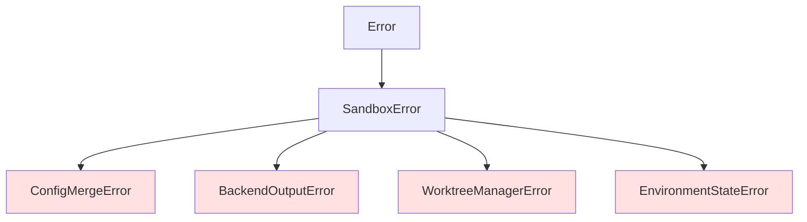

# v2.0.0機能 型定義・共通処理設計書

## メタ情報

| 項目 | 内容 |
|------|------|
| ドキュメントID | DETAILED-ORCH-003-COMMON-TYPES |
| バージョン | 1.0.0 |
| ステータス | ドラフト |
| 作成日 | 2026-01-26 |
| 最終更新日 | 2026-01-26 |
| 作成者 | AI Assistant |
| 承認者 | - |
| 関連基本設計書 | BASIC-ORCH-003 v1.0.0 |

---

## 1. 概要

v2.0.0で追加される機能（F-101〜F-104, F-201〜F-204）に必要な型定義とエラークラスの設計を定義します。

---

## 2. ファイル変更一覧

| ファイル | 変更内容 | 新規/変更 |
|---------|---------|----------|
| `src/core/types.ts` | RunConfigSchema、WorktreeConfigSchema追加 | 変更 |
| `src/core/errors.ts` | 4つのエラークラス追加 | 変更 |

---

## 3. 型定義拡張

### 3.1 RunConfigSchema（F-101）

#### ファイル: `src/core/types.ts`（追加分）

```typescript
/**
 * run設定のzodスキーマ
 * 
 * CLIオプションのデフォルト値を設定ファイルで指定可能にします。
 */
export const RunConfigSchema = z.object({
  /**
   * --auto のデフォルト値
   * @default false
   */
  auto_mode: z.boolean().default(false),

  /**
   * --create-pr のデフォルト値
   * @default false
   */
  create_pr: z.boolean().default(false),

  /**
   * --draft のデフォルト値
   * @default false
   */
  draft_pr: z.boolean().default(false),

  /**
   * --auto-merge のデフォルト値
   * @default false
   */
  auto_merge: z.boolean().default(false),

  /**
   * --resolve-deps のデフォルト値
   * @default false
   */
  resolve_deps: z.boolean().default(false),

  /**
   * --ignore-deps のデフォルト値
   * @default false
   */
  ignore_deps: z.boolean().default(false),

  /**
   * --container のデフォルト値
   * @default false
   */
  use_container: z.boolean().default(false),

  /**
   * --report のデフォルト値（パスまたはtrue/false）
   * @default false
   */
  generate_report: z.union([z.boolean(), z.string()]).default(false),

  /**
   * デフォルトプリセット
   */
  preset: z.string().optional(),
});

export type RunConfig = z.infer<typeof RunConfigSchema>;
```

### 3.2 WorktreeConfigSchema（F-201, F-202）

```typescript
/**
 * worktree設定のzodスキーマ
 */
export const WorktreeConfigSchema = z.object({
  /**
   * worktreeを有効にするか
   * @default false
   */
  enabled: z.boolean().default(false),

  /**
   * worktreeのベースディレクトリ
   * @default ".worktrees"
   */
  base_dir: z.string().default(".worktrees"),

  /**
   * マージ後に自動クリーンアップするか
   * @default true
   */
  auto_cleanup: z.boolean().default(true),

  /**
   * worktreeにコピーする環境ファイル
   * @default [".env", ".envrc", ".env.local"]
   */
  copy_env_files: z.array(z.string()).default([".env", ".envrc", ".env.local"]),

  /**
   * ブランチ名のプレフィックス
   * @default "feature/issue-"
   */
  branch_prefix: z.string().default("feature/issue-"),
});

export type WorktreeConfig = z.infer<typeof WorktreeConfigSchema>;
```

### 3.3 WorktreeEntry（F-201）

```typescript
/**
 * 環境タイプ
 */
export const EnvironmentTypeSchema = z.enum(["container-use", "docker", "host"]);

export type EnvironmentType = z.infer<typeof EnvironmentTypeSchema>;

/**
 * worktree状態
 */
export const WorktreeStatusSchema = z.enum([
  "active",        // 実行中
  "completed",     // 完了（マージ待ち）
  "merged",        // マージ完了
  "failed",        // 失敗
  "cleaning-up",   // クリーンアップ中
  "orphan",        // 孤立（追跡なし）
]);

export type WorktreeStatus = z.infer<typeof WorktreeStatusSchema>;

/**
 * worktreeエントリ
 */
export interface WorktreeEntry {
  /**
   * Issue番号
   */
  issueNumber: number;

  /**
   * worktreeパス
   * @example ".worktrees/issue-42"
   */
  path: string;

  /**
   * ブランチ名
   * @example "feature/issue-42"
   */
  branch: string;

  /**
   * 環境タイプ
   */
  environmentType: EnvironmentType;

  /**
   * 環境ID（container-use/dockerの場合）
   * hostの場合はnull
   */
  environmentId: string | null;

  /**
   * 作成日時
   */
  createdAt: string;

  /**
   * 状態
   */
  status: WorktreeStatus;

  /**
   * 最終更新日時
   */
  updatedAt: string;

  /**
   * タスクID（実行中のタスク）
   */
  taskId?: string;
}
```

### 3.4 WorktreesRegistry（F-201）

```typescript
/**
 * worktreesレジストリ
 * .orch/worktrees.json に保存
 */
export interface WorktreesRegistry {
  /**
   * レジストリバージョン
   */
  version: string;

  /**
   * worktree一覧
   */
  worktrees: WorktreeEntry[];

  /**
   * 最終更新日時
   */
  updatedAt: string;
}
```

### 3.5 HybridEnvironment（F-202）

```typescript
/**
 * ハイブリッド環境情報
 */
export interface HybridEnvironment {
  /**
   * worktree情報
   */
  worktree: {
    path: string;
    branch: string;
  };

  /**
   * 実行環境情報
   */
  environment: {
    type: EnvironmentType;
    id: string | null;
    image?: string;  // Docker/container-useの場合
  };

  /**
   * Issue番号
   */
  issueNumber: number;

  /**
   * 構築日時
   */
  createdAt: string;
}
```

### 3.6 EnvironmentState（F-203）

```typescript
/**
 * 環境状態ラベル
 */
export const EnvironmentStateLabelSchema = z.enum([
  "env:worktree-active",    // worktree実行中
  "env:worktree-completed", // worktree完了
  "env:container-active",   // container-use実行中
  "env:docker-active",      // Docker実行中
  "env:host-active",        // ホスト環境実行中
  "env:merged",             // マージ完了
  "env:failed",             // 失敗
]);

export type EnvironmentStateLabel = z.infer<typeof EnvironmentStateLabelSchema>;

/**
 * 環境状態メタデータ（Issue本文のコメントブロック）
 */
export interface EnvironmentStateMetadata {
  /**
   * worktreeパス
   */
  worktreePath?: string;

  /**
   * ブランチ名
   */
  branch?: string;

  /**
   * 環境タイプ
   */
  environmentType?: EnvironmentType;

  /**
   * 環境ID
   */
  environmentId?: string;

  /**
   * 最終更新日時
   */
  lastUpdated: string;
}
```

### 3.7 CleanupResult（F-204）

```typescript
/**
 * クリーンアップ結果
 */
export interface CleanupResult {
  /**
   * Issue番号
   */
  issueNumber: number;

  /**
   * クリーンアップ成功か
   */
  success: boolean;

  /**
   * 削除されたworktreeパス
   */
  deletedWorktree?: string;

  /**
   * 削除されたブランチ名
   */
  deletedBranch?: string;

  /**
   * 削除された環境ID
   */
  deletedEnvironmentId?: string;

  /**
   * 削除された環境タイプ
   */
  deletedEnvironmentType?: EnvironmentType;

  /**
   * エラーメッセージ（失敗時）
   */
  error?: string;

  /**
   * クリーンアップ日時
   */
  cleanedAt: string;
}
```

### 3.8 BackendOutputConfig（F-103）

```typescript
/**
 * バックエンド出力設定
 */
export const BackendOutputConfigSchema = z.object({
  /**
   * バックエンド出力をログファイルに書き込むか
   * @default true
   */
  enabled: z.boolean().default(true),

  /**
   * ログファイル名
   * @default "backend.log"
   */
  filename: z.string().default("backend.log"),

  /**
   * 最大ファイルサイズ（バイト）
   * @default 10485760 (10MB)
   */
  max_size_bytes: z.number().min(1048576).max(104857600).default(10485760),

  /**
   * ローテーション保持数
   * @default 3
   */
  max_files: z.number().min(1).max(10).default(3),
});

export type BackendOutputConfig = z.infer<typeof BackendOutputConfigSchema>;
```

### 3.9 LogSource（F-104）

```typescript
/**
 * ログソース
 */
export const LogSourceSchema = z.enum(["task", "backend", "all"]);

export type LogSource = z.infer<typeof LogSourceSchema>;
```

### 3.10 ConfigSchema拡張

```typescript
/**
 * 設定ファイル全体のzodスキーマ（v2.0.0拡張版）
 */
export const ConfigSchema = z.object({
  version: z.string().default("1.0"),
  
  backend: z.object({
    type: z.enum(["claude", "opencode", "gemini", "container", "custom"]).default("claude"),
    model: z.string().optional(),
    // v1.4.0追加フィールド
    command: z.string().optional(),
    args: z.array(z.string()).optional(),
    prompt_mode: z.enum(["arg", "stdin"]).optional(),
    prompt_flag: z.string().optional(),
    // v2.0.0追加: バックエンド出力設定
    output: BackendOutputConfigSchema.optional(),
  }),

  container: ContainerConfigSchema,
  sandbox: SandboxConfigSchema.optional(),

  loop: z.object({
    max_iterations: z.number().default(100),
    completion_promise: z.string().default("LOOP_COMPLETE"),
    idle_timeout_secs: z.number().default(1800),
  }),

  hats: z.record(z.string(), HatSchema).optional(),

  gates: z.object({
    after_plan: z.boolean().default(true),
    after_implementation: z.boolean().default(false),
    before_pr: z.boolean().default(true),
  }).optional(),

  quality: z.object({
    min_score: z.number().default(8),
    auto_approve_above: z.number().default(9),
  }).optional(),

  state: StateConfigSchema.optional(),
  autoIssue: AutoIssueConfigSchema.optional(),
  pr: PRConfigSchema.optional(),

  // v1.4.0追加
  memories: MemoriesConfigSchema.optional(),
  tasks: TasksConfigSchema.optional(),

  // 新規: run設定（v2.0.0）
  run: RunConfigSchema.optional(),

  // 新規: worktree設定（v2.0.0）
  worktree: WorktreeConfigSchema.optional(),
});

export type Config = z.infer<typeof ConfigSchema>;
```

### 3.11 LoopContext拡張

```typescript
/**
 * ループ実行コンテキスト（v2.0.0拡張版）
 */
export interface LoopContext {
  // 既存フィールド（v1.4.0以前）
  issue: Issue;
  iteration: number;
  maxIterations: number;
  scratchpadPath: string;
  promptPath: string;
  completionPromise: string;
  autoMode: boolean;
  createPR: boolean;
  draftPR: boolean;
  useContainer: boolean;
  generateReport: boolean;
  reportPath: string;
  preset?: string;
  taskId?: string;
  logDir?: string;
  prConfig?: PRConfig;
  resolveDeps?: boolean;
  ignoreDeps?: boolean;
  currentHatModel?: string;
  currentHatBackend?: HatBackend;
  memoriesConfig?: MemoriesConfig;
  tasksConfig?: TasksConfig;
  recordSessionPath?: string;
  loopId?: string;
  isPrimaryLoop?: boolean;
  noAutoMerge?: boolean;

  // 新規: worktree情報（v2.0.0）
  /**
   * worktreeパス
   */
  worktreePath?: string;

  /**
   * worktree設定
   */
  worktreeConfig?: WorktreeConfig;

  /**
   * ハイブリッド環境情報
   */
  hybridEnvironment?: HybridEnvironment;

  /**
   * バックエンド出力ログパス
   */
  backendLogPath?: string;

  /**
   * run設定（設定ファイルからのデフォルト値）
   */
  runConfig?: RunConfig;
}
```

---

## 4. エラークラス追加

### 4.1 エラー階層図



### 4.2 ConfigMergeError

#### ファイル: `src/core/errors.ts`（追加分）

```typescript
/**
 * 設定マージエラー
 * 
 * ConfigMerger（F-101）で発生するエラーを表現します。
 * 
 * @example
 * ```typescript
 * // 設定の競合
 * throw new ConfigMergeError(
 *   "CLIオプションと設定ファイルの値が競合しています",
 *   { option: "auto_mode", cliValue: false, configValue: true }
 * );
 * 
 * // 不正な設定値
 * throw new ConfigMergeError(
 *   "run.preset に無効なプリセット名が指定されています",
 *   { preset: "invalid-preset" }
 * );
 * ```
 */
export class ConfigMergeError extends SandboxError {
  constructor(message: string, details?: Record<string, unknown>) {
    super(message, {
      code: "CONFIG_MERGE_ERROR",
      details,
    });
    this.name = "ConfigMergeError";
  }
}
```

### 4.3 BackendOutputError

```typescript
/**
 * バックエンド出力エラー
 * 
 * バックエンド出力ストリーミング（F-103）で発生するエラーを表現します。
 * 
 * @example
 * ```typescript
 * // 書き込み失敗
 * throw new BackendOutputError(
 *   "backend.logへの書き込みに失敗しました",
 *   { path: ".agent/task-123/backend.log", cause: "EACCES" }
 * );
 * 
 * // ローテーション失敗
 * throw new BackendOutputError(
 *   "ログローテーションに失敗しました",
 *   { path: ".agent/task-123/backend.log", cause: "disk full" }
 * );
 * ```
 */
export class BackendOutputError extends SandboxError {
  constructor(message: string, details?: Record<string, unknown>) {
    super(message, {
      code: "BACKEND_OUTPUT_ERROR",
      details,
    });
    this.name = "BackendOutputError";
  }
}
```

### 4.4 WorktreeManagerError

```typescript
/**
 * WorktreeManagerエラー
 * 
 * WorktreeManager（F-201）およびHybridEnvironmentBuilder（F-202）で
 * 発生するエラーを表現します。
 * 
 * @example
 * ```typescript
 * // worktree作成失敗
 * throw new WorktreeManagerError(
 *   "worktreeの作成に失敗しました",
 *   { path: ".worktrees/issue-42", cause: "branch already exists" }
 * );
 * 
 * // container-use環境作成失敗
 * throw new WorktreeManagerError(
 *   "container-use環境の作成に失敗しました",
 *   { worktreePath: ".worktrees/issue-42", cause: "cu command not found" }
 * );
 * 
 * // 孤立worktree検出
 * throw new WorktreeManagerError(
 *   "孤立したworktreeを検出しました",
 *   { orphanPaths: [".worktrees/issue-99", ".worktrees/issue-100"] }
 * );
 * ```
 */
export class WorktreeManagerError extends SandboxError {
  constructor(message: string, details?: Record<string, unknown>) {
    super(message, {
      code: "WORKTREE_MANAGER_ERROR",
      details,
    });
    this.name = "WorktreeManagerError";
  }
}
```

### 4.5 EnvironmentStateError

```typescript
/**
 * 環境状態エラー
 * 
 * EnvironmentStateManager（F-203）で発生するエラーを表現します。
 * 
 * @example
 * ```typescript
 * // ラベル更新失敗
 * throw new EnvironmentStateError(
 *   "GitHub Issueラベルの更新に失敗しました",
 *   { issueNumber: 42, label: "env:worktree-active", cause: "API error" }
 * );
 * 
 * // メタデータ解析失敗
 * throw new EnvironmentStateError(
 *   "環境状態メタデータの解析に失敗しました",
 *   { issueNumber: 42 }
 * );
 * ```
 */
export class EnvironmentStateError extends SandboxError {
  constructor(message: string, details?: Record<string, unknown>) {
    super(message, {
      code: "ENVIRONMENT_STATE_ERROR",
      details,
    });
    this.name = "EnvironmentStateError";
  }
}
```

---

## 5. 設定ファイル例

### 5.1 orch.yml（v2.0.0完全版）

```yaml
version: "1.0"

# バックエンド設定
backend:
  type: claude
  model: claude-sonnet-4-20250514
  # バックエンド出力設定（新規 v2.0.0）
  output:
    enabled: true
    filename: backend.log
    max_size_bytes: 10485760  # 10MB
    max_files: 3

# サンドボックス設定（v1.2.0）
sandbox:
  type: docker
  fallback: host
  docker:
    image: node:20-alpine
    network: none
    timeout: 300
  containerUse:
    image: node:20
  host:
    warnOnStart: true

# container-use設定
container:
  enabled: true
  image: node:20

# run設定（新規 v2.0.0）
run:
  auto_mode: true       # --auto のデフォルト
  create_pr: true       # --create-pr のデフォルト
  draft_pr: false       # --draft のデフォルト
  auto_merge: false     # --auto-merge のデフォルト
  resolve_deps: false   # --resolve-deps のデフォルト
  ignore_deps: false    # --ignore-deps のデフォルト
  use_container: false  # --container のデフォルト
  generate_report: true # --report のデフォルト
  preset: tdd           # デフォルトプリセット

# worktree設定（新規 v2.0.0）
worktree:
  enabled: true
  base_dir: ".worktrees"
  auto_cleanup: true
  copy_env_files:
    - ".env"
    - ".envrc"
    - ".env.local"
  branch_prefix: "feature/issue-"

# ループ設定
loop:
  max_iterations: 100
  completion_promise: "LOOP_COMPLETE"
  idle_timeout_secs: 1800

# 承認ゲート
gates:
  after_plan: true
  after_implementation: false
  before_pr: true

# 品質基準
quality:
  min_score: 8
  auto_approve_above: 9

# PR設定（v1.3.0）
pr:
  auto_merge: true
  merge_method: squash
  delete_branch: true
  ci_timeout_secs: 600

# 状態管理（v1.3.0）
state:
  use_github_labels: true
  use_scratchpad: true
  scratchpad_path: ".agent/scratchpad.md"
  label_prefix: "orch"

# 改善Issue自動作成（v1.2.0）
autoIssue:
  enabled: true
  minPriority: medium
  labels:
    - auto-generated
    - improvement

# Memories設定（v1.4.0）
memories:
  enabled: true
  inject: auto
  path: ".agent/memories.md"

# Tasks設定（v1.4.0）
tasks:
  enabled: true
  path: ".agent/tasks.jsonl"

# Hat定義
hats:
  tester:
    name: "Tester"
    triggers: ["task.start", "code.written"]
    publishes: ["tests.failing", "tests.passing"]
    instructions: |
      Write tests first.

  implementer:
    name: "Implementer"
    triggers: ["tests.failing"]
    publishes: ["code.written"]
    instructions: |
      Implement code to make tests pass.

  refactorer:
    name: "Refactorer"
    triggers: ["tests.passing"]
    publishes: ["code.written", "LOOP_COMPLETE"]
    instructions: |
      Refactor the code.
```

---

## 6. 設定値バリデーション

### 6.1 RunConfigのバリデーション

| フィールド | 型 | 制約 | デフォルト |
|-----------|-----|------|-----------|
| auto_mode | boolean | - | false |
| create_pr | boolean | - | false |
| draft_pr | boolean | - | false |
| auto_merge | boolean | - | false |
| resolve_deps | boolean | - | false |
| ignore_deps | boolean | - | false |
| use_container | boolean | - | false |
| generate_report | boolean \| string | - | false |
| preset | string | オプション | undefined |

### 6.2 WorktreeConfigのバリデーション

| フィールド | 型 | 制約 | デフォルト |
|-----------|-----|------|-----------|
| enabled | boolean | - | false |
| base_dir | string | - | ".worktrees" |
| auto_cleanup | boolean | - | true |
| copy_env_files | string[] | - | [".env", ".envrc", ".env.local"] |
| branch_prefix | string | - | "feature/issue-" |

### 6.3 BackendOutputConfigのバリデーション

| フィールド | 型 | 制約 | デフォルト |
|-----------|-----|------|-----------|
| enabled | boolean | - | true |
| filename | string | - | "backend.log" |
| max_size_bytes | number | 1MB <= x <= 100MB | 10MB |
| max_files | number | 1 <= x <= 10 | 3 |

---

## 7. 既存コードとの互換性

### 7.1 後方互換性

v1.4.0からv2.0.0へのアップグレードで、既存の設定ファイルはそのまま動作します。

```yaml
# v1.4.0の設定（そのまま動作）
backend:
  type: claude
  model: sonnet
# run/worktreeがない場合はデフォルト値が使用される
```

### 7.2 新規フィールドのデフォルト値

| フィールド | デフォルト値 | 説明 |
|-----------|-------------|------|
| run | undefined | CLIオプションはコマンドラインのみで指定 |
| run.auto_mode | false | 明示的に有効化が必要 |
| worktree | undefined | worktree機能無効 |
| worktree.enabled | false | 明示的に有効化が必要 |
| backend.output | undefined | バックエンド出力ストリーミング無効 |
| backend.output.enabled | true | 設定されている場合は有効 |

### 7.3 CLIオプションとの優先度

```
CLI オプション > 設定ファイル (run.*) > デフォルト値
```

例:
- 設定ファイル: `run.auto_mode: true`
- CLI: `--no-auto`
- 結果: `autoMode = false`（CLIが優先）

---

## 8. 実装手順

### 8.1 types.ts変更手順

1. `RunConfigSchema` を追加
2. `WorktreeConfigSchema` を追加
3. `EnvironmentTypeSchema`, `WorktreeStatusSchema` を追加
4. `WorktreeEntry`, `WorktreesRegistry` を追加
5. `HybridEnvironment` を追加
6. `EnvironmentStateLabelSchema`, `EnvironmentStateMetadata` を追加
7. `CleanupResult` を追加
8. `BackendOutputConfigSchema` を追加
9. `LogSourceSchema` を追加
10. `ConfigSchema` に `run`, `worktree`, `backend.output` を追加
11. `LoopContext` を拡張
12. 型をエクスポート

### 8.2 errors.ts変更手順

1. `ConfigMergeError` を追加
2. `BackendOutputError` を追加
3. `WorktreeManagerError` を追加
4. `EnvironmentStateError` を追加
5. エクスポートを更新

---

## 9. テスト

### 9.1 スキーマバリデーションテスト

```typescript
import { describe, it, expect } from "bun:test";
import { 
  RunConfigSchema, 
  WorktreeConfigSchema, 
  BackendOutputConfigSchema,
} from "./types.js";

describe("RunConfigSchema", () => {
  it("デフォルト値が適用される", () => {
    const result = RunConfigSchema.parse({});
    
    expect(result.auto_mode).toBe(false);
    expect(result.create_pr).toBe(false);
    expect(result.draft_pr).toBe(false);
    expect(result.generate_report).toBe(false);
  });

  it("generate_reportはboolean/string両方を受け付ける", () => {
    expect(RunConfigSchema.parse({ generate_report: true }).generate_report).toBe(true);
    expect(RunConfigSchema.parse({ generate_report: "./reports/issue.md" }).generate_report).toBe("./reports/issue.md");
  });
});

describe("WorktreeConfigSchema", () => {
  it("デフォルト値が適用される", () => {
    const result = WorktreeConfigSchema.parse({});
    
    expect(result.enabled).toBe(false);
    expect(result.base_dir).toBe(".worktrees");
    expect(result.auto_cleanup).toBe(true);
    expect(result.branch_prefix).toBe("feature/issue-");
  });

  it("copy_env_filesのデフォルト値", () => {
    const result = WorktreeConfigSchema.parse({});
    expect(result.copy_env_files).toEqual([".env", ".envrc", ".env.local"]);
  });
});

describe("BackendOutputConfigSchema", () => {
  it("デフォルト値が適用される", () => {
    const result = BackendOutputConfigSchema.parse({});
    
    expect(result.enabled).toBe(true);
    expect(result.filename).toBe("backend.log");
    expect(result.max_size_bytes).toBe(10485760);
    expect(result.max_files).toBe(3);
  });

  it("max_size_bytesの範囲外はエラー", () => {
    expect(() => BackendOutputConfigSchema.parse({ max_size_bytes: 500000 })).toThrow();
    expect(() => BackendOutputConfigSchema.parse({ max_size_bytes: 200000000 })).toThrow();
  });
});
```

---

## 10. 変更履歴

| バージョン | 日付 | 変更内容 | 変更者 |
|-----------|------|---------|--------|
| 1.0.0 | 2026-01-26 | 初版作成 | AI Assistant |
