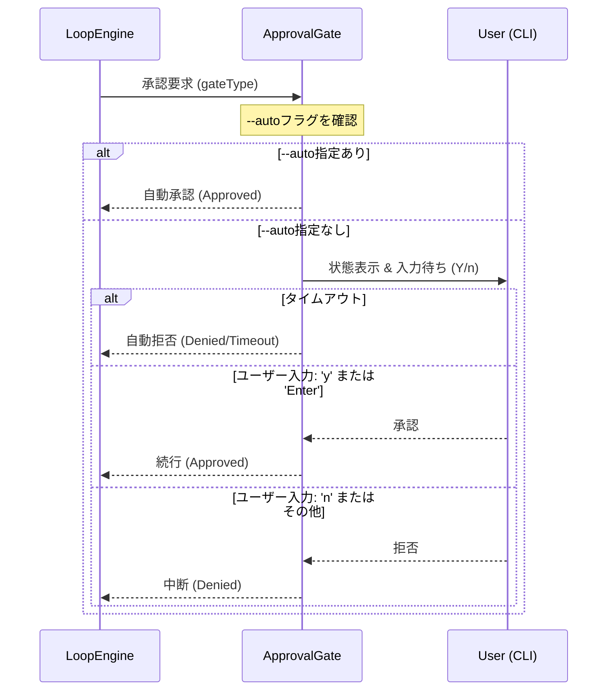

# 詳細設計書 - 承認ゲート (F-005)

## 1. メタ情報
- **ドキュメントID**: DETAIL-ORCH-004-F005-001
- **機能ID**: F-005
- **バージョン**: v3.0.0
- **状態**: Draft
- **作成日**: 2026-01-28

## 2. 機能概要
承認ゲート（Approval Gate）は、オーケストレーターの実行過程における重要なチェックポイントにおいて、人間の判断を介入させる機能である。
これにより、AIによる予期せぬ変更や、不適切なタイミングでのプルリクエスト作成を防止する。
CLIの対話型入力を利用し、ユーザーが「続行」または「中断」を選択できる。

## 3. ゲートポイント
本機能では、以下の3つのポイントで承認を要求する。

| ゲートポイント | タイミング | 目的 |
|----------------|------------|------|
| **pre-loop** | メインループ開始直前 | Issueの内容、生成されたプロンプト、適用されるHat構成の最終確認。 |
| **post-completion** | AIが `LOOP_COMPLETE` を出力した後 | 実装内容がIssueの要件を満たしているか、テストが成功しているかの確認。 |
| **before-pr** | PR作成処理の直前 | PRのタイトル、本文、送信先ブランチの最終確認。 |

## 4. 処理フロー



## 5. ユーザー入力待ち仕様
- **表示内容**:
    - 現在のゲートポイント名
    - 関連情報（pre-loopならIssue概要、before-prならPR予定内容など）
    - プロンプト: `Continue? [Y/n] > `
- **入力判定**:
    - `y`, `Y`, `Enter` (空入力): 承認（続行）
    - `n`, `N`, その他: 拒否（中断）
- **タイムアウト**:
    - 設定された時間（デフォルト30分）以内に入力がない場合は、安全のため「拒否」として扱い、プロセスを中断する。

## 6. --autoフラグによるスキップ
CLI実行時に `--auto` または `-a` フラグが指定されている場合、全ての承認ゲートはユーザー入力を待たずに自動的に「承認（Approved）」を返す。
これはCI環境や、完全にAIに任せるワークフローで使用される。
configファイルの `run.auto_mode` 設定でも同様の制御が可能である。

## 7. 呼び出し元（Integration Points）⚠️ 必須

> **重要**: このセクションは Phase 6.6（設計書整合性チェック）で統合漏れを検出するために必須。

### 7.1 このモジュールを使用する場所

| 呼び出し元ファイル | 使用メソッド | 説明 | 統合Issue |
|------------------|-------------|------|----------|
| `src/cli.ts` | - | v3.0.0現在では直接統合されていない（将来の統合予定） | - |
| `src/core/loop.ts` | - | ループ内での承認ゲートは将来実装予定 | - |

### 7.2 統合確認コマンド

```bash
# ApprovalGate の使用箇所を確認
grep -rn 'ApprovalGate\|approval' src/

# 期待される出力:
# src/gates/approval.ts: 実装ファイル
```

### 7.3 この機能を使用する他のIssue

| Issue | 概要 | 統合ポイント |
|-------|------|-------------|
| - | - | - |

### 7.4 統合ステータス（実装時に更新）

| 統合ポイント | ステータス | 備考 |
|-------------|----------|------|
| `run` コマンドでの pre-loop ゲート | ❌ 未実装 | v3.0.0では未統合 |
| `run` コマンドでの post-completion ゲート | ❌ 未実装 | v3.0.0では未統合 |
| `run` コマンドでの before-pr ゲート | ❌ 未実装 | v3.0.0では未統合 |
