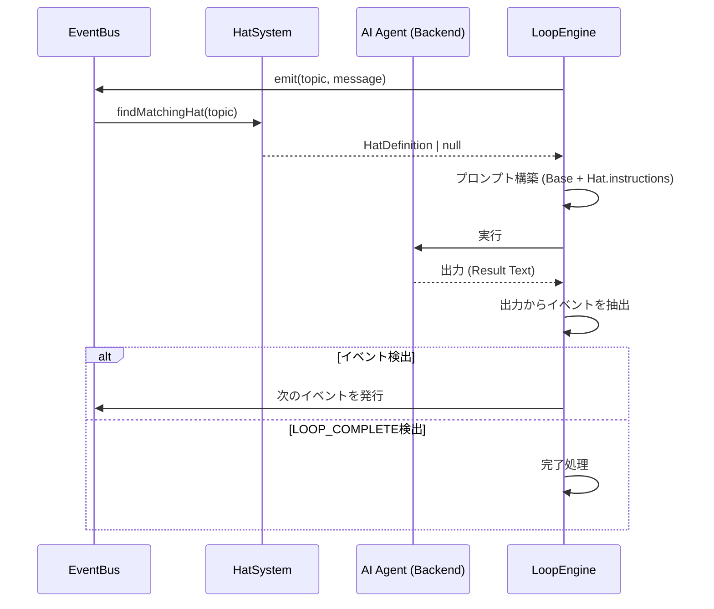

# Hatシステム 詳細設計書 (v3.0.0)

## メタ情報
- **ドキュメントID**: DETAIL-ORCH-004-F006-001
- **対象機能**: F-006 Hatシステム
- **ステータス**: Draft
- **最終更新日**: 2026-01-28
- **技術スタック**: Bun + TypeScript

## 1. 機能概要
Hatシステムは、AIエージェントに特定の役割（Role）を与え、プロンプトを動的に切り替えるための機構である。v3.0.0では、システムの複雑性を排除するため、各Hatごとのモデル指定やバックエンド指定を廃止し、純粋な「指示（Instructions）の切り替え」に特化した設計とする。

## 2. 簡略化内容
v2.0.0以前に存在した以下の機能を削除し、コアロジックを軽量化する。

- **Per-Hat Modelの削除**: すべてのHatは、グローバル設定または実行時に指定された同一のAIモデル（例: Claude 3.5 Sonnet）を使用する。
- **Per-Hat Backendの削除**: すべてのHatは、同一のAIバックエンド（例: Claude Code, OpenCode）を使用する。
- **複雑な重み付けの廃止**: トリガーに一致した最初のHat、または優先度順の単純な選択を採用する。

## 3. イベントバス仕様
Hatの切り替えは、イベントバスを介して行われる。

- **イベント構造**:
  - `topic`: イベントの種類（例: `tests.failing`, `code.written`）
  - `message`: 補足情報（任意）
- **ルーティング**:
  - Hatは1つ以上の `triggers`（トピック）を購読する。
  - イベントが発行されると、そのトピックを `triggers` に含むHatがアクティブになる。
  - アクティブなHatがない場合は、デフォルトのHatまたは基本プロンプトが使用される。

## 4. Hat定義スキーマ
`orch.yml` におけるHatの定義形式を以下に定める。

```typescript
interface HatDefinition {
  name: string;          // 表示名（例: "🧪 Tester"）
  triggers: string[];    // このHatを起動するイベントトピック
  publishes: string[];   // このHatが発行する可能性のあるイベント（ドキュメント用）
  instructions: string;  // AIへの追加指示（プロンプトに挿入される）
}
```

**YAML例**:
```yaml
hats:
  tester:
    name: "🧪 Tester"
    triggers: ["task.start", "code.written"]
    publishes: ["tests.failing", "tests.passing"]
    instructions: |
      あなたはテストエンジニアです。
      まず失敗するテストを書き、実装後はテストを実行して結果を報告してください。
```

## 5. 処理フロー
イベント発行からAI実行、次イベント抽出までの流れ。



## 6. イベント抽出ルール
AIバックエンドの出力から次のイベントを特定するためのルール。

- **キーワードマッチング**:
  - 出力テキスト内に `EVENT: topic_name` という形式の文字列が含まれている場合、それを次回のトリガーとして抽出する。
  - 例: `EVENT: tests.passing` -> `tests.passing` イベントを発行。
- **完了キーワード**:
  - `LOOP_COMPLETE` が含まれている場合は、Hatに関わらずタスク完了とみなす。
