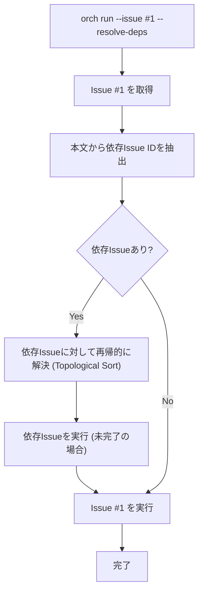

# F-010 Issue依存関係 詳細設計書

## メタ情報
- **ドキュメントID**: DETAIL-ORCH-004-F010-001
- **機能ID**: F-010
- **バージョン**: 1.0.0
- **ステータス**: ドラフト
- **作成日**: 2026-01-28
- **作成者**: Antigravity (AI Technical Writer)

---

## 1. 機能概要
Issueの本文から依存している他のIssue（Blocked by / Needs）を抽出し、それらを現在のIssueよりも先に実行する。複雑なタスクを複数のIssueに分割して管理する場合に、実行順序を自動的に解決することを目的とする。

### 1.1 目的
- Issue間の先行・後行関係を自動的に解決し、正しい順序でタスクを実行する。
- 依存するIssueが未完了の場合に、現在のIssueの実行をブロックまたは先行実行させることで整合性を保つ。

---

## 2. 依存関係解決フロー

---

## 3. 依存関係の処理ロジック

### 3.1 依存関係の抽出
Issue本文（body）から特定のキーワード（例: `Blocked by #42`, `Depends on #43`）を正規表現で抽出する。

### 3.2 循環参照検出 (Circular Reference Detection)
依存関係をグラフとして構築し、深さ優先探索（DFS）を用いて閉路を検出する。循環参照が検出された場合は実行を中断し、エラーを表示する。

### 3.3 トポロジカルソート (Topological Sort)
有向非巡回グラフ（DAG）に基づいて、実行順序を決定する。
1. 各Issueをノード、依存関係をエッジとするグラフを作成。
2. 入次数が0のノード（依存先がないIssue）から順に実行リストに追加する。
3. すでに完了（`orch:completed`ラベル付与済み）しているIssueは実行をスキップする。

---

## 4. CLIオプション仕様

### 4.1 `--resolve-deps` オプション
`run` コマンド実行時に指定することで、依存関係の自動解決を有効にする。

- **フラグ**: `--resolve-deps`
- **動作**: 
    - 指定されたIssueの依存ツリーを解析。
    - 未完了の依存Issueがある場合、それらを順番に実行。
    - 全ての依存Issueが完了した後、ターゲットIssueを実行。
- **デフォルト**: `false`（依存関係を無視して指定Issueのみ実行）

### 4.2 `--ignore-deps` オプション
明示的に依存関係を無視して実行する場合に使用する。

---

## 5. エラーハンドリング

| エラーケース | 内容 | ユーザーへのメッセージ |
|------------|------|----------------------|
| 循環参照検出 | Issue A -> B -> A のような依存 | "エラー: 循環参照が検出されました (#A -> #B -> #A)。依存関係を見直してください。" |
| 依存Issue不在 | 存在しないIssue番号が指定された | "警告: 依存Issue #<番号> が見つかりません。スキップします。" |
| 実行失敗 | 依存Issueの実行が途中で失敗した | "エラー: 依存Issue #<番号> の実行に失敗しました。現在のタスクを中断します。" |

---

## 6. 備考
- 本機能は `gh` CLIのIssue情報をベースに動作するため、リポジトリへの適切なアクセス権限が必要。
- 並列実行（`--issues`）と併用する場合、トポロジカルソート結果に基づいて並列度を調整する。
