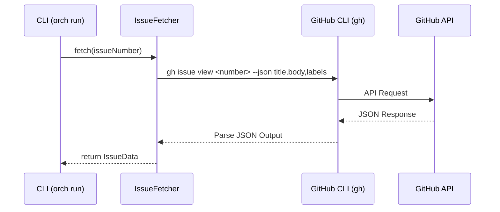

# F-001 Issue取得 詳細設計書

## メタ情報
- **ドキュメントID**: DETAIL-ORCH-004-F001-001
- **機能ID**: F-001
- **バージョン**: 1.0.0
- **ステータス**: ドラフト
- **作成日**: 2026-01-28
- **作成者**: Antigravity (AI Technical Writer)

---

## 1. 機能概要
GitHub Issueから、タスクの実行に必要となる情報を取得する。本機能は `gh` (GitHub CLI) を使用して、指定されたIssue番号に対応するタイトル、本文、および付与されているラベルを抽出する。取得された情報は、後続のプロンプト生成プロセス（F-002）に渡される。

### 1.1 目的
- 外部の唯一の真実（GitHub Issue）からタスクの定義を取得する。
- 人間が記述した要件を、AIエージェントが理解可能なコンテキストに変換する基礎を築く。

---

## 2. 処理フロー



### 2.1 正常系フロー
1. `orch run --issue <number>` コマンドにより開始。
2. `IssueFetcher` が `gh` コマンドを実行し、Issue情報を取得する。
3. 取得したJSONデータを `IssueData` 型にマッピングする。
4. 情報を `PromptGenerator` に受け渡す。

### 2.2 異常系フロー
- **Issueが存在しない**: `gh` コマンドがエラー（非ゼロ終了コード）を返す。
- **ghコマンド未インストール**: コマンド実行失敗。
- **GitHub認証未完了**: `gh` コマンドが認証エラーを返す。
- **ネットワークエラー**: API通信失敗。

---

## 3. インターフェース定義

### 3.1 データ構造 (TypeScript)

```typescript
/**
 * GitHub Issueから取得した情報
 */
export interface IssueData {
  number: number;
  title: string;
  body: string;
  labels: IssueLabel[];
}

/**
 * Issueに付与されているラベル
 */
export interface IssueLabel {
  name: string;
  color: string;
  description?: string;
}

/**
 * Issue取得のオプション
 */
export interface FetchOptions {
  repository?: string; // 指定がない場合はカレントディレクトリのリポジトリ
}
```

### 3.2 サービスインターフェース

```typescript
export interface IIssueFetcher {
  /**
   * 指定されたIssue番号の情報を取得する
   * @param issueNumber Issue番号
   * @param options オプション
   * @throws IssueNotFoundError Issueが見つからない場合
   * @throws GitHubCliError ghコマンドの実行に失敗した場合
   */
  fetch(issueNumber: number, options?: FetchOptions): Promise<IssueData>;
}
```

---

## 4. エラーハンドリング

| エラーケース | 例外クラス / コード | ユーザーへのメッセージ |
|------------|-------------------|----------------------|
| Issueが見つからない | `IssueNotFoundError` | "Issue #<番号> が見つかりません。番号を確認してください。" |
| ghコマンド不在 | `GitHubCliError` | "GitHub CLI (gh) がインストールされていません。インストールと認証を行ってください。" |
| 認証エラー | `GitHubCliError` | "GitHubの認証に失敗しました。`gh auth login` を実行してください。" |
| 不正なJSON出力 | `ParseError` | "GitHub CLI からの応答を解析できませんでした。" |

---

## 5. テスト方針

### 5.1 単体テスト (Bun test)
- `IssueFetcher` クラスのモックテスト。
- `gh` コマンドの出力をシミュレートし、正しく `IssueData` にパースされるか検証する。
- 異常系（エラーコード、空の本文など）のハンドリングを検証する。

### 5.2 結合テスト
- 実際に `gh` コマンドを呼び出す統合テスト（開発環境のみ実行）。
- `test-repo` などのサンプルリポジトリに対して実行し、整合性を確認する。

---

## 6. 備考
- 本機能は `gh` コマンドに依存するため、環境変数 `GITHUB_TOKEN` または `gh auth login` による認証が必須となる。
- ラベル情報は、Issue依存関係（F-010）やステータスラベル管理（F-009）でも再利用される。

## 7. 呼び出し元（Integration Points）⚠️ 必須

> **重要**: このセクションは Phase 6.6（設計書整合性チェック）で統合漏れを検出するために必須。

### 7.1 このモジュールを使用する場所

| 呼び出し元ファイル | 使用メソッド | 説明 | 統合Issue |
|------------------|-------------|------|----------|
| `src/cli.ts` (`run` コマンド) | `fetchIssue()` | Issue実行時のIssue情報取得 | - |

### 7.2 統合確認コマンド

```bash
# fetchIssue の使用箇所を確認
grep -rn 'fetchIssue\|IssueData\|IssueFetcher' src/

# 期待される出力:
# src/cli.ts: fetchIssue() 呼び出し
# src/input/github.ts: 実装ファイル
```

### 7.3 この機能を使用する他のIssue

| Issue | 概要 | 統合ポイント |
|-------|------|-------------|
| - | - | - |

### 7.4 統合ステータス（実装時に更新）

| 統合ポイント | ステータス | 備考 |
|-------------|----------|------|
| `run` コマンドでのIssue取得 | ✅ 実装済み | L91-94 |
