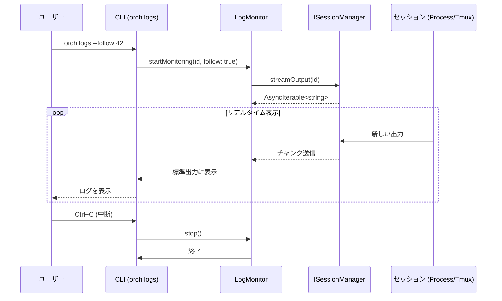

# 詳細設計書: F-008 ログ監視

## 1. メタ情報
- **ドキュメントID**: DETAIL-ORCH-004-F008-001
- **対象機能**: F-008 ログ監視
- **バージョン**: v3.0.0
- **状態**: Draft
- **最終更新日**: 2026-01-28

## 2. 機能概要
`orch logs` コマンドは、実行中の AI エージェント（Claude Code / OpenCode）のセッション出力をリアルタイムで表示する機能である。
バックグラウンドで実行されているプロセスの進行状況を、ターミナルを切り替えることなく確認することを目的とする。

v3.0.0 では、`ISessionManager` を介してセッション出力をストリーミングすることで、`native`, `tmux`, `zellij` のどのマネージャーを使用していても統一的なインターフェースでログを閲覧可能にする。

## 3. `orch logs` コマンド仕様

### 3.1. 基本構文
```bash
orch logs [issue-number] [options]
```

### 3.2. 引数・オプション
| オプション | 短縮形 | 説明 | デフォルト |
|-----------|--------|------|-----------|
| `issue-number` | - | 表示対象の Issue 番号。省略時は最後に実行されたセッションを表示。 | (最新) |
| `--follow` | `-f` | ログをリアルタイムでストリーミング表示し続ける。 | false |
| `--lines <num>` | `-n` | 表示する最新の行数。 | 100 |

### 3.3. 動作仕様
- **Issue 番号の特定**:
  - 引数が指定された場合、対応するセッション ID（`orch-<issue>`）を特定する。
  - 省略された場合、現在実行中のセッション、または直近に終了したセッションを自動選択する。
  - 複数のセッションが実行中の場合は、選択プロンプトを表示するか、最新のものを選択する。
- **表示終了**:
  - 通常実行（`--follow` なし）の場合は、指定行数を出力して終了。
  - `--follow` 指定時は、`Ctrl+C` (SIGINT) が入力されるまで、またはセッションが終了するまで表示を継続する。

## 4. リアルタイムストリーミング（--follow）
`--follow` オプションが指定された場合、`ISessionManager.streamOutput(id)` を呼び出し、返却される `AsyncIterable<string>` を逐次 `process.stdout` に出力する。

### 4.1. 実装方針
- 内部的には `LogMonitor` クラスがストリーミングを管理する。
- ストリームの購読中にエラーが発生した場合は、適切に例外をキャッチし、エラーメッセージを表示して終了する。
- ユーザーによる中断（Ctrl+C）時は、ストリームのイテレータを適切にクローズする。

## 5. 処理フロー



## 6. ビジネスルール
- **BR-008-1**: `--follow` 指定時は、明示的な中断（Ctrl+C）があるまで出力を継続する。
- **BR-008-2**: 対象のセッションが既に終了している場合でも、保存されているログを表示する。
- **BR-008-3**: セッションが存在しない、またはログファイルが読み取れない場合はエラーを通知する。
- **BR-008-4**: 大量のログ出力によるメモリ負荷を避けるため、ストリーミングはバッファリングせず即時出力する。

## 7. 呼び出し元（Integration Points）⚠️ 必須

> **重要**: このセクションは Phase 6.6（設計書整合性チェック）で統合漏れを検出するために必須。

### 7.1 このモジュールを使用する場所

| 呼び出し元ファイル | 使用メソッド | 説明 | 統合Issue |
|------------------|-------------|------|----------|
| `src/cli.ts` (`logs` コマンド) | `new LogMonitor()`, `showLogs()`, `stop()` | ログ表示・ストリーミング | - |

### 7.2 統合確認コマンド

```bash
# LogMonitor の使用箇所を確認
grep -rn 'LogMonitor\|showLogs\|streamOutput' src/

# 期待される出力:
# src/cli.ts: new LogMonitor(), logMonitor.showLogs() 呼び出し
# src/core/log-monitor.ts: 実装ファイル
```

### 7.3 この機能を使用する他のIssue

| Issue | 概要 | 統合ポイント |
|-------|------|-------------|
| - | - | - |

### 7.4 統合ステータス（実装時に更新）

| 統合ポイント | ステータス | 備考 |
|-------------|----------|------|
| `logs` コマンドでのログ表示 | ✅ 実装済み | L179-205 |
| `--follow` オプションでのストリーミング | ✅ 実装済み | L201-204 |
| SIGINT ハンドリング | ✅ 実装済み | L196-199 |
