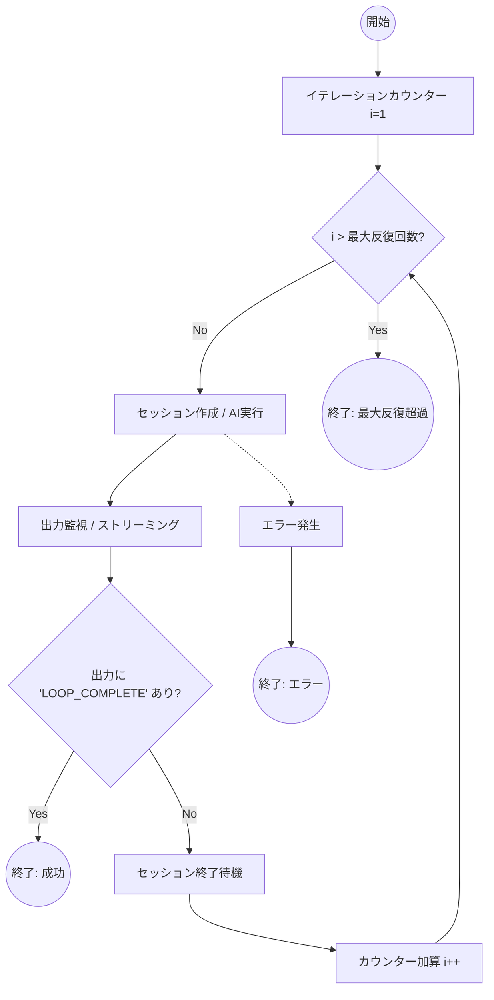

# 詳細設計書: F-003 ループ実行

## 1. メタ情報
- **ドキュメントID**: DETAIL-ORCH-004-F003-001
- **対象機能**: F-003 ループ実行
- **バージョン**: v3.0.0
- **状態**: Draft
- **最終更新日**: 2026-01-28

## 2. 機能概要
`LoopEngine` は、GitHub Issue から生成されたプロンプトを AI バックエンドに渡し、AI エージェントが完了キーワード（`LOOP_COMPLETE`）を出力するまで、または最大反復回数に達するまで反復実行を行うコア機能である。

v3.0.0 では、実行環境を抽象化した `ISessionManager` を介してプロセスを管理し、シンプルかつ堅牢なループ制御を実現する。

## 3. ループアルゴリズム
反復実行の基本フローを以下に示す。

## 4. 詳細仕様

### 4.1. 完了条件の検出
- **キーワード**: `LOOP_COMPLETE`
- **検出方法**: 
  - AI バックエンドの標準出力（stdout）をリアルタイムにスキャンする。
  - `ISessionManager.streamOutput()` または `getOutput()` を利用してテキストを取得し、部分一致で判定する。
  - 大文字小文字を区別せず、文字列が含まれている場合に「完了」とみなす。

### 4.2. 反復回数の制御
- **最大反復回数**:
  - 設定ファイル（`orch.yml`）の `loop.max_iterations` または CLI オプション `--max-iterations` で指定。
  - デフォルト値: 100回。
- **カウンター管理**:
  - `LoopContext` 内で現在のイテレーション回数を保持。
  - 各イテレーションの開始時にインクリメントし、最大値を超えた場合は `MaxIterationsReachedError` をスローして停止する。

### 4.3. エラーハンドリング
- **バックエンド異常終了**:
  - バックエンドプロセスが非ゼロの終了コードで終了した場合、最大 5 回まで再試行（同一イテレーション内または次イテレーション）を行う。
  - 連続して失敗する場合は `BackendError` としてループを中断する。
- **タイムアウト**:
  - 設定された `idle_timeout_secs` を超えて出力がない場合、セッションを強制終了（Kill）し、エラーとして扱う。
- **中断要求**:
  - ユーザーからの `SIGINT` (Ctrl+C) または `AbortSignal` を受け取った場合、即座にセッションを終了しクリーンアップを行う。

## 5. 入出力データ

### 5.1. 入力
- `prompt`: AI に渡す初期指示（`.agent/PROMPT.md` の内容）。
- `maxIterations`: 許容される最大ループ回数。
- `completionPromise`: 完了を判定するキーワード（デフォルト: `LOOP_COMPLETE`）。

### 5.2. 出力
- `success`: 完了キーワードを検出したかどうかの真偽値。
- `iterations`: 実際に実行された回数。
- `lastOutput`: 最終イテレーションの出力内容（レポート用）。
