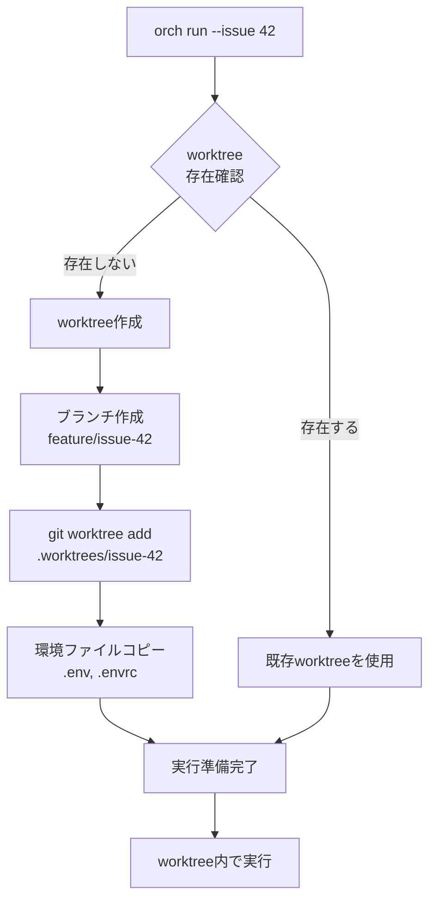
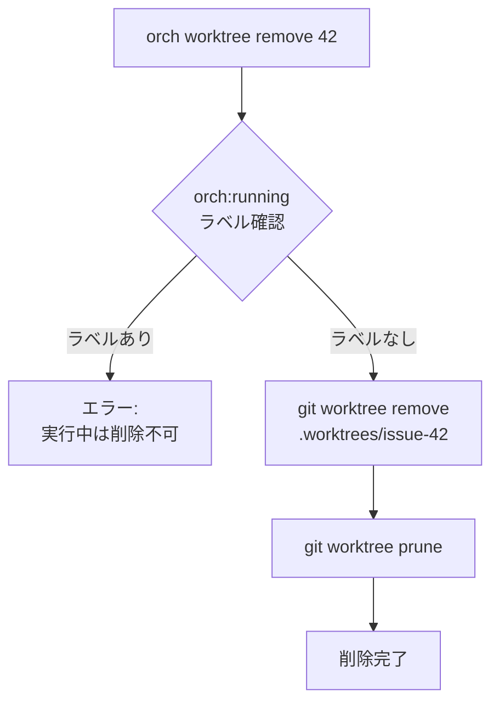

# F-011 Worktree環境分離 詳細設計書

## メタ情報

| 項目 | 内容 |
|------|------|
| ドキュメントID | DETAIL-ORCH-004-F011-001 |
| バージョン | 1.0.0 |
| 親設計書 | [基本設計書](../../../basic/BASIC-ORCH-004_v3.0.0.md) |
| 作成日 | 2026-01-28 |

---

## 1. 概要

### 1.1 機能概要

git worktreeを使用して、Issue実行ごとに完全に分離された作業環境を提供する。
これにより、複数のIssueを同時並行で実行しても互いに干渉しない。

### 1.2 設計目標

| 目標 | 詳細 |
|------|------|
| 環境分離 | 各Issueが独立したファイルシステムで動作 |
| 自動化 | worktree作成・環境ファイルコピーの自動化 |
| 安全性 | 実行中のworktree削除を防止 |

---

## 2. インターフェース定義

### 2.1 IWorktreeManager

```typescript
interface IWorktreeManager {
  /**
   * 指定されたIssue番号のworktreeを作成する
   * - ブランチ: feature/issue-{番号}
   * - パス: .worktrees/issue-{番号}/
   * - 環境ファイルをコピー
   * @throws WorktreeCreateError worktree作成に失敗した場合
   */
  create(issueNumber: number): Promise<WorktreeInfo>;

  /**
   * 全worktreeの一覧を取得する
   * git worktree list --porcelain の結果をパースして返す
   */
  list(): Promise<WorktreeInfo[]>;

  /**
   * 指定されたIssue番号のworktreeを削除する
   * - orch:running ラベルがある場合はエラー
   * - git worktree remove を実行
   * - ブランチは削除しない
   * @throws WorktreeRunningError 実行中のworktreeを削除しようとした場合
   */
  remove(issueNumber: number): Promise<void>;

  /**
   * 指定されたIssue番号のworktreeが存在するか確認する
   */
  exists(issueNumber: number): Promise<boolean>;
}

interface WorktreeInfo {
  issueNumber: number;
  branch: string;       // feature/issue-{番号}
  path: string;         // .worktrees/issue-{番号}
  status: 'running' | 'completed';
}
```

---

## 3. 処理フロー

### 3.1 Worktree作成フロー



### 3.2 Worktree削除フロー



---

## 4. ビジネスルール

| ルールID | ルール | 詳細 |
|---------|--------|------|
| BR-011-1 | worktreeパス | `.worktrees/issue-{番号}/` に作成 |
| BR-011-2 | ブランチ命名 | `feature/issue-{番号}` |
| BR-011-3 | 環境ファイルコピー | 設定 `worktree.copy_files` に指定されたファイルを自動コピー |
| BR-011-4 | クリーンアップ | 手動 (`orch worktree remove`) |
| BR-011-5 | 削除保護 | `orch:running` ラベルがあるIssueのworktreeは削除不可 |

---

## 5. 環境ファイル管理

### 5.1 コピー対象

設定ファイル `orch.yml` の `worktree.copy_files` で指定:

```yaml
worktree:
  copy_files:
    - ".env"
    - ".envrc"
```

### 5.2 コピーロジック

```typescript
async function copyEnvironmentFiles(
  sourceDir: string,
  targetDir: string,
  files: string[]
): Promise<void> {
  for (const file of files) {
    const src = path.join(sourceDir, file);
    const dst = path.join(targetDir, file);
    
    // ファイルが存在する場合のみコピー
    if (await Bun.file(src).exists()) {
      await Bun.write(dst, Bun.file(src));
    }
  }
}
```

### 5.3 .gitignore連携

worktreeディレクトリ自体は `.gitignore` に追加する:

```gitignore
.worktrees/
```

---

## 6. CLIコマンド仕様

### 6.1 orch worktrees

**概要**: worktree一覧表示

**出力フォーマット**:

| カラム | 説明 | ソース |
|--------|------|--------|
| Issue | Issue番号 | パスから抽出 |
| Branch | ブランチ名 | git worktree list |
| Path | ファイルパス | git worktree list |
| Status | 実行状態 | GitHub Issueラベル |

### 6.2 orch worktree remove

**概要**: worktree削除

**引数**: Issue番号（必須）

**処理**:
1. `gh issue view {番号}` でラベル確認
2. `orch:running` ラベルがある場合はエラー出力して終了
3. `git worktree remove .worktrees/issue-{番号}` 実行
4. `git worktree prune` 実行

### 6.3 --no-worktree オプション

`orch run --issue 42 --no-worktree` でworktree作成をスキップし、現在のディレクトリで直接実行する。

---

## 7. エラーハンドリング

| エラー | 原因 | 対応 |
|--------|------|------|
| `WorktreeCreateError` | git worktree add 失敗 | エラーメッセージ表示、gitの出力を含める |
| `WorktreeRunningError` | 実行中のworktree削除試行 | 「Issue #{番号} は実行中です」と表示 |
| `WorktreeNotFoundError` | 存在しないworktree削除試行 | 「Worktree issue-{番号} が見つかりません」と表示 |
| `BranchExistsError` | ブランチが既に存在 | 既存ブランチを使用してworktree作成 |
| `CopyFileError` | 環境ファイルコピー失敗 | 警告を表示して続行 |

---

## 8. テスト方針

### 8.1 単体テスト

| テストケース | 内容 |
|------------|------|
| worktree作成 | gitコマンドが正しい引数で呼ばれるか |
| 環境ファイルコピー | 指定ファイルがコピーされるか |
| 一覧取得 | git worktree list の出力が正しくパースされるか |
| 削除保護 | running状態のworktreeが削除できないか |
| 削除成功 | 完了状態のworktreeが削除できるか |

### 8.2 結合テスト

| テストケース | 内容 |
|------------|------|
| E2E作成→実行→削除 | worktree作成からAI実行、削除までの全フロー |
| 並列実行 | 複数worktreeが同時に動作するか |
| --no-worktree | worktreeなしでの実行が正常に動作するか |

---

## 変更履歴

| バージョン | 日付 | 変更内容 | 作成者 |
|-----------|------|----------|--------|
| 1.0.0 | 2026-01-28 | 初版作成 | AI Assistant |
