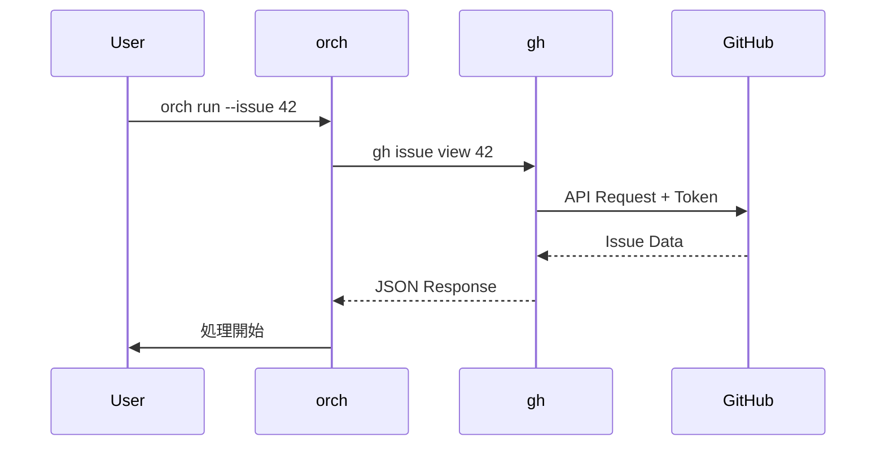

# orchestrator-hybrid v3.0.0 セキュリティ設計書

## メタ情報

| 項目 | 内容 |
|------|------|
| ドキュメントID | DETAIL-ORCH-004-SEC-001 |
| バージョン | 1.0.0 |
| 親設計書 | [基本設計書](../../../basic/BASIC-ORCH-004_v3.0.0.md) |
| 作成日 | 2026-01-28 |

---

## 1. 概要

### 1.1 セキュリティ方針

orchestrator-hybrid v3.0.0は**ローカル実行CLIツール**であり、以下の方針でセキュリティを確保する。

| 方針 | 説明 |
|------|------|
| 最小権限 | 必要最小限のファイル・API アクセス |
| 認証委譲 | 認証は外部ツール（gh CLI）に委譲 |
| 機密分離 | 機密情報は`.env`で管理、`.gitignore`で除外 |
| 監査可能 | 全操作をログに記録 |

### 1.2 脅威モデル

| 脅威 | 影響度 | 対策 |
|------|:------:|------|
| API Key漏洩 | 高 | `.env`+`.gitignore`、環境変数 |
| 不正なIssue実行 | 中 | 承認ゲート、ラベルチェック |
| ログからの情報漏洩 | 低 | `.agent/`を`.gitignore`に追加 |
| 悪意あるプロンプト注入 | 中 | Issue内容のサニタイズ |

---

## 2. 認証・認可

### 2.1 GitHub認証

| 項目 | 方法 |
|------|------|
| 認証方式 | `gh auth login` (OAuth/PAT) |
| トークン保存 | システムキーチェーン |
| 権限スコープ | `repo`, `read:org` |

**認証フロー**:



### 2.2 AIバックエンド認証

| バックエンド | 認証方法 | 保存場所 |
|------------|---------|---------|
| Claude | `ANTHROPIC_API_KEY` | `.env` or 環境変数 |
| OpenCode | 設定ファイル | `~/.opencode/config` |

---

## 3. 機密情報管理

### 3.1 機密情報の分類

| 分類 | 例 | 保存場所 | 保護方法 |
|------|-----|---------|---------|
| 認証トークン | GitHub PAT | システムキーチェーン | gh CLIが管理 |
| API Key | Anthropic API Key | `.env` | `.gitignore` |
| セッションログ | AI出力 | `.agent/` | `.gitignore` |

### 3.2 .gitignore設定

```gitignore
# 機密ファイル
.env
.env.local
.env.*

# ランタイムデータ
.agent/

# Worktree（オプション）
.worktrees/
```

### 3.3 環境ファイルのWorktreeコピー

Worktree作成時に環境ファイルをコピーする際の注意:

| 操作 | セキュリティ考慮 |
|------|----------------|
| `.env`コピー | worktree内の`.gitignore`も自動設定 |
| `.envrc`コピー | `direnv allow`は手動実行が必要 |

---

## 4. 入力検証

### 4.1 Issue内容のサニタイズ

Issue本文に悪意あるコマンドが含まれる可能性があるため、以下を実施:

| 検証項目 | 方法 |
|---------|------|
| シェルインジェクション | プロンプト内でコマンド実行しない |
| パス走査 | Issue番号は数値のみ許可 |
| 過大入力 | Issue本文の最大長制限 |

**コード例**:

```typescript
// Issue番号検証
const issueNumberSchema = z.number().int().positive().max(999999999);

// Issue本文サニタイズ（必要に応じて）
function sanitizeIssueBody(body: string): string {
  // 最大10万文字に制限
  return body.slice(0, 100000);
}
```

### 4.2 設定ファイル検証

`orch.yml`はZodスキーマで厳密に検証:

```typescript
const ConfigSchema = z.object({
  backend: z.enum(['claude', 'opencode']),
  auto: z.boolean().default(false),
  create_pr: z.boolean().default(false),
  max_iterations: z.number().int().positive().max(1000).default(100),
  // ...
});
```

---

## 5. アクセス制御

### 5.1 ファイルアクセス

| 操作 | 許可範囲 |
|------|---------|
| 読み取り | プロジェクトディレクトリ内のみ |
| 書き込み | `.agent/`, `.worktrees/`, `orch.yml` |
| 実行 | 設定されたバックエンドコマンドのみ |

### 5.2 外部コマンド実行

| コマンド | 許可 | 理由 |
|---------|:----:|------|
| `gh` | O | GitHub操作 |
| `git` | O | Worktree管理 |
| `claude` / `opencode` | O | AIバックエンド |
| `tmux` / `zellij` | O | セッション管理 |
| その他 | X | 明示的に禁止 |

---

## 6. ログセキュリティ

### 6.1 ログに含めない情報

| 情報 | 理由 |
|------|------|
| API Key | 認証情報漏洩防止 |
| フルプロンプト | 機密情報を含む可能性 |
| ユーザー個人情報 | プライバシー保護 |

### 6.2 ログのマスキング

```typescript
function maskSensitiveData(log: string): string {
  return log
    // API Keyをマスク
    .replace(/sk-[a-zA-Z0-9-]+/g, 'sk-***')
    // Bearer トークンをマスク
    .replace(/Bearer [a-zA-Z0-9-_.]+/g, 'Bearer ***');
}
```

---

## 7. 承認ゲートによる保護

### 7.1 ゲートポイント

| ゲート | トリガー | 目的 |
|--------|---------|------|
| pre-loop | ループ開始前 | Issue内容確認 |
| post-completion | ループ完了後 | 変更内容確認 |
| before-pr | PR作成前 | 最終確認 |

### 7.2 自動化時のリスク

`--auto`フラグ使用時は全ゲートがスキップされる。

| リスク | 軽減策 |
|--------|--------|
| 意図しない変更 | 信頼できるIssueのみで使用 |
| 大量コミット | `max_iterations`で制限 |

---

## 8. 依存パッケージセキュリティ

### 8.1 依存関係監査

```bash
# 脆弱性チェック
bun audit

# 依存関係更新
bun update
```

### 8.2 最小依存方針

| 方針 | 実施内容 |
|------|---------|
| 依存数削減 | 不要パッケージ削除（v3.0.0で実施済み） |
| 信頼性 | メンテナンスされているパッケージのみ使用 |
| ロックファイル | `bun.lockb`をコミット |

---

## 9. インシデント対応

### 9.1 API Key漏洩時

1. 該当キーを即時無効化
2. 新しいキーを発行
3. `.env`を更新
4. git履歴からの削除を検討（`git filter-branch`）

### 9.2 不正実行検知時

1. 実行中セッションを終了（`orch kill`）
2. Worktree削除（`orch worktree remove`）
3. 変更をrevert
4. Issue内容を確認

---

## 変更履歴

| バージョン | 日付 | 変更内容 | 作成者 |
|-----------|------|----------|--------|
| 1.0.0 | 2026-01-28 | 初版作成 | AI Assistant |
