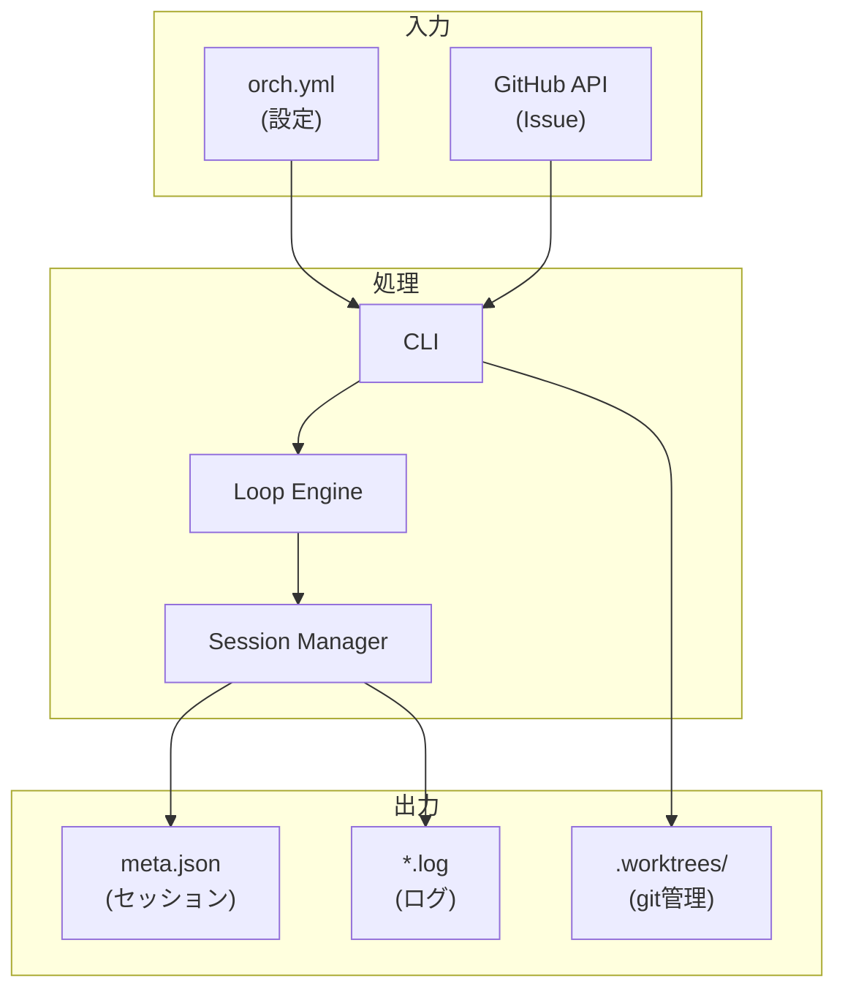

# orchestrator-hybrid v3.0.0 データベース設計書

## メタ情報

| 項目 | 内容 |
|------|------|
| ドキュメントID | DETAIL-ORCH-004-DB-001 |
| バージョン | 1.0.0 |
| 親設計書 | [基本設計書](../../../basic/BASIC-ORCH-004_v3.0.0.md) |
| 作成日 | 2026-01-28 |

---

## 1. 概要

### 1.1 データ永続化方針

orchestrator-hybrid v3.0.0は**データベースを使用しない**。

| 項目 | 方針 |
|------|------|
| 設定情報 | `orch.yml` (YAMLファイル) |
| セッション情報 | `.agent/sessions/` (JSONファイル) |
| Issue情報 | GitHub API から都度取得（キャッシュなし） |
| ログ | `.agent/sessions/{id}/` (テキストファイル) |

### 1.2 理由

- CLIツールとしてのシンプルさを優先
- 外部依存（DB）を排除
- ポータビリティ向上（git cloneのみで動作可能）

---

## 2. ファイルベースデータ構造

### 2.1 設定ファイル

**ファイル**: `orch.yml`

```yaml
backend: claude
auto: false
create_pr: false
max_iterations: 100
preset: simple
worktree:
  enabled: true
  base_dir: ".worktrees"
  copy_files:
    - ".env"
    - ".envrc"
session:
  manager: auto
  prefix: "orch"
  capture_interval: 500
```

**スキーマ**:

| フィールド | 型 | 必須 | デフォルト | 説明 |
|-----------|-----|:----:|-----------|------|
| `backend` | `'claude' \| 'opencode'` | O | `claude` | AIバックエンド |
| `auto` | `boolean` | - | `false` | 承認ゲート自動化 |
| `create_pr` | `boolean` | - | `false` | PR自動作成 |
| `max_iterations` | `number` | - | `100` | 最大反復回数 |
| `preset` | `'simple' \| 'tdd'` | - | `simple` | プリセット名 |
| `worktree.enabled` | `boolean` | - | `true` | Worktree有効化 |
| `worktree.base_dir` | `string` | - | `.worktrees` | 基準ディレクトリ |
| `worktree.copy_files` | `string[]` | - | `[".env"]` | コピー対象ファイル |
| `session.manager` | `'auto' \| 'native' \| 'tmux' \| 'zellij'` | - | `auto` | セッションマネージャー |
| `session.prefix` | `string` | - | `orch` | セッション名プレフィックス |
| `session.capture_interval` | `number` | - | `500` | キャプチャ間隔(ms) |

---

### 2.2 セッションメタデータ

**ディレクトリ**: `.agent/sessions/issue-{番号}/`

**ファイル**: `meta.json`

```json
{
  "id": "42",
  "command": "claude",
  "args": ["--prompt", "..."],
  "startedAt": "2026-01-28T10:30:00Z",
  "status": "running",
  "exitCode": null,
  "pid": 12345
}
```

**スキーマ**:

| フィールド | 型 | 必須 | 説明 |
|-----------|-----|:----:|------|
| `id` | `string` | O | Issue番号 |
| `command` | `string` | O | 実行コマンド |
| `args` | `string[]` | O | コマンド引数 |
| `startedAt` | `string (ISO8601)` | O | 開始日時 |
| `status` | `'running' \| 'completed' \| 'failed'` | O | ステータス |
| `exitCode` | `number \| null` | - | 終了コード |
| `pid` | `number` | - | プロセスID (nativeモードのみ) |

---

### 2.3 ログファイル

**ディレクトリ**: `.agent/sessions/issue-{番号}/`

| ファイル | 説明 | 用途 |
|---------|------|------|
| `stdout.log` | 標準出力 | AI出力のキャプチャ |
| `stderr.log` | 標準エラー出力 | エラーログ |
| `combined.log` | 統合ログ | タイムスタンプ付き全出力 |
| `pid` | プロセスID | nativeモードでのプロセス管理 |

---

### 2.4 Worktree情報

Worktree情報は**gitコマンド**から動的に取得する。

```bash
# worktree一覧
git worktree list --porcelain

# 出力例
worktree /path/to/repo
HEAD abc123...
branch refs/heads/main

worktree /path/to/repo/.worktrees/issue-42
HEAD def456...
branch refs/heads/feature/issue-42
```

**保存するファイルはない**（gitが管理）。

---

## 3. データフロー



---

## 4. バックアップ・リカバリ

### 4.1 バックアップ対象

| 対象 | 重要度 | バックアップ方法 |
|------|:------:|----------------|
| `orch.yml` | 高 | gitで管理推奨 |
| `.agent/sessions/` | 低 | 一時データ、不要 |
| `.worktrees/` | 中 | gitが管理 |

### 4.2 リカバリ

| 状況 | リカバリ方法 |
|------|-------------|
| 設定紛失 | `orch init`で再作成 |
| セッション破損 | 該当ディレクトリ削除、再実行 |
| Worktree破損 | `git worktree prune` + 再作成 |

---

## 5. 排他制御

### 5.1 方針

orchestrator-hybridは**単一ユーザーのCLIツール**であるが、`--issues 42,43,44`による並列タスク実行時に同一ディレクトリ内のファイルへ複数プロセスが同時アクセスする可能性がある。以下の方針で排他制御を行う。

| 対象 | 競合リスク | 制御方式 |
|------|:----------:|----------|
| `orch.yml` | 低 | 読み取り専用（起動時に1回読み込み、書き込みは`orch init`のみ） |
| `.agent/sessions/issue-{N}/` | なし | Issue番号でディレクトリ分離（プロセス間で共有しない） |
| `.agent/events.jsonl` | 中 | 追記のみ（append-only）。OSレベルのatomic appendに依存 |
| `.agent/PROMPT.md` | 中 | 並列実行時はWorktreeごとに生成（パス分離） |
| `.agent/scratchpad.md` | 中 | 並列実行時はWorktreeごとに生成（パス分離） |
| git worktree操作 | 高 | git自体のlock機構（`.git/worktrees/`）に委譲 |

### 5.2 セッションディレクトリの排他

各セッションは`issue-{N}`ディレクトリで物理的に分離されるため、プロセス間の排他は不要。

```
.agent/sessions/
  issue-42/    ← プロセスA専用
    meta.json
    stdout.log
  issue-43/    ← プロセスB専用
    meta.json
    stdout.log
```

### 5.3 イベントログの整合性

`events.jsonl`は複数プロセスから追記される可能性がある。

| 項目 | 仕様 |
|------|------|
| 書き込み方式 | 1行1JSON（改行区切り）の追記（append） |
| 原子性保証 | POSIXのO_APPENDフラグにより、4096バイト以下の書き込みは原子的 |
| 行フォーマット | `{"timestamp":"...","issueId":"...","event":"..."}` |
| 読み取り時 | 行単位パース。不正行はスキップ（壊れた行への耐性） |

### 5.4 Worktree環境での分離

並列実行時、各IssueはWorktreeで完全に分離される。

| 項目 | 仕様 |
|------|------|
| 作業ディレクトリ | `.worktrees/issue-{N}/` (Issueごとに独立) |
| `.agent/`ディレクトリ | 各Worktree内にローカル生成（共有しない） |
| ブランチ | `feature/issue-{N}` (Issueごとに独立) |
| gitロック | git worktreeの内部lock機構に委譲 |

### 5.5 異常終了時のリカバリ

| 状況 | 影響 | リカバリ |
|------|------|----------|
| プロセスクラッシュ | `meta.json`の`status`が`running`のまま残る | 次回起動時に`pid`の生存確認。不在なら`failed`に更新 |
| `events.jsonl`書き込み中断 | 末尾行が不完全になる可能性 | 読み取り時に不正行をスキップ |
| Worktree作成中断 | 不完全なWorktreeが残る | `git worktree prune`で自動修復 |

---

## 6. 制約事項

| 制約 | 理由 |
|------|------|
| リレーショナルDB不使用 | シンプル化、外部依存排除 |
| データ暗号化なし | 機密情報は`.env`で管理し`.gitignore` |
| ファイルロック機構なし | ディレクトリ分離 + append-onlyで代替 |
| 複数マシン間同期なし | 単一マシン想定 |

---

## 変更履歴

| バージョン | 日付 | 変更内容 | 作成者 |
|-----------|------|----------|--------|
| 1.0.0 | 2026-01-28 | 初版作成 | AI Assistant |
| 1.1.0 | 2026-01-28 | 排他制御仕様を追加（レビュー指摘対応） | AI Assistant |
