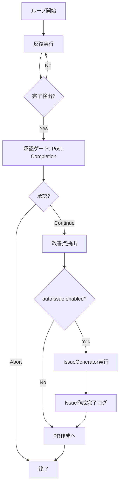

# 改善Issue自動作成 詳細設計書

## メタ情報

| 項目 | 内容 |
|------|------|
| ドキュメントID | DETAILED-ORCH-001-ISSUE-GEN |
| バージョン | 1.0.0 |
| ステータス | ドラフト |
| 作成日 | 2026-01-24 |
| 最終更新日 | 2026-01-24 |
| 作成者 | AI Assistant |
| 承認者 | - |
| 関連基本設計書 | BASIC-ORCH-001 v1.0.0 |
| 関連要件定義書 | REQ-ORCH-001 v1.2.0 |
| 対象機能 | F-006, F-007 |

---

## 1. 概要

### 1.1 目的

ralph-loop実行時にAIエージェントが発見した改善点を自動的にGitHub Issueとして作成し、継続的な品質改善サイクルを実現する。

### 1.2 スコープ

#### スコープ内

- Scratchpadおよびイベント履歴からの改善点抽出
- 優先度フィルタリング（high/medium/low）
- 重複Issue検出（タイトル検索ベース）
- GitHub Issue自動作成（gh CLI経由）
- Issue作成条件の設定（orch.yml）
- Issue本文テンプレート
- ループエンジンへの統合

#### スコープ外

- AIによる改善点の自動分析（将来拡張）
- Issue自動クローズ機能
- Issue優先度の自動調整
- GitHub Projects連携

### 1.3 用語定義

| 用語 | 定義 |
|------|------|
| ImprovementSuggestion | 改善提案を表すデータ構造 |
| IssueGenerator | Issue自動作成を担当するクラス |
| minPriority | Issue作成の最低優先度閾値 |
| 重複チェック | 既存Issueとのタイトル一致検出 |

---

## 2. 機能詳細

### 2.1 改善Issue自動作成（F-006）

#### 処理フロー

```mermaid
sequenceDiagram
    autonumber
    participant Loop as ループエンジン
    participant Extractor as 改善点抽出
    participant Generator as IssueGenerator
    participant Filter as 優先度フィルタ
    participant DupCheck as 重複チェック
    participant GH as GitHub API (gh CLI)

    Loop->>Loop: ループ完了検出
    Loop->>Extractor: 改善点抽出要求
    Extractor->>Extractor: Scratchpad読み取り
    Extractor->>Extractor: イベント履歴読み取り
    Extractor-->>Loop: ImprovementSuggestion[]
    
    Loop->>Generator: createIssues(suggestions)
    
    loop 各改善提案
        Generator->>Filter: 優先度チェック
        alt 優先度不足
            Filter-->>Generator: スキップ
        else 優先度OK
            Generator->>DupCheck: 重複チェック
            DupCheck->>GH: gh issue list --search
            GH-->>DupCheck: 既存Issue一覧
            
            alt 重複あり
                DupCheck-->>Generator: スキップ
            else 重複なし
                Generator->>GH: gh issue create
                GH-->>Generator: Issue URL
                Generator->>Generator: ログ出力
            end
        end
    end
    
    Generator-->>Loop: 作成されたIssue URL[]
    Loop->>Loop: 完了ログ出力
```

#### 改善点抽出ロジック

改善点は以下のソースから抽出されます：

1. **Scratchpad（`.agent/scratchpad.md`）**
   - `## Notes` セクション内の改善提案
   - `## Decisions Made` セクション内の技術的負債の記録

2. **イベント履歴（`.agent/events.jsonl`）**
   - Hat間で発行されたイベントのメタデータ
   - エラーや警告イベント

3. **出力履歴（`.agent/output_history.txt`）**
   - AIエージェントの出力から抽出された改善提案

**抽出パターン（Phase 1: 手動マーキング）**

Scratchpad内で以下のマーカーを使用：

```markdown
## Notes

### 改善提案
<!-- IMPROVEMENT_START priority:high category:refactoring -->
**タイトル**: SandboxAdapterの循環的複雑度が高い

**説明**: 
DockerAdapterのbuildDockerRunArgsメソッドが100行を超えており、
テストが困難になっています。

**関連ファイル**:
- src/adapters/docker-adapter.ts

**提案アクション**:
1. コマンド構築ロジックを小さな関数に分割
2. ビルダーパターンの導入を検討
<!-- IMPROVEMENT_END -->
```

**抽出正規表現**:

```typescript
const IMPROVEMENT_PATTERN = /<!-- IMPROVEMENT_START (.*?) -->([\s\S]*?)<!-- IMPROVEMENT_END -->/g;
```

### 2.2 Issue作成条件設定（F-007）

#### 設定スキーマ（orch.yml）

```yaml
autoIssue:
  enabled: true                    # Issue自動作成の有効/無効
  minPriority: medium              # 最低優先度（high/medium/low）
  labels:                          # 自動付与ラベル
    - auto-generated
    - improvement
  repository: ""                   # 対象リポジトリ（空=カレント）
  duplicateCheckEnabled: true      # 重複チェックの有効/無効
  templatePath: ""                 # カスタムテンプレートパス（オプション）
```

#### 優先度フィルタリング

| minPriority | 作成されるIssue |
|-------------|----------------|
| `high` | highのみ |
| `medium` | high, medium |
| `low` | high, medium, low（全て） |

---

## 3. データ設計

### 3.1 ImprovementSuggestion インターフェース

```typescript
export interface ImprovementSuggestion {
  /** Issue タイトル */
  title: string;
  
  /** Issue 本文（Markdown形式） */
  description: string;
  
  /** 優先度 */
  priority: "high" | "medium" | "low";
  
  /** 関連ファイルパス */
  relatedFiles: string[];
  
  /** カテゴリ（オプション） */
  category?: "refactoring" | "performance" | "security" | "documentation" | "testing";
  
  /** メタデータ（重複検出用） */
  metadata?: {
    /** 一意識別子（ハッシュ） */
    id: string;
    /** 抽出元 */
    source: "scratchpad" | "events" | "output";
    /** 抽出日時 */
    extractedAt: Date;
  };
}
```

### 3.2 IssueGeneratorConfig インターフェース

```typescript
export interface IssueGeneratorConfig {
  /** Issue自動作成の有効/無効 */
  enabled: boolean;
  
  /** 最低優先度閾値 */
  minPriority: "high" | "medium" | "low";
  
  /** 自動付与ラベル */
  labels: string[];
  
  /** 対象リポジトリ（空文字列=カレントリポジトリ） */
  repository?: string;
  
  /** 重複チェックの有効/無効 */
  duplicateCheckEnabled?: boolean;
  
  /** カスタムテンプレートパス */
  templatePath?: string;
}
```

### 3.3 Issue本文テンプレート

**デフォルトテンプレート**:

```markdown
## 改善提案

### 概要
{description}

### 優先度
{priority}

### カテゴリ
{category}

### 関連ファイル
{relatedFiles}

### 提案者
ralph-loop (自動生成)

### メタデータ
<!-- 
METADATA: {
  "id": "{metadata.id}",
  "source": "{metadata.source}",
  "extractedAt": "{metadata.extractedAt}"
}
-->

---
*このIssueは自動生成されました*
```

---

## 4. 処理詳細

### 4.1 改善点抽出処理

#### extractImprovements() 関数

```typescript
async function extractImprovements(
  context: LoopContext
): Promise<ImprovementSuggestion[]> {
  const suggestions: ImprovementSuggestion[] = [];
  
  // 1. Scratchpadから抽出
  const scratchpadSuggestions = await extractFromScratchpad(
    context.scratchpadPath
  );
  suggestions.push(...scratchpadSuggestions);
  
  // 2. イベント履歴から抽出（将来拡張）
  // const eventSuggestions = await extractFromEvents(context);
  // suggestions.push(...eventSuggestions);
  
  return suggestions;
}
```

#### extractFromScratchpad() 関数

```typescript
async function extractFromScratchpad(
  scratchpadPath: string
): Promise<ImprovementSuggestion[]> {
  const content = readScratchpad(scratchpadPath);
  const suggestions: ImprovementSuggestion[] = [];
  
  const pattern = /<!-- IMPROVEMENT_START (.*?) -->([\s\S]*?)<!-- IMPROVEMENT_END -->/g;
  let match: RegExpExecArray | null;
  
  while ((match = pattern.exec(content)) !== null) {
    const metadata = parseMetadata(match[1]);
    const body = match[2].trim();
    
    const titleMatch = body.match(/\*\*タイトル\*\*:\s*(.+)/);
    const descMatch = body.match(/\*\*説明\*\*:\s*([\s\S]*?)(?=\*\*|$)/);
    const filesMatch = body.match(/\*\*関連ファイル\*\*:\s*([\s\S]*?)(?=\*\*|$)/);
    
    if (titleMatch && descMatch) {
      suggestions.push({
        title: titleMatch[1].trim(),
        description: descMatch[1].trim(),
        priority: metadata.priority ?? "medium",
        category: metadata.category,
        relatedFiles: parseRelatedFiles(filesMatch?.[1] ?? ""),
        metadata: {
          id: generateHash(titleMatch[1]),
          source: "scratchpad",
          extractedAt: new Date(),
        },
      });
    }
  }
  
  return suggestions;
}
```

### 4.2 重複チェック処理

#### isDuplicate() メソッド

```typescript
private async isDuplicate(
  suggestion: ImprovementSuggestion
): Promise<boolean> {
  if (!this.config.duplicateCheckEnabled) {
    return false;
  }
  
  // タイトルで検索
  const searchQuery = `in:title "${suggestion.title}"`;
  
  const result = await this.executor.spawn("gh", [
    "issue",
    "list",
    "--search",
    searchQuery,
    "--state",
    "open",
    "--json",
    "title,number",
    "--limit",
    "10",
  ]);
  
  if (result.exitCode !== 0) {
    logger.warn("重複チェックに失敗しました。Issue作成を続行します。");
    return false;
  }
  
  const issues = JSON.parse(result.stdout);
  
  // 完全一致チェック
  return issues.some(
    (issue: { title: string }) =>
      issue.title.toLowerCase() === suggestion.title.toLowerCase()
  );
}
```

### 4.3 Issue作成処理

#### createIssue() メソッド

```typescript
private async createIssue(
  suggestion: ImprovementSuggestion
): Promise<string> {
  const body = this.buildIssueBody(suggestion);
  const labels = this.buildLabels(suggestion);
  
  // 一時ファイルにbodyを書き込み（シェルエスケープ問題を回避）
  const tempFile = await Bun.write(
    Bun.file("/tmp/issue-body.md"),
    body
  );
  
  const args = [
    "issue",
    "create",
    "--title",
    suggestion.title,
    "--body-file",
    "/tmp/issue-body.md",
    "--label",
    labels.join(","),
  ];
  
  // リポジトリ指定がある場合
  if (this.config.repository) {
    args.push("--repo", this.config.repository);
  }
  
  const result = await this.executor.spawn("gh", args);
  
  if (result.exitCode !== 0) {
    throw new Error(`Issue作成に失敗: ${result.stderr}`);
  }
  
  // URLを抽出
  const match = result.stdout.match(/https:\/\/github\.com\/[^\s]+/);
  return match ? match[0] : result.stdout.trim();
}
```

---

## 5. ループエンジンへの統合

### 5.1 統合ポイント

`src/core/loop.ts` の `executeLoop()` 関数内、ループ完了後に統合：

```typescript
// ループ完了後に改善点を抽出
const suggestions = await extractImprovements(context);

// Issue自動作成
if (config.autoIssue?.enabled) {
  const issueGenerator = new IssueGenerator(config.autoIssue);
  const createdIssues = await issueGenerator.createIssues(suggestions);
  
  logger.info(`${createdIssues.length}件のIssueを作成しました`);
  
  // 作成されたIssue URLをログ出力
  for (const url of createdIssues) {
    logger.success(`  → ${url}`);
  }
}
```

### 5.2 実行タイミング



---

## 6. エラーハンドリング

### 6.1 エラーケースと対処

| エラーケース | 対処方法 | ユーザーへの影響 |
|-------------|---------|----------------|
| gh CLI未インストール | 警告ログを出力し、Issue作成をスキップ | Issue作成されないが、ループは正常完了 |
| GitHub認証エラー | エラーログを出力し、Issue作成をスキップ | 同上 |
| Issue作成API失敗 | エラーログを出力し、次の提案へ | 一部Issueが作成されない |
| Scratchpad読み取り失敗 | 警告ログを出力し、空配列を返す | Issue作成されない |
| 重複チェック失敗 | 警告ログを出力し、Issue作成を続行 | 重複Issueが作成される可能性 |

### 6.2 エラーハンドリング実装例

```typescript
async createIssues(
  suggestions: ImprovementSuggestion[]
): Promise<string[]> {
  if (!this.config.enabled) {
    logger.info("Issue自動作成は無効です");
    return [];
  }
  
  // gh CLI利用可能性チェック
  try {
    await this.executor.spawn("gh", ["--version"]);
  } catch {
    logger.warn("gh CLIが利用できません。Issue自動作成をスキップします。");
    return [];
  }
  
  const createdIssues: string[] = [];
  
  for (const suggestion of suggestions) {
    try {
      // 優先度フィルタ
      if (!this.shouldCreateIssue(suggestion.priority)) {
        logger.debug(
          `優先度が低いためスキップ: ${suggestion.title} (${suggestion.priority})`
        );
        continue;
      }
      
      // 重複チェック
      if (await this.isDuplicate(suggestion)) {
        logger.debug(`重複のためスキップ: ${suggestion.title}`);
        continue;
      }
      
      // Issue作成
      const issueUrl = await this.createIssue(suggestion);
      createdIssues.push(issueUrl);
      logger.success(`Issue作成: ${issueUrl}`);
      
    } catch (error) {
      logger.error(
        `Issue作成に失敗: ${suggestion.title}`,
        error instanceof Error ? error.message : String(error)
      );
      // 次の提案へ続行
    }
  }
  
  return createdIssues;
}
```

---

## 7. テスト方針

### 7.1 単体テスト

| テストケース | 期待結果 |
|-------------|---------|
| extractFromScratchpad: 正常系 | マーカー付き改善提案を正しく抽出 |
| extractFromScratchpad: マーカーなし | 空配列を返す |
| shouldCreateIssue: 優先度high, minPriority=medium | true |
| shouldCreateIssue: 優先度low, minPriority=medium | false |
| isDuplicate: 重複あり | true |
| isDuplicate: 重複なし | false |
| buildIssueBody: デフォルトテンプレート | 正しいMarkdown生成 |
| createIssue: 正常系 | Issue URL返却 |
| createIssue: gh CLI失敗 | エラーをthrow |

### 7.2 統合テスト

| テストケース | 期待結果 |
|-------------|---------|
| ループ完了後のIssue作成 | 改善提案がIssue化される |
| autoIssue.enabled=false | Issue作成されない |
| 重複Issue検出 | 重複Issueが作成されない |
| gh CLI未インストール | 警告ログ出力、ループは正常完了 |

### 7.3 E2Eテスト

```bash
# テストシナリオ
1. Scratchpadに改善提案マーカーを追加
2. orch run --issue <test-issue> --auto を実行
3. ループ完了後、GitHubに新しいIssueが作成されることを確認
4. 同じ内容で再実行し、重複Issueが作成されないことを確認
```

---

## 8. 制約事項

### 8.1 技術的制約

- gh CLIのインストールと認証が必須
- GitHub API rate limitの影響を受ける（1時間あたり5000リクエスト）
- Scratchpadのマーカー形式は手動で記述する必要がある（Phase 1）

### 8.2 運用上の制約

- Issue作成は非同期処理ではなく、ループ完了後に同期実行される
- 大量の改善提案（100件以上）がある場合、Issue作成に時間がかかる
- 重複チェックはタイトルベースのため、完全な重複検出は保証されない

---

## 9. 将来拡張

### 9.1 Phase 2: AI自動抽出

Scratchpadマーカーなしで、AIが自動的に改善点を抽出：

```typescript
async function extractImprovementsWithAI(
  context: LoopContext
): Promise<ImprovementSuggestion[]> {
  const scratchpad = readScratchpad(context.scratchpadPath);
  const events = readEventHistory();
  
  // AIに改善点抽出を依頼
  const prompt = `
以下のScratchpadとイベント履歴から、改善提案を抽出してください。

Scratchpad:
${scratchpad}

Events:
${JSON.stringify(events, null, 2)}

出力形式: JSON配列
`;
  
  const result = await callAI(prompt);
  return JSON.parse(result);
}
```

### 9.2 Phase 3: Issue自動クローズ

PR作成時に関連Issueを自動クローズ：

```typescript
// PR本文に "Closes #123" を自動追加
```

---

## 変更履歴

| バージョン | 日付 | 変更内容 | 変更者 |
|-----------|------|---------|--------|
| 1.0.0 | 2026-01-24 | 初版作成 | AI Assistant |
