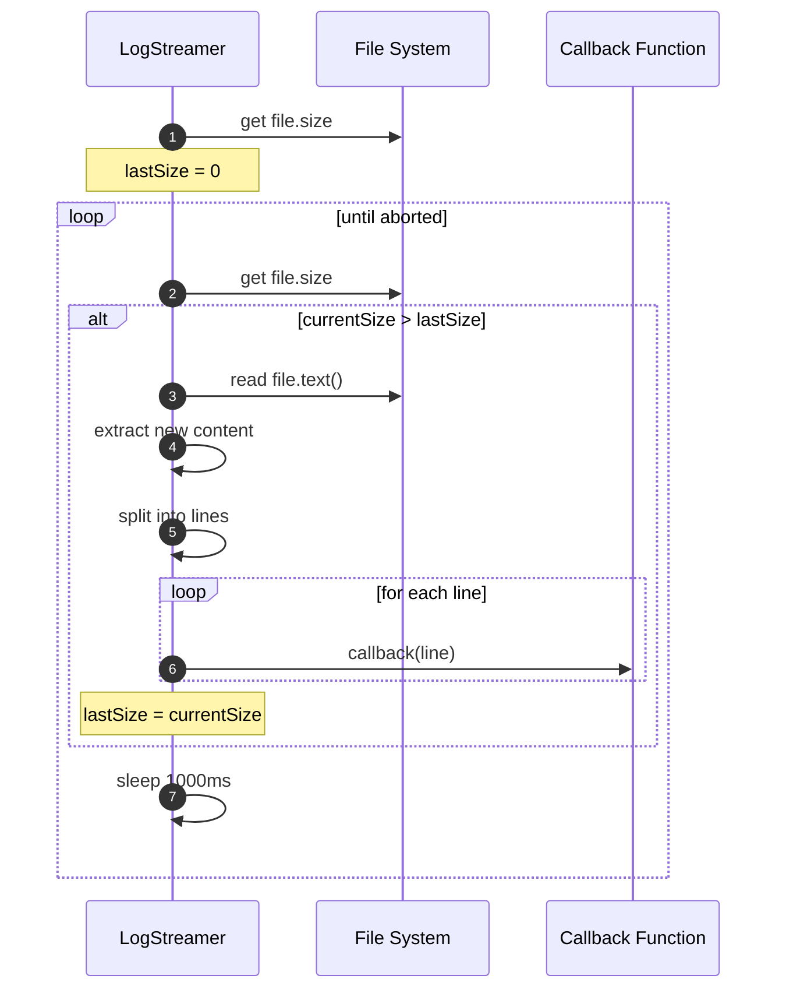

# logging サブ機能 バックエンド設計書

## メタ情報

| 項目 | 内容 |
|------|------|
| ドキュメントID | DETAILED-ORCH-001-LOGGING-BACKEND |
| バージョン | 1.0.0 |
| ステータス | ドラフト |
| 作成日 | 2026-01-24 |
| 最終更新日 | 2026-01-24 |
| 作成者 | AI Assistant |
| 承認者 | - |
| 関連詳細設計書 | DETAILED-ORCH-001-LOGGING v1.0.0 |
| 対応機能ID | F-008 |

---

## 1. 概要

本設計書では、logging サブ機能のバックエンド実装の詳細を定義します。

### 1.1 実装対象

- **LogWriter**: ログファイル書き込みコンポーネント
- **LogStreamer**: ログファイルリアルタイム読み取りコンポーネント
- **ディレクトリ構造**: `.agent/<task-id>/` 配下のファイル管理
- **Bun File API**: ファイル操作の実装方法

---

## 2. LogWriter 実装仕様

### 2.1 ファイル配置

**パス**: `src/core/log-writer.ts`

### 2.2 型定義

```typescript
export interface LogWriterConfig {
  /**
   * タスクを一意に識別するID
   * 例: "task-42-20260124-123456"
   */
  taskId: string;
  
  /**
   * ログディレクトリのベースパス
   * デフォルト: ".agent"
   */
  baseDir?: string;
}
```

### 2.3 クラス定義

```typescript
import { join } from "node:path";
import { mkdir } from "node:fs/promises";

export class LogWriter {
  private readonly taskId: string;
  private readonly logDir: string;
  private readonly outputPath: string;
  private readonly stdoutPath: string;
  private readonly stderrPath: string;
  private initialized = false;

  constructor(config: LogWriterConfig) {
    this.taskId = config.taskId;
    this.logDir = join(config.baseDir ?? ".agent", config.taskId);
    this.outputPath = join(this.logDir, "output.log");
    this.stdoutPath = join(this.logDir, "stdout.log");
    this.stderrPath = join(this.logDir, "stderr.log");
  }

  /**
   * ログディレクトリとファイルを初期化
   * - ディレクトリを作成（既存の場合はスキップ）
   * - ログファイルは初回書き込み時に自動作成される
   */
  async initialize(): Promise<void> {
    if (this.initialized) {
      return;
    }
    
    // ディレクトリを再帰的に作成
    await mkdir(this.logDir, { recursive: true });
    this.initialized = true;
  }

  /**
   * 標準出力を記録
   * - stdout.log に追記
   * - output.log にも追記
   */
  async writeStdout(data: string): Promise<void> {
    this.ensureInitialized();
    
    // 並行書き込み（順序は保証されない）
    await Promise.all([
      Bun.write(this.stdoutPath, data, { append: true }),
      Bun.write(this.outputPath, data, { append: true }),
    ]);
  }

  /**
   * 標準エラー出力を記録
   * - stderr.log に追記
   * - output.log にも追記
   */
  async writeStderr(data: string): Promise<void> {
    this.ensureInitialized();
    
    await Promise.all([
      Bun.write(this.stderrPath, data, { append: true }),
      Bun.write(this.outputPath, data, { append: true }),
    ]);
  }

  /**
   * 任意のメッセージを output.log に記録
   * stdout/stderr の区別が不要な場合に使用
   */
  async writeOutput(data: string): Promise<void> {
    this.ensureInitialized();
    await Bun.write(this.outputPath, data, { append: true });
  }

  /**
   * ログディレクトリのパスを取得
   */
  getLogDir(): string {
    return this.logDir;
  }

  private ensureInitialized(): void {
    if (!this.initialized) {
      throw new Error("LogWriter not initialized. Call initialize() first.");
    }
  }
}
```

### 2.4 Bun File API の使用方法

#### 2.4.1 ファイル書き込み

```typescript
// Bun.write() の基本形
await Bun.write(filePath, content, options);

// append モード（既存ファイルに追記）
await Bun.write(filePath, content, { append: true });

// 新規作成（既存ファイルを上書き）
await Bun.write(filePath, content);
```

#### 2.4.2 ファイル読み取り

```typescript
// ファイル全体をテキストとして読み取り
const content = await Bun.file(filePath).text();

// ファイルサイズを取得
const size = Bun.file(filePath).size;

// ファイルの存在確認
const exists = await Bun.file(filePath).exists();
```

### 2.5 エラーハンドリング

```typescript
async writeStdout(data: string): Promise<void> {
  this.ensureInitialized();
  
  try {
    await Promise.all([
      Bun.write(this.stdoutPath, data, { append: true }),
      Bun.write(this.outputPath, data, { append: true }),
    ]);
  } catch (error) {
    // ログ書き込みエラーは無視（ベストエフォート）
    // ループ実行を止めないため
    console.error(`[LogWriter] Failed to write log: ${error}`);
  }
}
```

### 2.6 使用例

```typescript
// Loop Engine での使用例
const logWriter = new LogWriter({ taskId: "task-42-20260124-123456" });
await logWriter.initialize();

// Backend 実行結果をログに記録
const result = await backend.execute(prompt);
await logWriter.writeStdout(result.output);

if (result.stderr) {
  await logWriter.writeStderr(result.stderr);
}
```

---

## 3. LogStreamer 実装仕様

### 3.1 ファイル配置

**パス**: `src/core/log-streamer.ts`

### 3.2 型定義

```typescript
export interface LogStreamerConfig {
  /**
   * タスクを一意に識別するID
   */
  taskId: string;
  
  /**
   * ログディレクトリのベースパス
   * デフォルト: ".agent"
   */
  baseDir?: string;
  
  /**
   * リアルタイム監視モード
   * true: tail -f 相当の動作
   * false: 一度だけ読み取って終了
   * デフォルト: false
   */
  follow?: boolean;
}
```

### 3.3 クラス定義

```typescript
import { join } from "node:path";
import { existsSync } from "node:fs";

export class LogStreamer {
  private readonly taskId: string;
  private readonly logPath: string;
  private readonly follow: boolean;
  private abortController: AbortController | null = null;

  constructor(config: LogStreamerConfig) {
    this.taskId = config.taskId;
    this.logPath = join(
      config.baseDir ?? ".agent",
      config.taskId,
      "output.log"
    );
    this.follow = config.follow ?? false;
  }

  /**
   * ログファイルをストリーミング
   * @param callback 新しい行が追加されたときに呼ばれる
   */
  async stream(callback: (line: string) => void): Promise<void> {
    // ファイルの存在確認
    if (!existsSync(this.logPath)) {
      throw new Error(`ログファイルが見つかりません: ${this.logPath}`);
    }

    if (this.follow) {
      await this.streamFollow(callback);
    } else {
      await this.streamOnce(callback);
    }
  }

  /**
   * ストリーミングを停止
   */
  stop(): void {
    if (this.abortController) {
      this.abortController.abort();
    }
  }

  /**
   * ファイル全体を一度だけ読み取る
   */
  private async streamOnce(callback: (line: string) => void): Promise<void> {
    const content = await Bun.file(this.logPath).text();
    const lines = content.split("\n");
    
    for (const line of lines) {
      if (line) {
        callback(line);
      }
    }
  }

  /**
   * ファイルをリアルタイムで監視（tail -f 相当）
   */
  private async streamFollow(callback: (line: string) => void): Promise<void> {
    this.abortController = new AbortController();
    const signal = this.abortController.signal;

    let lastSize = 0;

    while (!signal.aborted) {
      const file = Bun.file(this.logPath);
      const currentSize = file.size;

      if (currentSize > lastSize) {
        // 新しいデータを読み取る
        const content = await file.text();
        const newContent = content.slice(lastSize);
        const lines = newContent.split("\n");

        for (const line of lines) {
          if (line && !signal.aborted) {
            callback(line);
          }
        }

        lastSize = currentSize;
      }

      // 1秒待機
      await this.sleep(1000);
    }
  }

  private sleep(ms: number): Promise<void> {
    return new Promise((resolve) => setTimeout(resolve, ms));
  }
}
```

### 3.4 ポーリング方式の詳細

#### 3.4.1 動作フロー



#### 3.4.2 差分抽出ロジック

```typescript
// ファイル全体を読み取る
const content = await file.text();

// 前回読み取った位置以降のみを抽出
const newContent = content.slice(lastSize);

// 行に分割
const lines = newContent.split("\n");

// 各行をコールバックに渡す
for (const line of lines) {
  if (line) {  // 空行はスキップ
    callback(line);
  }
}

// 次回のために現在のサイズを記録
lastSize = currentSize;
```

### 3.5 AbortController による停止制御

```typescript
// ストリーミング開始時に AbortController を作成
this.abortController = new AbortController();
const signal = this.abortController.signal;

// ループ内で signal.aborted をチェック
while (!signal.aborted) {
  // ...
}

// 外部から stop() を呼ぶと abort される
stop(): void {
  if (this.abortController) {
    this.abortController.abort();
  }
}
```

### 3.6 使用例

```typescript
// CLI での使用例
const streamer = new LogStreamer({
  taskId: "task-42-20260124-123456",
  follow: true,
});

try {
  await streamer.stream((line) => {
    console.log(line);
  });
} catch (error) {
  console.error(`ログの読み取りに失敗: ${error.message}`);
  process.exit(1);
}

// Ctrl+C で終了
process.on("SIGINT", () => {
  streamer.stop();
  process.exit(0);
});
```

---

## 4. ディレクトリ構造の詳細

### 4.1 ファイル命名規則

- `.agent/<task-id>/` - タスクごとのディレクトリ
  - `PROMPT.md` - AIに渡すプロンプト
  - `output_history.txt` - ループ検出用（既存）
  - `output.log` - 全出力（新規）
  - `stdout.log` - 標準出力のみ（新規）
  - `stderr.log` - 標準エラー出力のみ（新規）
  - `report.md` - 実行レポート（既存）

### 4.2 task-id の生成ルール

**形式**: `task-<issue-number>-<timestamp>`

**例**: `task-42-20260124-123456`

**実装**:

```typescript
function generateTaskId(issueNumber: number): string {
  const timestamp = new Date()
    .toISOString()
    .replace(/[-:T]/g, "")
    .slice(0, 14);  // YYYYMMDDHHmmss
  
  return `task-${issueNumber}-${timestamp}`;
}
```

### 4.3 ディレクトリ作成タイミング

```mermaid
sequenceDiagram
    autonumber
    participant Loop as Loop Engine
    participant Writer as LogWriter
    participant FS as File System
    
    Loop->>Writer: new LogWriter({ taskId })
    Loop->>Writer: initialize()
    Writer->>FS: mkdir .agent/task-id/ (recursive)
    Note over FS: ディレクトリが作成される
    
    Loop->>Writer: writeStdout(data)
    Writer->>FS: Bun.write(stdout.log, append)
    Note over FS: ファイルが自動作成される
```

---

## 5. ループ実行中のリアルタイム出力とログファイル書き込みの並行処理

### 5.1 処理フロー

```mermaid
sequenceDiagram
    autonumber
    participant Loop as Loop Engine
    participant Backend as Backend
    participant Writer as LogWriter
    participant Console as Console
    participant FS as File System
    
    Loop->>Backend: execute(prompt)
    Backend->>Backend: run AI agent
    Backend-->>Loop: { output, stderr, exitCode }
    
    par コンソール出力
        Loop->>Console: print output
    and ログファイル書き込み
        Loop->>Writer: writeStdout(output)
        Writer->>FS: append to stdout.log
        Writer->>FS: append to output.log
    end
    
    alt stderr がある場合
        par コンソール出力
            Loop->>Console: print stderr
        and ログファイル書き込み
            Loop->>Writer: writeStderr(stderr)
            Writer->>FS: append to stderr.log
            Writer->>FS: append to output.log
        end
    end
```

### 5.2 実装例

```typescript
// src/core/loop.ts

async function executeSimpleIteration(
  context: LoopContext,
  backend: Backend,
  logWriter: LogWriter,
  ...
): Promise<IterationResult> {
  // Backend 実行
  const result = await backend.execute(prompt);
  
  // コンソール出力とログ書き込みを並行実行
  await Promise.all([
    // コンソール出力
    (async () => {
      taskLogger.debug(`Output (truncated): ${result.output.slice(0, 500)}...`);
    })(),
    
    // ログファイル書き込み
    logWriter.writeStdout(result.output),
  ]);
  
  // stderr がある場合
  if (result.stderr) {
    await Promise.all([
      (async () => {
        taskLogger.error(`Stderr: ${result.stderr}`);
      })(),
      logWriter.writeStderr(result.stderr),
    ]);
  }
  
  // 既存の処理を継続
  ...
}
```

### 5.3 パフォーマンス考慮

- **非同期書き込み**: `Bun.write()` は非同期なので、ループ実行をブロックしない
- **エラー無視**: ログ書き込みエラーはループを止めない（ベストエフォート）
- **並行実行**: コンソール出力とログ書き込みを `Promise.all()` で並行実行

---

## 6. 既存の `logs` コマンドとの統合

### 6.1 現状の動作

**ファイル**: `src/cli.ts` (L392-444)

```typescript
program
  .command("logs")
  .description("Watch task status in real-time")
  .option("-f, --follow", "Follow mode (watch for changes)")
  .option("-t, --task <id>", "Watch specific task")
  .option("-n, --interval <ms>", "Refresh interval in ms", Number.parseInt)
  .action((options) => {
    // タスクテーブルを表示・監視
    const store = new TaskStore();
    const tasks = options.task ? [store.get(options.task)] : store.getAll();
    
    if (!options.follow) {
      printTaskTable(tasks);
      return;
    }
    
    // ファイル監視でタスクテーブルを更新
    watch(taskStorePath, () => {
      printUpdate();
    });
  });
```

### 6.2 拡張後の動作

```typescript
program
  .command("logs")
  .description("タスクの実行ログを表示")
  .option("-t, --task <id>", "タスクID")
  .option("-f, --follow", "リアルタイムで監視")
  .option("-n, --lines <number>", "表示する行数", "100")
  .option("--table", "タスクテーブルを表示（既存の動作）")
  .action(async (options) => {
    // --table 指定時は既存の動作
    if (options.table || !options.task) {
      const store = new TaskStore();
      const tasks = options.task ? [store.get(options.task)] : store.getAll();
      
      if (!options.follow) {
        printTaskTable(tasks);
        return;
      }
      
      // 既存のファイル監視ロジック
      watch(taskStorePath, () => {
        printUpdate();
      });
      return;
    }
    
    // --task 指定時は LogStreamer を使用
    const streamer = new LogStreamer({
      taskId: options.task,
      follow: options.follow ?? false,
    });
    
    try {
      await streamer.stream((line) => {
        console.log(line);
      });
    } catch (error) {
      logger.error(`ログの読み取りに失敗: ${error.message}`);
      process.exit(1);
    }
    
    // Ctrl+C で終了
    process.on("SIGINT", () => {
      streamer.stop();
      process.exit(0);
    });
  });
```

### 6.3 使用例

```bash
# タスクテーブルを表示（既存の動作）
orch logs --table

# タスクのログを一度だけ表示
orch logs -t task-42-20260124-123456

# タスクのログをリアルタイム監視
orch logs -t task-42-20260124-123456 -f

# 全タスクのテーブルをリアルタイム監視（既存の動作）
orch logs -f --table
```

---

## 7. テストケース

### 7.1 LogWriter のテスト

**ファイル**: `tests/core/log-writer.test.ts`

```typescript
import { describe, test, expect, beforeEach, afterEach } from "bun:test";
import { rmSync, existsSync } from "node:fs";
import { LogWriter } from "../../src/core/log-writer.js";

describe("LogWriter", () => {
  const testTaskId = "test-task-123";
  const testBaseDir = ".agent-test";
  
  beforeEach(async () => {
    // テスト用ディレクトリをクリーンアップ
    if (existsSync(testBaseDir)) {
      rmSync(testBaseDir, { recursive: true });
    }
  });
  
  afterEach(() => {
    // テスト後のクリーンアップ
    if (existsSync(testBaseDir)) {
      rmSync(testBaseDir, { recursive: true });
    }
  });
  
  test("initialize() でディレクトリが作成される", async () => {
    const writer = new LogWriter({ taskId: testTaskId, baseDir: testBaseDir });
    await writer.initialize();
    
    expect(existsSync(writer.getLogDir())).toBe(true);
  });
  
  test("writeStdout() で stdout.log と output.log に書き込まれる", async () => {
    const writer = new LogWriter({ taskId: testTaskId, baseDir: testBaseDir });
    await writer.initialize();
    
    await writer.writeStdout("test output\n");
    
    const stdoutContent = await Bun.file(`${testBaseDir}/${testTaskId}/stdout.log`).text();
    const outputContent = await Bun.file(`${testBaseDir}/${testTaskId}/output.log`).text();
    
    expect(stdoutContent).toBe("test output\n");
    expect(outputContent).toBe("test output\n");
  });
  
  test("writeStderr() で stderr.log と output.log に書き込まれる", async () => {
    const writer = new LogWriter({ taskId: testTaskId, baseDir: testBaseDir });
    await writer.initialize();
    
    await writer.writeStderr("test error\n");
    
    const stderrContent = await Bun.file(`${testBaseDir}/${testTaskId}/stderr.log`).text();
    const outputContent = await Bun.file(`${testBaseDir}/${testTaskId}/output.log`).text();
    
    expect(stderrContent).toBe("test error\n");
    expect(outputContent).toBe("test error\n");
  });
  
  test("initialize() 前に書き込むとエラー", async () => {
    const writer = new LogWriter({ taskId: testTaskId, baseDir: testBaseDir });
    
    await expect(writer.writeStdout("test")).rejects.toThrow("LogWriter not initialized");
  });
});
```

### 7.2 LogStreamer のテスト

**ファイル**: `tests/core/log-streamer.test.ts`

```typescript
import { describe, test, expect, beforeEach, afterEach } from "bun:test";
import { rmSync, existsSync, mkdirSync, writeFileSync } from "node:fs";
import { LogStreamer } from "../../src/core/log-streamer.js";

describe("LogStreamer", () => {
  const testTaskId = "test-task-123";
  const testBaseDir = ".agent-test";
  const testLogPath = `${testBaseDir}/${testTaskId}/output.log`;
  
  beforeEach(() => {
    if (existsSync(testBaseDir)) {
      rmSync(testBaseDir, { recursive: true });
    }
    mkdirSync(`${testBaseDir}/${testTaskId}`, { recursive: true });
  });
  
  afterEach(() => {
    if (existsSync(testBaseDir)) {
      rmSync(testBaseDir, { recursive: true });
    }
  });
  
  test("stream() (follow=false) でファイル全体を読み取る", async () => {
    writeFileSync(testLogPath, "line1\nline2\nline3\n");
    
    const streamer = new LogStreamer({ taskId: testTaskId, baseDir: testBaseDir, follow: false });
    const lines: string[] = [];
    
    await streamer.stream((line) => {
      lines.push(line);
    });
    
    expect(lines).toEqual(["line1", "line2", "line3"]);
  });
  
  test("stream() (follow=true) で新しい行が追加されたら即座にコールバックが呼ばれる", async () => {
    writeFileSync(testLogPath, "line1\n");
    
    const streamer = new LogStreamer({ taskId: testTaskId, baseDir: testBaseDir, follow: true });
    const lines: string[] = [];
    
    const streamPromise = streamer.stream((line) => {
      lines.push(line);
    });
    
    // 初回読み取り
    await new Promise((resolve) => setTimeout(resolve, 100));
    expect(lines).toEqual(["line1"]);
    
    // 新しい行を追加
    await Bun.write(testLogPath, "line2\n", { append: true });
    await new Promise((resolve) => setTimeout(resolve, 1100));
    expect(lines).toEqual(["line1", "line2"]);
    
    // 停止
    streamer.stop();
    await streamPromise;
  });
  
  test("ファイルが存在しない場合はエラー", async () => {
    const streamer = new LogStreamer({ taskId: "non-existent", baseDir: testBaseDir });
    
    await expect(streamer.stream(() => {})).rejects.toThrow("ログファイルが見つかりません");
  });
});
```

---

## 8. API リファレンス

### 8.1 LogWriter

#### コンストラクタ

```typescript
new LogWriter(config: LogWriterConfig)
```

**パラメータ**:
- `config.taskId`: タスクID（必須）
- `config.baseDir`: ベースディレクトリ（オプション、デフォルト: `.agent`）

#### メソッド

##### `initialize(): Promise<void>`

ログディレクトリを作成します。

**例外**:
- ディレクトリ作成に失敗した場合

##### `writeStdout(data: string): Promise<void>`

標準出力を記録します。

**パラメータ**:
- `data`: 書き込むデータ

**動作**:
- `stdout.log` に追記
- `output.log` にも追記

##### `writeStderr(data: string): Promise<void>`

標準エラー出力を記録します。

**パラメータ**:
- `data`: 書き込むデータ

**動作**:
- `stderr.log` に追記
- `output.log` にも追記

##### `writeOutput(data: string): Promise<void>`

任意のメッセージを記録します。

**パラメータ**:
- `data`: 書き込むデータ

**動作**:
- `output.log` のみに追記

##### `getLogDir(): string`

ログディレクトリのパスを取得します。

**戻り値**:
- ログディレクトリの絶対パス

### 8.2 LogStreamer

#### コンストラクタ

```typescript
new LogStreamer(config: LogStreamerConfig)
```

**パラメータ**:
- `config.taskId`: タスクID（必須）
- `config.baseDir`: ベースディレクトリ（オプション、デフォルト: `.agent`）
- `config.follow`: リアルタイム監視モード（オプション、デフォルト: `false`）

#### メソッド

##### `stream(callback: (line: string) => void): Promise<void>`

ログファイルをストリーミングします。

**パラメータ**:
- `callback`: 新しい行が追加されたときに呼ばれる関数

**動作**:
- `follow: false` の場合: ファイル全体を一度だけ読み取る
- `follow: true` の場合: ファイルをリアルタイムで監視

**例外**:
- ファイルが存在しない場合

##### `stop(): void`

ストリーミングを停止します。

**動作**:
- `AbortController.abort()` を呼び出す
- `stream()` のループが終了する

---

## 変更履歴

| バージョン | 日付 | 変更内容 | 変更者 |
|-----------|------|---------|--------|
| 1.0.0 | 2026-01-24 | 初版作成 | AI Assistant |
