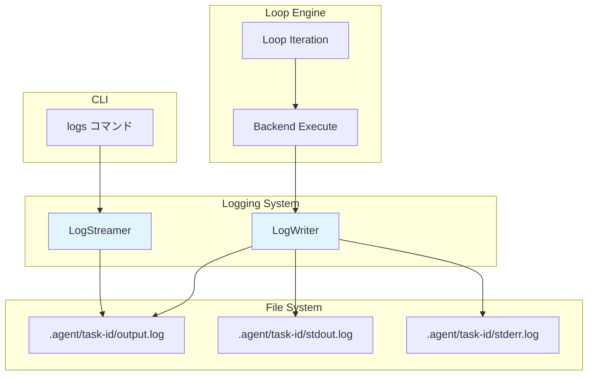
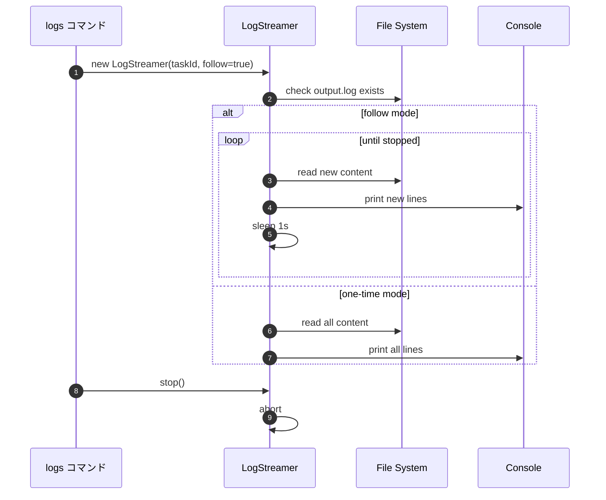
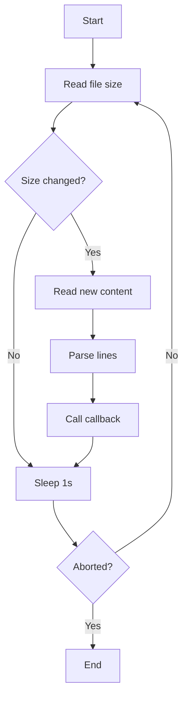

# logging サブ機能 詳細設計書

## メタ情報

| 項目 | 内容 |
|------|------|
| ドキュメントID | DETAILED-ORCH-001-LOGGING |
| バージョン | 1.0.0 |
| ステータス | ドラフト |
| 作成日 | 2026-01-24 |
| 最終更新日 | 2026-01-24 |
| 作成者 | AI Assistant |
| 承認者 | - |
| 関連基本設計書 | BASIC-ORCH-001 v1.0.0 |
| 対応機能ID | F-008 |

---

## 1. 概要

### 1.1 目的

orchestrator-hybridのタスク実行中に、AIエージェントの出力をリアルタイムで確認できる機能を提供します。これにより、以下を実現します：

- **実行状況の可視化**: タスクの進捗をリアルタイムで把握
- **デバッグの効率化**: 問題発生時に即座にログを確認
- **並列実行の監視**: 複数タスクの同時実行時に各タスクの状態を追跡
- **ログの永続化**: 実行履歴を後から参照可能

### 1.2 スコープ

#### スコープ内

- ログファイルへの書き込み機能（LogWriter）
- ログファイルのリアルタイム読み取り機能（LogStreamer）
- `.agent/<task-id>/` ディレクトリ構造の定義
- `output.log`, `stdout.log`, `stderr.log` の役割分担
- 既存の `logs` コマンドとの統合
- ループ実行中のリアルタイム出力とログファイル書き込みの並行処理

#### スコープ外

- ログのローテーション機能
- ログの圧縮機能
- ログの外部サービスへの送信
- ログの検索・フィルタリング機能（将来の拡張として検討）

### 1.3 用語定義

| 用語 | 定義 |
|------|------|
| LogWriter | ログファイルへの書き込みを担当するコンポーネント |
| LogStreamer | ログファイルのリアルタイム読み取りを担当するコンポーネント |
| task-id | タスクを一意に識別するID（例: `task-42-20260124-123456`） |
| output.log | 全出力（stdout + stderr）を記録するファイル |
| stdout.log | 標準出力のみを記録するファイル |
| stderr.log | 標準エラー出力のみを記録するファイル |
| tail -f | ファイルの末尾を監視し、追加されたデータをリアルタイムで表示するコマンド |

---

## 2. システムアーキテクチャ

### 2.1 全体構成



### 2.2 処理フロー

#### 2.2.1 ログ書き込みフロー

```mermaid
sequenceDiagram
    autonumber
    participant Loop as Loop Engine
    participant Writer as LogWriter
    participant FS as File System
    
    Loop->>Writer: initialize(taskId)
    Writer->>FS: mkdir .agent/task-id/
    Writer->>FS: create output.log
    Writer->>FS: create stdout.log
    Writer->>FS: create stderr.log
    
    loop 各イテレーション
        Loop->>Writer: writeStdout(data)
        Writer->>FS: append to stdout.log
        Writer->>FS: append to output.log
        
        Loop->>Writer: writeStderr(data)
        Writer->>FS: append to stderr.log
        Writer->>FS: append to output.log
    end
```

#### 2.2.2 ログ読み取りフロー



### 2.3 ディレクトリ構造

- `.agent/<task-id>/` - タスクごとのディレクトリ
  - `PROMPT.md` - 既存: AIに渡すプロンプト
  - `output_history.txt` - 既存: ループ検出用
  - `output.log` - 新規: 全出力（stdout + stderr）
  - `stdout.log` - 新規: 標準出力のみ
  - `stderr.log` - 新規: 標準エラー出力のみ
  - `report.md` - 既存: 実行レポート
- `.agent/scratchpad.md` - 既存: グローバルScratchpad
- `.agent/tasks.json` - 既存: タスク状態管理

---

## 3. コンポーネント設計

### 3.1 LogWriter

#### 3.1.1 責務

- タスク実行中のログをファイルに書き込む
- stdout、stderr、全出力を適切なファイルに振り分ける
- ログディレクトリの自動作成

#### 3.1.2 インターフェース

```typescript
export interface LogWriterConfig {
  taskId: string;
  baseDir?: string;  // デフォルト: ".agent"
}

export class LogWriter {
  constructor(config: LogWriterConfig);
  
  /**
   * ログディレクトリとファイルを初期化
   */
  initialize(): Promise<void>;
  
  /**
   * 標準出力を記録
   * - stdout.log に追記
   * - output.log にも追記
   */
  writeStdout(data: string): Promise<void>;
  
  /**
   * 標準エラー出力を記録
   * - stderr.log に追記
   * - output.log にも追記
   */
  writeStderr(data: string): Promise<void>;
  
  /**
   * 任意のメッセージを output.log に記録
   */
  writeOutput(data: string): Promise<void>;
  
  /**
   * ログディレクトリのパスを取得
   */
  getLogDir(): string;
}
```

#### 3.1.3 実装方針

- **Bun File API** を使用してファイル書き込みを実装
- `Bun.write()` の `append: true` オプションで追記モード
- ログディレクトリは `fs.mkdir(recursive: true)` で自動作成
- ファイルハンドルは都度開閉（長時間保持しない）

### 3.2 LogStreamer

#### 3.2.1 責務

- ログファイルをリアルタイムで監視
- 新しい出力を即座にコンソールに表示
- ユーザーによる停止（Ctrl+C）に対応

#### 3.2.2 インターフェース

```typescript
export interface LogStreamerConfig {
  taskId: string;
  baseDir?: string;  // デフォルト: ".agent"
  follow?: boolean;  // デフォルト: false
}

export class LogStreamer {
  constructor(config: LogStreamerConfig);
  
  /**
   * ログファイルをストリーミング
   * @param callback 新しい行が追加されたときに呼ばれる
   */
  stream(callback: (line: string) => void): Promise<void>;
  
  /**
   * ストリーミングを停止
   */
  stop(): void;
}
```

#### 3.2.3 実装方針

- **ポーリング方式**: 1秒間隔でファイルサイズをチェック
- **AbortController** でストリーミング停止を制御
- `Bun.file().text()` でファイル全体を読み取り、差分を抽出
- `follow: false` の場合は一度だけ読み取って終了

#### 3.2.4 ポーリング動作



---

## 4. 既存コードとの統合

### 4.1 Loop Engine への統合

#### 4.1.1 変更箇所

**ファイル**: `src/core/loop.ts`

**変更内容**:

1. `runLoop()` 関数の開始時に LogWriter を初期化
2. Backend 実行時に stdout/stderr を LogWriter に渡す
3. タスク完了時に LogWriter をクリーンアップ

#### 4.1.2 実装イメージ

```typescript
// src/core/loop.ts

import { LogWriter } from './log-writer.js';

export async function runLoop(options: LoopOptions): Promise<void> {
  const { taskId } = options;
  
  // LogWriter を初期化
  const logWriter = new LogWriter({ taskId: taskId ?? 'default' });
  await logWriter.initialize();
  
  try {
    // 既存のループ処理
    await executeLoop(context, backend, logWriter, ...);
  } finally {
    // クリーンアップ（必要に応じて）
  }
}

async function executeSimpleIteration(
  context: LoopContext,
  backend: Backend,
  logWriter: LogWriter,
  ...
): Promise<IterationResult> {
  // Backend 実行
  const result = await backend.execute(prompt);
  
  // ログに記録
  await logWriter.writeStdout(result.output);
  if (result.stderr) {
    await logWriter.writeStderr(result.stderr);
  }
  
  // 既存の処理を継続
  ...
}
```

### 4.2 CLI への統合

#### 4.2.1 既存の `logs` コマンド拡張

**ファイル**: `src/cli.ts`

**現状**:
- タスク状態の監視機能のみ（`--follow` でタスクテーブルを更新）

**拡張内容**:
- `--task <id>` 指定時に LogStreamer を使用
- `--follow` 指定時にリアルタイム監視
- 指定なしの場合は既存の動作を維持

#### 4.2.2 実装イメージ

```typescript
// src/cli.ts

program
  .command("logs")
  .description("タスクの実行ログを表示")
  .option("-t, --task <id>", "タスクID")
  .option("-f, --follow", "リアルタイムで監視")
  .option("-n, --lines <number>", "表示する行数", "100")
  .action(async (options) => {
    if (options.task) {
      // LogStreamer を使用
      const streamer = new LogStreamer({
        taskId: options.task,
        follow: options.follow ?? false,
      });
      
      try {
        await streamer.stream((line) => {
          console.log(line);
        });
      } catch (error) {
        logger.error(`ログの読み取りに失敗: ${error.message}`);
        process.exit(1);
      }
      
      // Ctrl+C で終了
      process.on("SIGINT", () => {
        streamer.stop();
        process.exit(0);
      });
    } else {
      // 既存の動作（タスクテーブル表示）
      const store = new TaskStore();
      const tasks = store.getAll();
      printTaskTable(tasks);
    }
  });
```

---

## 5. ログファイルの役割分担

| ファイル | 内容 | 用途 |
|---------|------|------|
| **output.log** | stdout + stderr の全出力 | デフォルトの監視対象。全体の流れを把握 |
| **stdout.log** | 標準出力のみ | 正常な出力のみを確認したい場合 |
| **stderr.log** | 標準エラー出力のみ | エラーメッセージのみを確認したい場合 |

### 5.1 書き込みルール

```typescript
// writeStdout() の動作
writeStdout(data: string) {
  await Bun.write(stdout.log, data, { append: true });
  await Bun.write(output.log, data, { append: true });  // 重複書き込み
}

// writeStderr() の動作
writeStderr(data: string) {
  await Bun.write(stderr.log, data, { append: true });
  await Bun.write(output.log, data, { append: true });  // 重複書き込み
}
```

### 5.2 ファイルサイズの考慮

- 長時間実行タスクではログファイルが肥大化する可能性
- 現時点ではローテーション機能は実装しない
- 将来的に必要に応じて以下を検討：
  - ファイルサイズ制限
  - 古いログの自動削除
  - ログの圧縮

---

## 6. テスト方針

### 6.1 単体テスト

#### 6.1.1 LogWriter のテスト

| テストケース | 検証内容 |
|-------------|---------|
| `initialize()` | ディレクトリとファイルが正しく作成される |
| `writeStdout()` | stdout.log と output.log に正しく書き込まれる |
| `writeStderr()` | stderr.log と output.log に正しく書き込まれる |
| `writeOutput()` | output.log のみに書き込まれる |
| 並行書き込み | 複数の書き込みが競合しない |

#### 6.1.2 LogStreamer のテスト

| テストケース | 検証内容 |
|-------------|---------|
| `stream()` (follow=false) | ファイル全体を一度だけ読み取る |
| `stream()` (follow=true) | 新しい行が追加されたら即座にコールバックが呼ばれる |
| `stop()` | ストリーミングが正しく停止する |
| ファイル不存在 | エラーが適切にスローされる |

### 6.2 統合テスト

| テストケース | 検証内容 |
|-------------|---------|
| Loop Engine 統合 | ループ実行中にログが正しく記録される |
| CLI 統合 | `orch logs -t <id> -f` でリアルタイム監視できる |
| 並列タスク | 複数タスクのログが混在しない |

### 6.3 手動テスト

```bash
# 1. タスクを実行
orch run --issue 42 --auto

# 2. 別のターミナルでログを監視
orch logs -t <task-id> -f

# 3. ログファイルを直接確認
cat .agent/<task-id>/output.log
tail -f .agent/<task-id>/output.log
```

---

## 7. エラーハンドリング

### 7.1 LogWriter のエラー

| エラー | 原因 | 対処 |
|--------|------|------|
| ディレクトリ作成失敗 | 権限不足 | エラーメッセージを表示して終了 |
| ファイル書き込み失敗 | ディスク容量不足 | エラーログを出力して継続（ベストエフォート） |

### 7.2 LogStreamer のエラー

| エラー | 原因 | 対処 |
|--------|------|------|
| ファイル不存在 | タスクIDが間違っている | エラーメッセージを表示して終了 |
| ファイル読み取り失敗 | 権限不足 | エラーメッセージを表示して終了 |

---

## 8. パフォーマンス考慮事項

### 8.1 書き込みパフォーマンス

- **Bun.write()** は非同期だが、ループ実行に影響を与えないよう配慮
- 書き込みエラーは無視してループを継続（ベストエフォート）

### 8.2 読み取りパフォーマンス

- **ポーリング間隔**: 1秒（調整可能にする必要はない）
- **ファイル全体読み取り**: 大きなファイルでは遅くなる可能性
  - 将来的に `tail -n` 相当の機能を検討

---

## 9. セキュリティ考慮事項

### 9.1 ファイルパス

- `taskId` にパストラバーサル攻撃（`../`）が含まれないよう検証
- `.agent/` 配下のみにログを保存

### 9.2 ログ内容

- ログに機密情報（APIキー等）が含まれる可能性
- ユーザーに注意喚起（README に記載）

---

## 10. 将来の拡張

### 10.1 ログローテーション

- ファイルサイズが一定以上になったら自動的に圧縮・アーカイブ
- 古いログの自動削除

### 10.2 ログ検索

- `orch logs --grep <pattern>` でログを検索
- 正規表現サポート

### 10.3 ログフォーマット

- JSON形式でのログ出力
- タイムスタンプの自動付与

### 10.4 外部サービス連携

- CloudWatch Logs、Datadog等への送信
- Webhook通知

---

## 変更履歴

| バージョン | 日付 | 変更内容 | 変更者 |
|-----------|------|---------|--------|
| 1.0.0 | 2026-01-24 | 初版作成 | AI Assistant |
