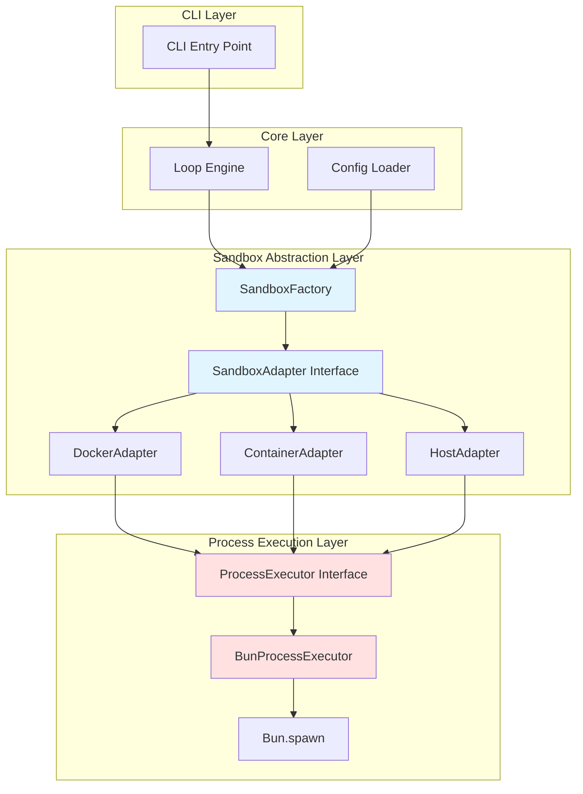
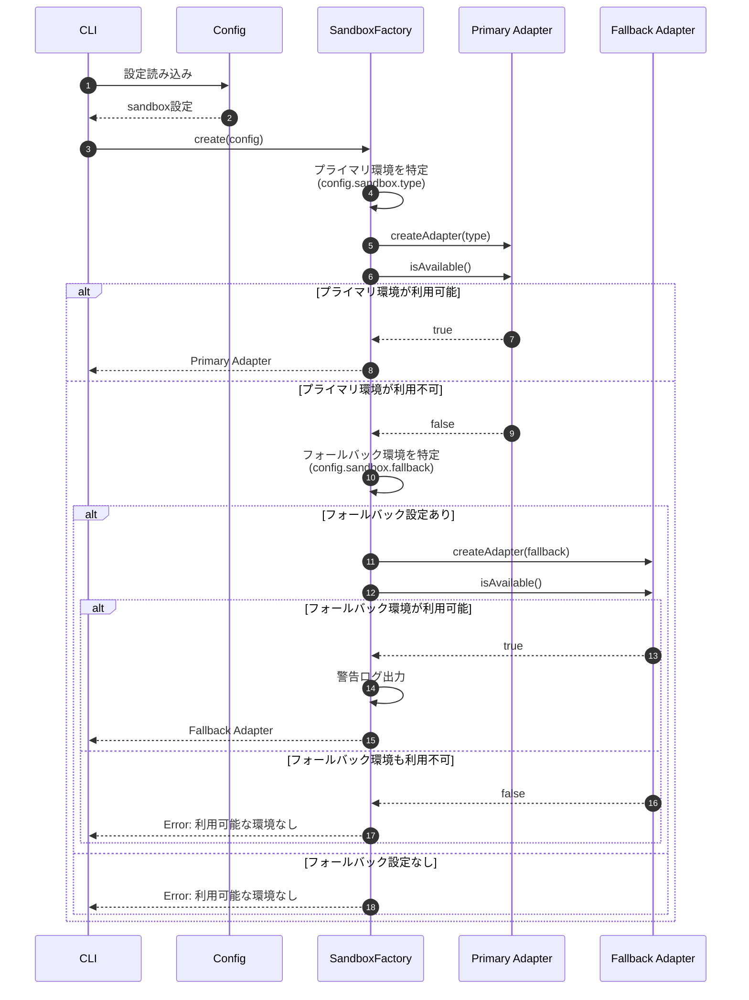
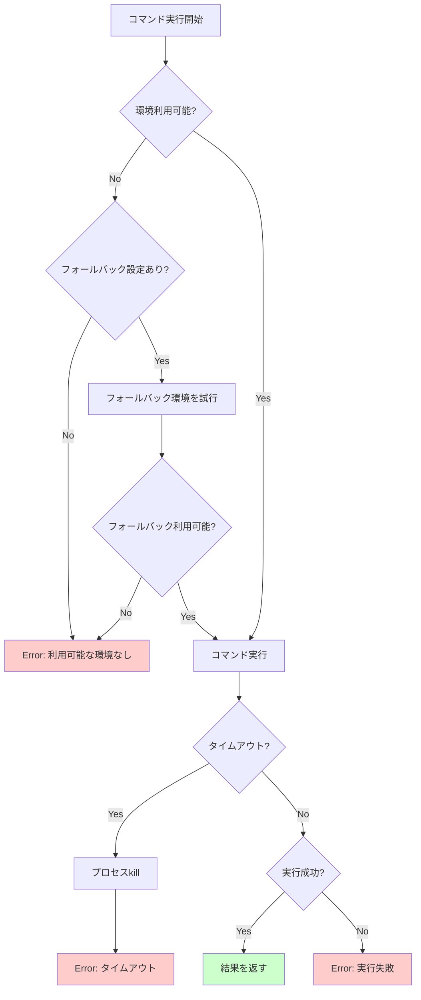

# sandbox サブ機能 詳細設計書

## メタ情報

| 項目 | 内容 |
|------|------|
| ドキュメントID | DETAILED-ORCH-001-SANDBOX |
| バージョン | 1.0.0 |
| ステータス | ドラフト |
| 作成日 | 2026-01-24 |
| 最終更新日 | 2026-01-24 |
| 作成者 | AI Assistant |
| 承認者 | - |
| 関連基本設計書 | BASIC-ORCH-001 v1.0.0 |
| 関連要件定義書 | REQ-ORCH-001 v1.2.0 |

---

## 1. 概要

### 1.1 目的

orchestrator-hybridに複数の実行環境（Docker、container-use、ホスト環境）を統一的に扱うためのサンドボックス抽象化層を実装します。これにより、以下を実現します：

1. **実行環境の柔軟な切り替え**: 設定ファイルで実行環境を選択可能
2. **フォールバック機能**: プライマリ環境が利用できない場合の自動切り替え
3. **プロセス実行の抽象化**: Bun.spawnへの直接依存を排除し、将来のランタイム切り替えを容易に

### 1.2 スコープ

#### スコープ内

- ProcessExecutorインターフェースの設計と実装（Bun.spawn抽象化）
- SandboxAdapterインターフェースの設計
- DockerAdapterの実装（F-001）
- HostAdapterの実装（F-002）
- ContainerAdapterのリファクタリング（既存コードをSandboxAdapterに適合）
- SandboxFactoryの実装（F-003）
- エラーハンドリング（Docker未インストール、タイムアウト等）
- 単体テスト方針

#### スコープ外

- Podman等の他のコンテナランタイム対応
- Windows固有の実装（将来対応）
- GPU等の特殊リソース管理

### 1.3 対象機能

| 機能ID | 機能名 | 優先度 |
|--------|--------|--------|
| F-001 | Docker sandbox対応 | 必須 |
| F-002 | ホスト環境実行対応 | 必須 |
| F-003 | 実行環境選択機能 | 必須 |

---

## 2. アーキテクチャ

### 2.1 全体構成



### 2.2 レイヤー構成

| レイヤー | 責務 | 主要コンポーネント |
|---------|------|------------------|
| **CLI Layer** | ユーザー入力の受付 | cli.ts |
| **Core Layer** | ビジネスロジック | loop.ts, config.ts |
| **Sandbox Abstraction Layer** | 実行環境の抽象化 | SandboxAdapter, Factory |
| **Process Execution Layer** | プロセス実行の抽象化 | ProcessExecutor |

---

## 3. インターフェース定義

### 3.1 ProcessExecutor（プロセス実行抽象化）

#### 目的

- Bun.spawnへの直接依存を排除
- 将来のNode.js対応を容易にする
- テスト時のモック化を簡単にする

#### インターフェース

```typescript
// src/core/process-executor.ts

/**
 * プロセス実行オプション
 */
export interface SpawnOptions {
  /** 作業ディレクトリ */
  cwd?: string;
  
  /** 環境変数 */
  env?: Record<string, string>;
  
  /** 標準入力データ */
  stdin?: string;
  
  /** タイムアウト（ミリ秒） */
  timeout?: number;
  
  /** 標準出力の処理方法 */
  stdout?: "pipe" | "inherit";
  
  /** 標準エラー出力の処理方法 */
  stderr?: "pipe" | "inherit";
}

/**
 * プロセス実行結果
 */
export interface ProcessResult {
  /** 標準出力 */
  stdout: string;
  
  /** 標準エラー出力 */
  stderr: string;
  
  /** 終了コード */
  exitCode: number;
}

/**
 * プロセス実行インターフェース
 */
export interface ProcessExecutor {
  /**
   * コマンドを実行する
   * @param command 実行するコマンド
   * @param args コマンド引数
   * @param options 実行オプション
   * @returns 実行結果
   * @throws タイムアウト時、またはプロセス起動失敗時
   */
  spawn(
    command: string,
    args: string[],
    options?: SpawnOptions
  ): Promise<ProcessResult>;
}
```

#### 実装クラス: BunProcessExecutor

```typescript
// src/core/bun-process-executor.ts

/**
 * Bun.spawnを使用したProcessExecutor実装
 */
export class BunProcessExecutor implements ProcessExecutor {
  async spawn(
    command: string,
    args: string[],
    options: SpawnOptions = {}
  ): Promise<ProcessResult> {
    // 実装詳細はバックエンド設計書を参照
  }
}
```

### 3.2 SandboxAdapter（サンドボックス抽象化）

#### 目的

- Docker、container-use、ホスト環境を統一的に扱う
- 実行環境の切り替えを容易にする
- 環境固有の処理を隠蔽する

#### インターフェース

```typescript
// src/adapters/sandbox-adapter.ts

/**
 * コマンド実行オプション
 */
export interface ExecuteOptions {
  /** 作業ディレクトリ */
  cwd?: string;
  
  /** 環境変数 */
  env?: Record<string, string>;
  
  /** タイムアウト（ミリ秒） */
  timeout?: number;
}

/**
 * コマンド実行結果
 */
export interface ExecuteResult {
  /** 標準出力 */
  stdout: string;
  
  /** 標準エラー出力 */
  stderr: string;
  
  /** 終了コード */
  exitCode: number;
}

/**
 * サンドボックスアダプターインターフェース
 */
export interface SandboxAdapter {
  /**
   * アダプター名（識別用）
   */
  readonly name: string;

  /**
   * サンドボックス環境でコマンドを実行
   * @param command 実行するコマンド
   * @param options 実行オプション
   * @returns 実行結果
   * @throws 実行失敗時、タイムアウト時
   */
  execute(command: string, options?: ExecuteOptions): Promise<ExecuteResult>;

  /**
   * サンドボックス環境のクリーンアップ
   * @throws クリーンアップ失敗時（ログ出力のみ、エラーは無視）
   */
  cleanup(): Promise<void>;

  /**
   * サンドボックス環境が利用可能かチェック
   * @returns 利用可能ならtrue
   */
  isAvailable(): Promise<boolean>;
}
```

---

## 4. 処理フロー

### 4.1 サンドボックス環境の選択フロー



### 4.2 Docker環境でのコマンド実行フロー

```mermaid
sequenceDiagram
    autonumber
    participant Loop as Loop Engine
    participant Docker as DockerAdapter
    participant Executor as ProcessExecutor
    participant DockerCLI as Docker CLI
    
    Loop->>Docker: execute(command, options)
    
    Docker->>Docker: ensureImage()
    Docker->>Executor: spawn("docker", ["image", "inspect", ...])
    Executor->>DockerCLI: docker image inspect
    
    alt イメージが存在
        DockerCLI-->>Executor: exitCode=0
    else イメージが存在しない
        DockerCLI-->>Executor: exitCode!=0
        Docker->>Executor: spawn("docker", ["pull", ...])
        Executor->>DockerCLI: docker pull
        DockerCLI-->>Executor: イメージダウンロード完了
    end
    
    Docker->>Docker: buildDockerRunArgs()
    Note over Docker: --rm, -i, -v, -w, -e等を構築
    
    Docker->>Executor: spawn("docker", ["run", ...])
    Executor->>DockerCLI: docker run
    
    alt 実行成功
        DockerCLI-->>Executor: stdout, stderr, exitCode
        Executor-->>Docker: ProcessResult
        Docker-->>Loop: ExecuteResult
    else タイムアウト
        Executor->>DockerCLI: プロセスkill
        Executor-->>Docker: Error: タイムアウト
        Docker-->>Loop: Error
    end
```

### 4.3 ホスト環境でのコマンド実行フロー

```mermaid
sequenceDiagram
    autonumber
    participant Loop as Loop Engine
    participant Host as HostAdapter
    participant Executor as ProcessExecutor
    participant Shell as sh
    
    Loop->>Host: execute(command, options)
    
    alt 初回実行
        Host->>Host: 警告ログ出力<br/>"⚠️ ホスト環境で実行中"
        Host->>Host: hasWarned = true
    end
    
    Host->>Executor: spawn("sh", ["-c", command])
    Executor->>Shell: sh -c "command"
    
    alt 実行成功
        Shell-->>Executor: stdout, stderr, exitCode
        Executor-->>Host: ProcessResult
        Host-->>Loop: ExecuteResult
    else タイムアウト
        Executor->>Shell: プロセスkill
        Executor-->>Host: Error: タイムアウト
        Host-->>Loop: Error
    end
```

---

## 5. データ構造

### 5.1 設定ファイル構造（orch.yml拡張）

```yaml
# サンドボックス設定（新規）
sandbox:
  # 実行環境タイプ: docker | container-use | host
  type: docker
  
  # フォールバック先（オプション）
  fallback: host
  
  # Docker設定
  docker:
    # ベースイメージ
    image: node:20-alpine
    
    # ネットワーク設定: none | bridge | host
    network: none
    
    # タイムアウト（秒）
    timeout: 300
  
  # container-use設定（既存）
  containerUse:
    image: node:20
    envId: ""
  
  # ホスト環境設定
  host:
    # タイムアウト（秒）
    timeout: 300
    
    # 起動時に警告を表示するか
    warnOnStart: true
```

### 5.2 TypeScript型定義

```typescript
// src/core/types.ts に追加

import { z } from "zod";

/**
 * サンドボックス設定スキーマ
 */
export const SandboxConfigSchema = z.object({
  type: z.enum(["docker", "container-use", "host"]).default("container-use"),
  fallback: z.enum(["docker", "container-use", "host"]).optional(),
  
  docker: z.object({
    image: z.string().default("node:20-alpine"),
    network: z.enum(["none", "bridge", "host"]).optional(),
    timeout: z.number().default(300),
  }).optional(),
  
  containerUse: z.object({
    image: z.string().optional(),
    envId: z.string().optional(),
  }).optional(),
  
  host: z.object({
    timeout: z.number().default(300),
    warnOnStart: z.boolean().default(true),
  }).optional(),
});

export type SandboxConfig = z.infer<typeof SandboxConfigSchema>;

/**
 * 全体設定スキーマに追加
 */
export const ConfigSchema = z.object({
  // ... 既存フィールド
  sandbox: SandboxConfigSchema.optional(),
});
```

---

## 6. エラーハンドリング

### 6.1 エラー分類

| エラー種別 | 発生条件 | 処理方法 |
|-----------|---------|---------|
| **環境利用不可エラー** | Docker/cuコマンドが見つからない | フォールバック環境に切り替え、なければエラー終了 |
| **タイムアウトエラー** | 実行時間が制限を超過 | プロセスをkillし、エラーを返す |
| **イメージ取得エラー** | docker pullが失敗 | エラーログを出力し、エラーを返す |
| **プロセス起動エラー** | コマンドが見つからない等 | エラーログを出力し、エラーを返す |
| **クリーンアップエラー** | 環境削除が失敗 | 警告ログを出力（処理は継続） |

### 6.2 エラーメッセージ例

```typescript
// src/adapters/sandbox-errors.ts

export class SandboxError extends Error {
  constructor(
    message: string,
    public readonly code: string,
    public readonly details?: unknown
  ) {
    super(message);
    this.name = "SandboxError";
  }
}

export class EnvironmentUnavailableError extends SandboxError {
  constructor(environmentType: string) {
    super(
      `サンドボックス環境が利用できません: ${environmentType}`,
      "ENVIRONMENT_UNAVAILABLE",
      { environmentType }
    );
  }
}

export class ExecutionTimeoutError extends SandboxError {
  constructor(timeout: number) {
    super(
      `実行がタイムアウトしました: ${timeout}ms`,
      "EXECUTION_TIMEOUT",
      { timeout }
    );
  }
}

export class ImagePullError extends SandboxError {
  constructor(image: string, stderr: string) {
    super(
      `Dockerイメージの取得に失敗しました: ${image}`,
      "IMAGE_PULL_FAILED",
      { image, stderr }
    );
  }
}
```

### 6.3 エラーハンドリングフロー



---

## 7. テスト方針

### 7.1 単体テスト

#### ProcessExecutor

| テストケース | 検証内容 |
|-------------|---------|
| 正常系: コマンド実行成功 | stdout, stderr, exitCodeが正しく返される |
| 正常系: 環境変数の設定 | 環境変数が正しく渡される |
| 正常系: 作業ディレクトリの設定 | cwdが正しく設定される |
| 異常系: タイムアウト | 指定時間でプロセスがkillされる |
| 異常系: 存在しないコマンド | エラーが適切にスローされる |

#### DockerAdapter

| テストケース | 検証内容 |
|-------------|---------|
| 正常系: イメージが存在する場合 | docker runが実行される |
| 正常系: イメージが存在しない場合 | docker pullが実行される |
| 正常系: ネットワーク設定 | --networkオプションが正しく設定される |
| 正常系: ボリュームマウント | -vオプションが正しく設定される |
| 異常系: Dockerが未インストール | isAvailable()がfalseを返す |
| 異常系: イメージpull失敗 | ImagePullErrorがスローされる |

#### HostAdapter

| テストケース | 検証内容 |
|-------------|---------|
| 正常系: コマンド実行 | sh -c でコマンドが実行される |
| 正常系: 初回実行時の警告 | 警告ログが出力される |
| 正常系: 2回目以降の実行 | 警告ログが出力されない |
| 正常系: isAvailable() | 常にtrueを返す |

#### SandboxFactory

| テストケース | 検証内容 |
|-------------|---------|
| 正常系: プライマリ環境が利用可能 | プライマリAdapterが返される |
| 正常系: フォールバック | フォールバックAdapterが返される |
| 正常系: 警告ログ | フォールバック時に警告が出力される |
| 異常系: 全環境が利用不可 | EnvironmentUnavailableErrorがスローされる |

### 7.2 統合テスト

| テストケース | 検証内容 |
|-------------|---------|
| Docker環境でのループ実行 | Issue → ループ → 完了 が正常動作 |
| ホスト環境でのループ実行 | Issue → ループ → 完了 が正常動作 |
| フォールバック動作 | Docker未インストール時にホスト環境で実行 |
| タイムアウト処理 | 長時間実行でタイムアウトが機能 |

### 7.3 テストコマンド

```bash
# 全テスト実行
bun test

# 特定ファイルのテスト
bun test src/core/process-executor.test.ts
bun test src/adapters/docker-adapter.test.ts

# カバレッジ計測
bun test --coverage
```

---

## 8. 既存コードへの影響

### 8.1 変更が必要なファイル

| ファイル | 変更内容 | 影響度 |
|---------|---------|--------|
| `src/core/exec.ts` | BunProcessExecutorを使用 | 中 |
| `src/adapters/container.ts` | SandboxAdapterに適合 | 中 |
| `src/adapters/claude.ts` | ProcessExecutorをDI | 小 |
| `src/adapters/opencode.ts` | ProcessExecutorをDI | 小 |
| `src/core/loop.ts` | SandboxFactoryを使用 | 中 |
| `src/core/config.ts` | SandboxConfigSchemaを追加 | 小 |

### 8.2 既存ContainerBackendのリファクタリング方針

```typescript
// Before: src/adapters/container.ts
export class ContainerBackend extends BaseBackend {
  readonly name = "container";
  async execute(prompt: string): Promise<BackendResult> { ... }
}

// After: src/adapters/container-adapter.ts
export class ContainerAdapter implements SandboxAdapter {
  readonly name = "container-use";
  
  constructor(
    config: ContainerAdapterConfig = {},
    executor: ProcessExecutor = new BunProcessExecutor()
  ) { ... }
  
  async execute(command: string, options?: ExecuteOptions): Promise<ExecuteResult> { ... }
  async cleanup(): Promise<void> { ... }
  async isAvailable(): Promise<boolean> { ... }
}
```

**変更点**:
1. `BaseBackend` → `SandboxAdapter` に変更
2. `execute(prompt: string)` → `execute(command: string, options?)` に変更
3. `ProcessExecutor` をDI
4. `isAvailable()` メソッドを追加
5. `cleanup()` メソッドを追加（既存の処理を移動）

---

## 9. 実装チェックリスト

### Phase 1: ProcessExecutor抽象化

- [ ] `src/core/process-executor.ts` インターフェース定義
- [ ] `src/core/bun-process-executor.ts` 実装
- [ ] `src/core/process-executor.test.ts` 単体テスト
- [ ] `src/core/exec.ts` をBunProcessExecutorに移行
- [ ] 既存コードの動作確認

### Phase 2: SandboxAdapter抽象化

- [ ] `src/adapters/sandbox-adapter.ts` インターフェース定義
- [ ] `src/adapters/sandbox-errors.ts` エラークラス定義
- [ ] `src/adapters/sandbox-adapter.test.ts` インターフェーステスト

### Phase 3: DockerAdapter実装

- [ ] `src/adapters/docker-adapter.ts` 実装
- [ ] `src/adapters/docker-adapter.test.ts` 単体テスト
- [ ] Docker環境での動作確認

### Phase 4: HostAdapter実装

- [ ] `src/adapters/host-adapter.ts` 実装
- [ ] `src/adapters/host-adapter.test.ts` 単体テスト
- [ ] ホスト環境での動作確認

### Phase 5: ContainerAdapterリファクタリング

- [ ] `src/adapters/container-adapter.ts` リファクタリング
- [ ] `src/adapters/container-adapter.test.ts` テスト更新
- [ ] 既存機能の動作確認

### Phase 6: SandboxFactory実装

- [ ] `src/adapters/sandbox-factory.ts` 実装
- [ ] `src/adapters/sandbox-factory.test.ts` 単体テスト
- [ ] フォールバック動作の確認

### Phase 7: 統合

- [ ] `src/core/config.ts` にSandboxConfigSchemaを追加
- [ ] `src/core/loop.ts` でSandboxFactoryを使用
- [ ] 統合テスト実施
- [ ] ドキュメント更新（README.md）

---

## 10. 変更履歴

| バージョン | 日付 | 変更内容 | 変更者 |
|-----------|------|---------|--------|
| 1.0.0 | 2026-01-24 | 初版作成 | AI Assistant |
